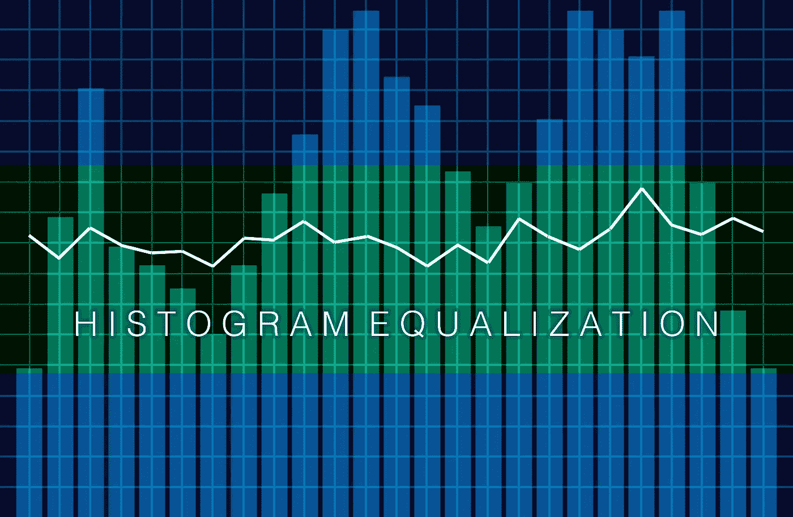
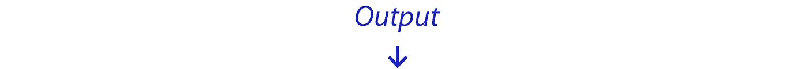
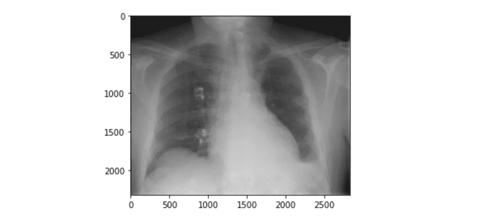
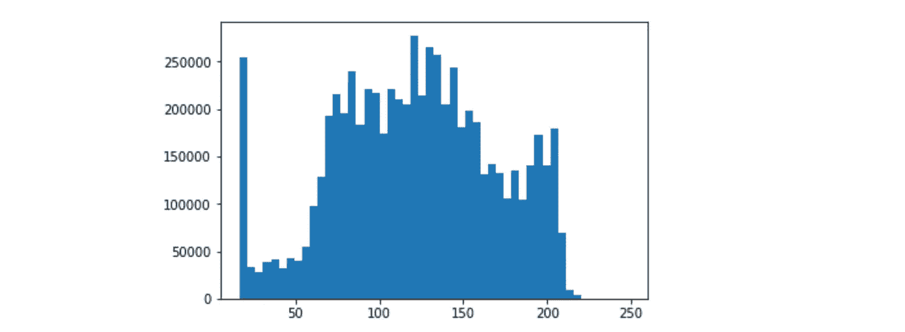
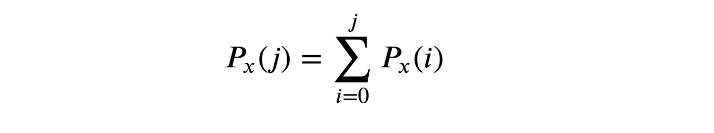
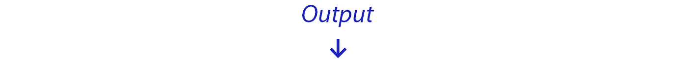
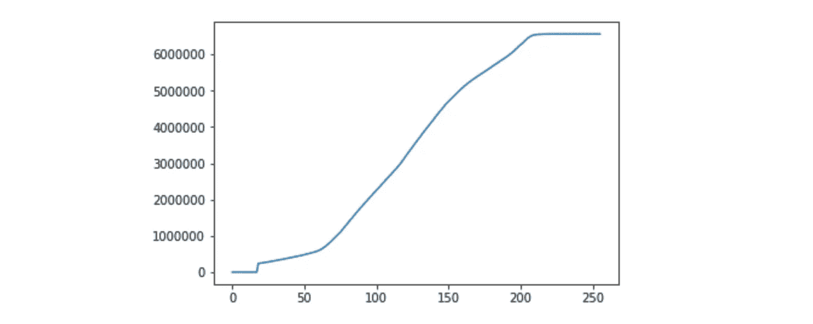
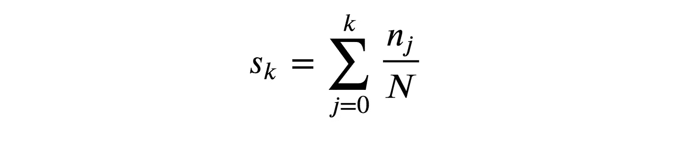
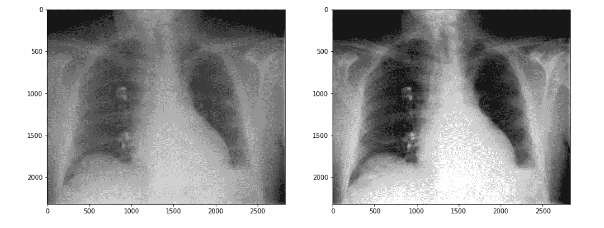
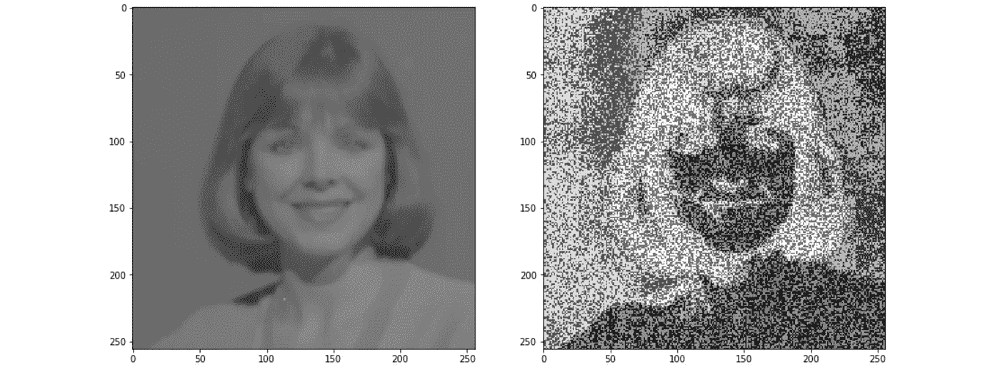

# Python 中的直方图均衡化

> 原文：<https://medium.com/hackernoon/histogram-equalization-in-python-from-scratch-ebb9c8aa3f23>

直方图均衡化是图像处理工具包中的基本工具之一。这是一种调整图像中像素值的技术，通过使这些强度更加均匀来增强对比度。通常情况下，图像的直方图会接近于*正态*分布，但均衡化旨在实现*均匀*分布。在本文中，我们将从头开始用 python 编写一个直方图均衡器。如果您想查看完整的代码，我在本文底部提供了一个 Jupyter 笔记本的链接。现在，如果你准备好了，让我们开始吧！

在此之前，我们必须做一些设置。让我们导入我们将在整个程序中使用的库，加载图像，并显示它:

出于本教程的目的，我们使用灰度图像，因为灰度图像中的每个像素只代表一个值——T4 强度。我认为这使得数学更容易推理，因为我们只需要关心一个值。作为比较，在 RGB 彩色图像中，每个像素包含三个值(红/绿/蓝)。由于我们读入和处理图像的方式，您仍然可以通过该程序运行彩色图像——我鼓励您这样做，这样您就可以看到您会得到什么样的输出！

我们将使用的图像是一个褪色的 x 光片。我们可以假装自己是放射科医生，想要均衡 x 射线，以便更好地看到一些细节。

为了处理图像，我们必须首先将它作为一个数组读入。但是，numpy 会自动返回一个多维数组，所以我们将其展平为一维数组:

在展平的数组中，每个像素都有一个亮度值。数值范围从 0 ( *黑色*)到 255 ( *白色*)。介于两者之间的一切都被认为是灰色的。从上图可以看出，我们有一个接近零的峰值，超过 200 的值不多。

现在，我们可以采用一维数组，并基于相似强度值的频率来计算图像的直方图。有一些预先存在的函数可以帮你做到这一点，但是我们是从零开始做的，所以让我们自己写吧！

⚠️ *请记住，对于生产环境，您会希望使用预先存在的函数，因为它们得到了更好的优化，并且可以处理更多的用例。*

我们求解的数学公式是:

现在我们有了直方图，我们可以通过计算直方图的*累积和*进行下一步均衡。累积和顾名思义，就是直方图中到该点为止的所有值的和，包括所有以前的值。就像上面一样，有一些函数可以帮你计算，但是让我们自己写:

我们在进步！我们现在有了累积和，但是正如您所看到的，值是巨大的(> 6，000，000)。我们将在最后一步将这些值与我们的原始图像进行匹配，因此我们必须将它们归一化以符合 0–255 的范围。这是我们需要编写的最后一个公式:

这样更好——我们的值现在在 0-255 之间正常化。现在是压轴戏。我们现在可以使用归一化的累积和来修改原始图像的亮度值。如果您以前从未使用过 numpy，那么这样做的代码看起来会有点混乱。其实反气候简单。

我们将从`flat`数组中获取所有的值，并使用它作为索引来查找`cs`数组中的相关值。结果成为新的亮度值，该值将存储在特定像素的`img_new`中。

最后一步，我们重塑数组以匹配原始图像，这样我们就可以将结果呈现为图像。

这就是我们的情况——原始图像已经被均衡化。我们现在几乎是放射科医生了！请注意整个图像的对比度差异。关于直方图均衡化，要记住的最重要的事情是，它在考虑所有像素的情况下，在*全局*级别调整强度。这个过程对于上面这样的图像效果很好，但是对于其他图像效果可能很差。

例如，以下面的图片为例——它是使用完全相同的算法转换的，但是，你可以看到它没有增强照片那么多，而是完全破坏了照片。

直方图均衡化并不总是这项工作的完美工具。但是，您可以使用其他方法来考虑相邻像素，而不是使用整个图像。请继续关注下一篇文章，我们将介绍一种更加本地化的均衡算法。

本文的完整源代码(作为 Jupyter 笔记本)可以在这里找到:

 [## tory walker/直方图均衡器

### 一个简单的直方图均衡化实现。通过创建一个……

github.com](https://github.com/torywalker/histogram-equalizer/blob/master/HistogramEqualization.ipynb) 

👏如果你觉得这篇文章很有帮助，并希望看到更多，请留下一些掌声让我知道！🔗关注更多类似的文章！