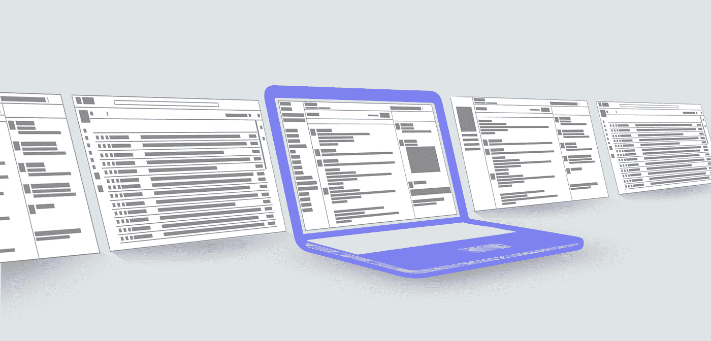
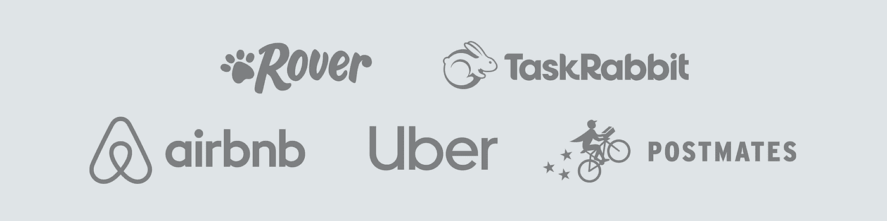
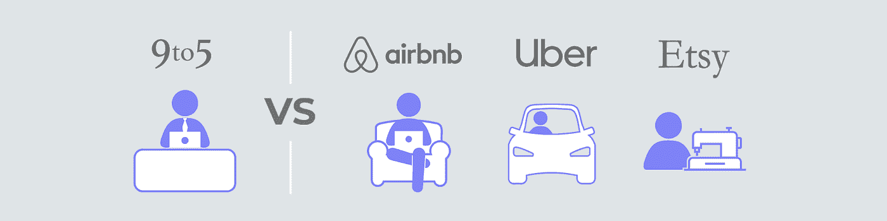
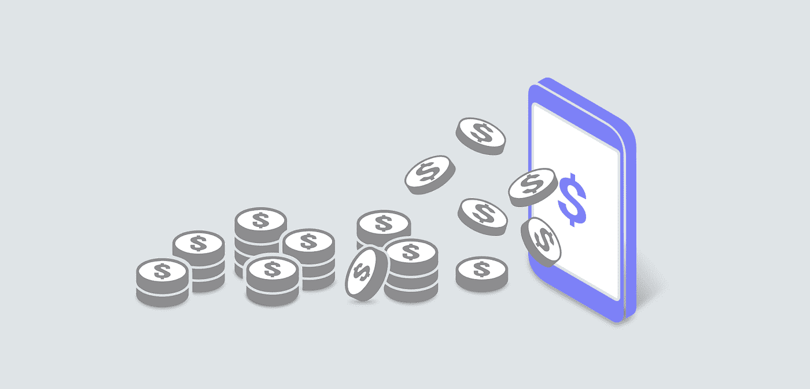

# 历史证明，群发消息是通向去中心化黄金时代的通道

> 原文：<https://medium.com/hackernoon/history-proves-group-messaging-is-the-conduit-to-the-decentralized-golden-age-dc7ed6c183b4>

我们发现技术采用的循环是如何运作的很奇怪。当键盘被采用时，人们从未想过他们会回到只用十根手指中的两根*来打字。然而，事情一直在朝着那个看似奇怪的方向加速变化(有时还会变回来)。*

我们今天的交流方式不仅是移动的，也是多智能体的。

我们的小组(多对多)对话的数量远远超过了我们与亲密朋友和家人交流时产生的*一对一*对话的数量。

在我们的工作和爱好中，我们依靠群体交流来组织自己和发现自己，围绕共同的灵感或追求建立一个社区，为我们的客户服务等等。

在这方面，群发信息被吹捧为电子邮件的歼灭者，因为它增强了多对多的通信，这是电子邮件在当今按需经济中永远无法跟上的功能。

## 一度，电子邮件已经足够好了

从根本上说，电子邮件是一种足够好的沟通方式。

然而，日益普遍的信息传递证明了它的繁忙和混乱。东西不可避免地会在混乱中丢失。

不幸的是，群发信息现在是一种症状，表现出和电子邮件一样的忙碌和混乱。

一些公司在群发信息创造大量活动的现实中茁壮成长，并利用跟踪流入群聊但你不可避免错过的关键、有价值信息的能力获利。

正是因为害怕错过有价值的内容，才驱使我们回到群发消息。然而，我们发现这是一个错误，而不是一个功能。

群发信息不应该感觉如此杂乱无章。

有价值的信息应该很容易找到。

他们应该让自己为人所知。他们应该有名声。

他们应该得到奖励。并得到认可。公开地。

多年来，我们一直有机会在消息传递领域进行创新，但最近我们在各种新的使用案例中观察到了群组聊天中混乱和噪音的痛苦，我们发现在大多数情况下，这些痛苦已经演变成了进步的障碍。

## 今天的群聊是🅽🅾🅸🆂🆈

拍电报；太…吵闹了。

你不断被你不认识的人添加到你不想要的群中。

当你加入一个你喜欢的群时，在接下来的一个小时里，你会收到 2000 多条未读信息。

如果你想收获团队的集体知识和见解，你很难单独回顾这些信息。

肯定需要有更好的方法。

这种缺乏控制——这种失去权力的感觉是一个很好的例子，它是分散化时代的核心问题，以及它是如何发生的。

去中心化时代的催化剂——人们从他们的资产和知识中获取巨大价值的时代——需要一个可以传播的渠道；一些不可阻挡的力量正在改变人们与世界互动的方式。

类似于开放网络。

## 个人数据作为访问的通行证

> 在 20 世纪 90 年代末的一段时间里，在公开的网络上分享你的名字被认为是自找麻烦，人们试图利用这些信息来掠夺他人。

浏览互联网的更深角落本质上是不安全的，因为害怕某种形式的曝光，这种事情会把你的个人信息——因此也是福利——交到一些陌生人的手中。

2005 年左右，情况开始迅速变化。

随着 MySpaces 和 Facebooks 的推出，人们保护和分享个人信息的方式发生了根本性的转变。

世界已经颠倒过来了。

如果你不分享你的一切，你就不存在。

如果你不存在，你就无法获得其他*网民*提供的好处，他们自己也在寻找更好的方式来公开*联系*和*分享*。你能想象再也无法登录脸书吗？！

这些话不再让人感到害怕，而是让人觉得有必要。

最终，大部分人类被吸进这个事件视界，这有效地压制了内部声音警告不要公开分享信息，因为害怕信息会落入坏人之手。

突然，那个声音对这种可能性产生了共鸣。它渴望最大程度的曝光，这样就有尽可能多的人可以接触到这些信息和数据。

这些未来的产品不仅创造了一个新的现实，而且是专门为连接*和*收获*尽可能多的*分享者*而建造的——越快越好。*

这将最终导致人们接触方式的彻底和极其有利可图的转变——以及在线广告本身。

## 按需服务的诞生

这个新时代是一个爆炸式增长的时期，随着数据驱动的产品开始通过文化和日常环境推动采用*，公司开始意识到并利用可能的力量。*

这导致了实时竞价广告的兴起，这种广告依赖于人们分享的关于自己的大量信息(或者他们每天搜索的东西)。

这也促使这些公司寻找和推断关于用户的额外信息，以提高其技术的定位能力，从而提供更大的商业优势。

开放信息的兴起使得按需履行的概念得以存在。

这个新网络是 Airbnb、优步、Postmates 和其他市场等公司的发射台，这些公司在工作结构以及全球数十亿人对工作的定义方面产生了涟漪。

很快，这些涟漪开始对人们看待工作的方式产生影响。朝九晚五的工作越来越不是一种默认，而是一种退路。

整整一代人看到父母为追求退休付出了几十年的努力和牺牲，并决定他们更愿意将自己的人生经历放在首位。

活在当下。

事实证明，这些新的商业模式非常适合那一代人。这解释了年轻人旅行的激增、*数字游牧者*、*社会影响者*等等。所有这些人都认为收入只不过是达到目的的手段。

突然间，工作的定义开始从单纯的实用性转向目的性。

人们已经开始做出乐观和审慎的尝试，将他们的人生抱负放在首位，并通过拼凑几项追求来资助这些冒险。

一些人在 Etsy 上出售小饰品来资助他们的下一次假期。其他人在 Airbnb 上出租他们的公寓来资助这次旅行。其他人甚至可能开车去他们梦想的目的地，同时在路上用优步把一些现金装进口袋。

人们拥有的东西和他们每天做的事情对他们周围的人和世界各地的人都有价值，一个日益增长的运动正在采纳和要求一个可以随时随地创造和分配价值的未来。

那些将自己置身于这些经历中间的公司，对人们相互之间以及与周围世界的互动方式产生了相当大的影响。

然而，这样做——即使在今天，他们也在使用他们产品的每个人的头脑中唤醒了一种企业家的独立意识。

我们相信这种感觉正在引发下一场伟大的革命。

# 分散化时代的案例

变革之风再次吹起。

在类似按需经济和共享经济崛起的背景下，世界正在发展和变化。

2000 年代末，用户意识到他们可以随时随地获得价值，他们拥有的资产可以通过我们互动和贡献的按需和共享经济成为收入的载体。

现在，用户开始意识到他们的资产*是有价值的——他们也是创造价值的工具，尽管这似乎遥不可及。*

我们开始意识到免费的代价。

人们越来越意识到，用个人数据换取免费体验，不管有多棒，最终都会导致滥用和安全漏洞。

人们对未来的数据库泄露和个人数据暴露有一种持续的预感，并且强烈感觉到那些受这些危险事件影响最大的人被剥夺了权力。

人们意识到为时已晚，他们没有其他选择可以作为独立的行动者参与共享和按需经济。

他们希望摆脱从用户那里窃取数据的知名市场和网络，或者将自己定位为分配价值的中间人。

奇怪的是，许多人也选择把他们的帽子放在区块链戒指里。

权力下放的好处被认为是赋予人民权力的理想渠道，使他们能够要求独立于他们已经厌恶的中央拥有的服务。

新一代人把区块链技术视为通往希望之乡的工具，在那里，你收获的果实是你的，只有你一个人可以享用和分享。

## 企业家独立的时代

人们对他们每天使用的服务的信任正在直线下降。

这种情况正在发生，因为人们使用的服务背后的公司已经证明为了利益而危害他们用户的隐私是正当的，更糟糕的是，这些利益甚至从来没有到达那些用户手中。

从许多方面来说，这些服务正在回归最初让它们站稳脚跟的元素。

脸书的使命是连接人们，但脸书让在他们的平台上维持这种连接变得越来越难，并将这种价值锁定在牺牲用户体验和数据来换取收入的算法和付费墙之后。

Airbnb 每天都能实现房地产的货币化，其功能和访客网络提供给主机，以换取收入分成。用户正在意识到，他们可以继续建立伟大的 Airbnb 业务，而不需要 Airbnb，尤其是当 Airbnb 把他们踢出去的时候。

YouTube、Instagram 和 Twitch 上的内容创作者正在意识到，在一个他们无法控制的平台上建立业务和受众的风险是，他们随时都可能被切断。

人们正在寻求赋权和独立的方式，以获得在不需要数百万眼球来实现可持续成功的背景下与最受尊敬的观众成员互动并将其货币化的能力。

这是维持他们收入的渠道，而不必忍受他们再也无法忍受的现实。

通过一种开放、赋权和赋能的交流方式，我们对未来的愿景是可能实现的。

在这种情况下，交往的背景和规则是由你设定的，作为一种基本的交流权利，你可以完全获得和拥有，而不用担心任何事情或任何人将自己置于中间。

这就是我们所追求的，因为我们改进了第一个分散的、被证明是安全的信使,旨在使你能够与你关心的人联系。