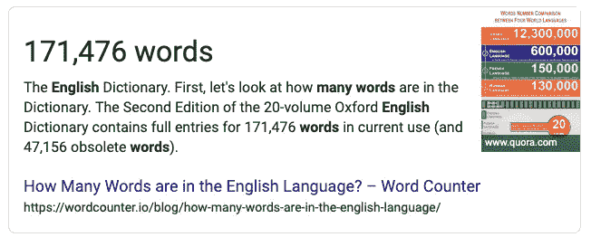
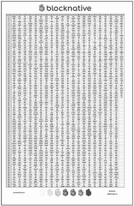

# 把所有的私钥都握在你的手掌里:超越链锯第三部分

> 原文：<https://medium.com/hackernoon/holding-every-private-key-in-the-palm-of-your-hand-beyond-chainsplaining-part-iii-6bf1a1361927>

《超越连锁解释》系列的目的是探索你可以用来帮助解释区块链的隐喻和故事。在我们的上一篇文章中，我们构建了第一个“当下的隐喻”:[区块链是砖墙](https://blog.blocknative.com/blog/bricks-in-a-wall)。

在本帖中，我们将介绍一个新的不同的“当下的隐喻”——**如何把几乎所有可能的私人钥匙握在手中。写在一张纸上。**

任何创建过以太坊钱包的人都熟悉仔细写下一系列看似随机的单词——种子恢复短语*。它们通常有 12 个单词长，尽管也使用 24 个单词的种子短语。*

你有没有想过那些单词是从哪里来的？或者它们是如何被挑选出来保护你的代币的？嗯，我们做到了。你需要知道的是:

1.  [种子短语](https://en.bitcoin.it/wiki/Seed_phrase)基于 [BIP 39](https://github.com/bitcoin/bips/blob/master/bip-0039.mediawiki) 标准。什么是 BIP？
2.  BIP 是比特币改进提案的缩写。就像以太坊的 ERC *(以太坊征求意见)*流程一样，BIP 的流程是比特币开发社区考虑比特币区块链新特性和功能的方式。
3.  BIP 39 使用助记短语*(也称为伪随机句子)*来生成主私钥，从中可以导出[分级确定性(HD)钱包](https://en.bitcoin.it/wiki/Deterministic_wallet)。
4.  令人惊讶的部分？您不能使用任何单词作为种子短语的一部分。相反，BIP 39 指定了一个只有 2048 个可能单词的字典。
5.  等等？就这样？才两千多字？这不到英语单词的 1.2%。但是这 2048 个单词创造了足够的种子短语的排列和组合来产生几乎每一个可能的私钥。

这就引出了一个显而易见的问题: ***有没有可能把整部《BIP 39 英语词典》挤在一张纸上？***

是啊！但是如果你想让它可读，你必须把它打印在 A3 (11x17)纸上。这里有一个缩略图:

要下载完整的 PDF，只需 [**点击这里加入我们的 Discord 服务器**](https://discord.gg/yz43Pbb) 。然后前往#downloads 频道。我们将来会在那里发布其他可下载的资产。

当我们向对加密好奇的人解释钱包和种子短语的概念时，像这样的打印输出已经被证明是强大的道具。将每一把可能的私人钥匙握在手中，不知何故会让钱包和种子短语背后的复杂概念变得更容易理解。当你试图超越链锯的时候，这是很重要的。

然后**引发对话**，帮助你的观众理解为什么种子短语很重要*。*有时，我们几乎可以看到人们从“我已经力不从心了”到“我想我能做到”这种微妙却又极其令人满意的内在转变

随着你谈话的进展，你的听众可能会问一个版本的:*“所以这一切都在一张纸上…现在每个钱包不都应该被黑客攻击了吗？”*

这是一个很好的问题。事实证明，猜测私钥的几率非常小。非常非常苗条。无论从哪方面来看，都不可能苗条。

好奇想知道到底有多苗条吗？请继续关注我们超越链锯系列的下一篇文章。我们将有趣地探索**幂定律**和猜测私钥的相对概率。带道具！

开心吗？请在 twitter 上关注 [@blocknative](https://twitter.com/blocknative) ，订阅我们的电子邮件列表，加入我们的 [Discord](https://discord.gg/TyVJkg4) 为对话做出贡献，并查看我们的[Beyond chain plaining 系列](https://blog.blocknative.com/blog/tag/beyond-chainsplaining)的下一篇帖子。

*原载于***。**