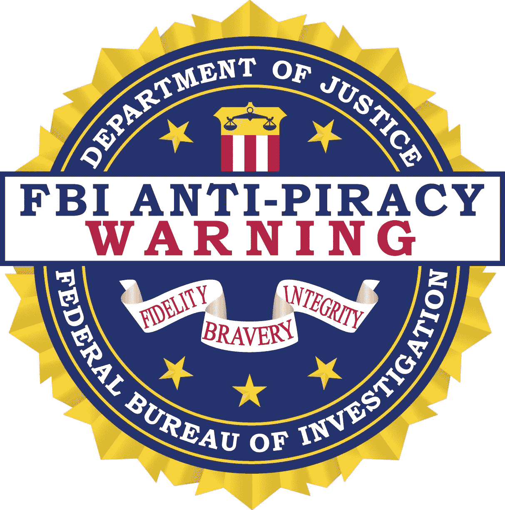
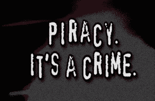
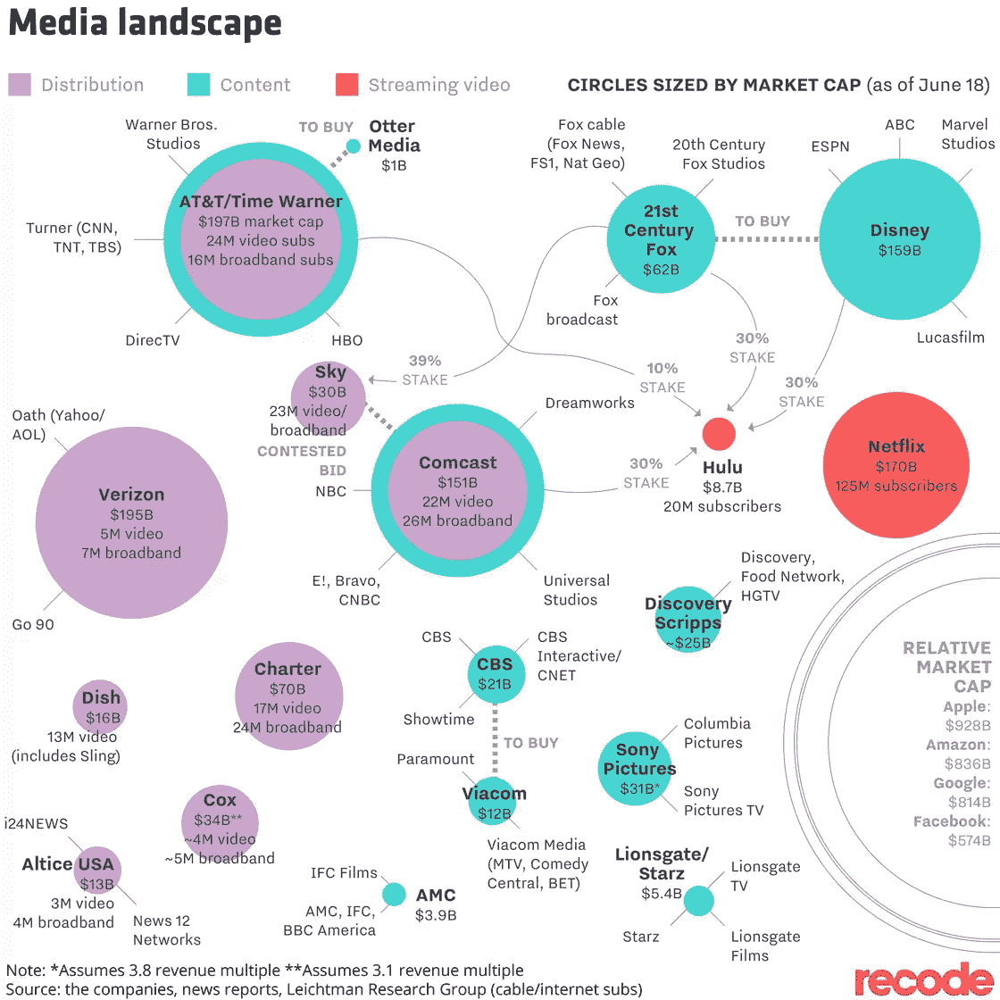
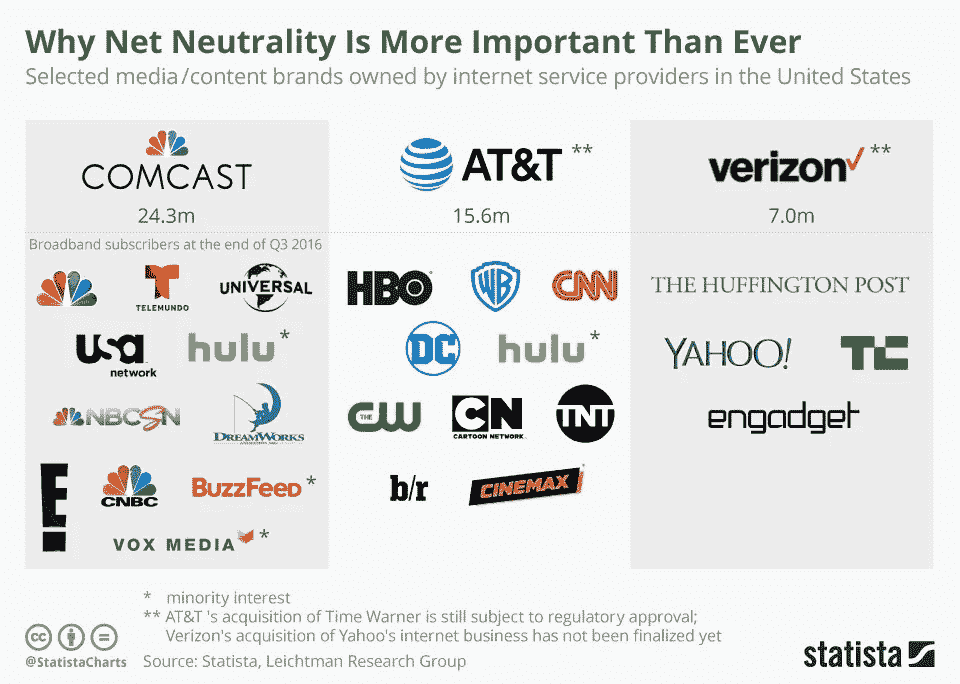
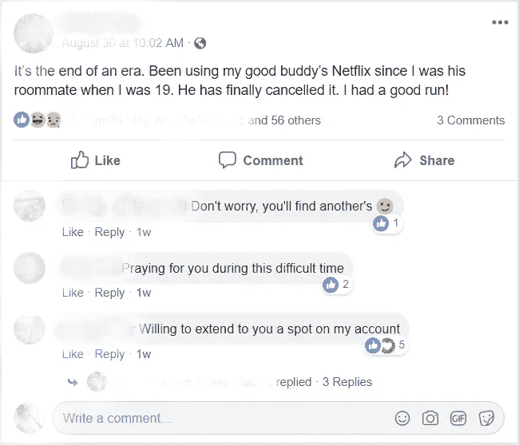
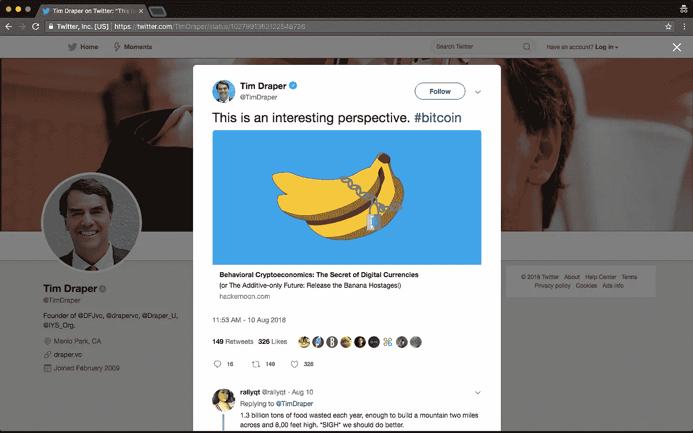
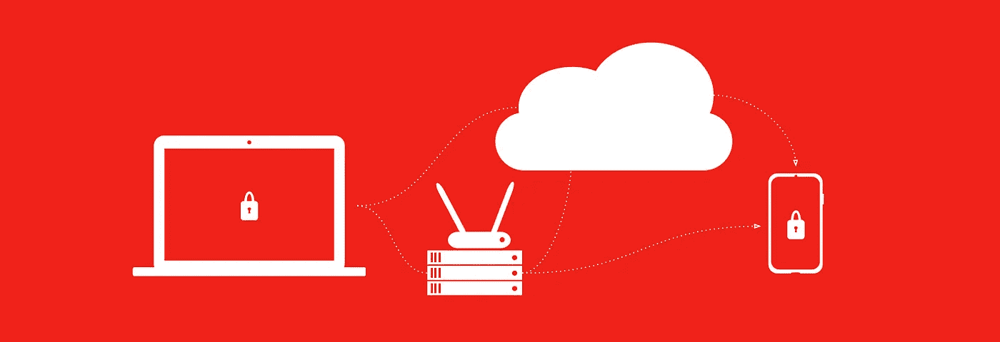
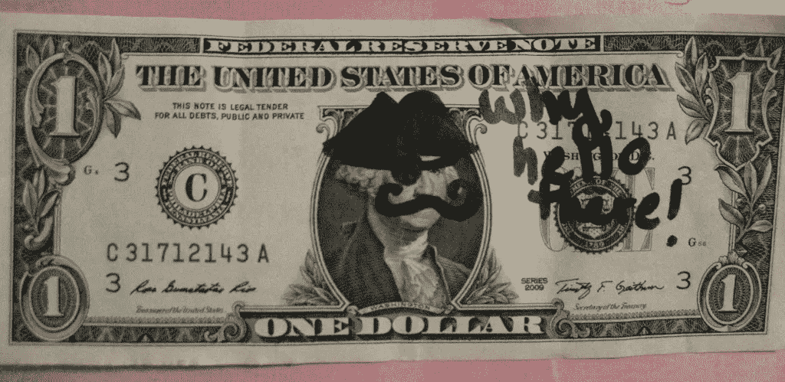

# 好莱坞秘密:盗版行为经济学，网飞和未来！

> 原文：<https://medium.com/hackernoon/hollywood-crypto-behavioral-economics-of-piracy-netflix-and-the-future-73f093e56130>

亲爱的(老派)好莱坞，让我们坦率地谈谈盗版、网飞(和其他过度的视频流媒体服务)，以及优质媒体之战。我将非常坦率地告诉你你失败的赚钱策略。会有点疼。但是，如果你和我一起坚持下去，我们将得到好东西:一种战略性的新方法，以消除由于盗版和那些讨厌的第三方订阅提供商刮掉顶部造成的收入损失。

所以，让我们从一个历史蒙太奇和一些坏消息开始。

# 历史蒙太奇和一些坏消息。

2001 年，BitTorrent 发布，彻底改变了盗版的面貌(以及整个互联网)。现在，盗版不再主要涉及实体 VHS 或 DVD，任何有互联网连接的人都可以在家舒适地访问和托管盗版内容。你猜怎么着？再多的游说也无法阻止它。在高峰期，盗版占全球带宽流量的 24%。盗版内容现在每年在[被访问 78.5 亿次](https://www.netnames.com/assets/shared/whitepaper/pdf/netnames-sizing-piracy-universe-FULLreport-sept2013.pdf)，据估计，盗版从电视、电影和音乐行业[带走了 20-60 亿美元](https://www.wired.com/images_blogs/threatlevel/files/MPAstudy.pdf)，加上[额外损失的 4.56 亿美元](https://books.google.com/books/about/Move_Fast_and_Break_Things.html?id=NX7UDAAAQBAJ&printsec=frontcover&source=kp_read_button#v=snippet&q=piracy&f=false)潜在广告收入。

更糟糕的是消费者对这场灾难的接受以及你们(好莱坞)对这场灾难的反应。32%的消费者观看盗版内容，40%的消费者不在乎电影公司因盗版而损失利润。到目前为止，阻止盗版的途径包括删除通知，试图审查盗版网站的搜索，以及告诉消费者“盗版不是无受害者的犯罪”的广告。但是这些策略的问题比比皆是。

互联网正朝着[加密和](https://decentralizedweb.net/)去中心化的方向发展，这对于试图通过删除通知或过滤谷歌搜索来执行盗版法律的人来说是一个真正令人讨厌的组合。向 BitTorrenting 网站发送关闭通知就像蒙着眼睛试图玩最史诗般的打地鼠游戏。当然，你已经试图变得更聪明一点，完全拔掉打地鼠机器的插头——通过从搜索结果中预先过滤侵犯版权的网站，让谷歌切断盗版供应线。太棒了。但是，现在你知道那也失败了。[维持盗版的 85%的收入来自广告](https://www.amazon.com/Move-Fast-Break-Things-Undermined/dp/0316275778)，独一无二的谷歌投放了这些广告的最大份额。要求谷歌预先过滤他们的搜索结果就像要求他们努力减少收入。怪不得他们不咬人。

关于反盗版广告:首先，大多数消费者将后期制作电影视为一种[沉没成本](https://en.wikipedia.org/wiki/Sunk_cost)，并比较他们从第三方播放非法拷贝(0 美元)与根本不看(也是 0 美元)的额外成本。所以，你可能是受害者，但他们并不比基蒂·吉诺维斯的旁观者更有责任。第二，这些广告实际上[将](https://en.wikipedia.org/wiki/Social_norm#Social_control)盗版正常化，其他人的行为比你明确的指示更响亮(你说的是“我们电影工作室是盗版的受害者”，但他们听到的是“很多人都在这样做，所以这实际上是正常的行为”)。事实上，你自己的员工也背叛了你，从工作室的电脑上下载盗版电影！尽管这些广告试图在盗版者和盗版内容的消费者中制造认知失调(如果你愿意，可以称之为内疚之旅)，但大多数人通过改变态度而不是改变行为来减少认知失调。实际上，这些广告助长了“我不在乎利润损失”的态度。哦，太好了。

与此同时，当你被在公海上进行的战争分散注意力时，一个更强大的对手正在蓄势待发，这将使你和海盗都为你的钱而战。2007 年，网飞推出了在线流媒体服务，这一流媒体服务将激励 Hulu、亚马逊等公司。以新的方式攫取你的钱。起初，网飞和其他流媒体服务似乎是分发服务的补充。但是合同并不像你想的那样有利可图，传统智慧建议避免第三方的收入。这种奇怪而复杂的伙伴关系的后果是它创造了[奇怪的友敌网络](https://www.wsj.com/articles/netflix-the-monster-thats-eating-hollywood-1490370059)。

自从引入网飞流媒体后，BitTorrent 就失去了互联网流量王的地位，从前面提到的 24%下降到目前的 3.5%。网飞成长为新的宽带之王，现在占据了 T4 37%的互联网流量。网飞的大规模捆绑销售使得它可以一次性投入大量资金来支持整季的内容包。新的狂欢现象做了三件重要的事情:1 .它巩固了他们的用户基础，2。它提供了一种安全感，吸引你的好莱坞天才去品尝网飞的禁果。它让网飞在尼尔森收视率调查中玩“藐视法律”游戏——这是一种你肯定没有享受过的奢侈。

传统的有线电视捆绑订阅的惯性持续了一段时间，但现在有一个稳定的趋势，那就是削减有线电视(取消有线电视订阅，转而支持流媒体服务)。仅在 2018 年，这一削减成本预计将达到 12 亿美元，康卡斯特将达到 16 亿美元。因此，无论你喜欢与否，这些电信提供商迅速抢购你的大型媒体公司也就不足为奇了。现在，网飞(和他们的合作伙伴 T-Mobile)正在威胁 AT & T、康卡斯特、威瑞森等公司，他们需要你作为某种内容人质来维持他们的用户数量。但是在这里，友敌景观变得非常复杂:电信提供商实际上希望人们使用宽带——就像大量的宽带。网飞在确保这一点上做得非常出色。

所以，好莱坞，你痛苦失误的简史现在是最新的了。接下来的问题是，你如何在不搬起石头砸自己母公司的脚的情况下，与网飞竞争？艰难。这整个崩溃让我想起了一点哈姆雷特…但是我跑题了，因为我保证这将以喜剧结束。所以，这是我的喜剧建议:也许盗版是你对网飞的回应。

# 向前看。

2007 年之前的 BitTorrent 盗版和 2007 年之后的网飞盗版所使用的宽带之间的反比关系强烈暗示了这两者是替代品，我甚至可以说是竞争对手。这有点道理。一些网飞订户是插队者，加入网飞是因为它比有线电视便宜，而且有越来越多的高质量内容可供选择。一些网飞用户(我指的是*用户*)实际上只是用户朋友的妈妈的老板的第三代表亲，因为他们太吝啬了，除了网络账单之外什么都不用付。一句话——网飞的用户几乎和海盗一样吝啬，但他们付费(或跟随)以避免 UX 的麻烦。**你敌友的敌人是你的朋友**。多亏了最近互联网基础设施的一些进步，我认为你们可以成为朋友。

自从互联网诞生以来，一些预言家就一直要求去中心化的互联网。尽管如此，只是在剑桥分析丑闻和网络中立的废除之后，它才被带到外行人的边缘观点。人们对他们的数据被挖掘感到愤怒，但也害怕你的母公司会限制他们狂看《权力的游戏》和上传自拍的能力。更多注重隐私的技术人员开始转向更受用户伦理驱动的 dApps，如 [Metamask](https://metamask.io/) 和社交网络的分散版本，如 [YouTube](https://d.tube/) 和 [Reddit](https://notabug.io/) 。

正是这类人群也在构建新的分散化存储、带宽和计算基础设施，并鼓励各方之间用“加密货币”进行无信任合作。这些有时被称为[实用令牌](https://hackernoon.com/how-is-security-token-different-from-utility-token-5d12d7109740)。例如，Filecoin 正在创建一个实用令牌，用于交换分散式设备网络上的文件存储。AXE 也是这么做的，除了[带宽和电信](http://axe.eco/)。

现在，在你的目光变得呆滞之前，请记住，这与你，好莱坞，有着非同寻常的关系。你将不得不学会在这个新环境中沉浮，因为盗版者已经准备好通过匿名支付来激励版权侵权。认为**一个** [**丝绸之路**](https://www.wired.com/2015/05/silk-road-untold-story/) **的经济完全是围绕着非法发行你的 IP** 为中心的。你必须比他们进化和适应得更快，否则你就会被淘汰。

## 战胜博弈论者

在一个纯添加剂经济兴起之前，我就已经预测过了，在这个经济中，每个人都是赢家。我的母公司，[时代](https://era.eco/)，是一个由心理学家、程序员、物理学家和哲学家组成的团队，他们开发了改变市场的技术和激励机制，[已经改变了市场](https://www.businessinsider.com/bitcoins-martti-malmi-not-worried-about-liberty-reserve-2013-5)。

你喜爱的内容可以被提供给 power *或者成为下一个加密货币*。第一，如果你足够大胆，它会自动跟踪你的内容的每(两)个工时的收视率到一个分散的数字账本，或“区块链”，不管他们是如何或何时访问的——离线、在线、盗版、通过合作伙伴或其他方式。最重要的是:你不需要花一分钱给科技公司来开发、托管、维护或分发它。

媒体是人类历史上第一批成为后稀缺资源的东西之一，你应该庆祝并拥抱它(毕竟，谷歌和脸书做到了，他们比你更赚钱)，而不是与 DMCA 斗争。你手握不老泉的圣杯，数字商品——一旦生产出来——就可以无限次地转售，只需通过光纤电缆发送少量的光。AXE 量化了这种带宽传输中“燃烧”的电力成本，就像比特币(其第二位开发者是我们团队的成员)在彩票游戏中解决数学难题一样。除了*你*，好莱坞，我每转一次你的电影就分一次。

老实说，ContentID 在投入了 6000 万美元和多年的开发后确实发挥了作用，但谷歌从上面刮走了太多东西，甚至不值得你浪费时间。它从 YouTube 喜爱的内容中获利最大——短病毒媒体，让用户陷入永无止境的黑暗的 UX 点击陷阱。不是你(和数十亿人)喜欢的长篇故事的高质量内容。

信不信由你，这甚至不是白日梦。Steem 已经向菲亚特支付了 4000 万美元来奖励其区块链上的内容。虽然这可能连两个电视节目的预算都不够，但至少证明了区块链版本的 ContentID 是可能的。更重要的是，它已经是一个比 HBO 更受欢迎的网站，[在推出后的几年里就在全球排名前 2K](https://www.alexa.com/siteinfo/steemit.com) ，而 HBO 是[在全球排名 5K+并超过](https://www.alexa.com/siteinfo/hbo.com)。

以下是 AXE 如何让好莱坞加密货币(“CC”，我亲切地称之为“海盗战利品”)成为可能的:

**第一步:**加密签名确保你在区块链上的收视率，很像 ContentID，但正如你将看到的，这将在任何平台上工作(是的，甚至在*真实的*黑暗网络中)。结果:*您已经在您的 IP 上数字标记了您的领域。说到底，人们想要的是权威的高质量原始资料，而不是私酒盗版。即使是海盗也为他们的赏金猎人成就而自豪。*

**第二步:**控制消费体验——用户界面、UX、品牌等。，如果你愿意，可以通过合作影院对它进行时间分层，在那里你可以对座位的稀缺资源收取版税，但一旦炒作结束，你赢得了奥斯卡奖，就可以免费将原版发布到网络上(“什么？！你可能会说，“我以为我要赚钱了。是的，坐稳了。)结果:*这使得不可避免的“海盗战利品硬币”(和网飞)无法通过提供更低的价格或不同的(合法或非法)激励来竞争*。

**第三步:**你友敌的敌人是你的朋友，做不可思议的事，让海盗成为你的 CDN。他们擅长技术，让我们面对现实吧，你不是，否则你会建立并拥有整个平台——但技术兄弟引诱你进入网飞、Prime 等。，反而。(即使是硅谷也无法与盗版竞争，[到 2009 年，P2P 分散网络推动了全球 40%的流量](https://www.webcitation.org/6OVSh9hZ0?url=http://www.ipoque.com/sites/default/files/mediafiles/documents/internet-study-2008-2009.pdf)然而[谷歌直到 2014 年才把](https://www.forbes.com/sites/timworstall/2013/08/17/fascinating-number-google-is-now-40-of-the-internet/#18698dd727c7)的流量提升到 40%。)

结果:*观众将会涌向合法网站上你的内容，这些网站运行你的体验和品牌，但能够有效地从盗版和* [*对等 cdn*](https://techcrunch.com/2013/12/17/yahoo-acquires-peercdn/)*(盗版将基本上成为你的带宽的优步驱动者)，而不是粗略的病毒感染的流媒体网站。他们不会费心去清理你的数字签名，因为当你的内容通过网络发送时，他们将获得 AXE 令牌来验证其加密完整性(所谓的***)。与此同时，您已经将基础架构维护成本降至 0 美元，并减少了消费者的延迟。**

***第四步:**唯一需要运行海盗战利品 CC 的是 UX。就是这样，分散协议的好处是，无论是盗版还是合作伙伴，账本都是由终端对等体自己执行的，而不管平台如何！由于文件是点对点传输的，盗版战利品 CC 算法会扫描网络以获取你的数字签名，然后在流媒体或离线重看时给工作室的钱包加分。结果:*与尼尔森收视率甚至 YouTube、Hulu 或其他平台的特定指标相比，准确性、安全性、精确度和规模达到了前所未有的水平。**

# *第五步:套现。*

**

*好莱坞 CC 点反映了你的内容的真实观众价值。有许多不同的方法可以用来使一个快速的海盗——啊——巴克——durn 自动完成！你会对他们的一堆数字黄金(T21)感觉很好。*

1.  ***无聊的出路**。*广告*，是的，从长远来看，这将咬你。ERA 的 [Iris.to](https://github.com/identifi/identifi-lib) 系统可以散列的大量观众统计数据，甚至人口统计数据(如果是被迫的，但我们也不建议这样做)可以使用 ERA 的[实时图形数据库](https://github.com/amark/gun)GUN，将个性化的和上下文相关的广告直接注入流中。哪些 *btdubs* ，由于这些广告也是通过分散的路线发送的，大多数广告拦截器将不得不从头开始重新编写，以不依赖于诸如广告客户集中域名的众包黑名单等技术。我们不容忍这种套现方法，如果需要，我们将开发反广告技术，因为它在人类心理学、伦理学和经济学上是短视的。*
2.  ***补贴**。非常诚实地说，网络中立的损失(AXE 可以在不需要政府强制或监管的情况下带回，这是对我们的加密自由主义粉丝的认可)和为了以用户为中心的内容播放而吞并工作室的电信趋势的可预测结果是已经发生的现金流出。创造好的 IP，免费分发来招揽人气，然后把 IP 卖出去。你的消费者会对这种安排感到兴奋，因为这意味着他们可以免费访问你的内容，而不必冒着病毒肆虐、广告粗糙的流媒体网站的风险，*和*都是低延迟速度。他们需要支付的只是他们使用的带宽——他们已经在这么做了。*
3.  ***利益相关方信用。**正如我们的一位好莱坞业内朋友正在试验的，盗版战利品 CC 可以是一种安全令牌，它代表随着时间的推移而升值的内容中的*股票*。你如何获得股份？通过好莱坞大片门票预售融资。电影或电视剧的粉丝甚至可以在电影制作开始前就直接投资 21 世纪福克斯(21 Century Fox)(或许他们会提供 1:1 的匹配基金)。如果该系列整体表现良好，利益相关者(包括客户、投资者、经销商或其他人)的价值就会上升。*
4.  ***资源资本化**。对于隐藏在外面的资本家来说，一件东西的价值*至少等于提炼(石油、黄金等)的成本*。)或生产(香蕉等)。)它，*加上*一个类似投机“股市”的共识认为它拥有的任何附加值。开采一枚比特币的电力“烧掉”的法定成本是投入该事物的必要前提资本。因此，比特币代表了一种“价值储存”(很像电池储存电能的方式)，可以在以后变现。海盗战利品 CC 的独特之处在于，它代表了围绕“烧毁”AXE 带宽的*需求*(具体来说，超过通过无线电塔或管道发送任何随机字节的成本的*值)。然后很容易将盗版 Booty CC 收视率转换为其计算的 AXE 值(实际带宽成本)，然后将其变现，以换取任何稳定的价值储存资源(如菲亚特或比特币)。**

***这里有一个具体的例子**，你在& T 的母公司会将你的电影播放一次给当地的同行(比如街区的邻居 Joe)并向他们收取全价。然后，当所有其他邻居请求该集时，该集由本地对等体提供给他们，但是在& T 到达 ***收取全价*** ，即使对他们来说实际带宽成本接近 0 美元。本地传播者=低延迟=满意的客户和更多的带宽交换！此外，它还减少了 AT & T 主要互联网回程的大量流量。*

# *赢+赢*

*因此，让我们来分析一下这种新的盈利模式对所有利益相关者的影响:*

***消费者:**赢了！向电信支付带宽费用，获得好莱坞 IP 补贴，成为他们最喜欢的节目的利益相关者*和*的电信母公司，*加上*使用他们的信用与他们的朋友交换电影(可能在不同的网络上，有他们自己的内容目录，*或*用于漫游带宽)，*所有*使用他们的好莱坞加密货币信用卡！*

***海盗:**赢了！电信公司或客户向他们支付费用，因为他们提供了超高效的分散式内容分发，即 P2P。我打赌他们会很高兴不用再和那些粗略的广告公司做交易了…*

***电信服务:**赢！既然你现在拥有好莱坞的大部分知识产权，这意味着随着免费内容的开放，你将不得不接受你的方式。但是如果你很聪明，你可能会通过接受免费媒体来赚更多的钱。让这些机制将带宽流量提高到前所未有的水平。当带宽流量增加时，你可以享受 P2P 网络提供的去拥塞功能，这对于本地托管病毒式内容来说是完美的，就像最新的《权力的游戏》一样。与此同时，您拥有大量的服务器，您可以在它的分散网络上投入到 mining AXE 中。由于你拥有大部分的知识产权，你也将享受到下面列出的好莱坞成果的所有好处。*

***网飞:**他们需要决定在多大程度上采用你的新商业模式。如果他们很大程度上接受了它，那么许多好莱坞的结果都与他们有关。然而，为了继续从他们平台的优点上获得收入，他们可能想做两件事:1 .为你打造一个 UX，让你的品牌熠熠生辉。第二。开始为更早的层级访问向你付费(以区别于盗版者，他们**嗤之以鼻** 只有“旧”内容)，因为许多高质量的内容现在是免费的，容易使用，安全使用。无论他们选择走哪条路线，这些流媒体平台都可能成为大型电影公司的补充，而不是与之竞争。*

***好莱坞:**赢！你可以讲述你认为值得讲述的故事。哦，还有你的顾客，他们会提前两年买票和光盘——完全资助你最疯狂的追车和燕尾服赌场的表演。所有这些顾客都会与他们的朋友*和他们的朋友*分享你的故事，直到你的故事感动了每一个灵魂。*

*因此，好莱坞，你需要做一些思考和选择。这听起来像是一次冒险的暴跌。但是，你也认为电视和 VHS 会是你的行业的终结，因为它们降低了内容访问的壁垒。也许值得在一些旧内容或试点季节进行一次海盗战利品 CC 实验？*

> *或者，你可以继续你安全、传统的做事方式。你只能希望海盗们不会真的得到他们自己的电影奖金加密货币，网飞会在你年老时对你好。*

*我正在用[时代](https://era.eco/#step1)构建去中心化网络的平等主义基础设施。*如果你喜欢这篇文章，如果你为它鼓掌，分享它，并在* [***推特***](https://twitter.com/ambercazzell) *上与我联系，这将意味着很多！您也可以订阅* [***观看***](https://www.youtube.com/playlist?list=PL-UMfJVuezk-YgNUNSgpv-fE6q5Qjokdp) *或* [***收听***](https://open.spotify.com/show/3e3030cJwqwKa2A4UzBwnK) *我的播客！**

*Amber Cazzell 博士是一名应用社会心理学家，曾在斯坦福大学、昆士兰大学、BYU 大学和耶鲁大学进行研究。*