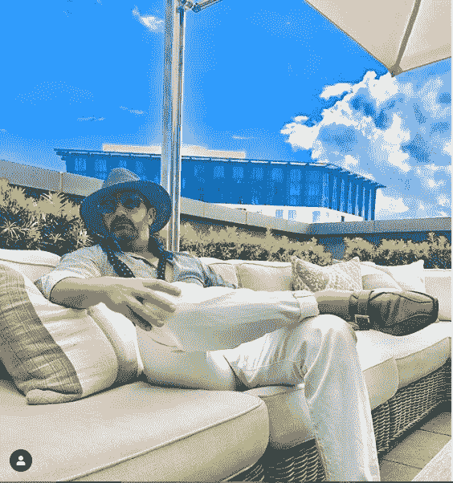
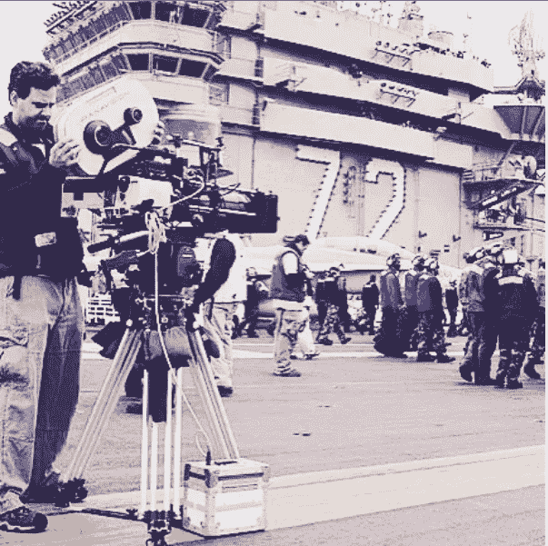
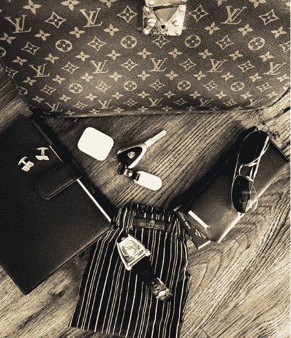
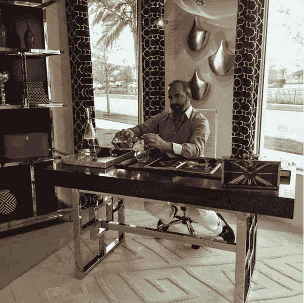

# 好莱坞的洛伦佐·鲁辛提出:确保品牌定位的 5 个步骤

> 原文：<https://medium.com/hackernoon/hollywoods-lorenzo-rusin-presents-5-steps-in-securing-brand-placement-a9891b68ed95>

Source: @lorenzorusin | Instagram

在社交媒体时代，我们会听到“影响者”、“品牌忠诚度”和“品牌整合”这些术语。但是做“品牌代理”意味着什么呢？名人和公众人物都很清楚他们是一个适销对路的产品，许多人创造了自己的个人品牌，使他们保持在聚光灯下。但是每个名人都有一个附属的奢侈品和商品。

这就是像好莱坞的洛伦佐·鲁辛这样的品牌代理商的用武之地。鲁辛是一名意大利品牌代理人，因其在*《比佛利山庄警探 4》、【终结者:黑暗命运】(2019 年)*和*《绝地战警》* (2020 年)中的工作而闻名，他是你想在电影摄影中加入那些豪华和异国情调的汽车、太阳镜、眼罩、手表和其他产品的人。

鲁辛最近接受了《砂砾日报》的采访，讲述了一名好莱坞品牌经纪人的生活。现在，他与我们交谈，分解了他和他的团队在准备获得品牌植入时所采取的五个步骤。

## **#1 —确保所有 NDA 都已签名**

首先，我们的团队确保签署所有适当的法律文书和保密协议(NDA 的)。

这使我们能够实际收到脚本，并与相关方讨论任何相关材料。

## **#2 —脚本交付和分解**

第二步是我们实际接收脚本的地方。

传统上，制片人/编剧会通过普通邮件把剧本寄给你。然而，随着今天的数字时代，我们现在有专门的软件，我们能够接收和查看脚本，数字化。虽然每个制作公司的运作方式不同，但总会有 NDA 来保护各方。

一旦我们收到脚本，它会立即交付给我的团队，以便他们可以阅读它并将其分解为产品和服务识别的部分/段。

## **#3 —识别&关联**

第三步，当我的团队阅读并分解剧本时，我们正在识别可能与特定品牌相关的细分市场。

如果我们正在确定有明确安置机会的场景，但与我所代表的客户无关，那么我会联系我的关系网，向他们提供潜在的安置机会。

记住，我的工作是告诉制作公司*产品是什么*以及*为什么我们向他们推荐的品牌是最合适的。*

## **#4 —推销机会**

Source: @lorenzorusin | Instagram

第四步，一旦我们确定了潜在的位置，我的工作就是联系品牌和/或服务公司，并根据 NDA 的条款向他们介绍机会。

几乎总是，我会透露项目的名称(如你所知，可能会因保密原因而改变)以及一些演员，当然还有制作公司。这也包括分享大纲。我们的目标不是分享太多的信息，而是提供足够的信息来衡量他们的兴趣，并让他们签署必要的协议，如果他们愿意继续讨论的话。

同时，因为我正在进入我的人脉网络，他们中的许多人相信我会给他们发一份好的作品(有影响力且没有负面排名的作品)，他们当然会同意。我在电子邮件中寻找的答案是“是或否”，即他们是否想继续前进。

## **# 5——打电话**

最后，如果我的客户同意，我们会安排一个电话，这是我花大部分时间来解释这个项目的地方。这包括了解我的客户(公司)的产品和/或服务系列中与项目预计发布日期相关的新内容。通常，我们会使用公司的新产品原型——尤其是眼镜和服装。

*原载于* [*砂砾日报独家专访*](https://gritdaily.com/lorenzo-rusin-hollywood-brand-agent/) 。