# 在谷歌云存储上托管一个免费的静态网站

> 原文：<https://medium.com/hackernoon/hosting-a-free-static-website-on-google-cloud-storage-d0d83704173b>

本指南将引导您使用 Google 云平台服务，通过自定义域名设置一个免费的桶来服务一个静态网站。

登录谷歌云平台，导航到[云 DNS](https://console.cloud.google.com/net-services/dns/zones) 服务，创建一个新的公共 DNS 区域:

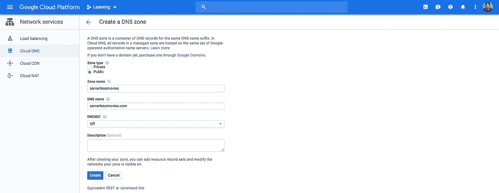

默认情况下，它将有一个 **NS** (名称服务器)和一个 **SOA** (授权开始)记录:

去你的域名注册商，在我的情况下我从 [GoDaddy](https://dcc.godaddy.com/manage/) 购买了一个域名(超级便宜)。添加您的 **NS** 记录中列出的名称服务器名称:

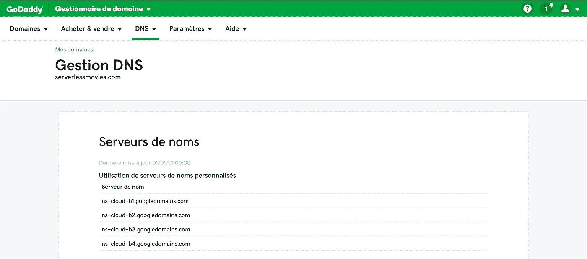

> *PS:go daddy 上的更改传播到 Google Cloud DNS 可能需要一些时间。*

接下来，使用[打开搜索控制台](https://www.google.com/webmasters/verification/home)验证您拥有该域名。有许多方法可用(HTML 元数据、Google 分析等)。最简单的方法是通过 TXT 记录进行 DNS 验证:

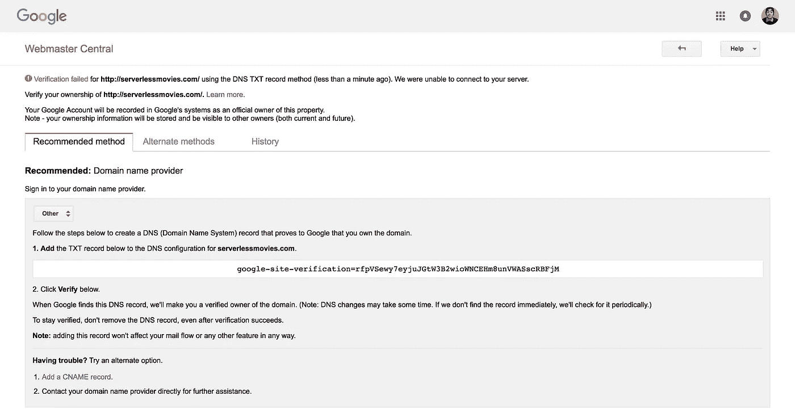

将 TXT 记录添加到之前创建的 DNS 区域:

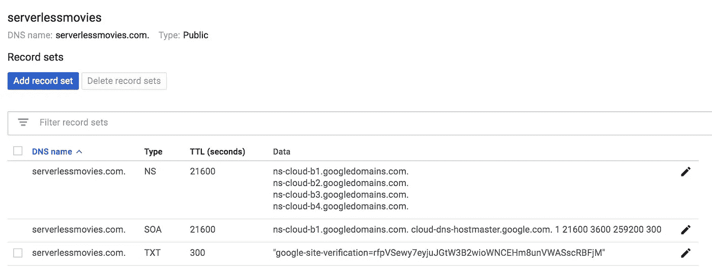

DNS 更改可能需要一些时间来传播:

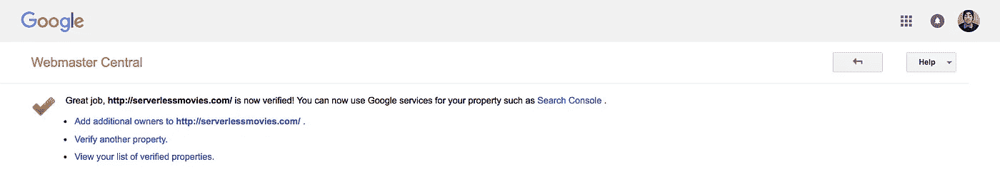

一旦您验证了域，您就可以在验证的域名下使用[云存储](https://console.cloud.google.com/storage/browser)创建一个 bucket。存储类别应为“**多区域**”(地理冗余存储桶，以防断电) :

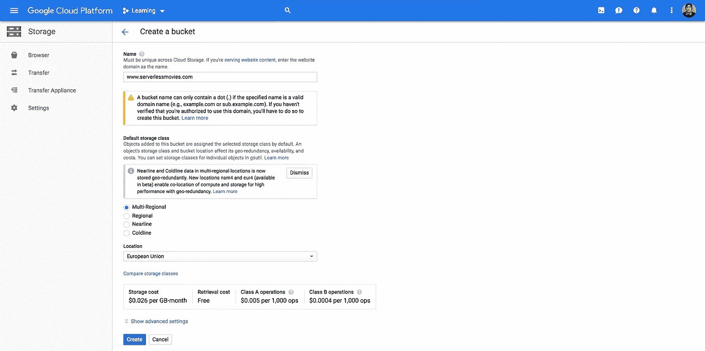

使用以下命令将网站静态文件复制到桶中:

> *gsutil rsync-R . GS://www . server less movies . com/*

上传完成后，您的静态文件应该在 bucket 上可用，如下所示:

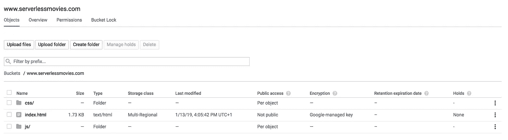

接下来，通过将具有*对象查看器*角色的 *allUsers* 实体添加到 bucket permissions，使文件可以公开访问:

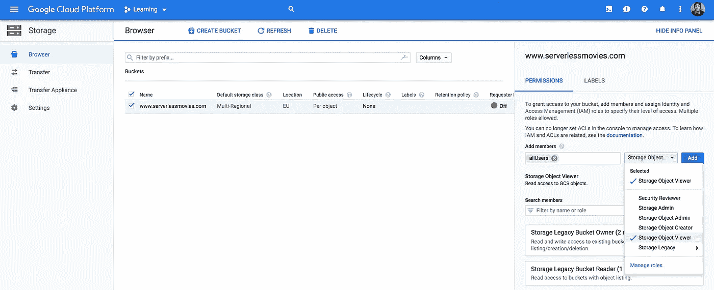

公开共享后，在*公共访问*列中会出现每个对象的链接图标。您可以单击此图标获取该对象的 URL:

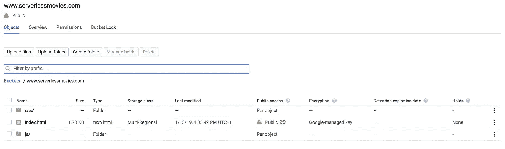

通过请求浏览器中的*index.html*链接，验证内容是否从存储桶提供:

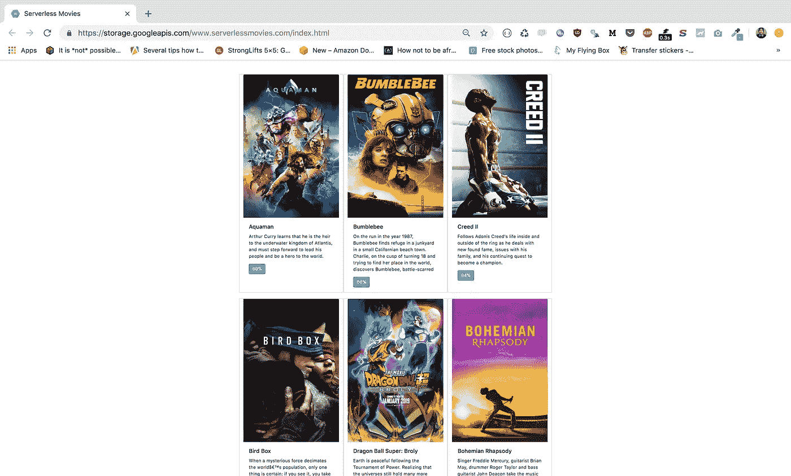

接下来，从**编辑网站配置**部分 **:** 设置主页面为*index.html*

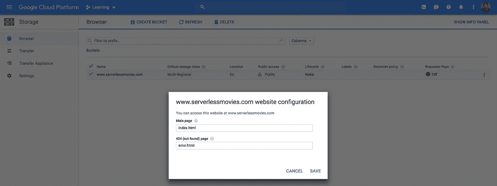

现在，我们需要将我们的域名映射到我们之前创建的 bucket。创建一个指向*c . storage . Google APIs . com:*的 **CNAME** 记录

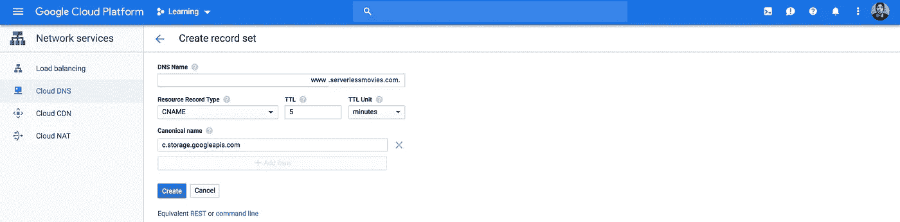

将您的浏览器指向您的域名，您的网站将得到服务:

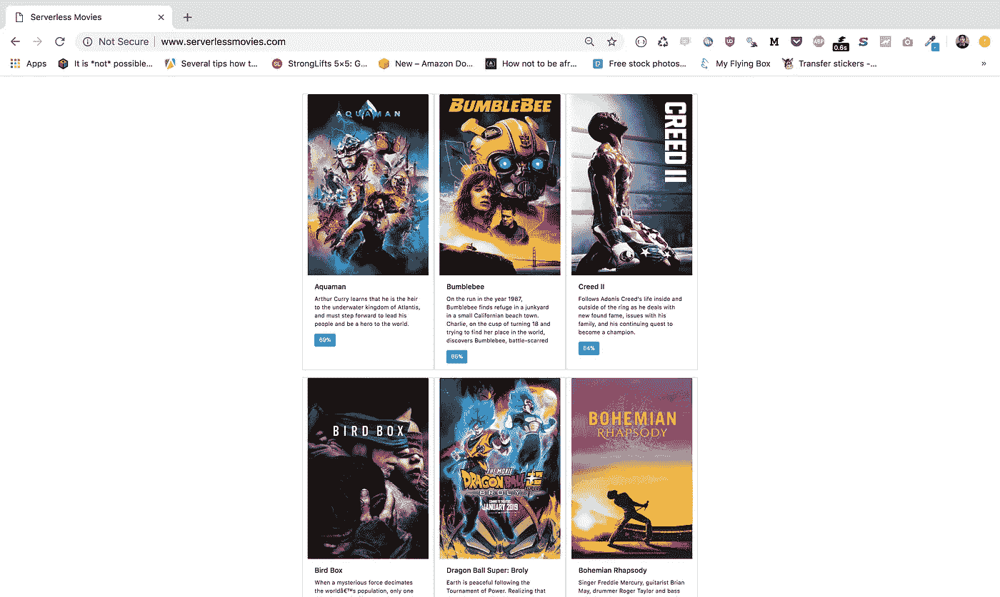

虽然我们的解决方案非常有效，但我们只能通过 HTTP 访问我们的内容(谷歌云存储只有在通过 *CNAME* 记录使用它时才支持 HTTP)。在下一篇文章中，我们将使用**内容交付网络** (CDN)，通过 SSL 上的自定义域提供我们的内容。

请在下面留下您的评论、反馈或建议，或者直接在 Twitter 上与我联系 [**@** mlabouardy](https://twitter.com/mlabouardy) 。