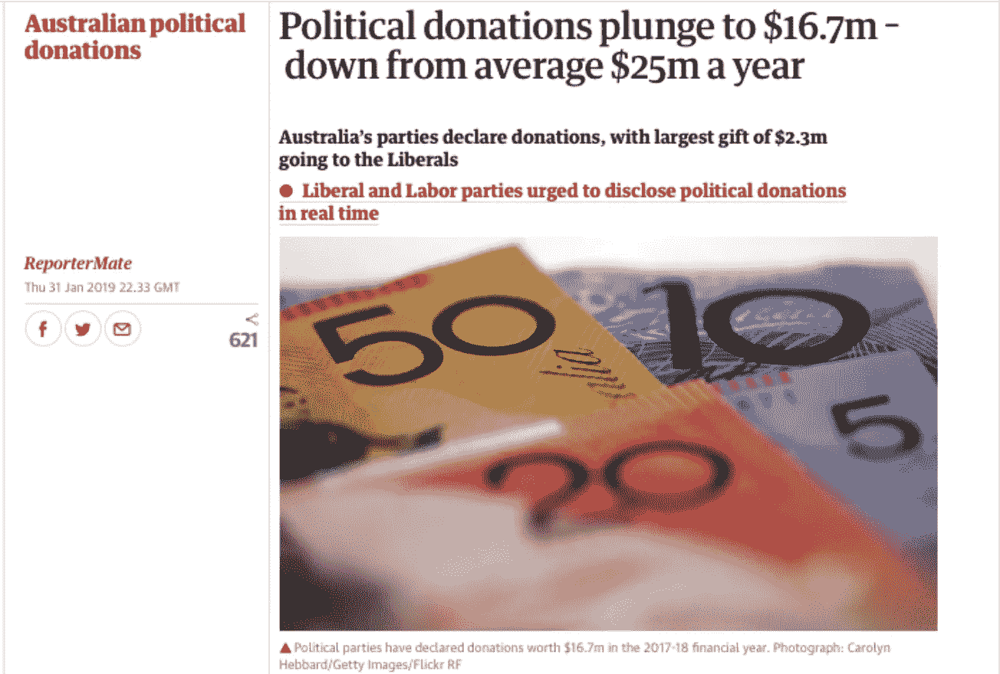
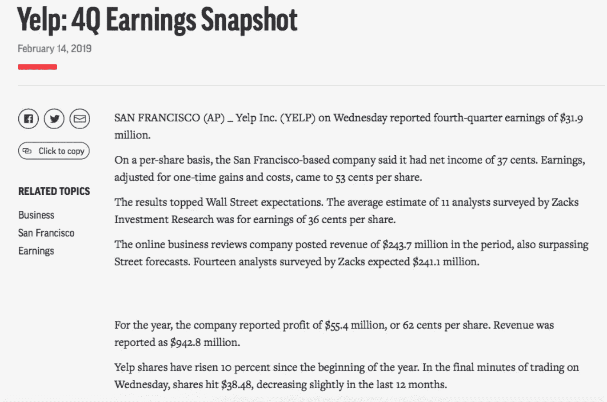

# 人工智能如何改变媒体格局和新闻传播

> 原文：<https://medium.com/hackernoon/how-ai-changes-media-landscape-and-news-delivery-adb024a519e3>

Photo by [Franck V.](https://unsplash.com/photos/jIBMSMs4_kA?utm_source=unsplash&utm_medium=referral&utm_content=creditCopyText) on [Unsplash](https://unsplash.com/search/photos/ai-algorithm?utm_source=unsplash&utm_medium=referral&utm_content=creditCopyText)

尽管围绕人工智能(AI)技术以及它们将如何影响我们的日常生活和未来就业存在恐惧，但现实生活中的人工智能用例证明了相反的情况:人工智能给我们带来的好处多于危险。从通过自动化节省时间和金钱到[借助认知技术做出更快更好的商业决策](https://8allocate.com/article/machine-learning-in-fintech-from-manipulation-detection-to-stock-market-price-predictions/)到基于数据的预测再到提供高度个性化的用户体验，人工智能被证明能够提高任何公司的收入增长并增加底线节约。更重要的是，人工智能支持许多企业正在寻求实现的数字化转型，以在未来获得创新优势。

让我们看看人工智能究竟如何改变现代媒体和新闻传递格局，以及它可以比人类做得更好。

# 艾可以写高质量的新闻文章

《澳大利亚卫报》使用人工智能撰写新闻文章。该算法的原理类似于 OpenAI 中使用的原理:它能够处理大量数据，以及查找和创建文本模式。

2019 年 2 月，《卫报》发表了第一篇[人工智能撰写的文章](https://www.theguardian.com/australia-news/2019/feb/01/political-donations-plunge-to-167m-down-from-average-25m-a-year)，题为**“政治捐款骤降至 1670 万美元——低于平均每年 2500 万美元**”。大赦国际分析了澳大利亚所有政党吸引的捐款数额数据(由国家选举委员会提供)。然后，它简要描述了它的分析结果，根据筹集的捐款对各方进行了评级，添加了原始来源的链接，甚至安排了文章的发表时间。

Image source: The Guardian

事实上，如果我们看这篇文章，我们永远不会猜到它是由 AI 写的，而不是由一个人类记者写的。所以，是的，人工智能可以写新闻故事，它们可以和人类写的一样好。

# 人工智能可以是一个很好的新闻主播(虽然不是很情绪化)

2019 年初，第一位基于人工智能的电视节目主持人出现在中国电视上。这位名叫新的虚拟主播与中国国家机构新华社的女员工曲萌(被用作人工智能原型)长得一模一样，于 2019 年 2 月 20 日首次亮相电视新闻。

由于机器学习，新孟晓能够从屏幕上阅读文本，并向活着的同事学习，模仿他们的面部表情和语调。

早在新华社，一个名叫邱浩的电视节目主持人已经被发明出来；他的长相是从一个真正的电视主播张昭那里抄袭来的。

这两款人工智能主播都是由新华社和中国搜索引擎搜狗联合开发的。自去年 11 月以来，邱浩已经整合了该机构的官方网站、在线电视平台、移动应用程序和微信公众号。

这种基于人工智能的新闻主持人的唯一缺点是，他们只能移动面部的一部分，还不能做手势。

# 人工智能可以通过自动媒体推荐帮助内容货币化

我们公司的一个客户是一家领先的英国媒体机构，[聘请我们建立](https://8allocate.com/projects/media-recommendations-engine/)一个基于人工智能的平台，类似于 9gag 和 Reddit 以及一个移动应用程序。该平台使用数据分析和机器学习来分析个人用户的偏好，并帮助他们相应地发现新内容(最相关、最有趣和最引人注目的内容)。

在部署后的前六个月，媒体合作伙伴优惠**的点击量与前一时期相比增长了 20%** ，而总体受众增长了约 **40%** 。

# 人工智能可以检测并过滤掉虚假新闻和故事

AI 足够强大，可以阻止假新闻传播。自 2015 年以来，汤森路透(Thomson Reuters)一直在使用基于人工智能的新闻追踪器将真实新闻与垃圾、未经请求/伪装的广告和信息噪音分开。现在，该算法每天筛选超过 7 亿条推文。

在搜索的过程中，人工智能像人一样“思考”。首先，它检查发布新闻的用户的个人资料。该算法会检查用户帐户是否经过验证，谁订阅了它以及用户关注了谁，推文中是否有任何链接和图像等等。

在过去的几年里，News Tracer 帮助了世界各地的许多汤森路透记者。2016 年 4 月，当厄瓜多尔地震造成 77 人死亡时，该算法给了路透社记者 18 分钟的额外时间，以便在其他新闻机构得知这场灾难并在新闻报道中争相强调之前收集尽可能多的信息。

# AI 可以报告公司的盈亏

数据科学是一个经典的人工智能用例:例如，早在 2014 年，美联社(AP)机构[找到了一种方法来自动化](https://agency.reuters.com/en/insights/articles/articles-archive/reuters-news-tracer-filtering-through-the-noise-of-social-media.html)许多记者最沉闷和无聊的工作——分析公司的季度报告。

Yelp earnings report created by AI

基于人工智能的软件代替记者撰写关于财务结果的技术新闻。多亏了它，美联社仅在一年内就将此类新闻的数量从 300 条增加到了 4400 条。显然，艾能够分析的季度报告比记者多十倍(3000 份而不是 300 份)。

人工智能驱动的机器人的引入还帮助美联社减少了打字错误和事实错误的数量，并为记者腾出了高达 20%的时间从事更少的日常工作和更具创造性的工作(这并没有导致解雇前员工)。2018 年，彭博和路透社开始使用类似的人工智能系统。

正如我们从上面的例子中看到的那样，当用于良好的目的时，人工智能可以成为媒体企业通过自动化、机器/深度学习算法和预测分析节省数百万美元的一个好方法，更重要的是，它可以从记者的肩膀上卸下日常和重复任务的负担，腾出他们的时间进行创造性工作和更好的用户参与。

## 你对此有什么看法？你是支持还是反对媒体大量采用人工智能技术？