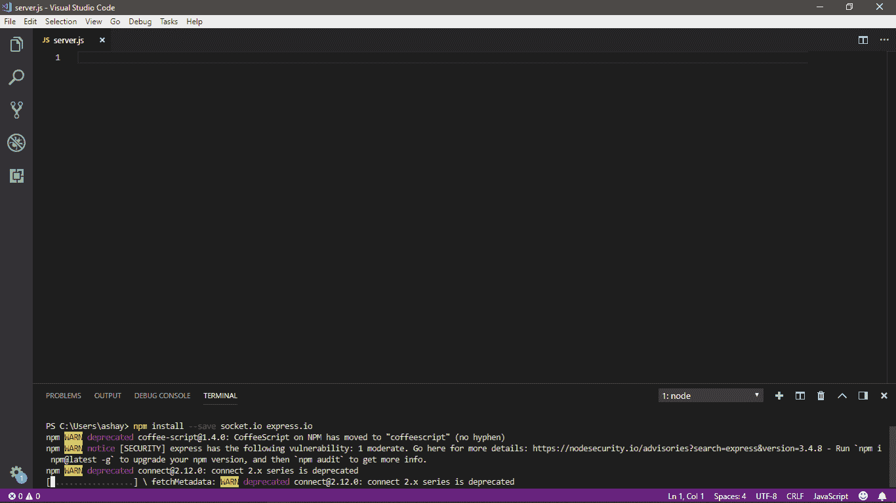

# 如何以及为什么对开源做出贡献

> 原文：<https://medium.com/hackernoon/how-and-why-to-contribute-to-open-source-ab7a4341d447>


Photo by [Yancy Min](https://unsplash.com/@yancymin?utm_source=medium&utm_medium=referral) on [Unsplash](https://unsplash.com?utm_source=medium&utm_medium=referral)

如果你在这里阅读这篇文章，这意味着你至少对开源有所了解。这篇文章旨在为那些还没有为开源社区做贡献但想做贡献的开发人员和程序员提供一个平台。它将讨论开源贡献的方式和原因。

您可能已经知道，开源已经改变了软件行业和现代计算世界的面貌，并且在未来还会继续这样做。开源社区有很多优秀的开发者，但它仍然需要你的贡献，因为每一滴都很重要。不管这是一个小的贡献还是实质性的东西。每个人都是这样开始的，随着你贡献越来越多，你也会成为专家。

千里之行始于足下。

# 对开放源码软件捐款的要求

对开放源码软件作出贡献的一些最基本要求是

*   **对您选择的一种编程语言有很好的理解**

对编程语言的理解不仅仅包括了解语法或者循环和递归是如何工作的。如果你已经熟悉了，那对你有好处！你越过了第一关。接下来，你需要承担起学习与这门语言相关的许多技巧和诀窍的任务。在那之后，你应该考虑学习和使用主要的库和软件包，它们将被用于任何大中型项目。你应该查找与你的编程语言相关的库，并花时间学习它们。很好地理解这些语言将有助于你更好地理解任何代码库。

*   **版本控制系统**

任何类型的版本控制系统对于任何开放源代码项目都是必须的，因为将有成千上万的贡献者，并且他们将独立地对源代码进行更改，所以需要一个系统来管理如此多的更改，随着贡献者数量的增加，手动适应所有的更改变得非常困难。

是的，这就是 Git 的用武之地。像 Github 和 SVN 这样的版本控制系统是协作编码的方式，它确保所有代码在整个项目的任何给定时间点都保持安全和并发。所有的组织/项目都使用某种形式的版本控制。尽管现在，几乎每个组织/项目都因为 Git 的一些特性而转向了 Git，但有些可能仍在使用 SVN。Github 只是一个 Git 客户端，可以让你在线托管你的代码。正如我们所看到的版本控制系统的重要性，很好地理解这些系统是如何工作的，并且了解它们的所有特性是非常重要的。所以，首先学习 Git，然后继续前进，学习如何使用 Github。

*   **学会阅读源代码**

如果你以前做过开源项目(*我认为你没有，这就是你在这里的目的*)或者使用过工具或其他软件，你可能会注意到它们大多数都有文档，而且大部分都是垃圾。您很少会遇到以直接和简单的方式告诉您有关项目或软件的文档，此外，有一个好的文档是不够的，没有什么可以替代阅读跨越数千到数百万行代码的巨大代码的能力。文档可能对最终用户有用，但对于任何新的开发人员来说，它可能看起来像是胡言乱语。当你需要检查跨越项目中 n 行和 n 个文件的源代码时，你只能靠自己了。

问题是，从哪里开始呢？这不是一个容易回答的问题，但我会尽力而为。

你应该学会如何使用几乎每个项目都会用到的 bug 和问题跟踪器。如果你不知道什么是软件缺陷，这将是一个开始学习的好时机。Bug 追踪器就像我们之前讨论过的版本控制系统。事实上，大多数版本控制客户端都有一个 bug 跟踪器的实现。Github 也有一个*问题*。一个 bug 追踪器，基本上，列出了软件当前识别的所有*【问题】*(或者 bug)以及它们的*【状态】*(它们解决了吗？未解决？正在努力吗？).Bug 追踪器为非开发人员的最终用户提供了一种指出软件中问题的方法。它们也可能被用来请求一个新的特性，这不同于一个 bug。

*   **提交补丁**

提交补丁意味着提交您对项目所做的更改。变更可能包括修复 bug 或向项目中添加新功能。这些补丁被提交给项目各自的所有者和版主。

一旦你学会了以上所有内容，你就可以向你选择的项目提交一些补丁或者错误修复了。选择任何一个开源项目——最好是用你知道的语言编写的，更重要的是，让你感兴趣——然后浏览它的 bug 跟踪器。大多数 bug 追踪器的问题都被标记为自愿的或介绍性的。搜索这样的问题，或者进行任何你认为可以解决的问题。评论或更新这个问题，说你正在着手处理。在您的本地系统上解决它(一旦您知道如何使用版本控制，您就会知道这是什么)，然后将其推送到组织的远程代码库。这说起来容易做起来难。您至少需要知道以下几点:

1.  项目使用什么版本控制系统。
2.  他们的代码贡献工作流程是怎样的？(大多数组织/项目都有一个定义好的提交补丁的方法，必须遵循该方法**。投稿指南可以在项目结构中的[投稿. md](http://contribution.md) 文件中找到**
3.  如何融入社区？
4.  如果你想成为一名优秀的社区贡献者，你必须练习并获得上述程序的专业知识，因为它们是构建社区的基石。

## 为部署创建应用程序

让我们使用制作一个简单的聊天应用程序，并将其部署到 github，让它对社区的贡献开放

我们将使用 JavaScript，Node.js，Experss 和 [Socekt.io](http://socekt.io) 创建应用程序。Node.js 是一个 JavaScript 运行时环境，它帮助 JavaScript 在浏览器(后端)之外运行。另一方面，Socket.io 是一个 JavaScript 库，有助于客户端和服务器之间的双向通信。Express 是一个节点框架，用于简化节点操作。

为了简单起见，本文将只关注后端部分，这是制作一个基本的应用程序所需的，不会关注 UI 部分。

遵循以下步骤，您将在几分钟内准备好应用程序。

*   使用 npm 安装 [Socket.io](http://socket.io) 和 Express.js，并将它们包含在您的项目中。



*   包括 Express，它将用于创建一个服务器，最终将有助于通信和逻辑实现。

```
 var app=require(‘express’)();
 var http=require(‘http’).Server(app);
```

*   包括 Express 和 call **http** 模块用于服务器创建

上面的代码用于调用 express 模块和 http 模块，后者包含创建服务器所必需的方法。

现在，当创建服务器时，我们需要将它托管在一个端口上。

```
var app=require(‘express’)();
var http=require(‘http’).Server(app);
http.listen(3000,()=>{console.log(‘Listening on port 3000’);})
```

**服务器托管**

上面的代码用于在给定的端口上托管服务器。每当服务器启动并运行时，控制台上会记录一条消息。

**定义路线**

您定义了一个路由处理器，当您访问网站主页时会调用它。

```
var app=require(‘express’)();
 var http=require(‘http’).Server(app);
 app.length(‘/’,(req,res)=>{
res.send(“<h1>Chat Application</h1>”)
})
 http.listen(3000,()=>{console.log(‘Listening on port 3000’);})
```

**创建一个 HTML 文件，以便在服务器启动时提供服务。**

```
<!DOCTYPE html>
<html lang=”en”>
<head>
<title>Socket.io chat</title>
</head>
<body>
<ul id=”messages”></ul>
<form>
<input id=”a”/><button>Send</button>
</form> 
<script src=”/socket.io/socket.io.js”></script>
<script>
$(()=>{
var socket=io();
$(‘form’).submit(()=>{
socket.emit(‘chat message’, $(‘#a’).val());
$(‘#a’).val(‘’);
return false;
});
});
</script>
</body>
</html>
```

**包含服务器中的**[**socket . io**](http://socket.io)**。**

```
var app=require(‘express’)();
var http=require(‘http’).Server(app);
var io=require(‘socket.io’)(http);
app.length(‘/’,(req,res)=>{
res.send(“<h1>Chat Application</h1>”)
})
io.on(‘connection’,(socket)=>console.log(‘A user connected’));
http.listen(3000,()=>{
console.log(‘Listening on port 3000’);
})
```

这是一个非常基本的聊天应用程序的例子。这篇文章的目的是如何为开源做贡献，所以它没有详细说明应用程序是如何制作的。该应用程序是一个简单的聊天 web 应用程序，我们将看到如何将其部署到 github 并打开它进行贡献。

# 开源您的项目

所以你正在考虑开始使用开源软件？

恭喜你！世界感激你的贡献。

没有开源你的作品的最佳时机。你可以开源一个想法，一个正在进行的工作，或者在关闭源代码多年之后。

要开源一个作品，每个项目都应包含以下项目文档:

*   开源许可证
*   自述文件
*   投稿指南

开源许可——开源许可保证其他人可以使用、复制、修改和贡献给你的项目，而没有任何负面影响。它还保护你免受法律诉讼。**当你启动一个开源项目时，你必须包含一个许可。**您可以使用我以前的一篇文章【链接到许可文章】来了解更多关于如何以及使用什么许可来进行项目的信息

**自述文件**——自述文件不仅仅是解释如何使用你的项目。他们也解释了为什么你的项目很重要，以及你的用户可以用它做什么。

在您的自述文件中，尝试回答以下问题:

*   这个项目是做什么的？
*   这个项目为什么有用？
*   我如何开始？
*   如果我需要帮助，我可以从哪里获得更多帮助？

**投稿指南** -投稿指南可在 [CONTRIBUTIG.md](http://contributig.md) 文件中找到。投稿文件包含关于以下内容的指南-

*   如何建议新功能
*   如何提交错误报告
*   如何运行测试
*   如何设置您的环境
*   如何在本地设置项目

它还可能包含关于项目愿景的信息，而不是技术信息，如

*   你希望你的项目发展成什么样。
*   你不希望你的项目发展成什么样。
*   你在寻找什么类型的贡献。
*   贡献者应如何联系您。

这些只是基本的步骤，对于投稿来说是必须的。如果你遵循所有的指导方针，有人最终可能会发现你的项目，他认为你的项目值得他们的贡献。你可以在不同的网站上传播你的项目，请求投稿。随着越来越多的贡献者对你的项目做出贡献，你将会看到它以你自己都无法想象的方式和幅度发展。