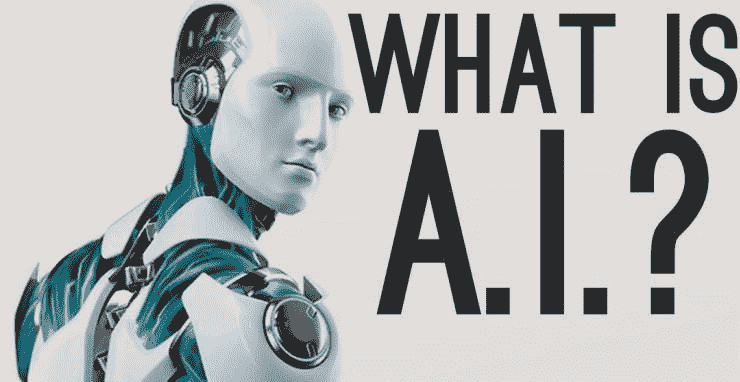
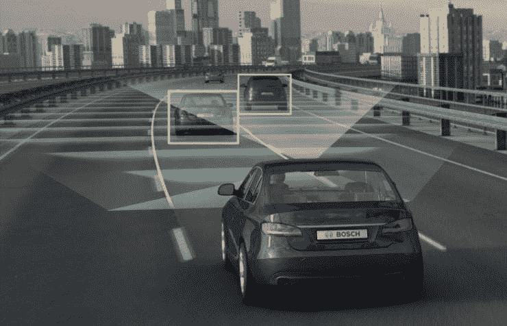
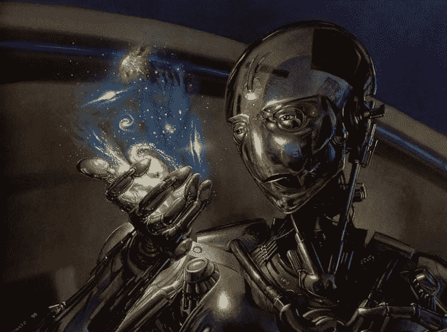
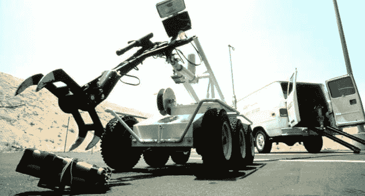
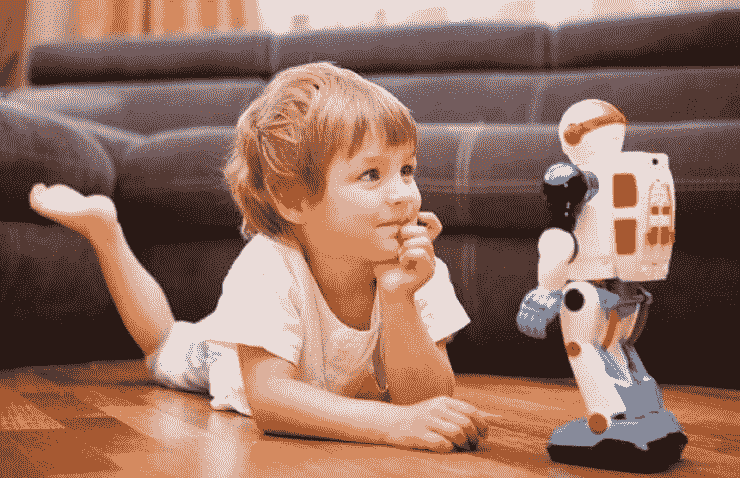
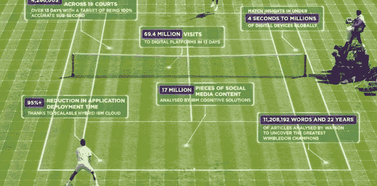
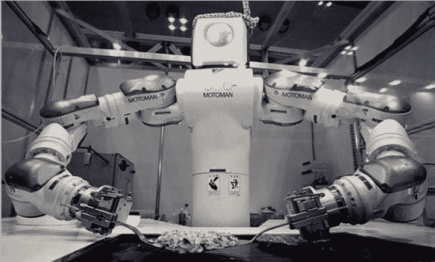
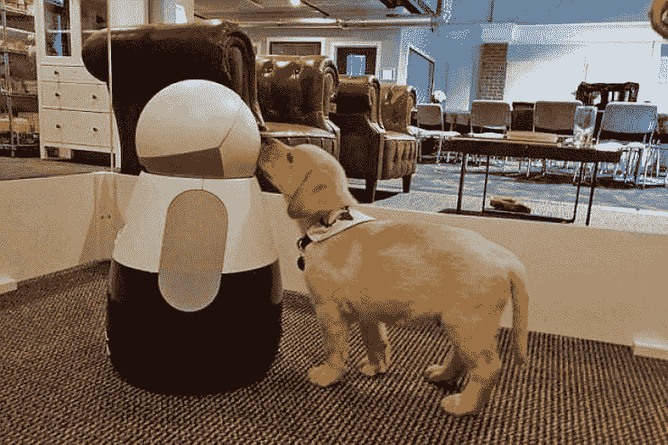
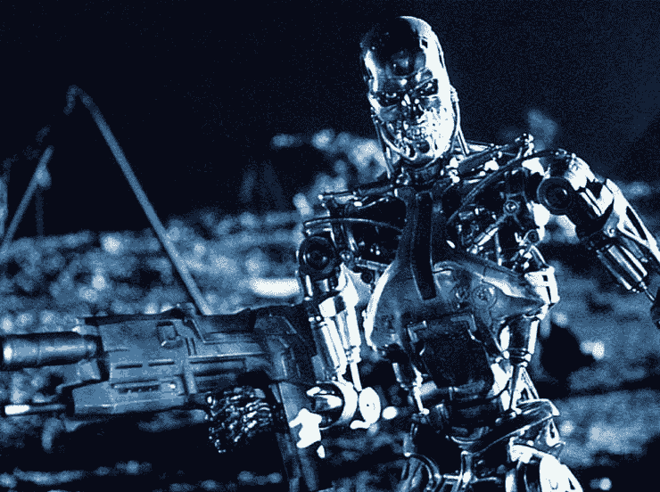

# 人工智能将如何改变我们的生活

> 原文：<https://medium.com/hackernoon/how-artificial-intelligence-is-going-to-change-our-lives-48458706f6a>

你很可能正在智能手机或电脑上阅读这篇文章。当你在 iPhone 上对 Siri 说**或者在 Windows 上对* [***谷歌助手***](https://assistant.google.com/#?modal_active=none) *或者*[***Cortana***](https://www.microsoft.com/en-us/windows/cortana)*问时间的时候，你在使用人工智能。在过去的十年里，人工智能的进步非常显著。但是更多的人来了。**

# *什么是人工智能？*

**

*如果能将人类的思维和思想引入计算机或类似计算机的设备中，那么就称之为 AI 或 [**人工智能**](https://en.wikipedia.org/wiki/Artificial_intelligence) 。如果你看过科幻电影或小说，你就会知道。人工智能代理是一个系统，它可以感知它的环境，并据此采取行动以最大化其成功的机会。*

*今天，人工智能被称为狭义 AI。这意味着，它被设计用来完成面部识别、互联网搜索、无人驾驶汽车等狭窄的任务。但是，创造出像人类一样执行强大任务的强大人工智能的日子还不太遥远。*

# *AI 可以集成在哪些设备中？*

*从手机到汽车，很多设备都可以引入人工智能。你只需要一个可编程的电子设备。如果你有一部 iPhone 或 Android 手机，那么你可能已经使用了 [**Siri**](https://www.apple.com/ios/siri/) 或 [**谷歌助手**](https://assistant.google.com/#?modal_active=none) 来完成一些常规任务，如知道时间、在互联网上搜索、设置闹钟和提醒等等，只需对它们说一句话就可以完成。人工智能可以引入电子设备，甚至可以作为自动程序(机器人)，如 [**扑克机器人**](https://www.yourpokerdream.com/online-poker/general-articles/poker-bot/) 、聊天机器人或任何其他类型的自动化。*

# *人工智能将如何改变我们的生活*

*技术以惊人的速度发展。我们现在口袋里装着比 10 年前在家里更多的权力。几十年来，人工智能一直是小说和电影的热门话题。但现在，它是我们不同维度技术的重要组成部分。我们的生活已经开始依赖于此。以下是人工智能将改变我们生活的一些方式。*

## ***医学科学***

*人工智能赋予计算机思考、学习和理解人类心理的能力。AI 可以在很多方面辅助医生。人工智能可以用来进行快速准确的诊断。机器人医生将治疗人类。因此，更多的病人可以得到良好的治疗。AI 将用于手术，手术将更加精确。人们将能够虚拟地咨询人工智能医生。 [**人类医生和人工智能系统**](https://www.researchgate.net/publication/303019481_Artificial_intelligence_in_medicine_Humans_need_not_apply) 的合作将对医学科技产生很大影响。*

## ***翻译和语言学***

*像微软和 Skype 这样的大公司已经引入了实时机器翻译。但是谷歌和苹果正在努力将这个想法更进一步。目前，世界上 7000 种语言中大约有 100 种可以被翻译成不同的语言。但是在未来，几乎世界上所有的流行语言都可以使用这项技术。来自世界各地的人们将能够用他们的母语与他人交流。*

## ***防御***

**

*人工智能将在许多方面适用于国防。它可以用于边境安全。人工智能系统可以准确地识别一个人。因此，它可以在过境时识别任何人。人工智能将应用于国际网络防御。*

*人工智能将能够在国家和国际安全方面帮助人类。这种人工智能机器人将被用来保卫国家安全。他们将充当警察和军人。*

## ***自动化运输***

**

*我们已经看到了自动驾驶汽车。但是为了安全，仍然需要一个司机在方向盘后面。尽管这项技术已经有了很大的进步，但它还不完善。所以，它还没有被公众接受。谷歌在 2012 年开始 [**测试自动驾驶汽车**](https://www.theguardian.com/technology/2012/may/09/google-self-driving-car-nevada) 。其他公司正在研究这项技术。*

*将来，汽车、公共汽车和火车等各种交通工具将不再需要人类司机。因此，道路事故不会发生很多。*

## ***电子人技术***

**

*研究人员认为，在未来，人类将能够用计算机来充实自己，增强许多天生的能力。*

*科学家和工程师认为，通过这项技术，截肢的人将能够用大脑与机器人肢体进行交流，并能够控制它们。这种技术将减少人类的身体限制。*

## ***接管危险工作***

**

*像 [**拆弹**](http://www.bbc.com/future/story/20160714-what-does-a-bomb-disposal-robot-actually-do) 这样的危险工作，机器人早已被引入。这些机器人不是完全人工智能的。人类从远处控制这些机器人。它们就像无人机。因此，他们拯救了成千上万人类士兵的生命。*

*其他危险的工作，如焊接、在深洞或井里找东西等，都由机器人来做。虽然人类必须控制这些机器人，但在未来，这些机器人将完全人工智能。*

## ***机器人做朋友***

**

*今天的机器人没有感情。所以，他们仍然不能像朋友一样。如果你看过科幻电影或读过小说，你就会看到人工智能机器人的行为像人类一样。因此，他们可以是人类的朋友或敌人。但是，我们仍然不能想到一个机器人伴侣。*

*但在 2014 年，日本一家公司推出了 [**一款名为“Pepper”**](https://en.wikipedia.org/wiki/Pepper_(robot))的机器人，可以理解和感受情绪。所有单位(1000 个单位)在一分钟内销售一空。因此，不难理解，在未来，机器人将是人类的好伙伴。*

## ***体育***

**

*许多多人游戏太复杂，无法应用正确的策略来赢得这些游戏。AI 现在在很多游戏中被用来设计策略。AI 理解游戏的基本原理，并通过机器学习算法来分解游戏。*

*因此，人工智能可以成功地设计游戏计划。但在未来，人工智能将能够设计一个像篮球，曲棍球，足球等连续运动的游戏策略。*

## ***作为助手的机器人***

*机器人将充当 [**人类的助手**](https://techeries.com/will-robots-take-human-tasks-next-10-years/) 。*

***烹饪:***

**

*烹饪是人工智能的完美工作。它基本上需要知道添加什么成分，怎么添加。现在，有许多可编程机器人可以根据你的选择烹饪食物。但在未来，人工智能将被引入机器人，像机器人将能够学习烹饪新的食物。*

***购物:***

**

*它不太好用。如今网上购物如此受欢迎。AI 可以理解你的想法，可以建议你选择最好的东西。在未来，你会告诉你的人工智能机器人给你买那个。它会付钱并把你的产品带给你。*

***养宠物***

*如果你是一个宠物爱好者，那么这个就不用解释了。当你出去工作时，你总是要关心你的宠物。虽然人工智能还没有改进到可以在那种情况下帮助你，但是在未来，人工智能机器人将能够在那种情况下帮助你。如果出了问题，机器人会让你知道。所以，你不用一直担心。*

# *人工智能的风险*

**

*用来杀人的人工智能系统被称为自主武器。如果这些武器落入坏人之手，这些武器会造成大规模伤亡。同样，人工智能机器人会导致一场反对人类生存的战争。如果你看过像《T2》、《我是机器人》、《T3》或《T4》、《瓦力》、《T5》这样的电影，你就会看到这种情况有多糟糕。*

*人工智能的广泛使用将在许多工作中用机器人取代人类。因此，失业问题将是巨大的。过于依赖人工智能会削弱身体和精神的力量。*

## ***总结***

*世上没有不纯洁的祝福。人工智能有自己的风险。人工智能在很多方面都是人类的福音。我们现在在很多情况下都在使用 AI。但在未来，将很难找到任何不使用 AI 的地方。过度依赖人工智能对人类有害。因此，对人类来说，在为时已晚之前，对人工智能在各个领域的应用进行大量研究是明智的。*