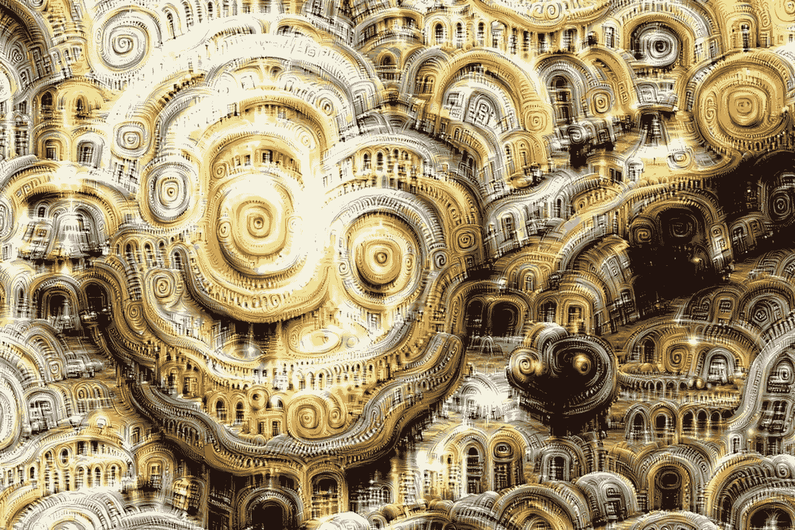
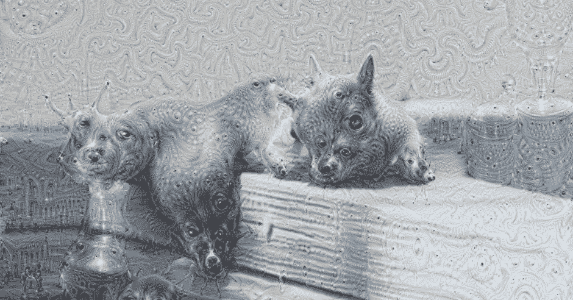
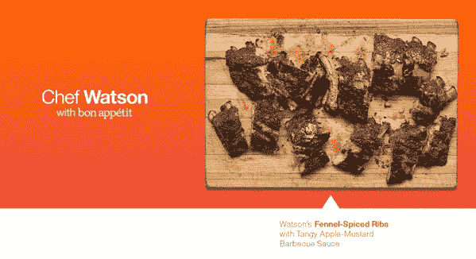

# 人工智能如何重新定义艺术

> 原文：<https://medium.com/hackernoon/how-artificial-intelligence-is-redefining-art-6cea5a01b05b>

艺术一直被认为是人类创造力的专属领域。但事实证明，在创新领域，机器能做的比我们人类想象的多得多。2018 年 10 月，佳士得以 43.25 万美元的价格卖出了第一幅[人工智能生成的画作。这幅名为《爱德蒙·德·贝拉米》的作品预计售价为 1 万美元。显而易见的艺术通过向系统输入 14 世纪至 20 世纪期间创作的 15，000 幅肖像，使用生成对抗网络(GAN)算法创作了这幅杰作。虽然使用人工智能创建的图像已经在互联网上流传了一段时间，但埃德蒙德·贝拉米证明了机器可以带来一种新的艺术类型。](https://www.christies.com/features/A-collaboration-between-two-artists-one-human-one-a-machine-9332-1.aspx)

在过去的 50 年里，艺术家们一直在使用人工智能来创作数字艺术。这个想法是教人工智能系统理解和复制人类创造的艺术品。[神经风格转移](https://en.wikipedia.org/wiki/Neural_Style_Transfer)技术用于复制和再造艺术作品。该技术使用深度神经网络来执行图像转换。无论是绘画、音乐、摄影、视频还是其他形式的艺术，概念都是一样的:你向算法输入数据集，人工智能将产生融合各种风格的艺术品。

# 绘画与素描中的人工智能

在绘画领域有几个人工智能的例子。最早的一个例子是哈罗德·科恩在艺术和人工智能交叉领域的工作。他创造了一个电脑程序[亚伦](https://en.wikipedia.org/wiki/AARON)自主生产艺术。2015 年，谷歌在 2015 年发布了一个名为 DeepDream 的计算机视觉程序，该程序通过算法 pareidolia 找到并增强图像中的模式，从而创建迷幻图像。开发该软件是为了帮助科学家和工程师理解什么是神经网络。

Google DeepDream Art

Pikazo 应用程序也使用神经风格转移技术来制作令人惊叹的艺术品。用户需要上传两张图像，并将它们转换成一幅美丽的新艺术作品。艺术家安娜·里德勒(Anna Ridler)拍摄郁金香的图像，并使用人工智能创建这些郁金香盛开的视频。像 soundwavepic.com 这样的网站允许用户上传/录制他们的声音，并将其转换成很酷的[声波艺术](https://www.soundwavepic.com)。微软新的[绘图机器人](https://techcrunch.com/2018/01/18/microsofts-new-drawing-bot-is-an-a-i-artist/)本身就是一个艺术家。机器人根据书面描述画了一幅画。

# 音乐产业

人工智能已经被用于音乐行业，为视频项目创作免版税的音乐。它推动了交互式作曲技术，在这种技术中，机器根据音乐家的现场表演来作曲。索尼计算机科学实验室的研究人员使用人工智能创造了一首相当奇怪但有趣的流行歌曲，名为“爸爸的车”，使用的是[流量机器](https://www.seeker.com/tech/artificial-intelligence/inside-flow-machines-the-lab-thats-composing-the-first-ai-generated-pop-album)。在 13，000 首歌曲被输入机器后，软件创作出了这段旋律。虽然一些艺术家回避机器可能会夺走他们的表达和创造力的可能性，但像塔瑞安·扫森这样的艺术家正在欢迎这种颠覆性的技术。谷歌的 [Magenta 项目](https://ai.google/research/teams/brain/magenta/)也旨在开发新的深度学习算法，以生成歌曲、图像、图纸等。艺术家和音乐家也可以使用这些工具扩展他们的流程。算法可以帮助音乐人创造出观众需要的东西，并预测哪首歌会火。

# 厨艺

IBM 的主厨沃森(Watson)是一位烹饪天才，能够像人类一样处理数据。它的功能就像一个数字厨房，可以访问一个大型的食谱和风味数据库。厨师沃森已经帮助成千上万的厨师做出美味的饭菜。这台机器有能力模仿厨师的工作，建议食物组合，并帮助他们创造出我们无法想象的独特风味。如果你不熟悉亚洲烹饪，沃森主厨也会帮助你。显然，认知技术也可以帮助人类完成复杂的任务，我们可以实现一些没有人工智能不可能实现的事情。沃森对海量数据进行分类的能力可以应用于任何事情，比如帮助科学家对抗癌症，制造香水等。

# 爱&舞蹈

在谷歌艺术与文化的帮助下，屡获殊荣的英国编舞韦恩·麦格雷戈开发了一个[人工智能系统，可以预测他特定风格的舞蹈动作](https://www.dancemagazine.com/is-google-the-worlds-next-great-choreographer-2625652667.html?rebelltitem=2#rebelltitem2)。这个人工智能驱动的工具从麦格雷戈的档案和其他十名舞者那里获得了数千小时的视频片段，以训练算法来检测模式。使用数据，它可以预测可能遵循短语或特定姿势的 McGregor 序列。该工具捕捉了舞者的个人风格，并学习了韦恩·麦格雷戈的独特风格。

它可以预测手势，重现舞者的风格。谷歌艺术与文化的技术项目经理达米安·亨利(Damien Henry)表示，人工智能系统不会发明以前没有见过的动作，但它会根据该工具学习到的以前的模式预测会发生什么。

AI 可以在创意领域打开一个有无数可能性的盒子。艺术家可以和机器一起工作，创造出一些想象不到的东西。

在艺术中实现人工智能将继续孵化有趣的艺术品。人工智能的能力不容置疑，只有时间会告诉我们如何利用这些能力。