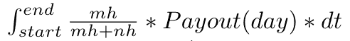
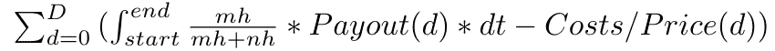
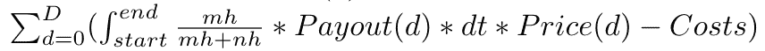
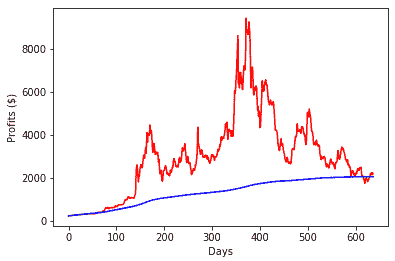
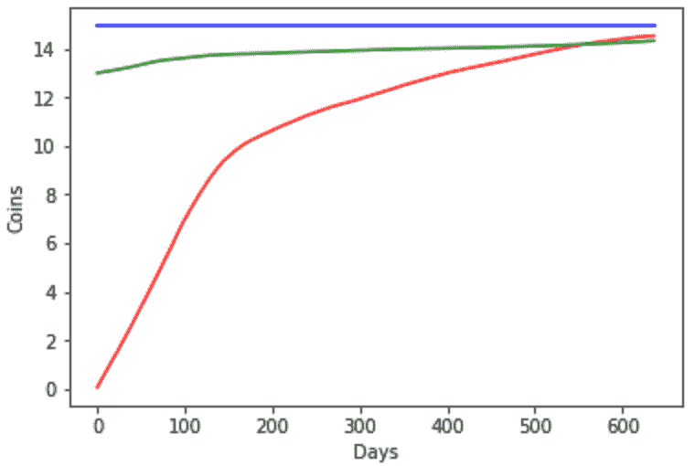

# 家庭加密挖掘如何胜过购买加密

> 原文：<https://medium.com/hackernoon/how-at-home-crypto-mining-outperforms-buying-crypto-8f30d87d2348>

**简介**

从外部来看，加密货币开采可能不透明，令人困惑。这是令人生畏的学习，更不用说试图确定是否有意义的实际参与。事实上，这正是我们开始 [Coinmine](http://coinmine.com) 的原因— —让加密和为加密提供动力变得容易。迄今为止，在家采矿的一个一贯动机是我们所说的“自由加密”——通过参与创造新的非法定货币，为自己和他人确保主权未来的能力。

除了值得挖掘的 Liberty Crypto 动机之外，从经济角度来看，挖掘可能是比购买更好的积累加密货币的选择。有了正确的框架和模型，它可以让人们使用他们的资源，不仅获得他们今天感兴趣的密码，而且让他们自己对未来应该出现的新密码保持开放。

在本文中，我们试图围绕加密货币开采的盈利能力、投资和投资回报展开思考。我们希望消除困惑，并在此过程中向新的受众开放采矿。我们相信，计算采矿投资回报率的更好模型将使人们能够就如何积累和支持他们相信的加密货币做出最佳选择。

**具体来说，在这篇文章中我们:**

*   回顾用于确定 ROI 的现有模型，指出其假设中的一些挑战
*   提供一个新的公式来确定一段时间内采矿的投资回报率
*   将该公式应用到 Zcash 的例子中，看看在代币累积和基于美元的财务回报方面，采矿与购买相比如何
*   总结一组我们认为有助于人们思考采矿是否适合他们的要点

我们的发现表明，在正确的心理模型和时间框架下，在家采矿可以成为一项有利可图的事业，比仅仅购买更有利于积累硬币。

注意:如果你只是想看数学，跳到“运行数字”部分。

**基于“今天”的挖掘 ROI 模型的问题**

总的来说，今天帮助人们确定他们采矿的可能投资回报率的模型太简单了。例如，他们倾向于假设价格不变，而事实上价格根本不变。分析工具助长了这种过度简化。大多数人使用在线挖掘计算器来获得他们当前的日利润，并通过设备的寿命来推断投资回报率。

这些网站往往有一个特定的方法。他们隐含地使用了一个公式来修正网络散列的变量。当 Twitter 和其他网站上的评论者使用这个公式时，他们固有地暗示他们认为价格和 hashrate 将永远保持不变。这没有考虑到价格和 hashrate 都在不断变化的事实。根据今天的数据推断未来的投资回报率似乎是不可能的。

另一个挑战是许多模型使用美元作为记账单位。虽然这在短期内作为对加密市场当前波动的对冲是好的，但加密货币的意义并不总是回到法定货币的世界。许多密码爱好者对积累尽可能多的硬币感兴趣，并且有很长的时间跨度。我们认为开采硬币的经济学不同于简单的买卖基础资产。这些差异让那些对加密货币前景有长远看法的人受益匪浅。

**运行数据挖掘**

我们认为挖掘 ROI 模型可以在某种程度上得到极大的改善，这种方式有直观的意义，并且有数学的支持。在本节中，我们提出了一个不同的公式来确定投资回报率，它考虑了不同的持有模式，然后根据 Zcash 对它们进行回测。

我们首先假设 D 是我们出售硬币的次数(通常是每天)，M 是我们支付费用的次数(通常是每月)，支出(D)是给定一天的总网络硬币支出 D。让成本=租金+电费+冷却费+资本支出。此外，mh 是单个矿工的哈希表，nh 是整个网络的哈希表。一个销售周期的硬币收入为:

*收入(硬币)*

在采矿硬件的寿命期间，仅通过销售来弥补成本时的利润是:

以美元计算，每天的销售额是:

**Zcash 的一个真实世界的例子**

让我们在一个流行的链上进行回溯测试:Zcash。

在我们的测试中，我们假设购买了一台 GTX 1080 采矿机，于 2017 年 1 月 1 日开始采矿。我们在 2018 年 10 月 1 日停止该模型，因为由于在 Zcash 网络上引入了 ASICs，使用 a 1080 开采 Zcash 变得利润更低。但是，1080 年的硬币可以换成其他的硬币，用于有利可图的采矿。稍后将详细介绍。

*采矿和销售利润(蓝色)，采矿和控股利润(红色)*

***采销 vs .采控股***

首先，我们比较了两种不同挖掘策略的利润:1)每日挖掘并出售(上图中的蓝线)，2)挖掘并持有硬币利润(上图中的红线)。上面的红线代表了一个矿工在任何一天持有股票后卖出的利润。例如，如果一个矿工花了 365 天开采 Zcash，并在他们的一周年纪念日出售，他们将获得 5236.86 美元的利润，超过每天开采和出售的利润。对于那些愿意持有一段时间的矿商来说，很明显，每天卖出比卖出能赚更多的钱。我们认为，绝大多数消费矿商都有比日常销售更长的时间跨度。将大型矿业集团的每日甚至每周销售模式应用于较小的个体矿商是没有意义的。

***挖矿 vs .买币积币***

到目前为止，我们已经讨论了以美元为记账单位的挖掘和 ROI。许多人对积累尽可能多的硬币感兴趣，并且有很长的时间跨度。采矿的投资回报率开始为负数，而不是购买硬币的投资回报率为 0。这意味着矿工必须比日内交易者有更长的时间框架。让我们在我们的第一个例子——开采一枚新硬币——中探索采矿可能带来的积累，以及采矿的长期主义如何能够作为对冲遭受加密价格的对冲。

现在，我们将通过 1)采矿(下面的红线)2)在与采矿相同的时间购买(下面的绿线)和 3)批量购买——所有资本支出和最终运营支出(下面的蓝线)来了解硬币积累。因此，我们将回到我们运行的 Zcash 回溯测试，检查一下一次性购买、增量购买、挖掘和持有我们会有多少硬币。

从这个实验中，我们可以看到，从长期来看，为采矿而积累的 Zcash 硬币比增量购买要好。请注意，一旦这个实验停止，Gtx 1080 在其他硬币上是盈利的，这些利润本来可以用来兑换 Zcash。可选地，GTX 1080 然后可以被出售以购买更多的 Zcash，导致通过采矿然后出售采矿设备积累更多的总 Zcash，而不是增量购买或一次购买。

**新硬币**

通常，当新的工作证明硬币发行时，发行率高，网络散列率低，市值低。由于市场不成熟和缺乏流动性，这个网络的硬币甚至可能价格飙升。以这种方式，购买 GPU 矿工几乎就像购买尚未创造的当前和未来硬币的看涨期权。潜在的矿商应该考虑任何尚未推出的有吸引力的硬币，作为现有估计投资回报率之上的溢价。计算这一新网络的一种方法是在启动后将溢价计入所有每日利润/收入。从发布到 GPU 过时，这方面的适当百分比可以是 30%或更高。

对于专注于积累的矿工来说，没有比在新推出的网络上采矿更好的积累硬币的方式了。最早的矿工在他们最需要的时候为他们最喜欢的新硬币供电，这有助于他们现有的硬币储备。

**审查&结论**

经过审查，有几个突出的结论:

1.  当一个人随着时间的推移实际测量 GPU 挖掘的 ROI 时，很明显，在正确的持有期内，挖掘不仅可以更有利可图，而且作为一种积累硬币的方法，还可以胜过直接购买。
2.  应用现有的投资回报率模型，专注于静态价格和哈希拉预期-或假设立即出售，而不是任何持有时间-往往低估了采矿的真正投资回报率
3.  此外，这些模型未能理解投资采矿设备带来的潜在好处。如果开采一枚硬币变得无利可图，由于将 ASICs 引入生态系统等因素，可以为不同的加密货币部署相同的设备。

投资加密货币等任何投机性资产仍存在固有风险。即使市场上出现了更容易、对消费者更友好的采矿设备，它们仍然是一种前期投资。

尽管如此，crypto 需要你的散列能力，甚至比你买卖它的订单还多。越多的人支持加密，加密就变得越安全和有价值，我们就能获得更多的自由、独立和自我主权。这些数字表明，自由的动机实际上也得到强大的经济激励的补充。