# 我的交易自动化是如何帮助我赢得加密熊市的

> 原文：<https://medium.com/hackernoon/how-automating-my-trading-is-helping-me-win-the-crypto-bear-market-434f641fb3e5>

> 牛赚钱，熊赚钱，猪被宰。

2016-17 年 crypto 的崛起带来了大型交易所、交易商数量的增加、流动性市场和巨大的**价格波动。**

Volatility in bitcoin prices 2014–2019

不像霍德勒买入并希望价格上涨，交易者喜欢价格波动并利用它赚钱。

一些最好的交易者甚至不关心市场的走向。他们不在乎市场是*看涨*还是*看跌。他们想做的就是利用古训中的价格波动，低买高卖。*

# 牛市中的交易

> 当市场上涨时，你所做的就是 HODL

当市场上涨时，你做的几乎任何事情都会给你带来丰厚的回报。交易者往往变得自满，只有当你寻找低点时，战胜市场的机会才会出现。

对于被动交易者来说，买入并持有是应该做的事情。等待和尝试，时间市场在牛市达到顶峰。

活跃的交易尝试使用更好的策略:

*   在下跌结束时逐步买入
*   建立长期头寸，等待价格上涨 10-12%
*   让交易持续几个小时或几天
*   当有坏消息或价格开始下跌时关闭
*   重复

这个策略非常有效地帮助我扩大了投资组合。直到它没有。

2017 年的冬天也带来了 crypto 的冬天。市场开始崩溃。价格下跌的速度超过了上涨的速度。在我的头脑中，我很清楚这种等待和观望的牛市策略现在再也行不通了。

# 我的熊市交易实验

随着熊市的到来，交易方式变得非常不同。我不能再坐等价格上涨，如果价格上涨的话。

我最初开始在不同的论坛上涉猎，跟随“交易大师”并开始查看 tradingview.com 的大量指标、图表和工具。我很快被扔给我的所有信息淹没了，我不是专业交易者。

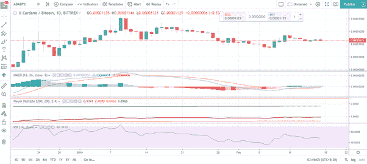

一旦我读够了书，建立了一个我想尝试的策略，我就把第一笔钱押在了 Bitmex.com 身上。这从一开始就是一场灾难，我很快意识到这一点

*   在部署之前，我需要测试我的策略
*   不停地盯着图表看什么时候是买入/卖出的正确时机，占用了太多的时间
*   我失去了 2/3 的机会，因为 crypto 是 24*7*365 的，我只能在屏幕前呆 8 个小时
*   市场太多了，寻找合适的机会变得很困难

交易从被动的每笔交易赚 10%变成了主动寻找小代币的机会，希望每笔交易赚 1-2%。我意识到赢的唯一方法是自动交易。我的策略只是算法，除了有一个小问题之外，应该有一种方法来自动化它们。*我不知道如何编码一个如此复杂的基础设施。*

# 自动化我和 Mudrex.com 的交易

无法实现交易自动化不仅仅是我面临的问题。我和我的朋友开始寻找制作我的机器人的方法。我尝试了一些平台，但是大部分不是限制太多就是被证明是骗局。

我的一个朋友向我介绍了 Mudrex，它是同类产品中的第一个*算法交易平台*，用户可以使用拖放界面创建交易策略。这个平台简单、直观，拥有我需要的一切。

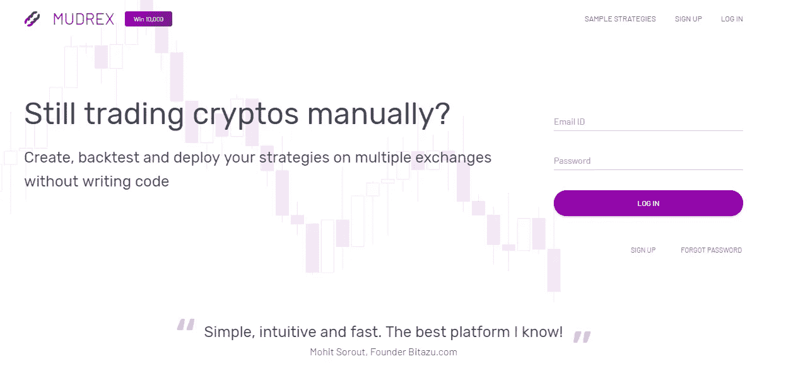

我花了几个小时才弄明白如何建造。这是我最初建立的策略

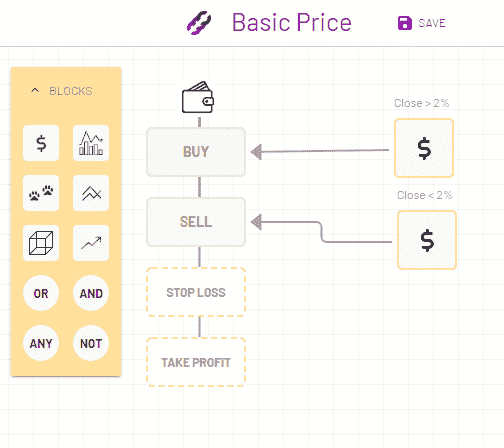

Simple strategy which buys when the price increases and sells when the price decreases by 2%(I admit it looks terrible)

我很快找到了窍门，建立了另一个策略，我称之为趋势捕捉器。我的假设很简单:

*   尝试用均线和振荡指标抓住上涨趋势
*   确保每笔交易的最低利润
*   不要交易太频繁
*   不要在下跌趋势中交易

在文档的帮助下，我自动化了我的策略，并在第一天就完成了！

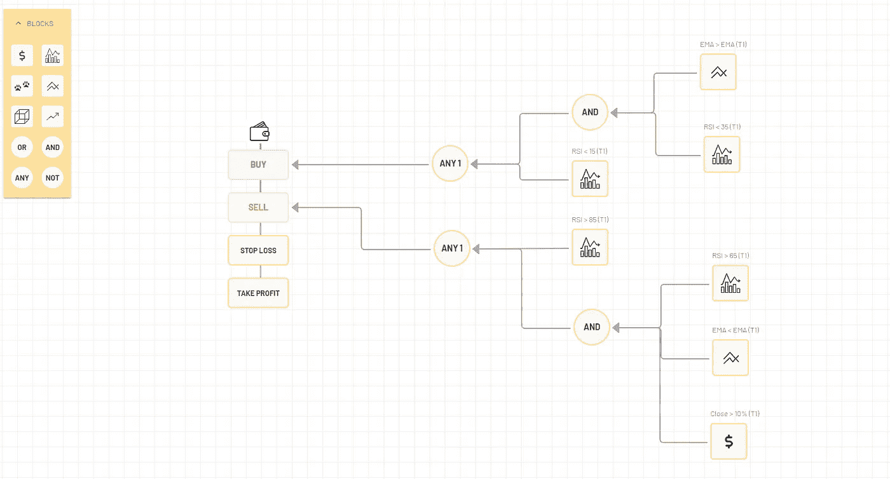

Trend catcher: My strategy to find small uptrends in bear markets

好的一面是，我不仅能够建立自己的策略，还能根据大量资产的历史数据对其进行测试。我可以查看详细的信息，并找出策略到底哪里出了问题。并一步一步地改进它。

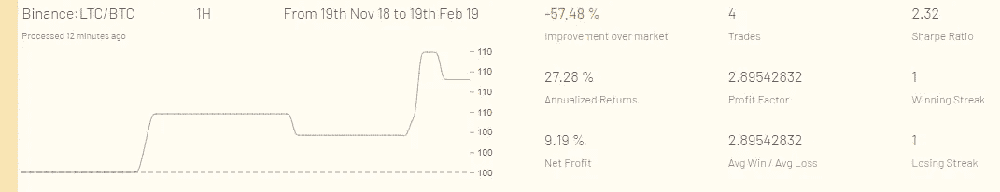

This was the first version

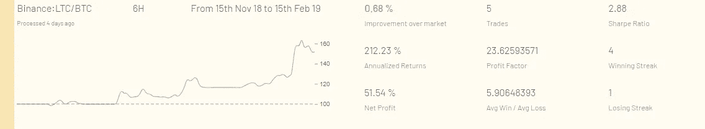

This is where I was able to get to eventually!

一旦我确信这个策略会起作用，我就运行这些策略。我可以使用 API 密匙在我的交易账户中使用真正的密码。

所以，如果你有一个账户，比如说，[币安](http://binance.com/)，你可以把交易的 API 密匙导出到 Mudrex，让它自动为你交易。

我已经交易了几个月，我的利润在稳步增长。我的策略轻松战胜了市场。当我出发时，我想我会

1.  制定战略
2.  运行它
3.  小睡一下
4.  参见利润

在 Mudrex 的现实世界中，更像是

1.  制定战略
2.  进行回溯测试
3.  进一步调整策略
4.  再做一次回溯测试
5.  …
6.  …
7.  进行纸上交易(虚构的交易，用虚构的钱实时交易)
8.  拧一下。
9.  最后，进行真正的交易
10.  **对结果负责。**

***免责声明:*** 在过去的 3 个月里，我一直作为 beta 测试人员在 Mudrex 帮助团队，因为我热爱这个产品！

Mudrex 免费供大家使用！他们正在进行一场交易竞赛，以寻找最佳的交易策略。我已经注册了，我计划赢得:D

我用类似的原则研究过更多的熊市策略。

**电视策略:**这是一个强力策略，通过查看超过 **30 个不同指标**和移动平均线的值，帮助我评估是否是进入/退出的正确时间

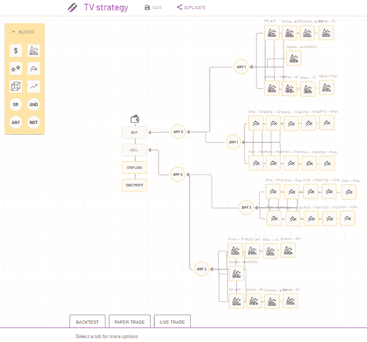

以下是回溯测试结果:

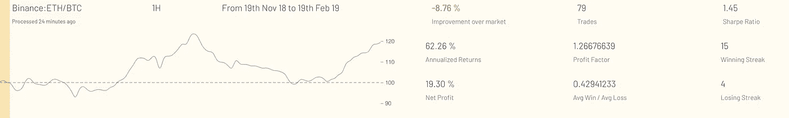

The strategy shows a profit but not better than market

**Ichimoku Cloud 策略:**该策略使用流行指标[“Ichimoku Cloud”](https://mudrex.com/indicators/31)，在市场开始上涨或下跌时买入和卖出。

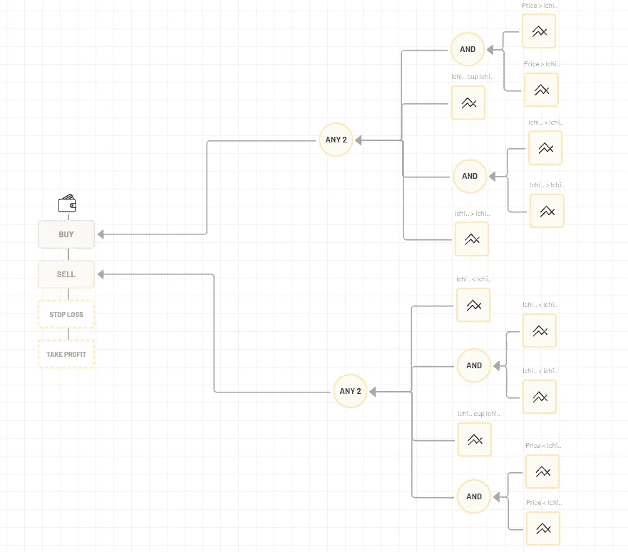

过去几个月的一些早期回溯测试结果:

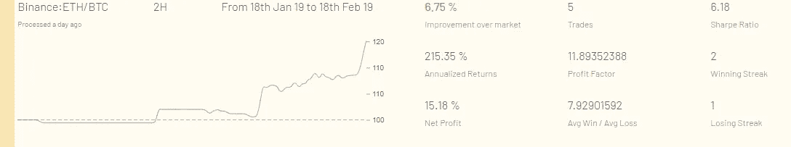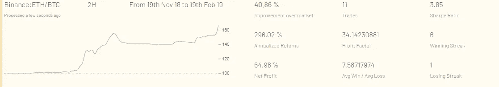

以下是 Mudrex 提供给所有在熊市工作的早期用户的一些例子:

*   [简单价格振荡器](https://support.mudrex.com/hc/en-us/articles/360015112172-Sample-Strategy-Price-Oscillator)
*   [均值回归策略](https://support.mudrex.com/hc/en-us/articles/360015113692-Sample-Strategy-Mean-Reversion)
*   [丸博和原见模式战略](https://support.mudrex.com/hc/en-us/articles/360015319291-Sample-Strategies-Pattern-Matcher)