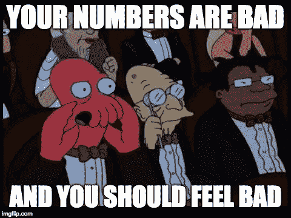

# 糟糕的数字是如何毁掉你的推介平台的

> 原文：<https://medium.com/hackernoon/how-bad-numbers-are-ruining-your-pitch-deck-a06515ec19da>

(Photo: [rawpixel](https://unsplash.com/@rawpixel))

我发现，在我工作过的几乎所有环境中，人们报告数据的方式都有问题。我在初创公司创始人的推介材料中，在高管的演示文稿中，在工程师、营销人员、产品经理甚至数据科学家的内部报告文档中，都看到过这一点。

今天，这个问题又一次出现了，一位创始人向投资者提供了最新信息，其中包含一些关于月度流失率的数据。它看起来像这样:

**八月:8.24%
九月:8.49%
十一月:8.36%
十二月:8.54%**

你看出问题了吗？

**这是重要数字。**

这位创始人正在报告他的流失率，精确到百分之*个百分点*。

这个数据在技术上是错误的，这已经够糟糕了:他的测量不可能精确到保证百分之一的报告。更糟糕的是无意的误导。这位创始人本质上是在引诱他的投资者问他，为什么流失率在变化，但剧透一下，它其实根本没有变化。

# 重要数字

从中学到研究生院，有效数字的概念被灌输到科学课学生的头脑中。这个想法是这样的:当你进行测量时，你只能做到如此精确。

可能你的尺子只下到 1/10 厘米。也许您的秤只能精确到 1/1000 克。

当您使用这些测量值来计算一个新的量时，该量的精度仅与您最不精确的测量值的精度相同。如果你的尺子的精度极限是 1/10 厘米，你就不应该报告精确到 1/100 厘米的计算量。你实际上并不知道精确到那个程度的量。你在误导你的观众。

How you measure matters. (Photo: [Patricia Serna](https://unsplash.com/@sernarial))

# 误差幅度

当计算像流失率这样的数量时，你将更容易受到测量精度问题的影响，而不是样本大小问题的影响。当你根据具体实例(例如，本月的用户数)来计算你的数字时，你总会有一些误差。

你合作的用户越多，利润就越小。但是不管你的用户群有多大，你都应该预料到你的人数会受到正常统计波动的影响。

The more ducks you collect, the more precisely you can measure their behavior. (Photo: [Joshua Coleman](https://unsplash.com/@joshstyle))

# 更多小数！=更准确

如果你在月初有 231 名用户，其中 19 人流失，你的计算器将返回流失率 19/231 = 8.225108225%。这些额外的小数是除法的人工产物，而不是你实际知道你的流失率到小数点后第九位的指标。**仅仅因为这些小数出现在计算中，并不意味着它们对数字的准确性有意义的贡献**。

报告额外小数的问题不仅仅是技术精确度的问题。报告过多的小数是有问题的，因为它具有误导性。阅读你的结果的人会认为你知道那些量，其精确度由你写下的小数位数暗示。他们会把你的测量数量和统计波动的大杂烩当成真相。

这就是为什么科研人员要关心这些看似枯燥的细节。科学家们以彼此的研究结论为基础。因此，他们需要清楚自己知道什么和不知道什么，这意味着他们必须严格要求他们在数字中报告的精确度。

It’s science! (Photo: [chuttersnap](https://unsplash.com/@chuttersnap))

# 你的数据应该讲述一个故事

那么，为什么商业环境中的许多人认为报告数字时，小数越多越好呢？在某种程度上，我认为这种做法源于一种透明的愿望，即给他们的观众尽可能多的信息。但愿不会有人对企业的发展方向产生错误的想法，因为报告数字的人用一些创造性的四舍五入掩盖了事实。

但是我认为这种行为背后更大的驱动力是人们抵制这种想法，即**这些数字应该讲述一个故事**。

您的数据不仅仅是页面上的图表。**您的数据传达了关于您的企业如何运营的基本事实——始终如此。**不要只是从仪表板上复制粘贴一个数字。报告前要三思。

# 如何做得更好

当你准备报告一个数字时，问问你自己…

*   有问题的数量看起来像你所期望的，还是比你所猜测的要大/小？为什么？这对企业意味着什么？
*   数量是增加、减少还是持平？每个选项的业务含义是什么？
*   数量是否仍在增加/减少，但速度比上个月慢/快？这对企业意味着什么？
*   数量是否在一周、一个月、一个季度或一年中循环变化——总是在周末下降或在假期前后上升？这种周期性行为应该如何影响你的受众对这些数据的理解？
*   数量变化的方式有意义吗？这是你所期望的吗？为什么？
*   根据需要，给你的结论添加上下文。您是否在处理基于非常小的用户子集的数字？你有证据表明目前的趋势可能会逆转吗？你有理由相信你在一个很大的误差范围内操作，或者一些日志问题可能搞乱了这个星期的数字吗？说吧。数字的透明度意味着给出完整的上下文，而不是写下每一个小数点。

(Photo: [Emily Morter](https://unsplash.com/@emilymorter))

如果像上面例子中的创始人报告流失率一样，你想要报告的数量没有变化，那就让它变得明显。不要一个月又一个月地写下小数值有些小波动的同一个数字。如果你的流失率是 8.24%，8.49%，8.36%，8.54%，那么就说:流失率每个月都在 8-9%之间。

继续下去，把你的结论说清楚。不要指望你的观众会为你画出来。

# 不要放弃你的数字的叙述

reporting analytics 的目的是讲述一个关于您的业务健康状况、面临的挑战以及您根据现有证据认为未来会是什么样子的故事。**分析数据是叙述性的。**如果你没有用你的数字来编造故事，那你还不如什么都不做。

你不需要统计学学位来学习如何倾听你的数据告诉你什么。你甚至不需要严格遵循有效数字和误差计算的原则。但是你确实需要**对你的数字有一种直觉，并且仔细思考你打算用你报道的每一个数字来讲述的故事。**

Your data is narrative. Tell the story. (Photo: [Aaron Burden](https://unsplash.com/@aaronburden))

不经过思考就报告多余的小数是懒惰的。这表明你期望你的听众为你做解释的工作。不要放弃你的数字叙述。听他们告诉你什么，并讲述这个故事。