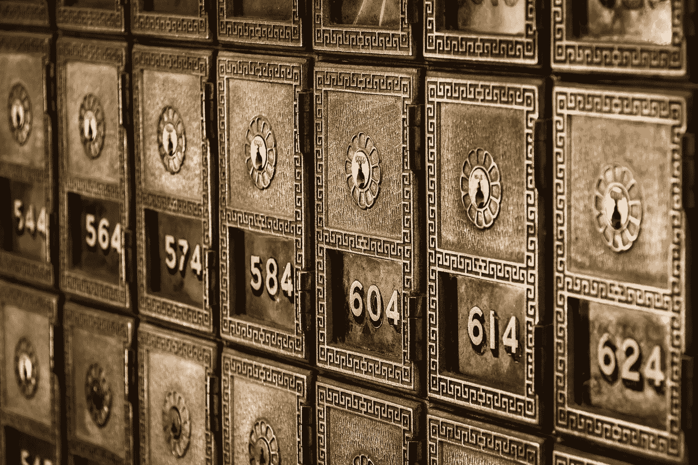
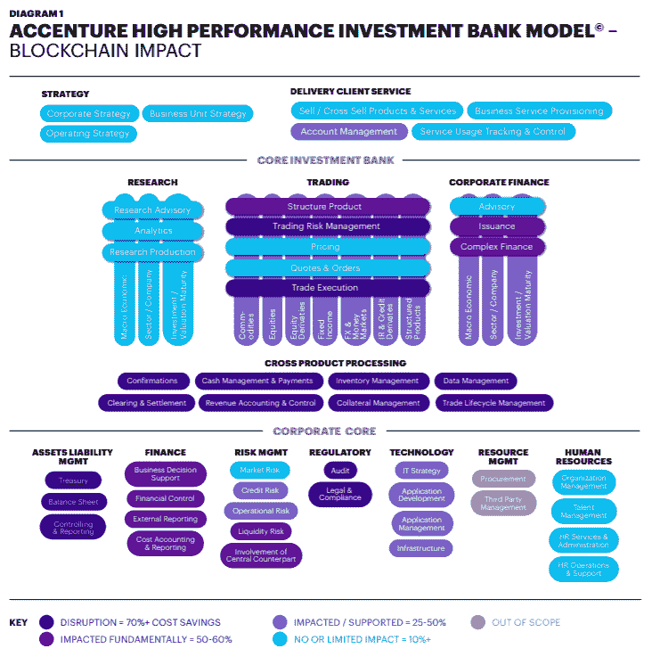
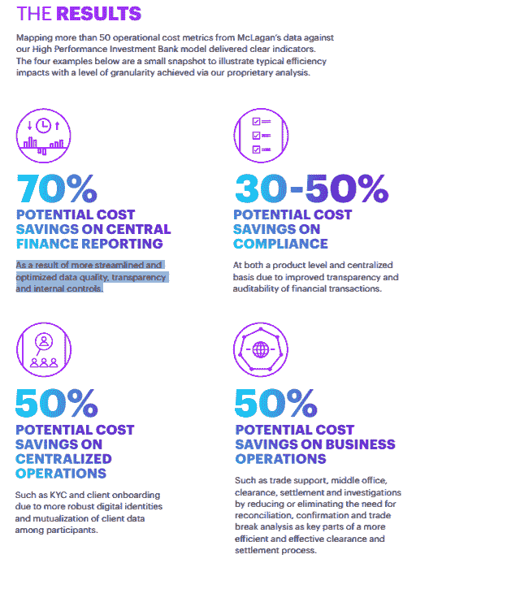

# 银行如何利用区块链技术

> 原文：<https://medium.com/hackernoon/how-banks-are-leveraging-blockchain-technology-4bc8143f359f>

## 银行正在研究区块链技术以降低成本。

现代银行系统可以追溯到 13 世纪的意大利，当时欧洲最著名的银行是美第奇银行。他们的主要创新是将银行和会计系统结合起来，将复式记账数据写入总账。银行家的工作是跟踪借贷或者为客户处理存款和取款。他们必须确保参赛作品被放置在一个安全的地方，资金得到保障。

> **信任和人才是当时以及随后几十年一家银行成功的最重要因素之一。**

几个世纪以来，世界上一些最大的公司和薪水都来自银行业。然而，在 2008 年金融危机期间，银行和客户之间的这种信任受到了打击。许多银行对客户的资金管理不当，是时候采取新的措施了。许多初创公司进入这一领域，并提供移动优先的银行解决方案，用户界面/UX 友好等，但问题仍然存在。人为错误、腐败、纸笔记录和交易管理不善不会随着当前的系统而消失。

正是在这个时候，一项新技术被介绍给了世界。这项技术允许第三方在公共分类账中跟踪交易，以更快的速度在世界各地转移价值，并在线管理假名身份，所有这些都不需要中央实体。这项技术被称为比特币，由中本聪引入。比特币在不知不觉中引入了一个三方会计系统，银行可以利用该系统来发展其当前的基础设施。

# ***银行研究区块链技术***

现在，比特币可能已经被创建来分散当前的银行系统，但这不会阻止银行研究和尝试利用这一基础设施并发展他们的系统。管理个人银行账户可能并不适合所有人，即使比特币提供了这样做的工具，即使是对全球 22 亿没有银行账户的人来说。区块链降低了运营银行的基础设施成本。这可能有助于银行(或其他创业公司)加入这一庞大的无银行账户人群。

**据 DTCC 首席执行官迈克·博德森(查看他的** [**采访**](https://open.spotify.com/episode/5vfblGUoYHykwZjYJJ9eQv) **获取 Blocks 播客)**:

> “美国市场，比如说股票市场大约有 650 亿美元。他们认为，在五到七年内，我认为，65 亿美元将下降到 480 亿美元。所以你面临着巨大的成本压力。没错。你知道，在过去的几年里，所有华尔街公司都做了同样的事情。他们都试图实现现代化，但我们都放弃了旧的传统技术。你外包，你把东西送到海外。你已经做了各种各样的事情来降低成本，但同时你也面临着合规和监管的压力，这使得你的成本又上升了。”。

**注意** : DTCC 每年花费 14 亿美元，50%用于科技(7 亿美元)，每年处理 1.8 万亿美元的交易。

# **长期机会**

每家银行都在专注于降低成本，而区块链的技术可能只是帮助他们实现部分目标。他们可以将关键的运营、风险和财务系统转移到区块链平台。

[埃森哲](https://www.accenture.com/t20171108T095421Z__w__/ph-en/_acnmedia/Accenture/Conversion-Assets/DotCom/Documents/Global/PDF/Consulting/Accenture-Banking-on-Blockchain.pdf)做了一份关于哪些领域能让区块链受益最大的报告。

其中一些领域由于其易于自动化的特性，可能会产生 70%的中断影响。想象一下，所有的交易都在一个数据库中，任何人都可以审计它的历史，当前的交易是实时更新的。因为所有的交易都是数字化的，所以不再担心如果风暴来了，它会破坏存储它们的地方，并失去重新通知网络的宝贵时间。此外，由于区块链商店是在一个分布式网络中进行交易的，所以没有人能够侵入、篡改或破坏过去的信息(除非他们拥有 51%的计算能力，这是另一回事)。

埃森哲最终完成的报告称，如果系统升级，区块链可以帮助节省约 80 亿美元。

# 中央银行当前的区块链解决方案

自 2014 年以来，各国央行一直在调查数字总账技术对各种银行义务的适用性，目前约有 40 家央行正在这样做。虽然区块链像任何新技术一样充满未知，但实验和研究表明，央行采用 CBDCs(商业银行数字货币)和 DLT(分布式账本技术)具有显著优势。在这份[世界经济论坛](http://www3.weforum.org/docs/WEF_Central_Bank_Activity_in_Blockchain_DLT.pdf)白皮书中，提出了十个用例:

1.  面向消费者的零售 CBDC，类似于实物现金或替代银行存款。
2.  用于商业层面银行间结算的批发商业跟单信用证。
3.  允许同时进行点对点资产交易的银行间证券结算。
4.  紧急情况下的主要或备用国内支付系统。
5.  由作为节点的国家发行和管理的主权债券。
6.  作为统一的信息渠道，对反洗钱/KYC 信息进行财务跟踪。
7.  公共和私人实体之间用于金融数据流的信息共享站点。
8.  通过分布式分类账进行贸易融资，以提高国内和全球效率。
9.  现金流供应系统，用于跟踪和分析商业银行和中央银行之间的大量现金流。
10.  欧盟 SEPA 信用系统的区块链数据库，用于提高成员国之间的整体效率。

## **零售 CBDC 供消费者使用，类似于实物现金。**

在未来消费者使用现金减少的情况下，一个国家引进好的 CBDC 至关重要。尤其是在商业银行不稳定、不提供存款保险的国家。CBDC 可以成为金融普惠的答案，尤其是其 52%的手机普及率。( [Statista](https://www.statista.com/statistics/284202/mobile-phone-internet-user-penetration-worldwide/) )。

## **在商业层面进行银行间结算的批发商业跟单信用证。**

新兴国家的央行在结算即时交易方面受益最大。拥有高效系统的中央银行(如丹麦银行)可以创建一个主要或备用的国内支付系统，以备不时之需。

**新兴国家和发达银行的交集可以创造每个人都在同一页上的必要性。因此，如果丹麦银行使用区块链作为备用，阿根廷银行作为主银行，那么他们可能需要使用相同的技术来结算交易。**

# **基于区块链发行的债券。**

法国银行集团[法国兴业银行](https://www.societegenerale.com/en/newsroom/first-covered-bond-as-a-security-token-on-a-public-blockchain)在区块链以太坊(ETH)发行了 1 亿欧元的担保债券，作为一种被称为“OFH”的证券。该债券被穆迪和惠誉评级为 Aaa/AAA，是金融科技实验内部启动计划的一部分。**区块链允许法国兴业银行实时探索更高效的债券发行流程。区块链债券缩短了上市时间，提高了透明度，加快了运输和结算速度。智能合同使整个过程自动化。**

阿富汉、突尼西亚和乌孜别克斯坦一直在测试主权区块链债券，以帮助关键经济部门摆脱困境，并增强对其市场的信任。阿富汗有兴趣发行与金属挂钩的债券。尤其是该国价值 3 万亿美元的锂产业。乌兹别克斯坦有兴趣为其棉花产业发行区块链债券。突尼斯将发行基于比特币的主权债券。([亚洲时报](https://www.asiatimes.com/2019/04/article/kabul-tunis-in-sovereign-crypto-bond-race/))。

## **作为统一信息渠道的反洗钱/KYC 信息金融跟踪。**

根据突尼斯中央银行行长 Marouane El Abassi 的说法，基于区块链的债券可以打击洗钱、管理汇款、打击跨境恐怖主义和限制灰色经济。([亚洲时报](https://www.asiatimes.com/2019/04/article/kabul-tunis-in-sovereign-crypto-bond-race/))。

# **已经在测试或使用区块链技术的银行**

## BNY 梅隆-基于区块链的美国国债结算

纽约梅隆银行是一家美国全球银行和金融服务控股公司，总部位于纽约市，管理着 1.8 万亿美元的资产。它们专注于提供一系列外汇、证券金融、抵押品管理和隔离、资本市场和大宗经纪服务，以及托管和财富管理。他们在 2016 年使用区块链技术推出了美国国债结算- [BDS360](https://www.coindesk.com/bny-mellon-backing-bank-transactions-blockchain-tech) ，作为他们系统的备份记录。这种区块链能够以安全、透明、更实惠和即时的方式将三至五天的债券结算时间缩短至 1 至 10 分钟。后端通过在区块链内清算和验证债券的真实性，绕过了互不信任的中介和陈旧的基础设施。

## 桑坦德银行-跨境交易

桑坦德银行是一家西班牙跨国商业银行和金融服务公司，总部位于西班牙桑坦德，2017 年收入 540 亿美元。桑坦德银行和区块链科技的服务遍布全球，由于这项技术提供的即时跨境交易，他们是天作之合。与 Ripple 的服务 Xcurrent 一起，桑坦德银行在 2018 年推出了 [One pay FX](https://www.santander.com/csgs/Satellite/CFWCSancomQP01/en_GB/Corporate/Press-room/Santander-News/2018/04/12/Santander-launches-the-first-blockchain-based-international-money-transfer-service-across-four-countries-.html) ，推出了一款分布式应用程序(d app)，为巴西、西班牙、英国和波兰的客户提供当天国际交易。传统系统需要三到五天的时间，并根据银行最终确定的国际交易向客户收取平均 25 美元的费用+3–7%的费用。

## 零知识证明集成员

ING 集团是一家荷兰跨国银行和金融服务公司，总部设在阿姆斯特丹。其主要业务是零售银行、直销银行、商业银行、投资银行、资产管理和保险服务，在全球拥有 3700 万客户。他们已经测试了区块链技术，使用零知识范围证明(ZKRP)解决方案来增加公共账本中的[机密性](https://www.ingwb.com/themes/blockchain-articles/ing-launches-major-addition-to-blockchain-technology)。该团队在内部开发的测试表明，保护客户私人信息的效率有了显著提高。“零知识证明”允许一方在不传达陈述中实际信息的情况下验证陈述的准确性。Zcash 是使用 ZKRP 模型的最大的加密货币之一。

# **临近**

## **无权限区块链**

公共区块链(无许可区块链)允许任何人与网络交互并运行节点。比特币、以太坊、莱特币、EOS 等区块链网络是无权限的。一个没有许可的区块链的好处是更多的权力下放，透明度和不变性的基本组成部分。

银行可能对让每个人共享网络不感兴趣。像 Monero、Zcash 和 Grin 这样的无权限区块链正在使用零知识证明算法将他们的技术集中在更私人的组件上。

*   Aztec 协议提供了建立在以太坊区块链之上的隐私组件。

## 被许可的区块链

私有区块链(许可的区块链)只允许有权访问区块链的各方参与网络、检查交易和审计信息流。财团正在创建，以将所有银行聚集在一起，在不泄露不应公开的关键数据的情况下，致力于私人区块链。

*   Ripple、Stellar、Quorum 和 R3 是一些最大的私人区块链或财团。

# **结论**

除了开设加密货币交易柜台之外，银行还有许多研究区块链技术的用例。区块链现在已经超出了银行业的测试阶段。他们想知道区块链将如何为他们工作。