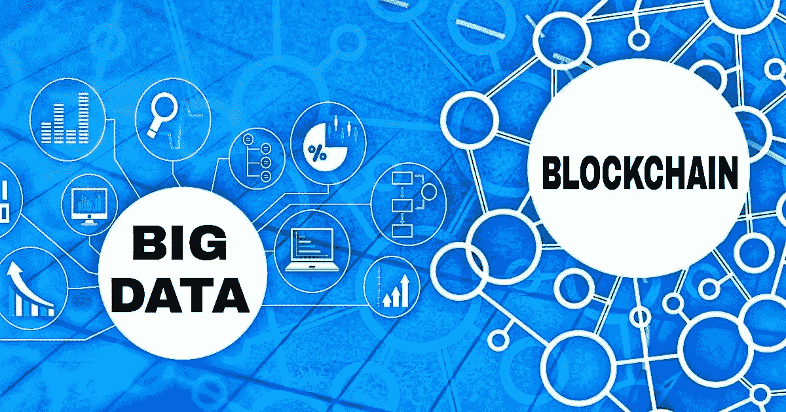
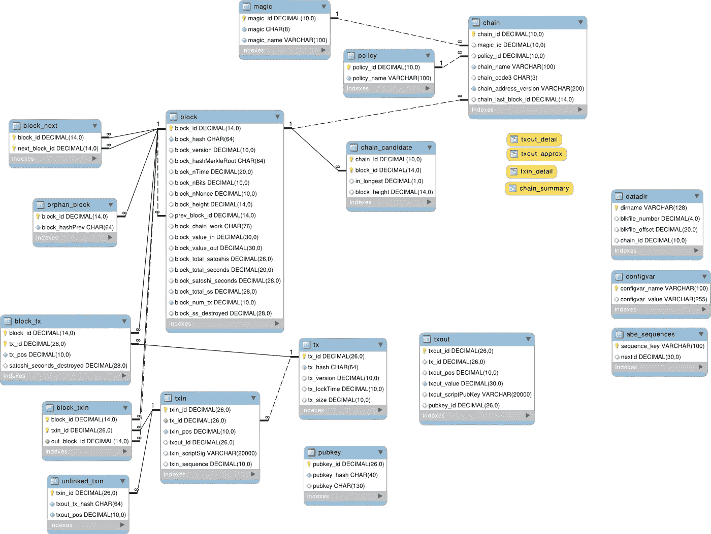
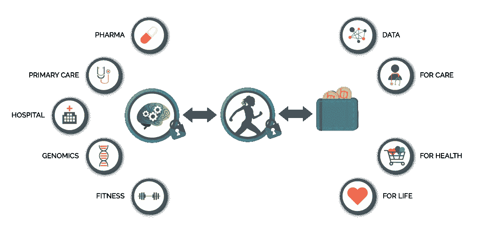
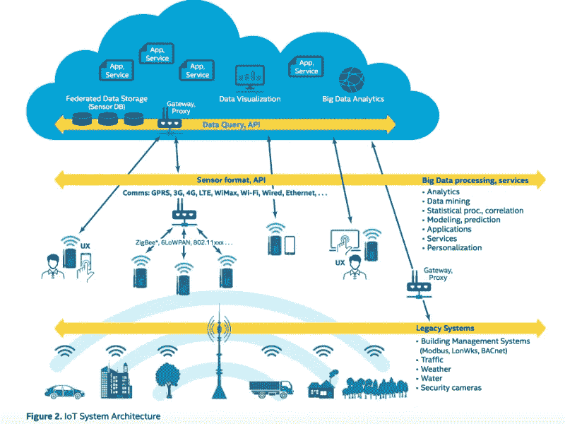
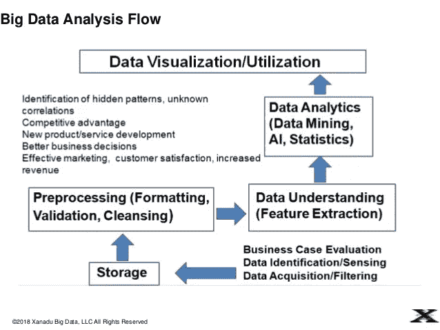
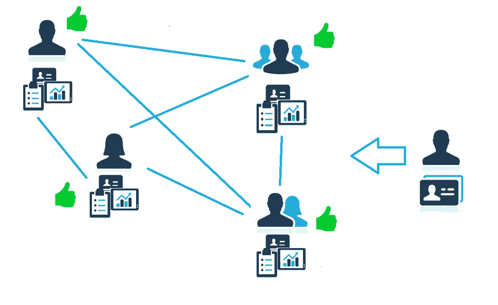
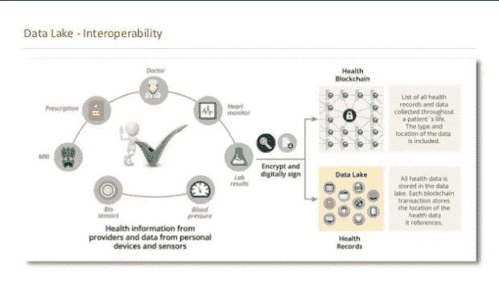

# 区块链和大数据如何互补

> 原文：<https://medium.com/hackernoon/how-blockchain-and-big-data-complement-each-other-92a1b9f8b38d>

区块链和大数据是两个如火如荼的技术，但也是两个互补的技术。了解区块链如何转变存储和数据分析。

近年来，区块链是计算机技术的核心。它是一种加密安全的分布式数据库技术，用于存储和传输信息。数据库中的每条记录称为一个块，包含交易日期等详细信息以及到前一个块的链接。

区块链的主要优势在于它是分散的。事实上，没有人控制输入的数据或其完整性。然而，这些检查是由网络上的各种计算机连续执行的。这些不同的机器保存着相同的信息。事实上，一台计算机上损坏的数据无法进入链中，因为它与其他机器上保存的同等数据不匹配。简单来说，只要网络存在，信息就保持不变的状态。

# 区块链和大数据保证数据质量

[Image Credit](https://juliandontcheff.wordpress.com/2017/10/30/blockchain-for-dbas/)

由于比特币、以太坊等加密货币，区块链实际上可以支持任何类型的数字化信息。这就是为什么它可以用于大数据领域，特别是提高数据的安全性或质量。

例如，医院可以使用它来确保患者数据保持安全、最新，并完全保持其质量。通过将健康数据库放在区块链上，医院可以确保其所有员工都可以访问单一、不可更改的数据源。

事实上，医疗保健环境中糟糕的数据管理带来了风险，患者可能会被错误处理、误诊，或者他们的测试结果可能会丢失或损坏。类似地，支持同一个病人的两个医生可以访问两组不同的数据。区块链消除了这种风险。

# 区块链作为有益的职业前景

鉴于区块链技术是一个不断增长的行业，对区块链概念的良好了解可以帮助你获得加密货币分析师、加密货币开发者、全电池开发者、比特币等许多职位。

我们知道，加密货币是区块链的一个子集，它目前主要由创业公司和金融机构使用。

该认证课程的教育团队致力于比特币和以太币等加密货币的控制，将由工程师和 IT 开发人员以及经济学家、社会人类学家、律师和交易员组成，他们都专注于区块链技术并参与未来的经济变革。

很多大学，像 Udemy，simplilearn，Blockchain Council 等在线学习平台都提供认证课程。你甚至可以找到这些平台的折扣代码，如 [10%的区块链理事会优惠券](https://couponcause.com/stores/blockchain-council-promo-codes/)。

# 区块链和大数据来保护数据

[Image Credit](https://www.linkedin.com/pulse/i-40-designing-more-affordable-smart-building-things-maximiliano)

这项技术还有助于防止[可能的数据泄露](https://hackernoon.com/blockchain-for-authentication-benefits-and-challenges-94a93f034f40)。一旦信息存储在通道上，即使是公司中最高级的管理人员也需要从网络中的其他点获得多个权限才能访问数据。因此，网络罪犯不可能获取它。

推而广之，区块链允许更平静地分享数据。以医院为例，机构可能需要与法院、保险公司或患者的雇主共享健康数据。然而，如果没有区块链，这一程序可能存在风险。

# 用于数据分析的区块链和大数据技术

区块链还补充了数据分析技术。例如，2017 年，由 47 家日本银行组成的财团与初创公司 Ripple 签署了协议，以促进通过区块链在银行账户之间转移资金。通常，实时转账非常昂贵，尤其是因为存在重复消费欺诈的风险(使用同一资产进行两笔交易)。区块链消除了这种风险。此外，大数据分析可识别风险交易。

更好的是，区块链允许银行机构实时检测欺诈企图。知道区块链保存每笔交易的记录，它允许银行实时探索数据以搜索模式。[区块链和大数据](https://hackernoon.com/the-convergence-of-blockchain-ai-and-big-data-analytics-52fdb537ea86)因此可以最大限度地加强银行交易的安全性。

# 区块链和大数据:隐私问题

然而，区块链的这种使用也带来了保密问题，这与这项技术最初流行的原因直接矛盾。一些专家担心交易记录可能被用来建立消费者档案或被滥用。

然而，区块链实际上提高了数据分析的透明度。如果一个条目不能被验证，它将被自动拒绝。因此，数据是完全透明的。其他专家也担心区块链和大数据对环境的影响。

# 区块链和大数据:预测比特币价格的社交数据

来自社交网络的数据(社交数据)在预测消费者行为方面非常有用。然而，事实证明，比特币和社交网络的用户在人口统计学上有许多相似之处，在观点和态度上也有共性。

推荐资源:

 [## 赋予 twitter 机器人基于历史数据预测比特币价值的能力

### 一段时间以来，我一直对加密货币感兴趣，最重要的是预测它们在未来的涨跌…

hackernoon.com](https://hackernoon.com/giving-a-twitter-bot-ability-to-predict-bitcoin-value-based-on-historical-data-dbe237c40430) 

这就是为什么许多数据分析师现在正在探索社交数据，以预测比特币和其他加密货币的价格，并将这些加密货币的价格与现实世界的事件联系起来。

# 区块链允许个人将他们的数据货币化

戴尔 EMC 服务首席技术官 Bill Schmarzo 表示，区块链允许个人重新获得对个人数据的控制，从而将这些数据转化为公司利润。消费者能够控制谁有权访问他们的区块链数据，而无需第三方的干预。

因此，例如，他们能够请求产品折扣以交换他们的个人数据。最终，区块链可以创造新的市场，让个人和企业参与数据交易。

# 区块链可能会在 2030 年占据大数据市场的 20%

Neimeth 表示:“根据 nei meth 的估计，到 2030 年，区块链账本的价值可能高达整个大数据市场的 20%，每年产生高达 1000 亿美元的收入。它将产生超过 1000 亿美元的年收入，超过 PayPal、Visa 和 Mastercard 的总和。

大数据分析对于跟踪交易和让使用区块链的企业做出更好的决策至关重要。这就是为什么新的数据智能服务正在出现，以帮助金融机构和政府及其他企业发现他们在区块链内与谁互动，并发现隐藏的模式。