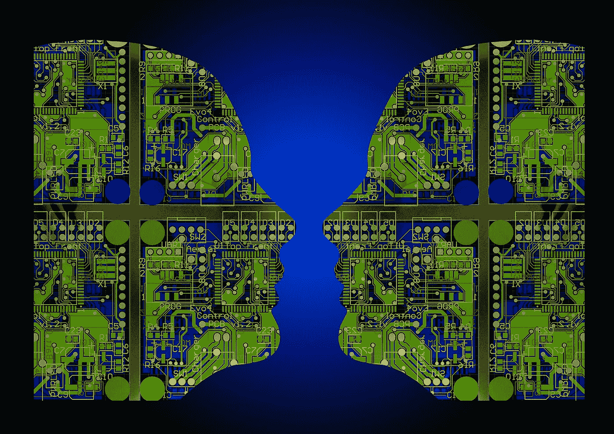

# 区块链如何让人工智能开发民主化

> 原文：<https://medium.com/hackernoon/how-blockchain-can-democratize-ai-development-6c49037100e4>

## 人工智能的数据访问:区块链的一个未充分开发的用途

世界上有大量的计算能力没有得到有效利用。据估计，世界上有 40 亿台个人电脑，其中 90%在任何时候都有空闲容量。更不用说智能手机和平板电脑等其他个人设备的闲置容量了。实际上，这种多余的计算能力被浪费了。

许多初创公司正试图使用区块链技术来利用这种低效率来满足不同的经济需求。在这种情况下，区块链是令人兴奋的，因为它为分布式计算能力提供了基础设施，同时为个人将他们的闲置设备连接到网络提供了激励。

我遇到的许多初创公司都专注于通过区块链提供虚拟主机和/或数据存储解决方案。然而，我认为最令人兴奋的用例涉及人工智能或“AI”。

## 民主化人工智能

将区块链应用于人工智能的想法吸引了很多关注。与分布式数据存储和网络托管的目标类似，[一些专家认为](https://www.nytimes.com/2018/10/20/technology/how-the-blockchain-could-break-big-techs-hold-on-ai.html)区块链可能会鼓励数据和算法的更广泛分布，这将决定人工智能的未来发展。

然而，许多人工智能专家担心，IBM、脸书、谷歌和其他一些大公司[正在垄断该领域的所有人才](https://www.nytimes.com/2017/10/22/technology/artificial-intelligence-experts-salaries.html?action=click&module=inline&pgtype=Article&region=Footer)。这些大公司还控制着创建和完善最佳机器学习程序所需的大量数字数据。许多人认为，如果人工智能要朝着造福全人类的方向发展，就有必要[将数据民主化](https://www.forbes.com/sites/bernardmarr/2017/07/24/what-is-data-democratization-a-super-simple-explanation-and-the-key-pros-and-cons/)。

这就是区块链技术的用武之地。

在最基本的层面上，正如区块链允许私人之间进行货币交易，中间没有银行或中央机构。人工智能专家希望区块链技术可以让人工智能网络在没有大公司或其他中央实体控制的情况下访问大量数据和计算能力。

## 支持浏览器的人工智能计算

几家初创公司正在建立区块链市场，人们可以在那里买卖数据。一位专家说[的目标是“在为时已晚之前分散对数据的访问。”我遇到过多个希望以这种方式加速人工智能发展的项目。其中几个背后都是有着令人印象深刻的学术资历的严肃企业家(例如](http://trent.st/)[天网](https://hackernoon.com/will-autonomous-devices-become-our-benevolent-overlord-14963b901c83)和[凯思](https://hackernoon.com/blockchain-artificial-general-intelligence-benefit-humanity-230e213cae12))。

在这篇文章中，我想重点介绍一下[强子](https://hadron.cloud)。强子正在创建一个市场，以利用未使用和浪费的计算能力来解决人工智能的现实问题。具体来说，强子以适合各种用途的方式处理和分类图像和声音，如人脸检测和图像分类。将他们的设备连接到强子网络的用户完成了这项工作的一部分，作为回报，他们得到了强子代币的奖励。

## 人工智能计算的需求

强子获得其人工智能供应。它创建的市场的任务，使人们能够处理和分类图像，为这项任务出价。强子将任务分配给连接到其网络的设备，并根据需求支付一定比例的投标。需求指的是市场上人工智能任务的数量，供应指的是链接设备的数量。这些共同决定了强子平台上计算的价格。例如，如果对计算的需求很高，投标价格就会更高。如果需求低，投标价格会更低。

## 集中式与分布式人工智能计算

与集中式人工智能计算相比，强子的分布式计算模型有几个优势。最值得注意的是，根据需求扩展计算资源很容易。当计算需求增加时，价格就会上涨，这就刺激了现有用户和新用户将他们的设备连接到强子。

强子最近宣布，这将是 Aikon 推出的第一项 dService，Aikon 是区块链支持的 API 市场。这将让任何人使用强子的新“[计算机视觉 API](/aikon/image-recognition-ai-is-first-dservice-to-go-live-make-a-gui-bounty-more-bf36a09e2236) ”来识别和分类任何图像。

## 结论

虽然仍处于早期阶段，但区块链技术似乎在加速人工智能发展方面有很大的前景。然而，不仅仅是加速这一发展，区块链还提供了一个分散的基础设施，可以避开企业和政府控制的数据孤岛，同时确保通过人工智能创造的价值可以以民主的方式共享。

*订阅我的频道* [*中*](/@minadown) *和* [*推特*](https://twitter.com/minad21) *如果你喜欢我的文章，想了解更多关于区块链和加密货币项目的信息，

如果您对本文有任何疑问，请在下面的版块发表评论。谢谢大家！*