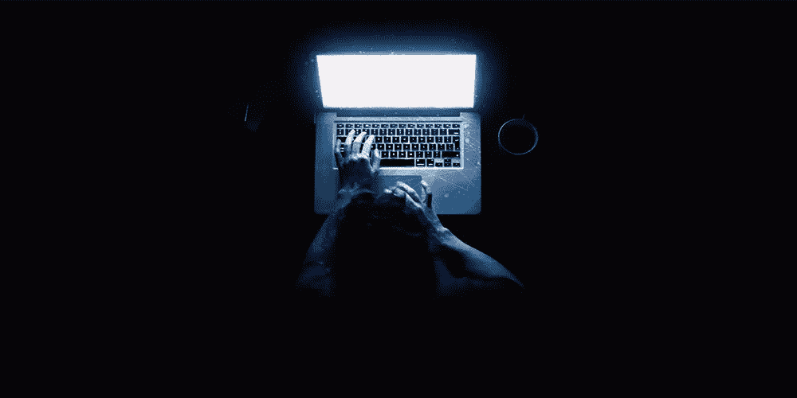

# 区块链如何终结黑暗网络上的身份盗窃

> 原文：<https://medium.com/hackernoon/how-blockchain-could-end-identity-theft-on-dark-web-62252090e989>

我们认为我们的个人数据非常重要，是无价的。然而，现实却大相径庭。偷来的信用卡信息、地址、电话号码、社会保险号在黑网上以不到一两美元的价格出售。一定会有解决办法的，对吧？

Source: [https://codeburst.io/](https://codeburst.io/immunity-on-the-dark-web-as-a-result-of-blockchain-technology-6693eb087bdd)

## 我们正处于一个选择便利而非隐私的时刻。

我们所有人都同意获得“免费”服务所需的任何条款和条件。作为交换，我们将给出我们的电话号码、位置、信用卡号码等等！我们不喜欢一遍又一遍地输入我们的信用卡号码，所以我们保存它以便更快地结账。

我希望利用这个平台来强调区块链的技术。所有嘲笑这项技术的人都需要获得更广阔的视角。我们可见的互联网只占整个网络的 10%。我们需要提高警惕。

去年，[美国有 1670 万人](https://www.wsj.com/articles/identity-fraud-hits-record-number-of-people-1517922001)成为身份欺诈的受害者，自 2016 年以来增加了 130 万人。

区块链支持的身份管理不仅让我们拥有数据的所有权，还能确保数据的安全。这使我们成为一个独立自主的个体。区块链技术使得诈骗分子非法获取数据变得极其困难。

目前，黑暗网络上的人们更喜欢使用比特币作为支付手段，因为它非常安全，并且保持身份匿名。同样，如果我们想保护我们的身份，我们应该适应区块链技术。

许多蓬勃发展的初创公司，如 uPort、Civic、Sovrin 都在为此努力。

让我们保护自己和我们所爱的人。我们可以一起终结身份盗窃。越多人加入去中心化的身份网络，就越强大！

## 注意安全。

如果你想了解更多关于暗网的信息，你可以在这里阅读。