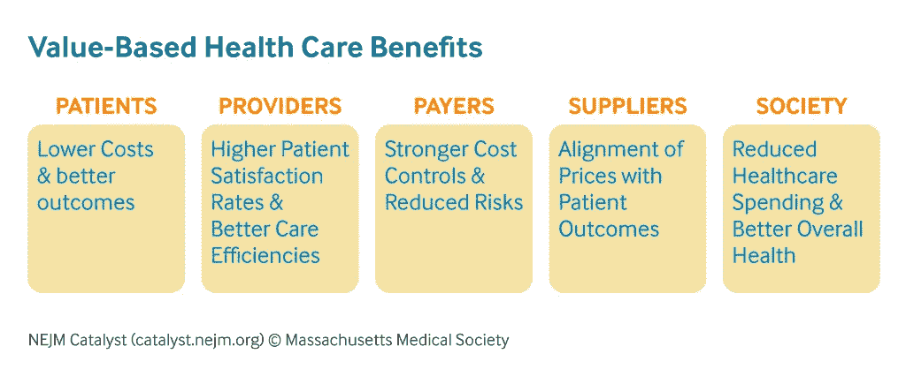

# 区块链如何帮助开发基于价值的医疗保健系统

> 原文：<https://medium.com/hackernoon/how-blockchain-helps-in-developing-value-based-healthcare-systems-986db75b1d04>

# **当前的医疗保健系统:“量大于值”**

医疗保健私有化曾被视为对支付治疗费用的患者的一种恩惠。然而，它将主要目的是拯救人们生命的新型医疗保健服务转变为一个**“数量更重要”的行业**当今的大多数医疗保健系统都是量驱动的，在这种系统中，提供者受到激励，以牺牲患者的健康为代价，提供更多的治疗和更多的药物。

## *这样的体系可持续吗？*

随着老年人口、慢性病和治疗费用的增加，以数量为基础的制度注定要崩溃。在未来几年，越来越多的人将无法获得基本的医疗服务，治疗等服务将成为只有少数当权者才能负担得起的奢侈品。最终，这将引发更多的人生病和患慢性病。

如上所述，目前的医疗保健系统激励的是数量，而不是价值。在这里，术语“价值”是指治疗特定疾病的药物或服务的性能。因此，当前的系统没有激励那些生产高质量产品的制造商。相反，它正在帮助那些更专注于通过营销策略拓展业务的人。

在本次[会议](https://www.youtube.com/watch?v=SZ18IUozxbA)中，Digipharm 首席执行官&联合创始人 Ahmed Abdullah 详细解释了基于价值的系统的优势，该系统可以减少医疗保健支出，改善整体医疗保健生态系统。

## *那么，为什么不采用基于价值的系统呢？*

虽然这听起来更道德和人性化，但考虑到当前的 it 和基础设施发展，基于价值的系统的实际实施几乎是不可能的。

实施基于价值的系统的一些关键挑战包括:

*性能测量*

由于价值驱动系统是基于绩效的，因此衡量绩效就变得至关重要。问题是，**如何衡量绩效**？**使用哪些指标**？谁会选择这些指标？患者在不同的时间点开始治疗。他们有不同的治疗持续时间，服务/产品显示效果所需的时间因患者而异。

此外，患者不断旅行，从一个医疗保健实体转换到另一个，这些实体之间缺乏数据互操作性。*设计一个系统来衡量药物/服务性能的管理成本如此之高，以至于抵消了实施价值驱动型医疗保健的益处。*

*隐私&数据安全*

性能测量意味着患者的数据将被收集和存储。由于 HIPAA 等法规遵从性限制了个人身份信息的共享，因此很难使用当前的技术开发一个仅收集特定信息并以全球通用的特定格式存储的系统。这种系统还应当能够证明它一直在以规定的方式存储和共享信息。

*延误*

为了开发这样一个系统，在关键点以批准的形式进行检查是很自然的。现在获得这些批准可能会导致延误。此外，登记患者进行表现测量以取得他们同意来收集和存储他们的治疗数据所涉及的文书工作会花费很多时间。

即使在表现测量之后，传输信息的延迟也可能导致付款人的治疗或治疗费用偿还的延迟。在[爱尔兰](https://www.irishtimes.com/news/health/hepatitis-c-patients-unable-to-get-drugs-due-to-funding-problems-1.3171803)发生的类似事件中，政府停止了对丙型肝炎患者的治疗，因为该项目已经耗尽了预算，导致接受治疗的患者数量不明确。

# **区块链在这一切中处于什么位置？**

区块链在不同行业找到了很多用例，其中一个就是数据互通。它可以以统一的格式记录数据，供世界各地的实体使用。

此外，作为区块链系统的一部分，分布式账本技术确保可以从世界任何地方记录数据，并在区块链网络的所有参与者之间共享，这些参与者拥有访问信息的有效凭证。由于所有参与者都在同一个网络上，因此可以快速获得批准。网络的所有节点(成员)几乎可以即时共享任何信息更新，确保没有延迟。

区块链的关键特征之一——智能合约——将在实现价值驱动的系统中发挥重要作用。这将确保基于预定义的规则以特定的格式收集和存储患者的数据。智能合同还将自动化许多管理过程，从而降低运行这样一个系统的成本，使之成为现实！

# **结论:对基于价值的医疗保健系统的现实检验**

开发基于区块链的软件解决方案是一回事，建立一个全球系统是另一回事。基于价值的医疗保健系统只能在全球范围内与许多医疗保健利益相关者合作开发。一些区块链项目，如 Digipharm，正在积极开发这样的系统。他们最近[与第一家推出基因组数据市场的公司 EncrypGen](https://digipharm.io/blog-190522.html)合作。

即使在今天，许多医疗保健制造公司，包括默克公司、艾伯维、诺华、安进等，都在向基于价值的医疗保健转变。德勤估计，到 2020 年，75%的医疗支付将基于价值。区块链肯定会在全球范围内建立这样的系统中发挥核心作用。