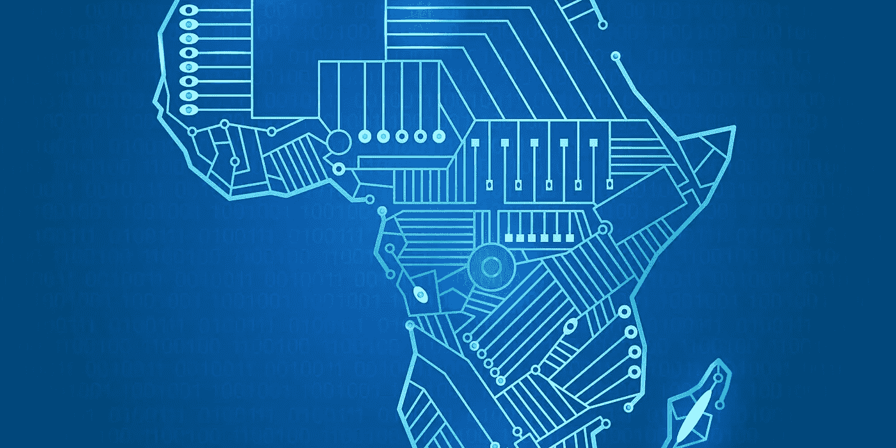
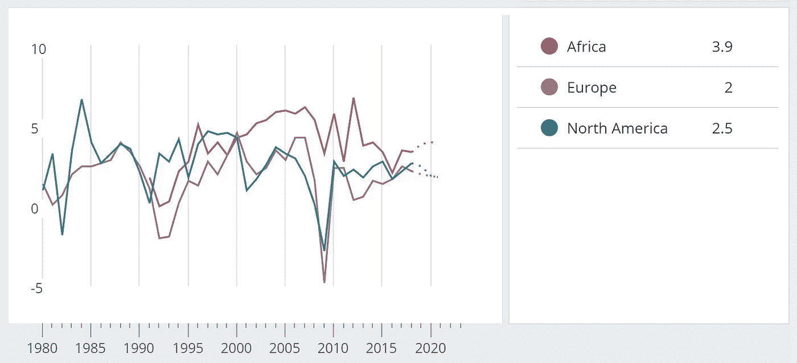
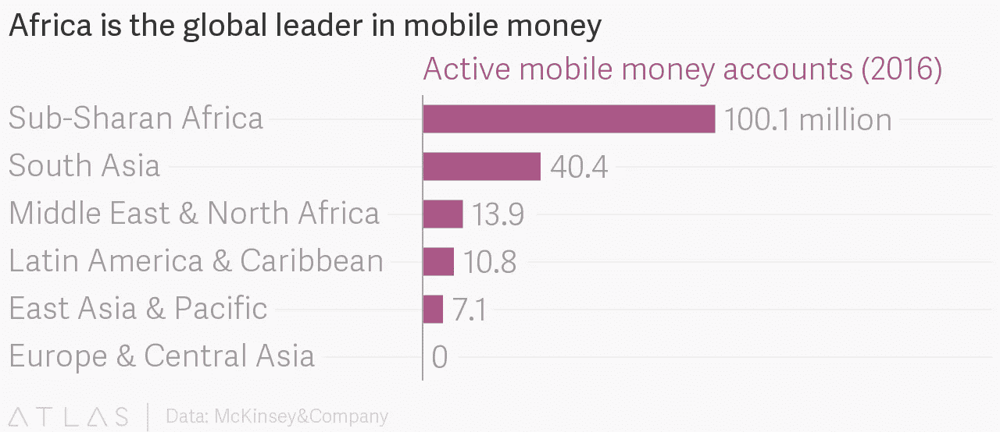
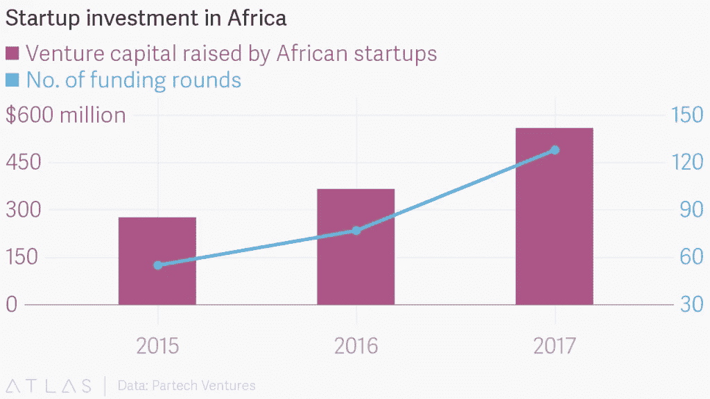

# 区块链如何帮助非洲发展

> 原文：<https://medium.com/hackernoon/how-blockchain-is-helping-africa-to-develop-d150bb85e90a>

虽然欧洲和亚洲已经经历了几波连续的加密热潮，并且仍在与国家结构和国家金融监管机构固有的保守因素进行斗争，以发展这个市场，但未能成功，相反，非洲对区块链和数字货币表现出兴趣。

[Source](http://www.thedouglasreview.com/wp-content/uploads/2018/09/bigstock-the-continent-of-Africa-65769415-2000x1000.jpg)

这方面的无条件领导者包括南非、摩洛哥和尼日利亚。这些国家对加密货币表现出越来越大的兴趣，与欧洲和亚洲的平均水平相当。

非洲的国内生产总值正以每年 3-4%的速度增长，甚至可能增长得更快。然而，经济持续发展的一个严重障碍是金融基础设施不发达和非洲各国货币相对疲软。所有这些因素都是寻找任何能够稳定非洲民族国家经济的替代工具的关键动力。

[Real GDP growth (Annual percent change)](https://www.imf.org/external/datamapper/NGDP_RPCH@WEO/AFQ/EUQ/NMQ)

数字货币和区块链在这方面相当理想。证明这一点的事实是，非洲国家拥有世界上最高比例的外币持有人，而且不是在银行账户中持有，而是在移动账户中持有(超过非洲大陆人口的 12%)。因此，非洲大陆的居民表现出积极将血汗钱投资于数字货币和加密货币的意愿。

[Source](https://www.theatlas.com/charts/BJug24tFz)

# 启动融资

21 世纪第一个十年生产力和投资的增长反映了非洲经济的日益多样化，不再以出口资源为导向。麦肯锡在 2010 年编写的报告《狮子在行动》中指出，2000 年至 2008 年，非洲大陆只有 24%的 GDP 增长直接或间接归因于与石油和其他自然资源相关的因素。

其他促进增长的领域(旅游、医药、金融服务、交通、新技术和建筑)每年增长约 8%。

非洲经济的多样化有助于面向信息技术的基金和孵化器的出现。一个例子是 [Zynecoin](https://zynecoin.io) 企业孵化器，它使用区块链技术和智能合同来资助有前途的初创公司。Zynecoin 已经与 [Hayat](http://hayat.mobi) 平台合作，开发了一个应用程序，旨在分散医疗数据的存储，并改善患者和医疗服务提供商之间的互动。

再举一个例子:在 IBM Research 在内罗毕启动的一个 IBM 试点项目中，Hyperledger Fabric 区块链被用作开发应用程序和解决方案的基础。为了参与这个项目，需要商业发展资金的非洲人只需要他们的手机。IBM 的区块链项目正在寻求填补这一资金缺口，这将为小企业提供在非洲大陆发展的机会。

[Source](https://www.theatlas.com/charts/S1dpnqcDz)

# 区块链和土地注册

根据世界经济论坛，非洲大陆 90%的领土没有在任何地方注册，也没有反映在任何官方文件中。这也是比尔·泰(Bill Tai)和 T2(Richard Branson)打算借助他们的犬吠项目解决的问题之一。该项目基于经济学家 Hernando de Soto 的想法，将通过使用区块链实施土地地籍系统，帮助那些土地登记和权利登记仍然令人困惑的国家的政府。

比尔·泰建议利用区块链技术发展非洲的经济、技术和社会基础设施。根据他的说法，非洲对区块链来说是一个完全未开发的领域。

比尔·泰说:

> 如果你有一个擅自占地者和一个有头衔的人，擅自占地者只想拿走，拿走，拿走，然后在法律来临时逃跑。如果你拥有土地所有权，你想让它变得更好，你想改善它。

在这方面，非洲将步格鲁吉亚和乌克兰的后尘，区块链已经在类似项目中为这两个国家的政府提供服务。类似的项目已经在非洲启动:加纳的 Bitland 和肯尼亚的 Land Layby。

# 利用太阳能

需要在非洲大陆的偏远和贫困地区更积极地部署太阳能。Sun Exchange 项目正在解决这个问题。AfricaPowerhive 将成为在 Sun 交易所出售 SUNEX 代币所得资金的受益者。这笔钱将用于在撒哈拉以南的非洲地区建设小型太阳能发电系统。

随后，该项目将向太阳交易所的用户出售二手太阳能电池板，因此，这些用户将拥有自己的电池板，并随后能够靠太阳能赚钱。

这是太阳交易所的创始人亚伯拉罕·剑桥描述的:

> 我们正在共同努力建设一个没有人被迫使用不安全的煤油或烧柴炉做饭，没有孩子需要担心天黑后如何学习，缺乏能源不再加剧贫困循环的世界。

# 建设学校

教育也是一个使用密码货币的领域。卢旺达就是一个很好的例子。在这里，他们计划只使用来自密码货币的捐款来建造一所学校。非营利组织 Zam Zam Water 与 Paxful 金融 P2P 平台合作，正寻求筹集 10 万美元，用于建设一个拥有全部教学人员的教育中心。该项目将在布格塞拉地区实施。

# 银行业务

在世界上通货膨胀率最高的 20 个国家中，有 13 个位于非洲。此外，大多数非洲人无法进入银行系统。例如，在撒哈拉以南非洲，15 岁以上的居民中只有 43%有银行账户，相比之下，世界其他地区只有 69%。密码货币可以提供非洲人迫切需要的金融结构，但他们无法获得。

专注于非洲的 Coindirect 交易所正在开发解决方案。联合创始人史蒂芬·杨表示，非洲有独特的问题，任何初创公司在非洲大陆使用密码货币时，都需要在业务计划中加以解决。当代证券交易所不理解它们。非洲法定货币的特点是系统性波动、不可靠和缺乏控制。

史蒂芬·杨指出:

> 如果非洲人想从密码货币革命中受益，我们需要让购买、存储和交易密码货币变得更容易。作为非洲人，我们有责任帮助建设基础设施，我们需要成为这场革命的一部分。

尽管密码货币不会解决非洲的所有问题，但这是一个充满创新的市场，将有助于非洲经济的多样化和改善。Blockchain 将帮助解决小额信贷问题，如高利率、高间接费用、注册时间慢和腐败。

# 未来

今天在非洲许多地区观察到的密码狂热可以被视为欧亚大陆和美国的伟大世界经济中发生的更全球化进程的回声。尽管如此，“黑暗”大陆的经济形势和资源确实有利于数字经济的自信整合和稳定增长。也许这种增长不会在今天显现出来，而是在最近的将来。尽管如此，事实仍然是，全球化和非洲参与全球趋势是不可避免的。