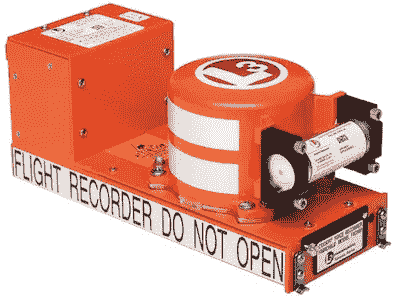
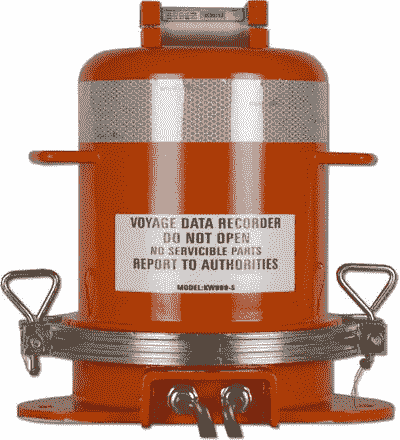
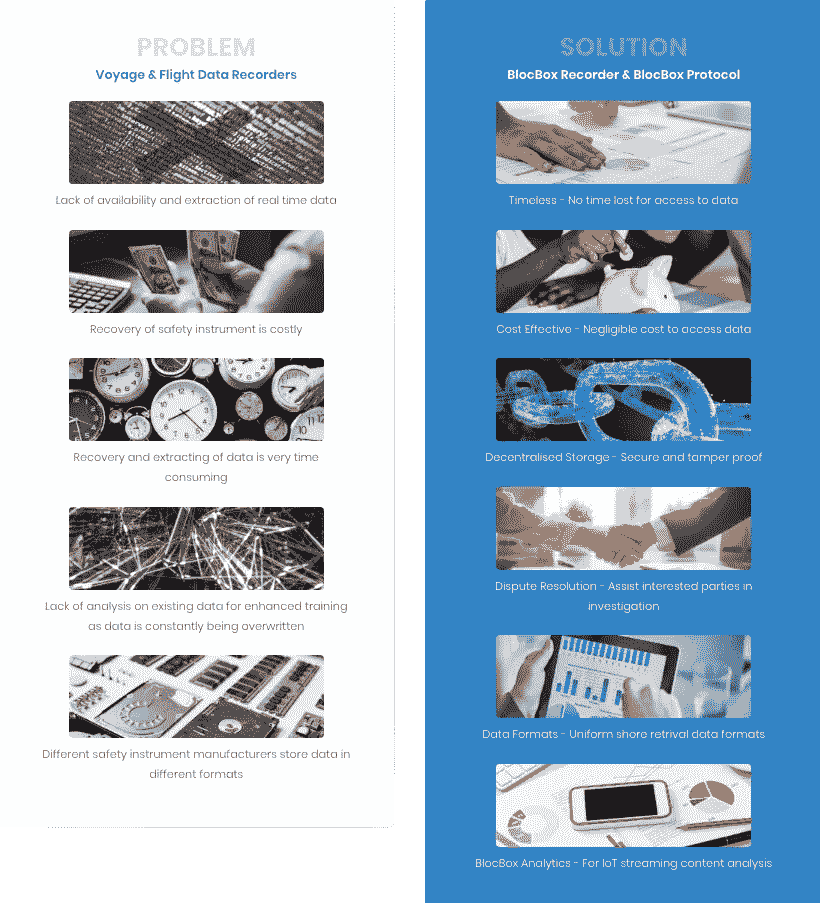

# 区块链将如何帮助航空和航海业

> 原文：<https://medium.com/hackernoon/how-blockchain-will-help-the-aviation-and-maritime-industry-ee8f58758822>

*免责声明:我不是 Blocbox 团队的成员，也不持有该公司的股份。这篇文章纯粹是一篇关于区块链如何帮助当前航空业和海运业的教育文章。*

全球化和互联网让世界变得更小。拥有笔友是新奇事物的日子已经一去不复返了。从社会角度来看，拥有一个互联世界的好处显而易见。但在全球贸易行业，互联网对全球范围内的货物物理运输没有影响。

互联网使得从不同国家订购商品、供应品和材料变得更加容易。因此，对全球海运和空运贸易都有强劲的需求。鉴于船只和航班数量的不断增长，航空和海上安全成为一个基本关切。[区块链](https://hackernoon.com/tagged/blockchain) [技术](https://hackernoon.com/tagged/technology)能否在海事和航空业都找到一席之地？

我们先来看看航空业和海运业。

# 航运和海运业

航运对于众多行业的供应链至关重要，因为它约占全球贸易的 90%。对所有相关的企业和团体来说，任何海上事故都会导致巨大的经济损失。一旦发生严重事故，如果灾难得不到及时处理，就有丧失生命的危险。

根据贸发会议的统计，自世纪之交以来，注册船舶的数量一直在迅速增加。海运业没有显示出放缓的迹象。因此，我们可以期待船只数量的增加。在中国南海、印度尼西亚和菲律宾地区，[安联全球企业报告](https://www.agcs.allianz.com/assets/PDFs/Reports/AGCS_Safety_Shipping_Review_2018.pdf)报告称，从 2007 年到 2017 年，发生了超过 252 起航运事故，这是世界上按地区划分的事故数量最多的一次。仅在 2017 年，该地区就发生了 30 起航运损失，在全球航运伤亡和事故方面排名第一。损失包括船舶的实际总损失以及 100 总吨或 100 总吨以上船舶的推定总损失。

# 航空业

目前至少有 2000 家航空公司运营着 23000 多架飞机，为 3700 多个机场提供服务。在过去的 30 年里，世界航空旅行的年增长率至少为 5%,航空旅行的年增长率被认为是美国 GDP 年增长率的两倍。从 2006 年到 2018 年，全球空中交通乘客需求的年增长率为正。直到 2009 年，该行业才经历了有史以来最严重的需求下滑。2017 年，世界航空公司运送了至少 41 亿名乘客，创造了 6500 万个就业机会，以支持航空和相关旅游业。6500 万个工作岗位中约有 1020 万人直接在航空业工作。在全球范围内，包括货机和客机在内的飞机总数估计为 21，453 架，预计到 2037 年将增长到 47，987 架。

# 数据记录仪器的重要性

我们已经谈到了航空业和海运业的高增长率。随着每天海上和空中交通流量的增加，避免事故和未遂事故是不可能的。这也包括不可预见的事件，如马来西亚航空公司的两次航班(MH17 和 MH370)。如果这些不可预见的事件发生在偏远地区，无论是在海洋中还是在无人居住的地区，找到残骸可能是一个主要障碍。

## 航空(飞行数据记录器和驾驶舱语音记录器)

鉴于飞行数量的飞速增长，航空业不能低估预防和调查的重要性。大多数飞机都装有下列一种或两种飞行记录器。这些设备是飞行数据记录器(FDR)和驾驶舱语音记录器(CVR)。飞行数据记录器通常被称为“黑匣子”。

《国际民用航空公约》(芝加哥公约)规范了罗斯福和 CVR 的使用。FDR 必须记录的参数包括飞行路径、速度、高度、发动机功率以及升力和阻力装置的配置。但是，这也取决于起飞质量和飞机类型。此外，FDR 必须能够抵抗火、冲击、压碎力、流体和水浸泡、抗穿透性和流体静压。

## 海事(航行数据记录器)

国际海事组织(IMO)颁布[决议 MSC.333(90) (IMO 决议)](http://www.imo.org/en/KnowledgeCentre/IndexofIMOResolutions/Documents/MSC%20-%20Maritime%20Safety/333(90).pdf)要求大部分船舶安装航行数据记录仪(VDR)。该决议的颁布是为了帮助调查海上事故。这些设备以连续循环的方式监控和记录来自船上传感器的重要传感信息。

每当发生海上事故时，将提取和分析 VDR，以发现根本原因并防止再次发生。但是，VDR 面临着某些缺点，主要是在检索数据之前需要对设备进行物理访问。这被证明是一个至关重要的挑战，因为存在 VDR 不可恢复的情况。

# 两个行业面临的问题

## 人为误差

[研究](https://www.researchgate.net/publication/272807445_MARINE_ACCIDENTS_RESEARCHED_THROUGH_HUMAN_FACTOR_PRISMA)一致估计，大约 80%的海上事故原因可归因于人为因素。安联全球公司&的一份报告强调船员疏忽和船只维护不足是两个日益增加的风险领域。

## 需要身体接触

作为一个物理对象，数据记录仪器需要物理接触，以便在发生事故时进行检索。安装定位发射器使检索过程更加容易。然而，信号的有效范围只有几英里。尽管如此，它仍然需要搜索队几乎直接在残骸的顶部，以便能够识别它。

## 永远无法 100%恢复

恢复过程可能是艰巨和昂贵的。在某些情况下，寻找和找回飞机和船只的残骸是不可能的。这些挑战可能包括自然因素，如浩瀚的海洋和海底深度。还有技术问题，ping 信号只能用一个月，而且在很小的有效半径内。这需要大量的人工搜索和救援工作，既费钱又费时。

## 篡改

保险索赔流程也可能面临几个问题，尤其是在非致命的例子中，如两艘船差点相撞。VDR 记录的数据是用于确定责任的数据来源之一。然而，恶意行为者可以找到篡改数据或设备的方法和手段，以减轻他们的责任。篡改 VDR 是一个严重的问题。

以下是几个引人注目的案例，其中篡改导致了严重的后果:

*   【2012 年 2 月 15 日，意大利油轮 MV Enrica Lexie 上的两名意大利海军陆战队员在印度喀拉拉邦海岸的圣安东尼向两名印度渔民开枪并将其打死。
*   2012 年 3 月 12 日，新加坡货船 MV Prabhu Daya 在印度喀拉拉邦海岸附近发生碰撞。在随后的调查中，发现一名机组人员将一个 USB 闪存驱动器插入 VDR，导致关键数据被重写和丢失。此外，该软件被发现感染了恶意软件。
*   [在胜安航空 185 航班上，调查人员得出结论，CVR 可能是通过拔出与 CVR 相连的断路器而失效的。](https://www.nytimes.com/2000/12/19/news/unexplained-disaster-insufficient-evidence-of-murder-3-years-after.html)
*   2012 年，塞萨尔·兰托在[“死亡之船”上失踪，两周之后，赫克托·科拉多被发现死在船上](https://www.theguardian.com/australia-news/2017/may/31/sage-sagittarius-inquest-death-ship-crewmen-were-victims-of-foul-play-coroner-finds)

# 那么区块链如何帮助解决这些问题呢？

区块链的可追溯性和防篡改性为上面讨论的问题提供了直接的解决方案。

## 防篡改

在最近的一篇文章中，我讨论了区块链被量子计算攻击的可能性。数百万区块链用户的力量使其免受黑客攻击。在任何情况下，集中式遗留系统和数据库比(分散式)分布式分类帐技术更容易被破解、更改和误用。拥有一个提供实时位置数据的系统会非常有帮助，因为它减少了(或完全消除了)篡改黑匣子的可能性。如果全球运输基础设施采用这一系统，它可以利用区块链技术的潜力。

## 不需要身体接触

安装一颗记录实时位置数据的卫星可能会改变游戏规则。可以远程访问数据，这使得物理接触变得过时。

## 使用卫星定位增强可检索性

目前黑匣子找回的首要问题是定位。有了卫星，它最后的位置数据几乎可以立即传输并记录在区块链上。因此，使定位黑匣子的过程容易得多。然而，还需要注意的是，如果数据已经记录在区块链上，那么就没有必要取回黑匣子。

# 已经有区块链的解决方案了吗？

不，没有。然而，最近几周有一家公司引起了我的注意。

进入 [Blocbox](https://www.blocbox.io/) ，这是一家总部位于新加坡的公司，试图解决检索黑匣子数据的挑战。Blocbox 结合了人工智能和大数据分析等关键技术的优势，正在创建世界上第一个针对航空和海上安全的区块链协议。

该公司正在建造一种叫做 BlocBox 发射机的物理轻量级设备。该设备应连接到飞机和船舶上现有的记录仪器。它将不断复制和传输记录的数据。该设备的一个优点是它不会取代现有的仪器。

根据他们的白皮书，他们还在开发一颗卫星，专门用于确保相关方之间的数据持续传输。

Blocbox 相对较新，所以观察它们在未来几年的进展会很有趣。理论上，他们提出的解决方案解决了行业中当前面临的关键问题。

# 区块链革命

在航空业和航运业实施区块链技术看起来肯定很有前景。然而，重要的是要记住，我们仍处于区块链解决方案的早期阶段。大多数提供区块链解决方案的公司仍在发展中。这绝对是一个激动人心的时期，看着大多数人采用新兴技术。

请务必阅读我在 Hackernoon 上的文章，了解为什么我认为区块链的采用并没有我们想象的那么远。

 [## 区块链的采用可能比我们想象的更近

### 当我们说区块链领养是什么意思？2017 年，这一切都是关于首次发行硬币如何扰乱…

hackernoon.com](https://hackernoon.com/blockchain-adoption-could-be-closer-than-we-think-e68bebaebca4) 

# 关于我:

**伊利亚·扎基是一家总部位于美国的** [**STO 咨询**](https://moonwhale.io/) **公司的业务开发主管和营销官:Moonwhale Ventures。**

在我们的各种社交媒体平台上关注我们—

[推特](https://twitter.com/MoonwhaleBV) | [领英](https://www.linkedin.com/company/moonwhalebv) | [脸书](https://www.facebook.com/MoonwhaleBV/) | [电报](https://t.me/moonwhaler)

