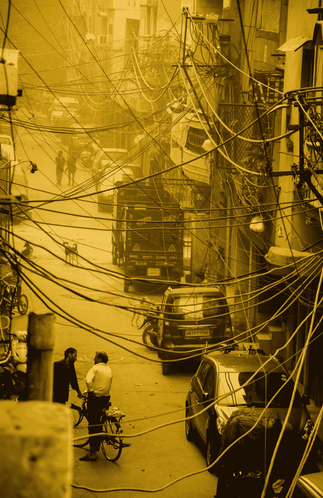
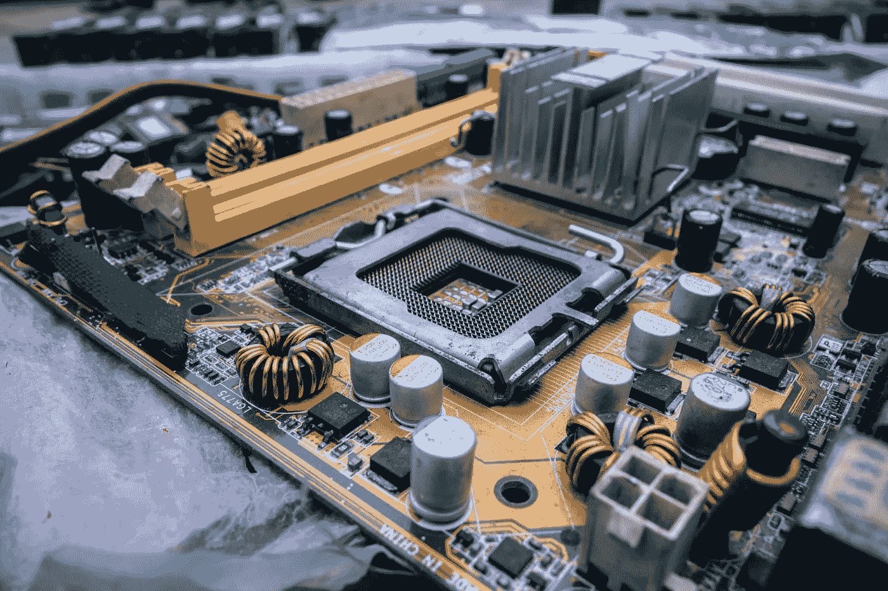
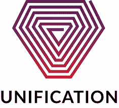

# 区块链将如何统一智慧城市

> 原文：<https://medium.com/hackernoon/how-blockchains-will-unify-smart-cities-521759f625c2>

## **今天的智慧城市**

随着超过一半的世界人口居住在城市，城市规模不断扩大，智能城市的概念最近出现，以更好地应对高密度城市生活的挑战。智能城市使用各种输入和传感器来收集、处理和解释数据，以便高效地管理资产和资源。可以从公民、设备和资产中收集数据，以监控和管理交通运输系统、发电厂、供水网络、废物管理、执法、信息系统、学校、图书馆、医院、应急服务和电网等各种系统。

如今，包括新加坡、巴塞罗那、斯德哥尔摩和纽约在内的 700 多个城市都渴望成为智能城市。这些国家都在探索不同的方法来找到最适合其公民的解决方案。

智能城市的当前项目包括:

*   连接垃圾箱，检测它们有多满，并传达这一信息，以优化废物管理
*   连接在一起的公共汽车、火车和共享自行车网络。他们的位置可以在城市的数字地图上显示出来，使公共交通更加方便。
*   连接了闭路电视摄像头，可以搜索整个城市的物体。例如，您可以搜索一个放错地方的红色行李箱。
*   电子政务，或应用信息和通信技术(信通技术)提供政府服务，如政府对公民(G2C)、政府对企业(G2B)、政府对政府(G2G)、政府对雇员(G2E)的通信和交易，以及政府框架内的流程。
*   走向“开放数据”的趋势。这是指要求或鼓励公共机构发布数据集并使其可自由访问的公共政策。典型的例子是全市犯罪统计、城市服务水平和基础设施数据。

## **智慧城市面临的问题**

**碎片化**智慧城市需要整合多样的硬件和软件——从电动自行车到水表，从交通系统到互联垃圾桶。这可能导致一系列的挑战，这些挑战本质上是一个常见的潜在问题的症状——数据共享系统之间缺乏互操作性。

作为一个雄心勃勃的智能城市，巴塞罗那已经付出了惨痛的代价。思科在西班牙的创新负责人安东尼奥·孔代[在提到巴塞罗纳的智慧城市计划时说](https://www.ft.com/content/6d2fe2a8-722c-11e7-93ff-99f383b09ff9)，

> “有许多不同的筒仓，许多传感器供应商，许多不同的应用，我们首先需要的是一个通用层，”Conde 说。“我们在巴塞罗那学到的主要经验是，要成为一座成功的智能城市，你需要做的第一件事就是开始部署一个公共平台。”

这种缺乏数据标准化以方便互操作的做法同样会影响企业，就像智能城市一样，将任务外包给第三方集中化公司也不是解决办法。举个例子，对于巴塞罗那来说，

> “目标是创建一个具有通用标准的开源传感器网络，连接到由城市自己管理的计算机平台。巴塞罗那希望保留自己网络、平台和数据的所有权，并保护其居民的数据，同时确保个人和公司能够访问属于公共领域的信息。”

虽然许多企业目前都提供现成的解决方案来将他们的服务与城市连接起来，但这导致城市需要管理一系列分散的系统。巴塞罗那的首席技术官和数字专员 Francesca Bria 描述了这个问题，

> “市政厅最终拥有大量数据和仪表盘，但却没有任何能力真正利用数据和信息为公众利益做出更好的决策，或将数据所有权交给公民，”她说。

此外，还有大量的数据提供商类型，包括:公共交通系统、电网、配水系统、垃圾处理服务、天气数据、交通监控、公共服务(如饮水机、公共厕所、wifi 网络、街道网络摄像头馈送)的位置，以及关于停电和紧急情况(如地震、交通事故和火灾)的警告。

这是一个非常复杂的管理问题——关键是要让城市生活变得更简单！

**数据安全和主权** 收集与智慧城市相关的大量数据带来了另一个挑战。这是失去对有关城市和市民的数据的控制的潜在黑暗面。正如哈佛大学研究生本·格林谈到这种情况时所说的，

> “有些城市陷入了这种魔鬼交易，它们觉得自己没有资源来提供人们需要的服务，因此它们与有钱的科技公司达成这些交易，但从长远来看，这些交易可能对它们或它们的居民都没有好处。”

这种数据集中化导致了多伦多政府因隐私泄露而被解雇，亚特兰大的公共数据和赎金遭到黑客攻击，西雅图的城市传感器网络被拆除。同样，这也是数据收集的阴暗面。但是，这是一个数据*集中化*的问题。在这方面，合适的区块链提供了一个开明的解决方案——为合法所有者确保每个数据包的控制权。不再有魔鬼的讨价还价！

# **从分散到统一的智慧城市**

智能城市已经够复杂的了，那么你为什么还要把区块链加入其中呢？嗯，智慧城市计划可以受益于区块链提供的数据的透明性、不变性、安全性和主权。然而，最重要的是，区块链可以简化市政当局和公司的不同系统之间的集成，以解决他们面临的分散问题。这导致了所谓的“统一智能城市”。让我们考虑一下智能城市与[统一](https://unification.com/)区块链融合的一些切实好处。

**统一智慧城市的优势:互操作性**

将每个新的数据提供者集成到系统中的挑战可能是一个令人头疼的问题。比方说，大都会希望将 Li.me 踏板车和自行车集成到其系统中，以便其市民可以看到这些酷电动踏板车所在位置的实时地图。目前，这需要大量的时间、工作和成本来连接城市系统的独特技术堆栈和踏板车公司的独特技术堆栈。Li.me 的滑板车和自行车已经在 100 多个城市销售，这是一个很大的整合！

然而，如果 Li.me 通过创建俳句对统一协议进行一次性整合，那么它的摩托车位置可以被链接到统一的 100 个城市中的任何一个城市访问。通过巴别塔界面，只需轻轻一按开关，就可以增加与新城市的互联互通。

类似地，一旦 Metropolis 有了自己的俳句来连接统一协议，它不仅可以与 Li.me scooters 互操作，还可以与连接到统一协议的所有其他数据提供商互操作。这将再次变得简单，只需在城市的巴别塔界面上按下开关，就可以与比如说电力公司共享数据。

这种顺畅的互操作性是统一智能城市的主要优势。但是“区块链上的新城市”还有其他好处…

**统一智能城市的优势:激励**

可以通过激励计划鼓励智能城市内的数据共享。一方面，Unification 的 native UND token 可用于奖励数据提供商，如收集空气质量数据的私营公司。这种交易数据共享可以鼓励大量新参与者共享他们已经收集的数据，从而使城市以及研究团体受益。

然而，拥有一个与垃圾收集、公共交通和电力截然不同的城市服务中心所带来的互联互通，可以为强大的新公共激励计划打开大门。例如，Unification 的身份验证系统(UVCID)可以帮助市民在市中心使用公共交通工具而不是开车时获得奖励。例如，这种有益的行为可以反映在他们每月电费的减少上。类似地，拥有相连的回收箱可以让每个家庭在回收方面的努力得到回报——也许是市政费用的折扣，或者是公共交通的折扣。

这样，通过使用跨服务的公共身份，服务之间的互连性由城市的公共区块链统一起来。这个系统可以激励聪明的城市居民成为“好的聪明人”。

最后，任何两个连接到统一协议的智能城市都可以选择相互共享数据集，从而为学习带来新的可能性。此外，通过将不同的数据集放置在统一的平台上，可以打开对传统上不相关的信息进行多元分析的大门(例如，交通和天气可能传统上不进行比较，但可能确实有关系)。

**统一智慧城市的好处:透明促进民主 *-公共区块链促进公共治理***

区块链可以确保的两个明显特征是透明性和不变性。这些为一个旨在展示负责任和公平的决策和资源分配的城市提供了多重好处。区块链在这方面可以提供帮助的一些例子包括最大限度地减少欺诈，降低信任成本，以及确保公共资金的透明使用。

**最大限度减少欺诈** 最近的一项研究估计，每 250 笔在线支付中就有 1 笔是欺诈性的，到 2020 年，企业的总成本将[超过 250 亿美元](https://risk.lexisnexis.com/insights-resources/research/2018-true-cost-of-fraud-study-for-the-retail-sector)。由区块链保护的身份和交易的不可辩驳和不可逆转的跟踪可以有力地降低欺诈的发生率及其成本。这样做的好处适用于整个商业中自然重叠的公共和私营部门。

**降低信任成本**通过审计和验证，全球约 35%的 GDP 花费在信任上，导致[目前 29 万亿美元的经济机会被浪费](/@cryptoeconomics/the-29-trillion-cost-of-trust-be8ffbd5788d)。鉴于其中很大一部分通过了政府审计，通过统一等标准化、可互操作的分类账进行交叉引用可能会大大降低这些成本。

公共资金的透明使用公共资金的使用经常被批评，往好里说是缺乏透明度，往坏里说是腐败。因此，将一个城市的财政转移到公共区块链有几个好处。

首先，公共资金的透明使用可以减少腐败的机会，这种机会传统上是由模糊性提供的。例如，以有偏见和不公平的方式将公共合同授予特定承包商的模式，在公共账目曝光时可能变得非常明显。

第二，公开资金如何在各部门之间分配的透明度，并向公众公开，可以导致对预算作出更明智的决定。简而言之，更大的透明度带来更大的民主。

第三也是最后一点，通过区块链管理财务可以提高会计效率。不幸的是，记录保存的复杂性和封闭性导致了明显的摩擦。因此，使用不可变的公共分类账为简化智能城市的会计工作提供了一个统一的平台。

## **如何统一智慧城市**

*有了这么多实实在在的好处，问题是区块链上的第一批智慧城市会是哪一个。凭借专为政府和企业应用设计的独特许可/公共混合区块链模型，Unification 非常适合智能城市的碎片整理。然而，不仅仅是技术，统一企业还面临着制造产品来解决街道上面临的问题的挑战。*

> 披露:*我是统一的顾问。要了解更多关于我们的技术和使用案例，请参见*[*Unification.com*](https://unification.com/)*。要了解统一如何支持您的智能城市的连通性和公民参与，请点击* [*联系我*](mailto:rafael@unification.com) *。*