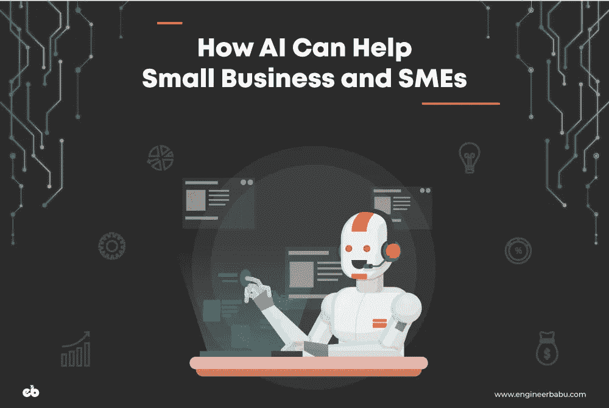
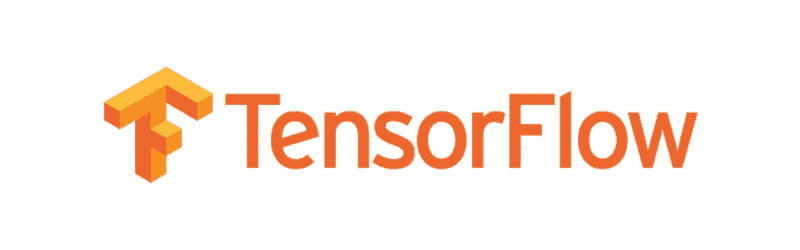
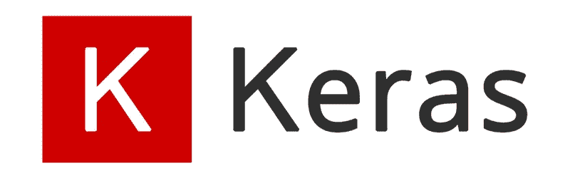
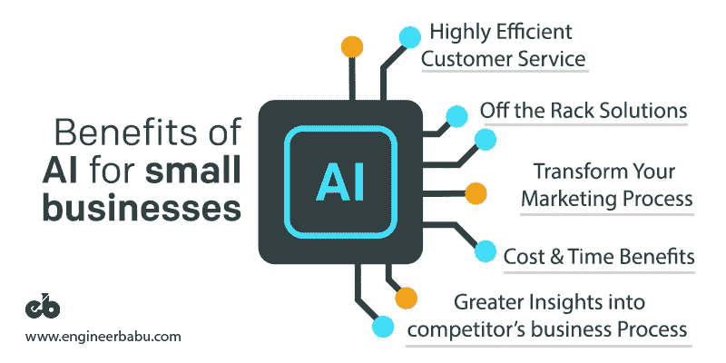

# 人工智能如何帮助小企业？

> 原文：<https://medium.com/hackernoon/how-can-ai-help-small-businesses-e3f6938d384b>

## 嘿，Siri！你能帮我做生意吗？

最近，我和我的营销经理进行了一次讨论，他是一个高大魁梧的中年男人；
我们就叫他史蒂夫吧。

*史蒂夫和我就人工智能如何改变商业运作方式的话题展开了讨论。*

这个人，一个受过良好教育的绅士，只是部分同意我的观点，
他补充道，

***“我承认技术已经产生了相当大的影响，但这种影响是非常有限的。我的工作领域，或者就此而言，大多数小企业还没有观察到任何重大转变，即使在人工智能最近的发展之后***

***“主要是大型组织从人工智能和机器学习等新时代技术中受益。”***

*这让我很好奇…*

*   人工智能的使用案例仍然局限于大型公司吗？
*   ***难道一点都没有方便中小企业吗？***

我的好奇心让我四处寻找，询问中小型企业主，问他们这个问题。

令人惊讶的是，几乎每个人都有相同的观点！经过大量的拾荒，这是我了解到的。

# 现在小企业如何利用人工智能？

人工智能和人工智能应用程序几乎无处不在，从打车服务到智能手机上的语音搜索，我们每天都在使用人工智能服务——对我们消费者来说，它是如此容易获得，以至于小企业也必须触手可及！

预计人工智能将通过优化利用组织数据，在业务流程中提供智能应用和效率，从而改变所有行业的游戏规则。

大型企业已经将人工智能灌输到他们的系统中，并对这些改进感到非常满意，但中小企业仍然不确定人工智能对他们的潜在用例，因为他们质疑它是否真的能给他们的业务流程带来变化。

人工智能不仅仅是为预算数十亿美元的公司准备的。

其实小企业群体都在较劲又如何！许多创新型中小企业正在通过人工智能驱动的应用程序大幅削减成本，并提供卓越的客户体验。

如果得到最佳应用，人工智能工具可以改变 MSME 的空间，使小企业主和企业家能够在一系列商业职能领域创造巨大的成功，包括 ***产品开发、销售、客户服务和营销*** 。

根据我的广泛研究，很明显，大多数中小企业都在挣扎，因为他们认为人工智能需要大量投资。

幸运的是，对于预算有限的企业来说，不需要倾家荡产就可以开始将机器学习和人工智能融入到他们的运营中。通过在较小的规模上启动并利用现成的解决方案，人们可以有效地利用人工智能的能力，并大大提高不同部门的绩效。

***这里有 4 种在中小企业中立即采用人工智能的最佳方法:***

# 1.利用现有平台

开发自己的 AI 无疑是一个复杂而耗时的过程，需要相当大的投资。幸运的是，几家科技公司已经开源了他们的人工智能工作，以使人工智能覆盖越来越多的消费者。利用这一平台为您的企业节省了开发和设计所需的大量成本和时间。 ***以下是一些你的企业可以利用的最受欢迎的人工智能平台:***

## [Tensorflow(由谷歌提供)](https://www.tensorflow.org/)

TensorFlow 于 2015 年发布，是维护最完善、使用最广泛的机器学习框架之一。
TF 的开发旨在推动其研究和生产目标，现已被众多公司广泛使用，包括 Dropbox、易贝、优步、Twitter 和英特尔。

Tensorflow 的广泛用例归功于它在几乎所有主要编程语言中的可用性，如 C++、Go、Haskell、Java、Python、Rust 以及最近的 Javascript。也可以找到其他编程语言的第三方包。

## [Keras](https://keras.io/)

Keras 因其用户友好性、模块化和易于扩展而臭名昭著。使 Keras 与众不同的突出特点是，它既可以作为附加软件也可以作为独立软件使用。Keras 旨在简化深度学习模型的创建。

它是用 Python 编写的，可以部署在 Tensorflow、CNTK 和 Theano 等其他人工智能技术之上。

该平台提供了全面的机器学习库，

*   简单快速的原型制作，
*   在 CPU 和 GPU 上运行最佳
*   支持循环和卷积网络。

## [火花](https://spark.apache.org/mllib/)ml lib

Spark MLlib 由 Apache 开发，是一个支持 Java、Python、Scala 甚至 r 的机器学习库，Spark MLlib 专为处理大量数据而设计，可以快速部署到各种中小企业，如制造、金融、医疗保健等。该工具还提供了与 Python 和 R 库中 NumPy 的互操作性。

## [咖啡](http://caffe.berkeleyvision.org/)

快速特征嵌入的卷积架构于 2017 年发布，通常缩写为 Caffe，是一个主要关注表现力、速度和模块化的机器学习框架。这个开源平台是用 C++编写的，还嵌入了 Python 接口。
**特点:**

*   表达性建筑
*   扩展代码
*   快速性能
*   活跃而充满活力的社区
    Caffe 可以作为您业务的理想平台，因为它易于部署，其活跃的社区提供移动解决方案。

## [快速文本(脸书)](https://fasttext.cc/)

由脸书人工智能研究(FAIR)实验室创建，提供单词嵌入和文本分类。它可以在所有主要平台上使用，如 Linux、MacOS，甚至是 Microsoft Windows。

fastText 用 C++和 Python 编写，允许用户创建无监督或有监督的学习算法来获得单词的矢量表示。

# 2.从小处着手

AI 使能不是一蹴而就的。尝试和匆忙进入这个过程绝对是一种有害的方法。对于中小型企业，不建议全押和大规模投资。中小企业需要慢慢开始，并随着时间的推移逐渐增加他们的人工智能工作。

下面是如何进行的结构化方法:

*   首先集成第三方应用程序，提高已就业员工的工作效率。
*   一旦准备好了，就将你的努力转向开源人工智能、云系统和灵活的工作流模型。
*   从一个小问题开始，这个小问题很有可能证明投资的正回报 **(ROI)** 。
*   有三个步骤
*   **定义**:为你的特定业务档案定义清晰的人工智能能做什么和不能做什么的期望。
*   **测量**:测量应该根据有意义的基线进行。
*   **决定**:决定实验成功与否，快速失败。

因此，解决一个投资回报率高的小问题至关重要，尤其是如果你是一家小企业。当你在为你愿意在人工智能上投资的金额而挣扎时，坚持这种方法证明是卓有成效的。

# 3.实施人工智能进行分析

对于小型甚至庞大的企业来说，人工智能最关键和最基本的用例是在分析领域。人工智能在分析领域打开了新的视野；通过利用预测分析，人们可以极大地扩展他们的企业。

如果你正试图为你的企业实施人工智能，而不想在机器学习上投入大量资金，那么分析就是一条出路。

人工智能驱动的分析软件将以一次性的价格为你带来商业智能。
**以下是一些你的企业可以利用的最佳分析软件:**

## 亚马逊机器学习

AML 是一种机器学习服务，提供创建机器学习模型的工具和向导。借助易于使用的分析，亚马逊的目标是让机器学习比以往任何时候都更容易实现。

AML 可以连接到 RDS、Redshift 或亚马逊 S3 中存储的数据。

## H2O

H20 为自己在人工智能和机器学习领域开辟了一个利基市场，因为它的主要工具是免费和开源的。
**只要下载就能获得主要的 H20 平台。**

H20 在 Apache 2.0 许可下运行，这是可用的最灵活的开源许可之一。此外，你也可以在 AWS 驱动的集群上运行它们，只需要几百美元。

## [微软板载](https://dynamics.microsoft.com/en-in/talent/onboard/)

用其首席执行官塞特亚·纳德拉的原话来说，“ ***我们的目标是让人工智能民主化，让每个人和每个组织都能实现更多。***

记住这一点，微软已经开发了一个开源软件框架，与 Caffe 和 Tensorflow 竞争。该解决方案使企业能够在大型数据集上跨多台机器进行高效扩展。

# 4.部署聊天机器人

Image Courtesy: [dribbble.com/isiluzum](http://dribbble.com/isiluzum)

聊天机器人是一个从人工智能那里获得即时投资回报的绝佳场所。他们有能力与客户互动和互动，回答基本甚至复杂的问题，并恰当地传递查询，这使得员工有限的企业显得更加突出。

人工智能可以利用其闪电般的数据处理能力来分析任何客户的所有可用信息，并基于此自动做出响应，从而减轻负责人员的负担。

它还改善了客户服务并留住了客户，提供了全天候的呼叫中心服务，否则这需要相当大的投资。

# 人工智能在小型企业中的优势

人工智能可以推动许多部门的中小企业取得重大突破。尽管人工智能仍在发展，但我们开始相信，通过它提供的技术水平，它将改变企业的管理方式。许多组织已经开始在他们的业务工作流程中实施人工智能，并在投资回报率和业务周转率方面看到了相当大的改善。

通过正确利用小公司产生的数据，人工智能也可以对小公司有用。企业主应该开始考虑可以让他们成功实施人工智能的步骤，无论他们的企业规模如何。

***以下几点可以帮助小企业主采用人工智能:***

## 1.高效的客户服务

对任何企业来说，客户培育都是一个必不可少的过程。支持对于留住客户至关重要，有时支持代理无法向客户提供独特且合适的解决方案。通过人工智能支持服务，这种异常现象可以很容易地得到解决。此外，完全消除了人为错误的风险。

## 2.对竞争对手业务流程的重要见解

彻底研究竞争对于了解市场趋势和保持竞争力至关重要。基于人工智能的分析软件为你的竞争对手的业务流程提供了更加重要和相关的见解。

例如，人工智能驱动的竞争分析工具 Crayon 可以帮助跟踪竞争对手在网站、社交媒体和网络应用程序等不同渠道的活动。这一功能使小型企业能够更好地了解竞争对手战略的持续变化。

## 3.现成的解决方案

小型企业可以将现成的工具部署到涉及数据的业务工作流的几乎每个元素中。这些解决方案不仅能更好地洞察流程，还能为问题提供更好的解决方案。例如，像 **Monkey Learn** 这样的人工智能工具使用实体提取和情感分析等技术来更好地理解业务。此外，它不需要用户编码，非常容易集成。另一个有趣的工具是 Darktrace 的**企业免疫系统。这家利用人工智能的安全应用公司建立了自己对企业内正常人类行为的理解，并实时检测新出现的威胁。
*该工具无需特殊技能即可安装，并且可以自学。***

## 4.转变您的营销流程

AI 正在从根本上改变营销。像脸书和谷歌这样的大公司已经部署了基于人工智能的广告平台，以瞄准那些接受他们信息的特定客户群。对于小企业来说也是如此；通过部署**程序化广告**，中小企业可以轻松接触到相当多的在线受众，这在以前是不可能的。强烈建议小型企业现在就开始利用和集成人工智能，如果他们希望在未来接触到潜在的消费者。

## 5.成本和时间优势

中小企业利用深度学习最终可以节省大量用于雇佣额外员工或外包特定项目的资金。当重复或耗时的工作只需按一下按钮就能快速高效地完成时，员工就可以解放出来从事有助于公司发展的创造性工作。

# 包扎

***“有人称之为人工智能，但现实是这种技术会增强我们。因此，我认为我们应该增强我们的智能，而不是人工智能。”***

***—吉妮·罗梅蒂，IBM 首席执行官***

人工智能和机器学习的用例现在不仅仅局限于大型企业。它们也是中小企业实现巨大增长的一种极好的方式。它们允许小型企业有效地将传统任务委派给创新而快速的方法来完成，使员工能够专注于其他有助于公司扩张的足智多谋和创造性的机会。

然而，为了在人工智能方面取得成功，小型企业需要制定战略，并根据各自的业务目标调整这些应用程序。如果中小企业正确理解这一新兴现象的重要性，并相应地优先考虑它以实现长期和可扩展的成功，那么他们的人工智能之旅可以是丰富多彩的。

在相对更大的程度上，关于人工智能和商业的场景非常相似。就像 80 年代一样，当时也有例外，一些企业考虑为其行业的未来投资计算机，中小企业通过这种投资实现价值，同时又有能力负担得起，应该继续前进，并根据其业务目标评估其投资决策。