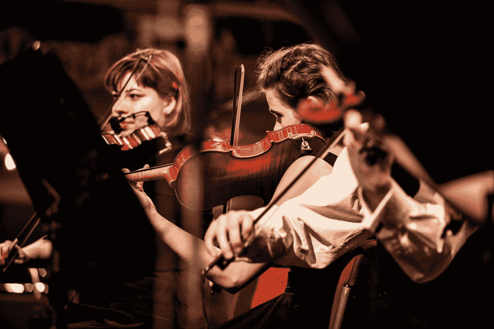

# 如何对音频数据应用无监督学习？

> 原文：<https://medium.com/hackernoon/how-can-you-apply-unsupervised-learning-on-audio-data-be95153c5860>

## 无监督学习

Photo by [Jan Střecha](https://unsplash.com/@jan_strecha?utm_source=medium&utm_medium=referral) on [Unsplash](https://unsplash.com?utm_source=medium&utm_medium=referral)

最新的自然语言处理模型(如伯特，GPT-2)表明，无监督学习方法是为下游任务学习特征的好方法。研究人员证明，数据驱动的学习特征比传统的声学特征(如梅尔频率倒谱(MFCC))提供了更好的音频特征。