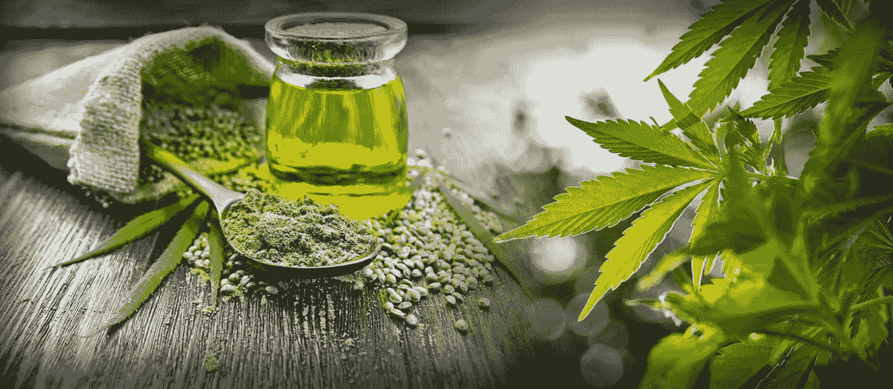
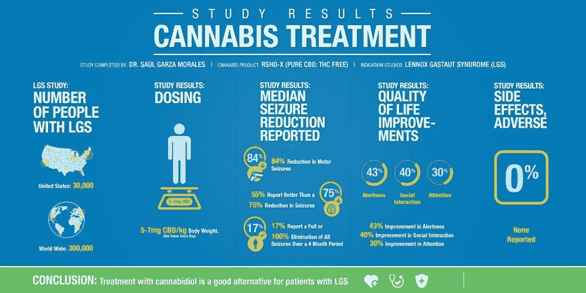
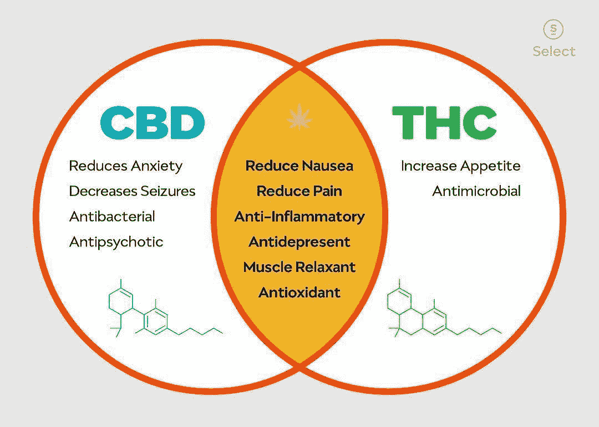
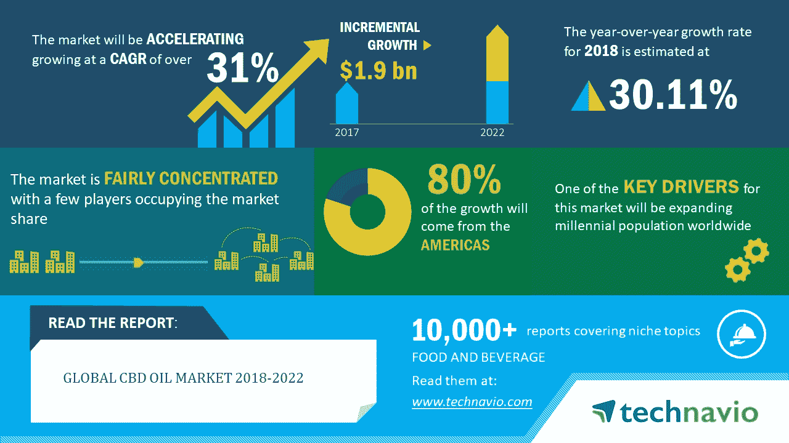
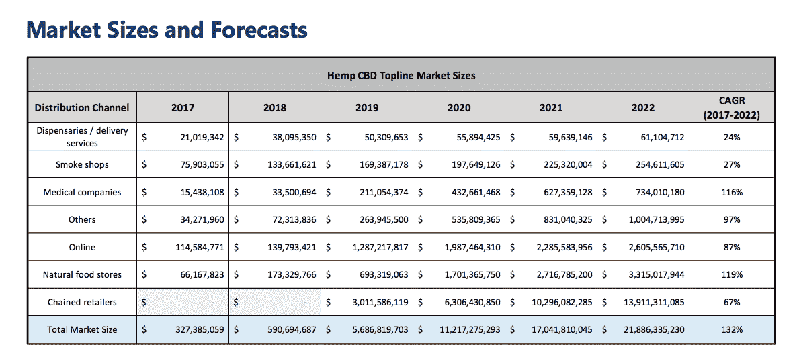
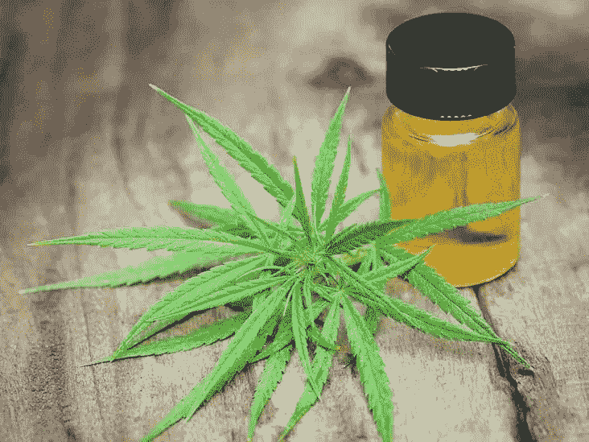

# 根据临床研究和市场分析，CBD 市场如何向正确的方向发展？

> 原文：<https://medium.com/hackernoon/how-cbd-market-is-moving-in-the-right-direction-according-to-the-clinical-research-and-market-79f0c80764cf>

使用大麻治疗疾病在历史上已有记载。古代的治疗师和医生给他们的病人开处方，因为他们看到了大麻所包含的治疗特性。

现代医学只是在几十年前才注意到这个神奇的家庭，并一直在将其应用于治疗疾病。然而，最近这种植物越来越受欢迎，市场上开始出现 CBD 或大麻产品。

CBD 不应该和大麻混在一起。尽管两者都源自大麻 *sativa* 因此得名。前者不含足够的 THC(四氢大麻酚)作为精神活性物质，使人中毒或引起欣快感(又名“兴奋”)相反，许多人证明了它能够减轻疼痛、缓解焦虑、舒缓皮肤和其他健康益处。

事实上，大麻已被证明对与两种最罕见的儿童癫痫相关的癫痫发作有效，这两种癫痫为 Dravet 综合征和 Lennox-Gastaut 综合征。这种疗法得到了美国食品和药物管理局的批准[。这是食品和药物协会第一次允许 CBD 用于治疗两岁及以上的 Dravet 综合征患者。](https://www.fda.gov/NewsEvents/Newsroom/PressAnnouncements/ucm611046.htm)

医药市场得到了这个消息，所有人都举着手。它以前的含义和现在 FDA 的同意是希望制造商进一步进入药物开发和研究。

医学界也没有保持沉默，并且已经进行了各种研究来分析 CBD 如何有益于某些情况。

其中一项研究是关于青少年的 IBD(炎症性肠病)。[的研究集中在](https://www.ncbi.nlm.nih.gov/m/pubmed/30801394/?i=1&from=cbd%20oil)IBD 患者口服和舌下含服 CBD 油的使用。13 至 23 岁的受试者在 2015 年至 2017 年期间在科罗拉多儿童医院参加了研究。比较了 CBD 油使用者和非使用者的风险认知和临床特征。

《生物多样性公约》石油用户分享了关于其使用模式、动机、好处和问题的信息。该研究从 15 名 CO 使用者和 67 名非 CO 使用者开始，他们都处于相同条件下。15 个 CO 用户中有 5 个报告了 CBD 在缓解疼痛方面的医疗益处。9 CO 使用者表现出睡眠质量、对恶心的效果和增加的食欲。

从好的一面来看，CBD 用户表现出更健康的身体，患肥胖症和糖尿病的风险更低。发表在《美国流行病学杂志》上的另一项临床研究证实了这一说法。该调查小组有超过 52，000 名参与者，测试得出的结论是，经常使用 CBD 的人肥胖率较低。

**市场反应如何？**

制药巨头将 CBD 吹捧为生命的[灵丹妙药](https://www.nytimes.com/2018/10/27/style/cbd-benefits.html)。虽然它已经出现了一段时间，但用途并不是绝对的，需要时间来进一步开发。这是你不应该将它与其他药物混合的众多原因之一，但它绝对是药物的替代品。

据业内专家称，CBD 石油市场正在经历一场风暴。它正以超过 30%的惊人 CAGR (复合年增长率)增长，这一数字预计将一直保持到 2022 年。

Img Src:技术导航

[LP Information 预计](https://www.reuters.com/brandfeatures/venture-capital/article?id=75171)CBD 市场的 CAGR 将达到 30.7%，这将使未来几年(即 2023 年)的收入从 1.5 亿美元(2017 年)增加到 7.6 亿美元。

也就是说，它在医学领域的流行和令人惊讶的应用已经导致更多基于 CBD 的产品，如食品补充剂，进入市场。这就是一个新问题出现的地方。在提供越来越好的替代品的竞赛中，许多公司都在走合成路线。

Charlotte's Web Hemp 的首席执行官乔尔·斯坦利(Joel Stanley)说:“现在有很多伟大的创新，但因为这是一个新行业，所以也有不可靠的玩家希望快速赚钱。事实上，FDA 对 CBD 产品进行了自己的研究，发现许多产品甚至不含 CBD。

不管怎样，许多创业公司和制药公司被驱使着用真实可信的 CBD 产品上架。由于这是一个价值 220 亿美元的闪亮产业，竞争者不想错过即将到来的淘金热。

像维尔马农场这样的公司从无农药、有机、全天然的大麻植物中提炼 CBD 油。他们甚至使用最少的额外成分(全天然和纯素食)。此外，他们反对使用任何不是天然产生的东西。他们的产品中最受欢迎的是 Focus，它被 CBD 爱好者们称赞为能够帮助你在引起严重分心或社交焦虑的情况下放松

事实上，合成 CBD 和其他人造大麻素极其危险，它们会导致各种症状，包括呕吐、癫痫和妄想症，在更糟糕的情况下，甚至会导致死亡。如果你要从事 CBD 产品，你必须使用那些最高的、全天然的产品。

“2RiseNaturals”是另一个合乎道德的 CBD 产品开发商。他们使用不含杀虫剂的大麻，在生产过程中用堆肥制成。虽然最值得信赖的 CBD 品牌会在第三方实验室对其产品进行效力和纯度验证测试，但 2Rise Naturals 不只是对其产品进行一次测试，而是在不同的实验室进行三次测试。

该公司的酊剂包括从椰子中提取的 MCT 油，以提供脂肪，帮助你的身体吸收 CBD。[Wellandgood.com](https://www.wellandgood.com/good-advice/best-cbd-products/)也证明了它极其美味的味道，所以你可以考虑用它来烹饪，而不仅仅是直接食用。

CBD 目前的市场看起来很有前景，也有很大的改进潜力。优秀的玩家正在通过制造原创产品做出贡献，更多的初创公司正在推出新的创新。类似于 [vape juice](https://www.worldvaping.com/vape-juice) 行业，其目标是烟草/香烟用户，并试图将消费者转移到电子烟方面。

医学界和科学家正在努力改善 CBD 部门，并利用其完整的本质来治愈尽可能多的疾病。

对于消费者来说，虽然去找可信的和认证的 CBD 供应商是必要的，但是寻找假的和合成的替代品也是重要的。如果你打算使用大麻二酚油和酊剂，建议你先咨询你的全科医生/医生，然后再做相应的处理。也请留意食品和药物管理局的公告。