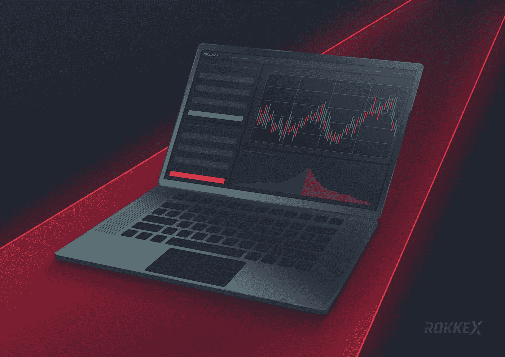

# 集中式加密货币交易如何工作:2 种平台

> 原文：<https://medium.com/hackernoon/how-centralized-cryptocurrency-exchange-works-2-types-of-platforms-719703ced753>

在二十一世纪，出现了一个震惊全世界的现象。Cryptobirds 很快吸引了投资者、开发者、程序员以及——稍后——监管者的注意。众所周知，通过使用这样的工具，你可以大大增加你的资本。

首先要给出加密货币交易所的定义，会有几种:

*   加密货币交易所是一个数字市场，交易者可以按照市场价格买卖比特币和替代币。
*   加密货币交易所是一个在线平台，充当加密货币买家和卖家之间的中介。

有许多加密货币交易所，很快它们的数量将超过一千。在本文中，我们将考虑两种类型的加密货币交易所，以及一种更方便的交易选择——经纪人。

交易核心是交易所最重要的部分。交换机上所有操作的速度和正确性取决于代码的功能性。核心执行几个优先任务:

*   检查所有已签发订单的金融资产安全性。简单来说，根据交易者当前的余额，它允许或禁止下单购买/出售加密货币；
*   在下新订单和执行当前订单时，创建和更改数据库中的记录；
*   准备在交易终端显示的数据:价格水平、图表和股价指数、最后完成的订单列表。

所有的资金都存储在钱包里，用户将资产转移到钱包里进行交易。有冷钱包和热钱包。

热钱包用于在加密交易所接收资金，并向交易者付款。它总是积极的，应该有一个积极的平衡。

一个冰冷的钱包用来存放加密货币的主要金额。它们与互联网断开连接，这使得攻击者无法在交易所遭到黑客攻击时窃取资金。外部驱动器或单独的计算机可以用作冷钱包。

*你可以在这里* *找到更多关于钱包种类的信息* [*。*](https://blog.rokkex.com/where-to-keep-crypto-types-of-crypto-wallets-52db723b928f/)

网站是所有交易者最重要的元素。它必须具有功能性、直观性和便捷性，并支持使用移动设备工作。使用交易所的网络界面，用户可以访问所有必要的功能:

*   账户的登记和随后的核实；
*   加密货币和法定货币的存取；
*   账户余额，为购买和出售加密货币下交易订单的能力；
*   所有买入、卖出、存入和提取资金交易的详细统计；
*   交易对的股价图、当前买卖订单、最近订单的历史记录等等；
*   背景和快速获得客户支持。

我们现在转向非官方类型的集中式密码交换机。按照惯例，它们可以分为两类。第一种方式提供了一个购买大量各种硬币的机会，并根据需要长期持有。第二个提供了一个较小的硬币列表，但在交易风格方面有更广泛的选择，即做空和使用杠杆的能力。

如果考虑第一种，一个平台应该有一个最好的接口和一个优秀的交易核心。多级验证和双因素身份认证是必须的。交易的对子至少有 100 对，而且不断有新币加入。有时候有一种加密货币，你可以用很大的折扣支付佣金。交易量大，流动性高，交易的硬币是根据非常严格的要求添加的，未来至少可以增长到目前价格的 5-10 倍。该交易所将适合长期投资者，但当一枚硬币增长时，终端开始沉重地悬挂。

第二种更适合活跃的交易者。双向交易都有可能，就是空仓和多头怎么开。杠杆让你反复增加利润，同时值得记住的是风险增加。也可以设置止损单来限制损失。但这种交易所有许多缺点:首先，缺乏监管，在交易活动增长期间终端不断挂起，经常缺乏流动性，存入/提取资金以及交易操作本身的佣金很高，以及复杂的界面使得难以与新交易者合作。此外，如果没有止损，保证金是不合理的，这会导致止损过早平仓。总的来说有点奇怪，交易所的管理员可以追查不公平行为。

还值得注意的是，这两种类型的交易所都可能被黑客攻击，而且还有一个交易机器人的问题，因为用户经常会因此而赔钱。

需要注意的是，这种区分是基于交易所为其业务运营选择的受众。如果目标受众主要是年轻的加密货币交易者，那么第一种更适合。当一个交易所希望更多地关注有经验的交易者时，那么这个平台应该用先进的交易工具来吸引用户。然而，这不是规则，年轻的和有经验的交易者都使用这两种类型的交易所。

对于活跃的交易活动，交易者和投资者越来越经常地使用经纪人的服务。有些由金融委员会监管，而交易所可能永远不会受到完全的法律监管。其他优势包括方便直观的 MT 4/5 终端、广泛的技术分析工具、调节杠杆的能力、最低佣金、高流动性以及黑客入侵的可能性小。

总之，我们注意到密码行业将继续增长，新的交易所和硬币将会出现。这个领域非常广泛，允许你在它的基础上发明各种各样的知识；于是，就出现了投资的工具。我们可以说，在未来 10-15 年，增加资本的机会仍然存在。

# 你可能也喜欢

[什么是加密货币兑换 API](https://blog.rokkex.com/what-is-cryptocurrency-exchange-api-53159d15224f/)

[一份庞大的加密货币盗窃清单](https://blog.rokkex.com/a-huge-list-of-cryptocurrency-thefts-16d6bf246389/)

[加密货币交易所 VS 证券交易所](https://blog.rokkex.com/cryptocurrency-exchange-vs-stock-exchange-3e6e72d78743/)

> **在**[**ROKKEX**](https://www.rokkex.com/?utm_source=Medium&utm_medium=blog&utm_content=kl)**，我们极其重视安全性，我们的加密交换建立在“安全第一”的原则之上。我们希望与更广泛的公众分享我们的专业知识，让世界变得幸福、安全和智慧:)**

如果您有任何想法和建议，请联系我们

[网站](https://www.rokkex.com/?utm_source=Medium&utm_medium=blog&utm_content=kl)。[领英](https://www.linkedin.com/company/rokkex/)。[脸书](https://www.facebook.com/rokkex/)。[推特](https://twitter.com/ROKKEX_com)。[电报](https://t.me/rokkex_chat)。 [Reddit](https://www.reddit.com/r/Rokkex/) 。 [Instagram](https://www.instagram.com/rokkexofficial/)