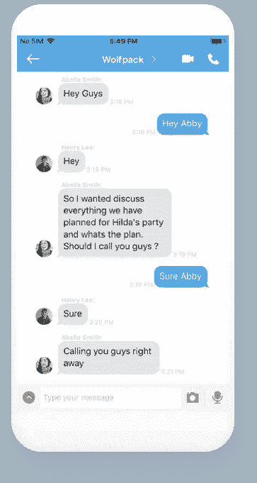
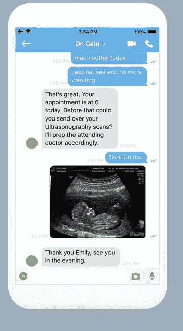
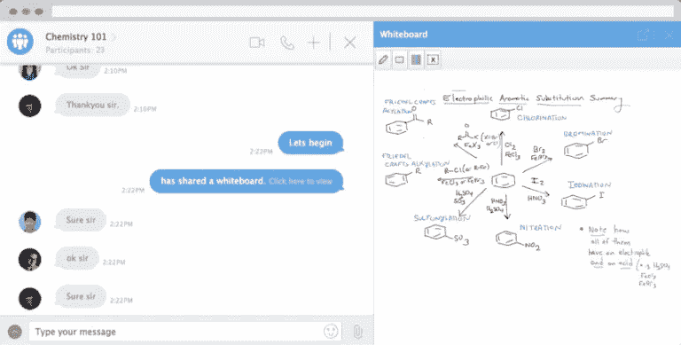

# 聊天 API 如何提高用户的参与度和忠诚度

> 原文：<https://medium.com/hackernoon/how-chat-api-boosts-the-engagement-and-retention-of-users-646bb7bb1739>

即时消息是一个在 90 年代开始普遍使用的术语。GTalk，Yahoo Messenger，Orkut 的日子，谁能忘记？

但是你知道即时消息的实际概念可以追溯到 20 世纪 60 年代中期吗？兼容分时系统(CTSS)是最早的多用户操作系统之一，于 1961 年在麻省理工学院(MIT)的计算中心创建。他们允许多达 30 个用户同时登录并互相发送消息。到 1965 年，这些系统，也许看起来更像今天的电子邮件，已经有了许多来自麻省理工学院和附近大学的注册用户。

从那时起，我们走过了漫长的道路，今天我们有多种沟通方式。在用户与用户交互的情况下，我们有推送通知、应用内消息、实时聊天等选项。

原因很简单——大多数平台所有者已经意识到，没有什么比聊天平台更能吸引用户了。在这个地方，他们可以说出自己的想法，与人交谈(包括买家和卖家)，找到志同道合的人，并愉快地与他人联系，这将大大有助于确保他们坚持使用你的平台。

现在，当谈到开发一个聊天平台时，你经常会在两个选项之间左右为难:

*   从头开始建造
*   使用聊天 API

虽然第一个选项看起来会让你对聊天应用程序有更多的控制，但也有一些缺点。价格只有一个。另一方面，如果您选择使用 Chat API 来增强您的聊天平台，您会发现您可以向您的聊天服务添加大量的功能。

但是一个[聊天 API](https://www.cometchat.com/blog/know-about-chat-api/) 到底是什么？

# 聊天 API 简介

聊天 API 基本上是一个应用程序接口，允许您连接到服务器端，并在任何应用程序或网站上提供实时聊天和消息传递功能。这些聊天 API 支持实时聊天应用程序所需的所有可伸缩性、稳定性等特性。

无论是亲密的一对一对话还是开放的群聊，这些聊天 API 都可以帮助您实现这些功能。但是，作为一个企业/平台所有者，你可能想知道这些 API 到底是如何帮助你的。

简而言之，使用聊天 API，您可以为您的用户提供各种功能。您还可以打开各种沟通渠道，包括:

*   **用户< >用户:**无论是游戏平台还是约会平台(甚至是电子学习和医疗保健，都可以使用聊天 API 实现用户对用户的交互。如果我们谈论的是医疗保健平台，这种互动将是患者和医生之间的互动。
*   **市场< >卖家< >买家:**这些 API 帮助电子商务平台维护市场、卖家和买家之间的沟通渠道，实现完全透明。
*   **服务提供商< >用户:**市场中的服务提供商和用户之间的沟通可以证明是非常富有成效的。
*   **广播员< >观众:**推送通知来了——另一个可以使用聊天 API 的功能。

# 聊天 API 如何提高用户参与度？

到目前为止，我们都认为 Chat API 真正提供了一系列服务，可以帮助您向用户展示一个更好的聊天平台。这也肯定有助于人们更容易被你的平台所吸引——因为如果他们有一个表达自己的舞台，他们会感到宾至如归、轻松自在。但是，如果我们要讨论这些聊天 API 提高参与度的具体功能，让我们开始吧:

*   [**各种对话模式:**](https://www.cometchat.com/features/voice-video-text-chat/) 无论你是在寻找一对一的聊天、私人群聊还是公共群聊，聊天 API 都能满足你。有些时候，你的用户会想在公共平台上发表自己的观点，但也有相反的时候。例如，如果你提供游戏服务，你肯定希望有一个公共论坛，让你的用户可以讨论游戏发生的事情。如果你有一个约会应用，你不能没有一个私人聊天选项。同样，不同的行业有不同的要求。但最终，结果是一样的——参与度提高。
*   [**协作功能:**](https://www.cometchat.com/features/collaborate) 允许您的用户在协作式白板上表达他们的想法有助于提高参与度。特别是如果你是一个商业网站，一个社交社区，或者一个游戏平台，如果用户参与是你想要达到的，这是一个必要的功能。
*   [**文件共享:**](https://www.cometchat.com/features/plugins/file-sharing/) 使用聊天 API，您可以添加允许您的用户共享重要文档的功能，无论是照片、视频还是笔记。给你的用户这个选项将会在他们面前打开一个更宽的交流范围。
*   [**屏幕共享:**](https://www.cometchat.com/features/plugins/screen-sharing/) 通过允许您的用户在交流时共享屏幕，您确保了前所未有的透明度。想象一下这种可能性——通过使用屏幕共享功能，用户可能存在的任何问题都可以得到实时解决，甚至更快。
*   [**推送通知:**](https://www.cometchat.com/features/all-features/) 如果我们在谈论用户参与度，推送通知值得一提。这些通知的作用就是把你的用户带回你的平台。推送通知确保每次用户有消息时，他们都能得到实时通知，只需点击通知就可以访问他们的聊天框。很吸引人，不是吗？

所有这些，以及更多的功能确保你的用户被你的网站所吸引，从而被你的产品所吸引。毫不奇怪，聊天 API 在各种行业的市场上越来越受欢迎。几乎没有哪个行业的所有者没有因为在他们的平台上使用聊天应用程序而不知所措。既然您已经选择了一系列必要的特性，并且使用了一个聊天 API 来吸引用户使用您的平台，那么让我们来谈谈下一件重要的事情:用户保持。

# 利用聊天应用编程接口的强大功能来提高留存率

Chat API 为开发人员和企业家提供了量身定制的功能，以提高保留率。

使用人工智能技术建立沟通渠道，您可以帮助您的用户发送强大的信息，并解决他们的疑问。这些功能可以帮助您针对特定的受众群提供完全符合他们需求和兴趣的产品。

如果我们谈论留住用户，个性化信息等功能也很有帮助。无论你在哪个业务领域运营，为你的用户提供与你平台上的其他人直接实时交流的选项，将有助于他们更快地澄清疑问。一旦他们可以快速访问所有需要的信息，他们需要采取的下一步措施就会变得容易。

此外，表情符号、gif、文件共享等其他功能将确保您平台上的交流是一种互动体验，而不仅仅是一种活动。这将是一种用户想要反复体验的体验。这就对了，你有一群游客正在返回你的平台。怎么会？因为您使用聊天 API 满足了他们的需求。

这就把我们带到了[comet chat](https://www.cometchat.com/)——一个实时信息服务提供商。他们的聊天 API 提供了上面讨论的所有特性，甚至更多。让我们看看他们如何帮助你的事业。

# 用于提高用户参与度和忠诚度的 CometChat API

## 约会应用

你的约会应用程序的对话式用户界面是必不可少的。理想情况下，你的用户应该能够进行面对面的交流，而不是简单的发短信。这可以通过启用语音和视频聊天来实现。

*Enable voice & video calling on your dating website.*

CometChat API 允许您将这些功能无缝集成到您的应用程序中。

## 在线社区和社交网络

作为一家企业，拥有一个[在线社区](https://www.cometchat.com/solutions/social-community/)会给你带来巨大的好处。这是一个你的客户、品牌倡导者、有影响力的人、员工和其他人可以聚会和互动的地方。

*Increase user engagement by enabling group chats.*

CometChat 的通信功能帮助您保持社区活跃。用户可以通过实时文本、语音和视频聊天、协作白板和写字板等进行交流。

## 市场网站

用户对用户的聊天对市场有很大帮助。当涉及到用户解决他们对你的市场上的任何产品的担忧时，这是特别棒的。如果他们有机会与其他用户讨论，他们会更加信任这些产品。它将创造透明度，这将有助于参与和保留，反过来，增加你作为一个品牌的商誉。

*With one-on-one chats
buyers and sellers can communicate with each other.*

想象一下，在没有聊天功能的情况下，买方和卖方将通过电子邮件或电话相互交流。他们会在你的平台之外完成交易。你还冒着让你的市场成为“另一个平台”的风险，在这个平台上，买方/卖方可以“找到”对方，但不能进行交易。在您的应用中集成实时聊天有助于确保交易或互动不会超出您的平台。

## 卫生保健

通过为你的[医疗保健](https://www.cometchat.com/solutions/healthcare-consultation/)平台使用聊天 API，你可以创建一个完全互联的生态系统。病人可以和医生以及其他病人进行无缝交流。这不仅可以改善整个治疗过程，还可以节省医生和患者的时间。

*Doctors and patients can share medical reports and prescriptions with each other in real time.*

除了与医生和病人联系，你还可以使用这个服务来实时共享医疗报告。患者和医生之间的这种协调努力将产生一个更加高效的医疗保健生态系统。

## 电子学习

电子学习平台需要一定程度的交流和互动。没有这些，学生就没有办法联系老师，甚至其他学生。

*Enrich the interactivity of your virtual classroom, by using collaborative whiteboard to express your ideas.*

为您的电子学习平台提供聊天 API，以提供视频聊天、语音聊天、文件共享、屏幕共享等功能，这对于确保学生坚持使用您的平台大有帮助。这只能通过向他们提供他们需要的东西来实现。相信我们，有效的沟通渠道是他们需要的第一件事，尤其是当我们谈论电子学习论坛的时候。

## 以及其他等等

即使你不属于上面讨论的服务提供商，你也没有理由阻止自己使用聊天服务。例如，咨询领域可以使用实时聊天及其功能来帮助用户获得更好的帮助。但事实并非如此，无论你来自哪个领域，归根结底，这都是为了帮助你的用户更好地联系。

当谈到透明通信和允许用户相互交流时，没有什么比实现聊天 API 更接近的了。

[通过聊天 API 进行实时交流](https://www.cometchat.com/chat-api/)

【www.cometchat.com】最初发表于**。**