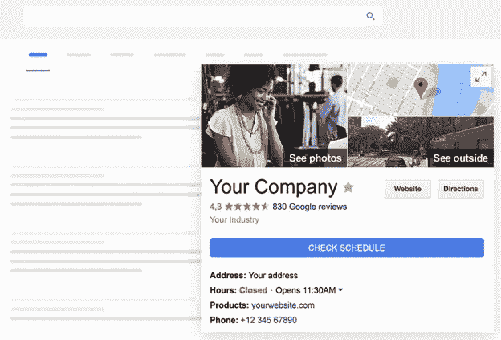
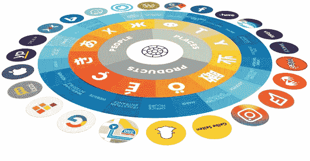

# 互联数据如何改变机构开发人员管理网站的方式

> 原文：<https://medium.com/hackernoon/how-connected-data-can-change-the-way-agency-developers-manage-sites-5015de7bd54c>

末日预言还没有到来。尽管出现了像 WordPress 这样的“免费”平台和 Wix 这样的“围墙花园”网站建设者，作为代理专业的网络开发还没有被 DIY 扼杀。

并非所有公司都负责建立和维护自己的网站。一些人缺乏专业知识来负责这项工作，而另一些人只是希望更多地关注他们的其他业务活动。所以他们仍然乐于将他们的需求外包给开发机构。

此外，数字业务发展如此之快，以至于公司经常需要添加新功能或偶尔重新设计他们的网站。幸运的是，开发商和代理商现在也可以获得解决方案，让他们大规模地满足这些需求。

今天的许多网络应用和服务也通过应用编程接口(API)开放了它们的平台，允许第三方访问各种功能和数据。因此，网站有可能从社交媒体、电子商务平台和其他云应用等外部来源获取数据。互联数据还可用于接入第三方内容库并将内容推送到网站，从而简化内容管理和网站维护。

以下是互联数据可以从根本上改变开发商和代理商创建和管理网站的方式的五种方式。

# 1.增加的功能

集成允许站点访问数据并嵌入来自第三方服务的强大功能。请注意，按照惯例，过去需要开发人员从头开始编写他们自己的模块，这需要高水平的专业知识才能安全和大规模地完成。

*Image source:* [*https://www.shore.com/en/reserve-with-google/*](https://www.shore.com/en/reserve-with-google/)

对于开发商和代理商来说，这可以通过使用集成来简化。例如，餐馆和健康企业可以轻松地将 Shore 的预约和客户管理功能集成到他们的网站中，同时与 Google My Business 等第三方服务无缝同步。

# 2.更快的网站创建

互联数据还支持使用内容库，允许网站从任何数据集(包括数据库和现有网站)中提取内容。例如，一个客户可能希望在很紧的期限内更新其网站。该机构可以简单地使用连接的数据来填充各种网站模板的内容，立即创建大量的功能设计原型，供客户选择。

例如，杜达主要被代理机构用于其协作网站建设功能，但其 API 也允许开发者使用外部托管资源更新内容，甚至通过推送来[创建整个网站。这极大地有利于客户，因为他们能够随时预览新的设计，并在批准后快速部署它们。这也有助于减少停机时间，因为在今天的互联网上根本没有“网站建设中”页面的位置。](https://www.duda.co/blog/new-instant-website-creation-now-available-on-duda/)

# 3.简化管理

代理机构面临的另一个关键挑战是帮助企业保持内容准确和最新。有多少网站，尤其是小企业的网站，在页面上显示不一致甚至矛盾的信息？

*Image source:* [*https://www.yext.com/products/*](https://www.yext.com/products/)

定价和联系方式等关键信息的变更必须保持正确，并且必须反映在网站上显示数据的所有情况中。互联数据允许这一点自动完成，因为真相来源的任何变化都将被推送到所有的网站元素和部分。你甚至可以使用一个规范的商业信息平台，比如 Yext，作为你所有客户内容的[单一来源](https://www.yext.com/products/knowledge-graph/)——在他们的网站上以及其他地方。

# 4.更高的敏捷性

如今，网站创建的挑战不在于如何让事情运转起来，也不在于网站是否可以增加某些功能。有大量的管理系统、平台和插件可以帮助开发人员提供这些功能。这关系到企业建立新网站或更新网站的速度。

即时定制功能、重用信息和部署内容的能力使公司能够根据目标和目的的变化灵活地调整他们的体验。

# 5.更丰富的体验

企业还必须对用户多变的情感做出快速反应。就在几年前，博客在公司网站中风靡一时。如今，一切都是关于社交媒体和简短形式的内容。未来暗示着对更多自动化和聊天机器人的需求。也就是说，用户仍然希望看到公司使用所有这些功能来创建丰富和令人满意的用户体验。代理开发者必须能够为他们的客户提供更丰富的体验，更好地吸引访问者。

*Image source:* [*https://www.personyze.com/crm-targeting-and-personalization/*](https://www.personyze.com/crm-targeting-and-personalization/)

互联数据可以帮助公司通过使用从客户旅程的其他方面收集的数据来显示更相关的内容，从而提供个性化的浏览体验。一旦你将相关的社交媒体、电子邮件营销和广告数据平台连接到你客户的 CRM，你就可以[使用 API 将这些信息](https://www.personyze.com/crm-targeting-and-personalization/)与 Personyze 这样的工具集成，Personyze 为个人网站访问者提供个性化的、有针对性的服务。

# 挑战旧的

互联数据应该是 web 开发领域的一个可喜进步，因为它简化了在当今商业环境中保持网站相关性所需的许多创建和维护任务。

不幸的是，并不是所有的开发商和代理商都有能力进行必要的整合来实现这一点。不乏自称提供全面服务的代理机构，但它们只能创建前端定制和部署现在的一般功能。他们无法执行这些集成，这可能会使他们的客户无法享受互联数据带来的更丰富的网络体验。

这就是为什么对于网站开发者和设计机构来说，确保他们有这样的能力是至关重要的。这不是证明他们能够处理编码挑战，而是为他们的客户提供直接的价值。