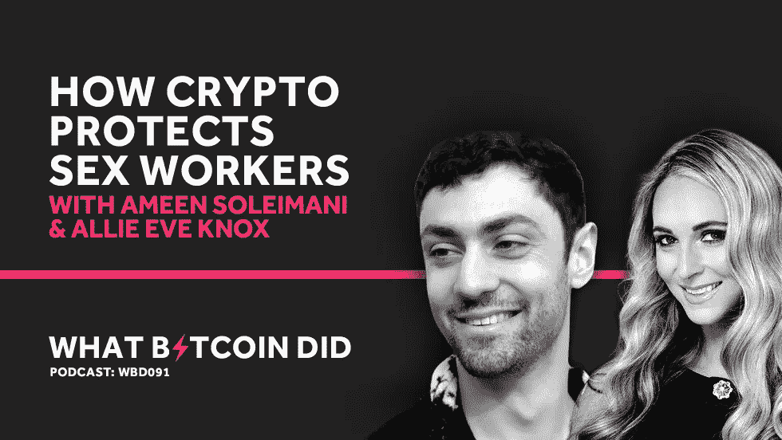

# Crypto 如何保护性工作者免受 Spankchain 的伤害

> 原文：<https://medium.com/hackernoon/how-crypto-protects-sex-workers-with-ameen-soleimani-allie-eve-knox-from-spankchain-86bf50a4acfb>

音频采访转录— WBD091

***注:*** *以下是我对 Spankchain 的 Ameen Soleimani 和 Allie Eve Knox 的采访转录。我已经检查了转录，但如果您发现任何错误，请随时发送* [*邮件给我*](http://hello@whatbitcoindid.com) *。可以* [*在这里*](https://www.whatbitcoindid.com/podcast/how-crypto-protects-sex-workers-with-ameen-soleimani-allie-eve-knox-from-spankchain) *听原声录音。*

*你可以在这里订阅播客* [*听所有剧集*](https://www.whatbitcoindid.com/podcast/) *。*

在这一集里，我和来自 Spankchain 的 Ameen Soleimani&Allie Eve Knox 交谈。我们讨论了性工作者所面临的问题，包括去平台化、金融审查以及行业压力如何导致虐待和剥削。

联系比特币做了什么:
听:[**iTunes**](https://itunes.apple.com/gb/podcast/what-bitcoin-did-podcast-bitcoin-crypto-trading-strategy/id1317356120?mt=2)|[**Spotify**](https://open.spotify.com/show/0mWUJuONiilW5JSBBFZ0s7?si=5qcbjpjYSRyKpi8wycEZUw)|[**Stitcher**](https://www.stitcher.com/podcast/what-bitcoin-did)|[**SoundCloud**|](https://soundcloud.com/what-bitcoin-did)[**YouTube**](https://www.youtube.com/whatbitcoindid)|[**TuneIn**](https://tunein.com/radio/What-Bitcoin-Did-p1079869/)关注: [**网站**](https://www.whatbitcoindid.com/)

# **采访记录**

****面试日期:**Ameen-2019 年 3 月 17 日星期日| Allie-2019 年 3 月 22 日星期五**

> **“色情是世界各国政府在互联网上扼杀你的自由的门户，因为没有人会来捍卫他们观看色情的权利，因为这是一种社会耻辱。”**
> 
> **——阿梅恩·索莱马尼**

**[**彼得·麦科马克:**](https://twitter.com/PeterMcCormack) 艾丽。你好。你好吗**

**[**Allie Eve Knox:**](https://twitter.com/allieeveknox)做得很好，谢谢。你好吗**

**[**彼得·麦科马克:**](https://twitter.com/PeterMcCormack) 我很好，谢谢。吃得很好。谢谢你带我来盐舔餐厅。这是一个著名的地方吗？**

**[**艾莉伊芙诺克斯:**](https://twitter.com/allieeveknox) 太棒了。这是世界上最好的烧烤场所之一。**

**彼得·麦科马克: 我告诉过你，上次我在奥斯汀的时候，我是一个素食主义者，我被带到所有这些烧烤店，吃墨西哥胡椒和一点面包。所以有点变化！听着，谢谢你同意见我。我显然在威尼斯见过 Ameen，我不是一个以太坊迷，但我对比特币和加密如何帮助性工作者非常感兴趣，这些人受到各种支付渠道的审查和封锁。**

**所以在我们开始谈论这个行业之前，你能告诉我比特币对你来说意味着什么，它能让你做什么吗？**

**[**艾莉·伊芙·诺克斯:**](https://twitter.com/allieeveknox) 确定。我从 2014 年开始拿比特币换 Skypes。这是一个不同的支付来源，因为我已经关闭了所有的支付应用程序。所以我的现金应用程序，我的谷歌支付，我的贝宝，所有你能想到的都被关闭了，因为我违反了服务条款，把它用于性工作！这有点可笑，因为我被 PayPal 关闭的原因是有人向我致敬，他们向我支付了他们的钱或其他东西，并以这种方式关闭了它。**

**所以这并不像我护送或做任何违反法律的事情，但他们不喜欢这样，保留我的钱，关闭我的账户，无论如何。所以我在寻找另一种方法来取钱。我早就听说过比特币，大概是在 2013 年左右。**

**我当时和我约会的那个人发生了争执，他说，“我们必须进入比特币，我们必须这么做”。我想，“好吧，我们应该得到它，我们应该卖一些药物或一些性或人们想要这种替代付款的东西，所有这些东西，他们不能使用它。”他说，“不，我们必须走向主流”。事实证明我们都是对的！因此，我在 2014 年开始接受预付 Skypes，持有一批，在 2017 年 12 月卖掉，买了一套房子。**

**[**彼得·麦科马克:**](https://twitter.com/PeterMcCormack) 好时机！**

**[**艾莉伊芙诺克斯:**](https://twitter.com/allieeveknox) 是啊，真的很棒。我有点自责，因为我卖了 19，000 美元而不是 21，000 美元，但是你知道，**

**[**彼得·麦科马克:**](https://twitter.com/PeterMcCormack) 加油！**

**艾莉·伊芙·诺克斯: 这是那种我会说，“他妈的，我受够了！”**

**彼得·麦科马克: 嗯，我想我一直以大约 8000 美元的价格卖出了一些。所以，我认为你做得很好。**

**艾丽·伊芙·诺克斯: 我干得不错。去年在以太坊，我已经失去了 60%的薪水，这真他妈的令人失望。**

**[**Peter McCormack:**](https://twitter.com/PeterMcCormack)嗯，这里真正有趣的事情是，比特币让你能够工作。**

**[**艾莉·伊芙·诺克斯:**](https://twitter.com/allieeveknox) 绝对。比特币无疑改变了我的生活。**

**彼得·麦科马克: 但是你在一个被认为是合法的行业工作。**

**[**艾莉伊芙诺克斯:**](https://twitter.com/allieeveknox) 我是。**

**彼得·麦科马克: 你在一个行业工作，你不会因为你所做的事情而被捕，但你会受到支付流程的审查。你被银行审查了吗？**

**[**艾丽·伊芙·诺克斯:**](https://twitter.com/allieeveknox) 绝对。我的银行账户被关闭了，我的邮箱被关闭了，我的亚马逊愿望清单……是的，你能想到的都有。再说一遍，所有法律工作！**

**彼得·麦科马克: 但同时我们可能也应该认识到，将会有……我将把这与性别联系起来，他们将会是在那里从事卖淫的妇女。**

**[**艾莉伊芙诺克斯:**](https://twitter.com/allieeveknox) 绝对。**

**[**彼得·麦科马克:**](https://twitter.com/PeterMcCormack) 无论我们做出什么样的道德判断，我都不反对有人以他们想要的方式赚钱，但是他们也是，尽管这可能被认为是非法的，但还是有一些关于合法化的讨论。人们仍然需要能够谋生。所以影响到所有人。**

**艾丽·伊芙·诺克斯: 无论如何我都不会对他们评头论足。我只是想说清楚，我是做法律工作的，所以当我的事情被关闭时，这甚至是一个更大的问题，因为这就像，嗯，我只是在做一些人们不喜欢的事情。我并没有做任何伤害任何人的事。**

**彼得·麦科马克: 这是一个全行业的问题，还是性工作者的问题，但可能不是最大的性公司的问题？**

**艾丽·伊芙·诺克斯: 哦，不，他们也完蛋了。我曾经拍过一个场景，我拿到支票，然后去银行存，当他们开出支票的时候，到我存进银行的时候，我不知道是三个小时左右，他们的账户已经被关闭了。所以我不得不回去，在他们能开新账户的时候再去取一张支票。他们只是一个普通的色情公司。但是银行不喜欢。**

**[**彼得·麦科马克:**](https://twitter.com/PeterMcCormack) 你认为决定关闭这家店的人会回家看色情片？**

**[**艾莉·伊芙·诺克斯:**](https://twitter.com/allieeveknox) 是的，我愿意。事实上，我从一个金融顾问那里得到了很多比特币。他严格地说是在为一家关闭了我一个账户的公司工作，但他会过来和我一起干他的脏活，并另外付钱给我。**

**[**彼得·麦科马克:**](https://twitter.com/PeterMcCormack) 围绕这个有争论吗？有人在讨论这个吗？有没有一些金融机构看起来更开明或自由了？**

**[**艾莉·伊芙·诺克斯:**](https://twitter.com/allieeveknox) 是啊，我想是的。最近有人在谈论制造他们自己的硬币。脸书现在也在投入他们自己的硬币，这在我看来很棒，因为它将成为主流，这也是我们所希望的。有用吗？我不知道。它需要一些时间吗？大概吧。政府最终会得到它吗？大概吧。在那之前，我会一直拍下去！**

**[**Peter McCormack:**](https://twitter.com/PeterMcCormack) 业内对比特币和加密货币的理解和认识有多广泛？和你交谈的许多人理解它吗？还是它仍然相对较新？**

**[**Allie Eve Knox:**](https://twitter.com/allieeveknox) 超级新。人们仍然喜欢，“这是 scammy。这很奇怪”。价格波动是一个他妈的问题，特别是当……在我们这边，有点不同，因为我们现在有一个稳定的硬币，所以你支付相同的金额，但在此之前，我们没有。所以有些模特会得到报酬，当他们下班时，价格已经不同了，这对那些刚刚进入这个行业并信任我们的人来说是个很大的问题。**

**他们说，“哦，这太奇怪了。我去查了一下我的账户，是完全不同的号码？”事情是这样的。所以是的，它还是新的。对于我们来说，找到目前愿意放弃他们的密码的人是一个问题，这对于当我展示我的乳头而你不想放弃你的密码时是一件大事！**

**[**Peter McCormack:**](https://twitter.com/PeterMcCormack)这个行业需要什么样的教育工作，对于一些性工作者来说，当你给他们看一些东西时，他们会不会有“啊哈”的时刻，“哦，好吧，这很有道理”。**

**[**艾莉·伊芙·诺克斯:**](https://twitter.com/allieeveknox) 是啊，肯定的。我不知道 Ameen 对我们的 onboarding 工具(即加密 Titties)说了什么？**

**[**彼得·麦科马克:**](https://twitter.com/PeterMcCormack) 我意识到了。**

**Allie Eve Knox: 那真是一次很好的入职培训。它吸引了很多人，也让我们得到了很多关注。还挺好玩的！你真的把你的乳房照片放上去，人们就会走过去给你小费。我们有每一个性别的人。我们不歧视任何东西。任何人想申请我们的网站，他们必须把他们的 ID 之类的东西，因为他们必须验证他们的年龄。**

**因此，我们必须核实你的身份，仍然在法律分支和诸如此类的事情。所以你不可能完全匿名，但这是任何 cam 网站的工作方式，任何你可能成为的人…我的意思是，甚至 Twitch 也可能是这样。任何你有可能展示任何类型的性内容的地方，你都必须识别。所以这是个问题。但它也让我们和其他人安全，这是我们如何运行一个真正好的平台。**

**总之，一旦你被批准了，并且你给了我们你的身份证明，你就可以上秘密奶子，人们就可以开始给你小费了。当你开始得到提示，你开始得到钱，人们想了解它！他们想学习如何翻转或如何兑现。一旦你得到了那笔钱，你就会学到东西。这就是我们使用的工具。外面可能还有其他东西。我知道有些 cam 人员会谈论加密之类的东西，但它仍然很新。**

**[**Peter McCormack:**](https://twitter.com/PeterMcCormack) 你有没有遇到过把比特币换成美元的问题？**

**艾丽·伊芙·诺克斯: 我把我的比特币基地关掉了，如果你指的是这个的话。**

**[**彼得·麦科马克:**](https://twitter.com/PeterMcCormack) 好的。出于同样的原因？**

**[**艾莉·伊芙·诺克斯:**](https://twitter.com/allieeveknox) 我在 Showtime 上做了一个名为“黑暗网络”的节目，在节目中我谈到了使用比特币进行性工作，我向摄像机展示了我的二维码，所以人们可以通过摄像机给我汇款，因为你可以像这样扫描它。比特币基地不喜欢它。我违反了条款，所以他们关闭了我的屁股，然后阻止我。所以这是有问题的。**

**我刚刚搬到一个新的地方，我现在使用的地方在他们的术语中没有性工作。这是我的问题。我违反了条款。我不应该用它来做我该做的事情，但是，我是合法的，所有这些事情。他们如何区分我不是贩卖人口或者我不是用它来护送，他们没有？所以当这种事情发生时，我不会感到不安。这是他妈的扫兴，因为这是我的钱或什么，但我明白。**

**[**彼得·麦科马克:**](https://twitter.com/PeterMcCormack) 所以我们在处理企业道德判断？**

**[**艾莉伊芙诺克斯:**](https://twitter.com/allieeveknox) 肯定，绝对。但这背后也有一些原因。我的意思是有一些人口贩卖在继续。护送还在继续。在这种交易中，有些事情是非法的，有些事情是不可能发生的。我明白了。**

**彼得·麦科马克: 但是我想你对此审查得越多，你就越把它推到地下，你就越难让人们接受，这可能会增加风险。例如，我支持卖淫合法化，因为我的信仰是…**

**[**艾莉·伊芙·诺克斯:**](https://twitter.com/allieeveknox) 非刑事化？**

**彼得·麦科马克: 我不认为合法化有什么问题，因为我认为一个受监管的行业对人们来说可能是一个安全的行业。这有意义吗？**

**[**艾莉伊芙诺克斯:**](https://twitter.com/allieeveknox) 我明白你在说什么。我不一定同意，因为我不知道我希望政府监管我的业务，但这就是他们正在做的事情。作为性工作者，我们认为合法化。对我们来说更安全一点。我真的不能完全回答这个问题，因为我在这方面不是很了解。有很多人比这更有见识。但无论如何，继续！**

**Peter McCormack: 但听到这些对我很有用，这也是我想见你的原因之一，因为我想了解这个行业。当我遇到阿明时，他说 70%的人消费色情。你觉得会更高？我怀疑它更高。这是禁忌。人们不想谈论它，除非他们和一两个朋友在一起。**

**因此，当它可能是世界上最大的行业之一时，它似乎笼罩着一层灰色的乌云。所以有些事情我想了解一下。对我有帮助的是，你能不能给我一个背景，告诉我你最初是如何进入这个行业的，以及你做过的各种角色和事情？**

**[**艾莉伊芙诺克斯:**](https://twitter.com/allieeveknox) 耶，完全。从 2014 年开始，我从研究生院毕业。我上了 8 年大学，拿了学位，负债 10 万美元。所以我在一份工作中，我读了研究生，几乎没有赚到什么钱。我经历了一场离婚。我在离婚中受到了巨大的打击。我支持我的兄弟。**

**我有一种昂贵的生活方式，我已经习惯了，我的工作没有削减它。所以十年前，我为《花花公子》做过模特，为他们工作，他们把我当成女王一样对待。《花花公子》现在是，过去也是。他们非常有条理。他们什么都有。每一件事都已敲定。他们很棒。他们对他们的女孩很好，爱她们！**

**[**彼得·麦科马克:**](https://twitter.com/PeterMcCormack) 你见过休？**

**[**Allie Eve Knox:**](https://twitter.com/allieeveknox) 我有好几次！我非常喜欢《花花公子》,我知道通过摆姿势和与男人互动，我可以以此为生。所以我开始关注花花公子。当时他们有一个网站，我开始做 camming，第一个晚上就赚了 600 美元左右。我记得我只是露出了我的乳头，当时我甚至没有说话。我只是喜欢在一个晚上打字。那是在我下班后，感觉很棒，因为那时我一直都在堵车。我为这些根本不喜欢我的人工作。**

**我做了很多工作，但就是赚不到钱。生活真他妈的糟糕，这就是我读研的目的。那么发生了什么？我花了 8 年时间和很多钱才过上这种糟糕的生活。不管怎样，我开始做 camming，赚了很多钱，我想，“哦，妈的，这太棒了。”所以那年秋天，也许是冬天，我就说:“我要去拍些色情片。我需要它来营销。我可以让我的名字在那里，也许这将是一种乐趣”。**

**彼得·麦科马克: 但我不认为这是一个草率的决定？**

**[**艾莉·伊芙·诺克斯:**](https://twitter.com/allieeveknox) 哦不！首先，我是一个思考者，我会列出我的优缺点。我知道一旦它在那里，它将永远在那里。我知道随之而来的所有耻辱。我知道所有糟糕的事情，我知道所有美好的事情。我去研究了很多东西。我读了博客，我去了，有一个网站，告诉凸轮女孩和凸轮模型如何凸轮，如何做到这一点。这是很多人的建议，他们一直在做这个行业。所以我研究了一下。**

**彼得·麦科马克: 你和你的家人讨论过这件事吗？**

**[**艾莉伊芙诺克斯:**](https://twitter.com/allieeveknox) 不我没有。他们知道我拍过《花花公子》之类的东西。当时他们知道我在监控。我的家人都很酷。所以这从来都不是问题。所以后来我开始拍黄片。我大概拍了 8 个月左右的男孩女孩色情片。然后我受伤了。所以我决定，这真的不适合我。我真的不想这么做。**

**我从德克萨斯来回飞行，我仍然在边上凸轮。我经历了一轮色情，我和一个永远在这个行业的人坐在一起。他给了我一大堆建议，他说，“你必须拥有自己的内容。你必须做所有的事情。你必须露营，你必须制作剪辑，你必须打电话做爱，如果你想长寿，你必须做每一件事。我照做了。**

**彼得·麦科马克: 这有点像我必须上 iTunes、苹果、Soundcloud、Youtube。我要有一个网站，我要上推特。我在社交方面很有市场。很相似？**

**[**艾莉·伊芙·诺克斯:**](https://twitter.com/allieeveknox) 耶！你得快点。我的意思是，在詹娜·杰姆逊的日子里，她从色情行业赚了很多钱，但那些日子已经过去了。**

**[**彼得·麦科马克:**](https://twitter.com/PeterMcCormack) 她也是跨界进入的，她不是也拍电影吗？**

**[**艾莉伊芙诺克斯:**](https://twitter.com/allieeveknox) 是啊，肯定的。但那是不同的时代。你知道他们拍一部电影能赚 3 万美元。如果你现在达到你的速度，你是幸运的！**

**彼得·麦科马克: 你的速率是多少？就一场戏？**

**[**艾莉·伊芙·诺克斯:**](https://twitter.com/allieeveknox) 我是说我拍《男孩女孩》时的片酬是 1600 美元。我不知道现在有谁能挣 1600 美元。**

**Peter McCormack: 一场戏平均多长时间或者你在那里待多久？**

**艾丽·伊芙·诺克斯: 你可能会在那里呆上五个小时，因为你必须做头发和化妆，然后你必须通过所有的同意书，所有这些东西，然后你就可以拍摄了。**

**[**彼得·麦科马克:**](https://twitter.com/PeterMcCormack) 好的。让我退一步。所以你正在为你的第一场成人戏做准备，你有什么许可证吗？你需要通过什么监管程序吗？**

**[**艾丽·伊芙·诺克斯:**](https://twitter.com/allieeveknox) 你得考试。所以你必须确保你没有任何 SDI 或任何东西，你没有艾滋病毒。所以是验血验尿。那时我有一个经纪人，这就是我停止拍摄的原因，因为经纪人允许我处于一些不安全的位置。所以我不想再和他一起拍了，所以我实际上停止了一段时间的拍摄，这样我就可以摆脱我的合同。**

**当你在为你的第一场戏做准备，并准备进入这个行业时，有没有任何支持网络可以让人们介绍他们，让他们为将要发生的事情做好准备，或者让他们为他们经历的任何情感困难做好准备？**

**Allie Eve Knox: 在那个时候，我什么都不知道。我不知道是否有一些存在。现在有了，而且大部分都是靠捐款来运作的。我甚至不知道他们是如何获得资金的，除了那些给他们钱的公司。有一个做心理健康的。在波特兰和维加斯有一群被称为纸杯蛋糕女孩的女士。**

**他们为性工作者免费提供一系列不同的服务。我指的是金融资料、法律资料、健康资料、大量信息。我当时不知道他们。我现在是在这个行业中知道他们的，我正在为他们筹集资金，诸如此类的事情。但当时我只知道互联网告诉我的事情！所以我做了调查，这可能比大多数进入这个行业的人多 500 倍。**

**彼得·麦科马克: 我想我会担心的一件事是，我之前跟你说过，我想法定同意年龄是 18 岁。**

**[**艾莉伊芙诺克斯:**](https://twitter.com/allieeveknox) 耶。**

**彼得·麦科马克: 我担心的是，也许有些年轻女孩，不管她们有什么样的理由，都可能在早期被引入一些令人生畏或颇具攻击性的要求，也许她们没有信心保护自己。这是普遍问题吗？**

**[**艾莉·伊芙·诺克斯:**](https://twitter.com/allieeveknox) 绝对。我很喜欢。我不嗑药，我准时出现，我的经济状况相当稳定，而且很聪明。但是我不能想象 18 岁而不是 18 岁，因为当我 18 岁的时候我不是 18 岁，我对此很满意！我无法想象你 18 岁时还需要性工作。我进入它的时候也老了很多。我年近三十，所以我有很多生活经验。**

**我很有感觉。我有个计划。但是我不能想象没有。这当然是一个你可以非常非常容易被吃掉又吐出来的行业。也换了！我的意思是，我记得我的经纪人告诉过我一次，这让我难以忘怀，这就像那些名言之一，这是那些令人大开眼界的时刻之一，那就是，“每一天，都有另一个女孩满 18 岁”。**

**[**彼得·麦科马克:**](https://twitter.com/PeterMcCormack) 哇。**

**[**艾丽·伊芙·诺克斯:**](https://twitter.com/allieeveknox) 他为此感到骄傲，因为他要在女孩 18 岁时得到她，你明白我的意思吗？所以这只是一个循环。但这是一件真实的事情，因为如果你没有完成任务，你没有达到目标，你没有按时出现，或者如果你的工作很糟糕，有人会取代你，然后就是这样。**

**彼得·麦考马克: 我想有一件事我觉得很奇怪，那就是 18 岁的你可以合法地成为成人行业的性工作者，你可以制作色情作品，但你还没有老到可以去酒吧喝威士忌。我觉得这有点令人困惑！**

**[**艾莉伊芙诺克斯:**](https://twitter.com/allieeveknox) 肯定有种迷惑！**

**彼得·麦科马克: 如果有什么的话，应该是反过来？或者应该有一些可能的平价？**

**[**艾莉伊芙诺克斯:**](https://twitter.com/allieeveknox) 不知道。我是说，也许有些 18 岁的人已经为此做好了准备。但在我快 30 岁的时候，我不是。我知道当我进入状态时，在所有的研究和与人交谈之后，我做的每一件事，我都进入状态，就像，“他妈的怎么回事？好像这是坚果！”我不知道这个这个那个还有这个！**

**[**彼得·麦科马克:**](https://twitter.com/PeterMcCormack) 那么有哪些事情是你不知道的，是我或其他听众不知道或不知道的呢？有哪些我们不知道的事情正在发生？**

**[**艾莉伊芙诺克斯:**](https://twitter.com/allieeveknox) 好吧。这听起来没什么大不了的，但这就像，我没有住在那里，所以我会飞到那里，我会查找一些场景。我不知道有些场景会被取消，有些场景会被替换，有些场景甚至根本不存在，因为你的经纪人真他妈的烂。他们只是想让你出去，只是为了拍摄，因为他们可能只会让你出去一次。**

**所以他们会试着给你注射毒品，尽可能多的从你身上赚钱，因为你回家后可能会讨厌这个，并且再也不会回来。这种事经常发生。所以我到了那里，住在样板房里，这是你付钱买的，没什么大不了的，因为你会付旅馆之类的费用。但是我住的样板房真他妈的疯狂！经营这家店的女孩是个瘾君子，完全疯了。她经常和在那里的女孩们做不安全的事情，而我却在这里，远离家乡，在一个不同的州，独自一人。**

**我拍的一些场景，他们两个星期都不付钱。你得去片场，你得为你所有的内衣，所有的鞋子，所有像这样的东西付钱。你必须进行测试，所以在你拿到报酬之前，你要先掏钱。好吧，你可能两周拿不到工资了。当你 18 岁的时候，你有一份薪水，你他妈的把它花在衣服上或者你下一场戏的任何东西上，这他妈的是个问题！**

**彼得·麦科马克: 所以人们有很多机会被利用？**

**[**艾莉伊芙诺克斯:**](https://twitter.com/allieeveknox) 肯定，绝对！**

**彼得·麦科马克: 对此有什么办法吗？你对此有什么想法吗？**

**[**Allie Eve Knox:**](https://twitter.com/allieeveknox)在我看来，我认为需要有，也许这是一件已经发生或正在发生或将要发生的事情，但在我进入这个行业之前，与业内人士就这个行业进行对话会很好。我在网上读过类似的东西，但是一些导师或者一些网站解释了如何做到这一点。那会非常有帮助。**

**可能存在。我不知道这件事。我认为另一件事是有时代理人或制作公司或导演，他们中的一些是低劣的。他们中的一些人不关心他们的幸福。他们只想要钱，但有些不该发生的事情还是发生了。这种情况很少见，但确实存在，人们也不会大声反对，因为他们需要自己的工资支票。**

**所以我拍了一个场景，我他妈的很痛苦。我受伤了，这实际上是我拍摄的最后一个男孩/女孩场景。我受伤了，我记得导演一直在说，“我们必须有两分钟没有剪辑”，所以你必须继续拍摄。我就像，“听着我不能，我在流血，这是一个他妈的问题，我不能这样做”。他就像这样，“不，你不完成这个场景就不会得到报酬”，这是一个问题！这是超级不安全的，这种事情经常发生。嗯，我从来没谈过。**

**我从没说过公司。我从没说过导演。我不说这些话是因为我想被登记。嗯，那甚至会产生更多的问题。那么解决的办法是什么，也许是站出来说一些事情，让人们被认真对待。**

**彼得·麦科马克: 但是这个行业确实有一些相当严格的规定。它们是自我施加的规定还是由法律强制执行的？例如，有一个为期两周的测试项目。这是合法的还是全行业的？**

**[**艾莉·伊芙·诺克斯:**](https://twitter.com/allieeveknox) 我敢肯定这是全行业的。**

**[**Peter McCormack:**](https://twitter.com/PeterMcCormack)那么这个行业有没有自己的一套指导方针或者规则呢？它有自己的组织来监督它吗？**

**Allie Eve Knox: 他们有一些志愿者组织，他们基本上是工会或直言不讳的组织。有言论自由联盟，它代表表演者说话，他们做了很多法律诉讼之类的事情。那些人在那里，他们保护不了你。如果你需要东西，他们可以提供一些帮助。他们可以提供资源之类的东西。但是他们没有制定人们遵守的规则。他们收集了一份同意清单，人们可以在上面填写同意清单。所以如果你的任何界限被跨越了，那又怎样？我不知道！我不知道接下来会发生什么。**

**彼得·麦科马克: 我想我在这里想的是，如果有人受伤了，他们受到压力或被迫做他们不想做的事情，我很难理解这和虐待之间的区别。**

**[**艾莉伊芙诺克斯:**](https://twitter.com/allieeveknox) 耶。**

**彼得·麦科马克: 你能谈谈那个吗？你对此有什么看法？**

**[**Allie Eve Knox:**](https://twitter.com/allieeveknox)不，那玩意儿就是虐。我的意思是，除了少数站出来说话的人之外，没有人监管它。我的意思是你之前提到了表演者，我告诉你一些表演者已经出场了。他还在拍摄。**

**[**彼得·麦科马克:**](https://twitter.com/PeterMcCormack) 耶。我跟你提过，我看过一部纪录片，里面有一家诊所是由一位前色情明星经营的，她经营这家诊所是为了性健康。她经常与受伤的人打交道，这让我想到了这个行业背后的真实后果，而人们并没有意识到。有没有消费色情的人应该意识到的，应该关心的事情？因为我认为在任何其他行业…例如，这是一个法律行业。**

**因此，出现了一些丑闻，比如说奥运会体操运动员在试图让他们发挥出最佳水平成为一名表演者的过程中，受到了压力、虐待和非常糟糕的对待。作为一个社会，我们看到这种情况，我们会说，这太可怕了。我们有同样的人，他们可能看奥运会体操运动员，他们也看色情片，他们似乎不关心那些可能在摄像机前工作的人。所以我知道你会说是，但人们应该关心？**

**[**艾莉伊芙诺克斯:**](https://twitter.com/allieeveknox) 是啊，肯定的。这是其中的一件事，如果有人在工作中受伤或被利用或被虐待，很多人会说，“嗯，她只是一个妓女。她期望进入色情行业”，不应该是这样的。我把这归咎于很多事情，比如…我可能永远不会再为他们的公司工作，我通常不会，因为他妈的那些混蛋，但在我看来，MindGeek 完全毁了一切。**

**他们把所有的色情都放上去，他们允许人们偷所有的色情并放上去，现在人们不付钱了。所以现在主要是女孩，但也有男人，他们拍摄场景的成本更低，因为制作公司的成本更低。所以现在他们不得不做一些他们不一定会做的事情，因为他们要付该死的房租。那是超级有问题的。所以作为消费者，我们能做的一件事就是不要去他妈的 Pornhub，知道那东西是偷来的。知道那东西不应该在那里。**

**[**彼得·麦科马克:**](https://twitter.com/PeterMcCormack) 所以是偷来的？**

**[**艾莉·伊芙·诺克斯:**](https://twitter.com/allieeveknox) 大部分吧。一些公司已经采取在网站上放一个更小的剪辑场景来增加流量。**

**[**彼得·麦科马克:**](https://twitter.com/PeterMcCormack) 喜欢预告片？**

**[**艾莉伊芙诺克斯:**](https://twitter.com/allieeveknox) 是的。我他妈的拒绝，因为首先，我不想要消费者，我不想要这种去得到免费色情的客户。我想要有人付钱给我，你好！**

**[**彼得·麦科马克:**](https://twitter.com/PeterMcCormack) 但是预告片不公平吗？因为我猜人们消费色情的方式，你可以在预告片上生存。**

**[**Allie Eve Knox:**](https://twitter.com/allieeveknox) 绝对！很明显。我的意思是，如果你在 30 分钟的场景中投入 12 分钟，那么 12 分钟…平均手淫是多少？大概五分钟？**

**[**彼得·麦科马克:**](https://twitter.com/PeterMcCormack) 是啊，我不知道。有趣的是，当我开始发布我的播客时，我总是对人们说，请听广告，因为是广告付钱让我这么做的。当人们在 Youtube 上发布广告结束的时间时，我总是评论说，“不，不要这样做，因为没有广告商我做不了。所以不能有免费内容”。因此，我看不出这种情况和那种情况有什么不同，因为这给表演者造成了不适当的压力！**

**[**艾莉·伊芙·诺克斯:**](https://twitter.com/allieeveknox) 肯定。所以色情没有太多广告。他们会有那些鸡巴药丸或类似的东西。但是有太多的公司不愿意涉足这个领域。这是另一个问题，现在公司必须尽可能地赚钱。**

**[**Peter McCormack:**](https://twitter.com/PeterMcCormack)所以，一种我们知道被超过 70%的人消费的产品正在挣扎，因为社会还没有接受它。还是太忌讳了。**

**艾丽·伊芙·诺克斯: 是的，当然，我现在可以很容易地去 Pornhub 观看，这很好。他们不必来买我的视频，他们不必以任何方式支持我。他们可以去买或租。**

**[**彼得·麦科马克:**](https://twitter.com/PeterMcCormack) 那么 MindGeek 是被业界痛恨还是被视为一种必要的邪恶？**

**[**艾莉伊芙诺克斯:**](https://twitter.com/allieeveknox) 两者皆不幸。他们挺过来了，买下了很多工作室。我真正为他们拍摄的那家公司，他们对我非常好。这就是这个行业的不幸之处。**

**[**彼得·麦科马克:**](https://twitter.com/PeterMcCormack) 给我说说你合作过的最好的公司。他们的做法有什么不同？他们如何更好地对待他们的表演者？**

**Allie Eve Knox: 我合作过的最好的公司都把我们当成艺术家。所以首先，即使只是有这种差异，而不是表演者、艺术家或其他人来创造内容，所以我不只是表演，我会创造东西，也编辑东西。这个过程背后有很多东西。**

**因此，即使考虑到我们是…这也提升了我们的专业水平，这是一件大事。有时我们甚至会被更认真地对待。像你这样的人让我们上播客，我们做主流的东西。我们正在讨论如何解决这个问题，如何弥合不同行业之间的差距。这类事情非常重要。**

**[**彼得·麦科马克:**](https://twitter.com/PeterMcCormack) 业内药物有问题吗？**

**[**艾莉·伊芙·诺克斯:**](https://twitter.com/allieeveknox) 我觉得任何行业的药物都有问题。**

**[**彼得·麦科马克:**](https://twitter.com/PeterMcCormack) 表示同意。我认为这里的区别是，我担心有毒品问题的人有一个非常快速的方式来快速赚钱，如果他们愿意降低他们的标准或做他们不想做的事情。**

**[**Allie Eve Knox:**](https://twitter.com/allieeveknox)没错耶。**

**彼得·麦科马克: 然而，如果我说我吸毒成瘾，我不可能突然出去做一些低价值的播客来赚钱。这有监控吗？有没有针对吸毒成瘾的性工作者的支持网络？**

**[**艾丽·伊芙·诺克斯:**](https://twitter.com/allieeveknox) 可能，就像我说的那些慈善机构，他们可能有一些资源。我不知道他们中的任何一个，但是我也从来不需要任何东西，并且必须调查任何东西。这不是广为人知的，我会说。**

**[**彼得·麦科马克:**](https://twitter.com/PeterMcCormack) 好的。所以我从这次采访中真正得到的是，有几个主要问题。首先，我不想说监管，但我感觉监管对这个行业很有帮助。要有一套工作标准，并且知道如果这些标准和界限被越过，人们可能会受到刑事指控，因为有很多行业，如果你可能受伤，并且你对此有过错，你可能会被追究刑事责任。感觉行业需要这个。**

**[**Allie Eve Knox:**](https://twitter.com/allieeveknox) 某种监管，我不一定知道是政府的还是全行业的。我认为很多人都有，同意清单或你必须遵守的行为准则。当人们不知道的时候，我们需要知道。人们需要知道。有人不应该有 12 个人站出来，我们才知道这个人很难共事。**

**[**彼得·麦科马克:**](https://twitter.com/PeterMcCormack) 这不需要建立在没有说出口的名声或没有讨论过的名声上，是的，那是一种耻辱。显然，我们讨论过的第二个问题是金融审查，这是一个真正的问题。你认为在那里可以做些什么？人们如何帮助这个行业？人需要成为什么样的人？**

**[**Allie Eve Knox:**](https://twitter.com/allieeveknox)帮助行业会为你的内容付费。如果你喜欢表演者、模特或内容制作者，买他们的东西，支持他们，因为他们有账单要付。如果你不这样做，我们不会成功的。我是说，那是我离开的方式，开始他妈的付我钱。懂我意思吧?**

**[**彼得·麦科马克:**](https://twitter.com/PeterMcCormack) 对走开而言？**

**艾丽·伊芙·诺克斯: 我在提供人们想要的服务。所以我很幸运，我在一个恋物癖的世界里工作，在那里人们付钱给我。所以我的客户真的倾向于这样做。**

**[**彼得·麦科马克:**](https://twitter.com/PeterMcCormack) 所以感觉这是一个更安全的行业领域…**

**[**Allie Eve Knox:**](https://twitter.com/allieeveknox) 绝对！**

**彼得·麦科马克: …因为你能更好地控制与你的朋友的关系。但不是每个人都能做到那一点？**

**[**艾莉·伊芙·诺克斯:**](https://twitter.com/allieeveknox) 确实如此。**

**[**彼得·麦科马克:**](https://twitter.com/PeterMcCormack) 而这种恋物癖是一种特定的味道。虽然这可以解决个人的问题，但它不是一个全行业的解决方案。**

**[**艾莉·伊芙·诺克斯:**](https://twitter.com/allieeveknox) 肯定。我的行业解决方案是，我改变了我的商业模式，让我一直处于掌控之中。很多人做不到。**

**彼得·麦科马克: 如果人们想了解更多这方面的知识，你会推荐他们去哪里？除了明显地为内容付费之外，还有其他可以采取的行动吗？你还希望看到其他什么事情发生吗？**

**艾丽·伊芙·诺克斯: 我认为不做一个混蛋。不上推特，和人打架。我是说来吧！如果我发布一张照片，人们会过来评论你的胸部暴露或者你是个妓女之类的，这太疯狂了。就是不要！我在推特上屏蔽了很多人。可能是我一半的追随者。**

**我敢打赌，每一个跟踪我的人，我都会去看看他们是不是在犯傻，因为这就是典型的情况。如果你对一个人来说是巨魔，你对一大群人来说也是巨魔。所以我屏蔽了他们，也不和巨魔互动，所以我没怎么收到。但总有人会被讨厌，如果人们不那么讨厌彼此，这一切都会变得更好。**

**[**彼得·麦科马克:**](https://twitter.com/PeterMcCormack) 你在推特上分享不被审查，这挺有意思的…**

**[**Allie Eve Knox:**](https://twitter.com/allieeveknox) 所以我们是因为我要把我的东西标成 18+，所以很多人甚至不会看到我的东西。**

**[**彼得·麦科马克:**](https://twitter.com/PeterMcCormack) 哪个好。但是注册一个 18+的账号是非常容易的。显然我昨晚做了调查。我谷歌了你，我看过你的作品。我看过你的推特。我看过你的裸体，也在推特上看过。现在你不是因为上传裸照而被 Twitter 审查，最终会为 Twitter 带来更多流量，而是因为收到付款而被 Cash app 审查。**

**所以感觉有一定程度的虚伪。事实上，奇怪的是，付款只是坐在后台。没人真正知道那件事。如果有的话，我不同意，但我理解…我可以看到他们审查内容的思维过程，因为我的儿子可以有一个 Twitter 帐户。**

**[**艾丽·伊芙·诺克斯:**](https://twitter.com/allieeveknox) 是的，非常明确地说，我不想让 18 岁以下的人看到我的内容。首先，他们付不起我钱，去他妈的。我不想让他们看到我。其次，这真他妈的奇怪。**

**[**彼得·麦科马克:**](https://twitter.com/PeterMcCormack) 不知道。我儿子现在快 15 岁了，他们现在有钱，有卡，有密码！密码无法阻止他们。**

**[**艾莉伊芙诺克斯:**](https://twitter.com/allieeveknox) 真的吗？他不必 KYC 到交易所，他是成年人？**

**[**彼得·麦科马克:**](https://twitter.com/PeterMcCormack) 对了我儿子没有 crypto！但如果我转身对我儿子说，“这是钱包，这是比特币”。我想我们有一个问题，我刚刚想到，但我还没有真正考虑清楚。那是稍微不同的事情。**

**[**Allie Eve Knox:**](https://twitter.com/allieeveknox)那就有问题了。**

**彼得·麦科马克: 但这还是要归结到我作为一名家长的工作上！这真是太棒了。谢谢你。我认为把这个公之于众非常重要。我有一种感觉，我的一些观众可能会拒绝这样做，或者可能会说，“你为什么要这样做？”但同时，我认为这是一个重要的问题。我真的很高兴能和你谈论这个。**

**[艾莉伊芙诺克斯:绝对！](https://twitter.com/allieeveknox)**

**彼得·麦科马克: 我很高兴你一直很坦诚。谢谢你的午餐。我要用比特币付给你！如果有人想和你谈谈或者问你这件事，有什么方法可以联系上吗？**

**是的，你可以去我的网站，allieknox.com，或者你可以在推特上关注我。您可以通过我的任何链接购买我的内容。**

**[**彼得·麦科马克:**](https://twitter.com/PeterMcCormack) 令人惊叹。好吧，听着，祝你万事如意。**

**[**艾莉伊芙诺克斯:**](https://twitter.com/allieeveknox) 谢谢！**

**[**彼得·麦科马克:**](https://twitter.com/PeterMcCormack) 我想以后很可能会再次以这样的方式结束。好吧。保重。**

**[**Allie Eve Knox:**](https://twitter.com/allieeveknox)谢谢！**

****采访记录——Ameen Soleimani****

**彼得·麦科马克: 早上好，阿明。你好吗**

**[**Ameen Soleimani:**](https://twitter.com/ameensol)做得好谢谢。谢谢你邀请我。**

**彼得·麦科马克:感谢你的到来。所以我今天早上很早就起来看足球，我读了一篇解密文章，很明显我知道你有一段时间了，但它说你在威尼斯，我在威尼斯，所以我给你发了消息…**

**[**Ameen Soleimani:**](https://twitter.com/ameensol) 天作之合！**

**[**彼得·麦科马克:**](https://twitter.com/PeterMcCormack) 通常我会为面试准备一天左右的时间，我已经做了大约 30 分钟，所以我们只能将就一下了。会有一大堆我不知道的事情，所以你只能忍受我了！**

**[**Ameen Soleimani:**](https://twitter.com/ameensol)很酷。当我醒来的时候你抓住了我。**

**[**彼得·麦科马克:**](https://twitter.com/PeterMcCormack) 完美。你能给我讲讲背景吗，你是怎么去 ConsenSys 的，但最后却做了 SpankChain？**

**[**Ameen Soleimani:**](https://twitter.com/ameensol)所以我住在伯克利一栋理性主义者住宅的阳台上，付出的代价太大了。天气很冷，有时会下雨。但是我有一个睡袋，挺不错的。但是从那以后，我了解了以太坊，我读了这篇博客文章，“关于火神的沉思”，我认为以太坊在帮助人类解决一般的协调问题方面会很有趣。**

**所以我去了康森斯，为乔·卢宾工作。我主要从事小额支付基础设施和国家频道的工作，我在那里从事能源项目，当时它被称为城市。在那里工作快结束的时候，我搬到了洛杉矶，从事 AdChain 的工作，这是第一个 TCR，Token 管理的注册中心。后来，我离开了康塞斯，我开始问自己，收养首先会发生在哪里？我一直从事的小额支付基础设施有什么好的用例？**

**我开始关注成人娱乐业和色情业。所以我们建立了 cam 网站，推出了 SpankChain，在 2017 年 11 月进行了一次代币销售，筹集了大约 650 万美元，雇佣了一个精英团队，我们在以太坊上推出了第一个支付通道，就像闪电一样。但那是在 4 月份，从那时起我们已经进行了多次升级，与我们的合作伙伴之一 Connext 合作，并将支付渠道集成到无数的 SpankChain 产品中。**

**[**彼得·麦科马克:**](https://twitter.com/PeterMcCormack) 对。引领科技的总是色情？**

**[**Ameen Soleimani:**](https://twitter.com/ameensol)他们就是这么说的。这是一种自我实现的预言。**

**[**彼得·麦科马克:**](https://twitter.com/PeterMcCormack) 你认为那是为什么？**

**[**Ameen Soleimani:**](https://twitter.com/ameensol) 首先，他们会尝试任何事情，他们是高度实验性的。第二，加密货币是一种边缘文化，成人也是一种边缘文化。所以这两个人更容易达成共识。第三，在这种特殊的情况下，加密货币提供了一种存储资金和交易的方式，而不会受到审查，也不会让你的资金被没收。**

**这正是该行业所需要的，因为成人行业尤其受到金融机构的歧视。他们的贝宝账户被关闭，Stripe 不会处理他们的付款，银行关闭他们的账户，诸如此类的事情经常发生。**

**[**彼得·麦科马克:**](https://twitter.com/PeterMcCormack) 所以只是常规的财务审查？**

**[**Ameen Soleimani:**](https://twitter.com/ameensol)是的，所以对成人娱乐业来说，有一股更大的动力推动它向这种新的金融体系发展。因此，我的一个论点是，最有动力转向新金融体系的人，也是最受现有体系排斥的人。**

**[**Peter McCormack:**](https://twitter.com/PeterMcCormack)那么 SpankChain 是一家生产产品的公司，还是你也在为成人产业建设基础设施？**

**[**Ameen Soleimani:**](https://twitter.com/ameensol)两者兼而有之。我们有应用程序和服务，所以我们有自己的 cam 网站，但我们也在建立一个商家可以集成的支付处理器。cam 网站叫做 spank.live，你可以去看看，现在是测试版。支付处理器还没有出来，但这是我们的主要关注点，这就是所谓的 Spank Pay。所以你可以把它想象成色情网站的贝宝，我们会为其他服务开发 SDK。例如，我们可以将 Spank Live 的视频组件放入 SDK，并允许任何构建自己应用程序的人使用它。**

**彼得·麦考马克: 我读了你们外联主管艾丽·伊芙·诺克斯的一段话，她说，“你让这些富有的银行家关闭表演者的账户，然后回家给那些他们刚刚关闭账户的女人打飞机”。我认为这是一个非常有趣的引用，因为我想成人产业可能是几乎每个人都在私下里使用的东西，然后在公开场合很多人对其进行道德评判。**

**[**Ameen Soleimani:**](https://twitter.com/ameensol) 是的，我袖手旁观·艾莉的名言，我觉得很搞笑，她完全正确。我们正处于这个阶段，我个人认为这是一个转折点，70%的人看色情片，但我们都表现得好像没人看一样。**

**[**彼得·麦科马克:**](https://twitter.com/PeterMcCormack) 70%的成年人？**

**[**Ameen Soleimani:**](https://twitter.com/ameensol)是的，70%的成年人，而且这个数字还在不断增长。广泛承认成人娱乐业是我们生活的一部分，最大的阻力来自福音派右翼。无神论者的数量也在逐年显著上升。所以你有这一套美丽的条件，在我看来，这将导致在未来 5 到 10 年内，针对成人娱乐业的污名将被显著削弱。**

**彼得·麦科马克: 那么，你为什么认为色情业是一个巨大的耻辱，你认为怎样才能改变它？**

**我的意思是，从某种意义上来说，这一直是一种耻辱。只是随着时间的推移，这种耻辱的范围已经缩小了。所以，让我举个例子。我读到早期的《花花公子》和休·海夫纳在杂志上刊登奶头，裸露的乳房在 20 世纪 50 年代是一件大事。就像，“哦，这太奇怪了”。邮局拒绝运送他的杂志，也拒绝给他和其他发行杂志的人一样多的可比价格。**

**他起诉了他们并赢了。他赢得了 100 万美元，相当于今天的 10 万美元。但这只是表明，你采取了这个起点，我们没有分发色情媒体，然后你开始，你把乳房放在杂志上，这是开始。现在我们在这里，所以好像每一年，每一代人都在把边界推得更远一点。**

**彼得·麦科马克: 但与此同时，它在《泰晤士报》上也变得相当极端。人们认为社会可以接受的东西是否有一个限度？**

**[**Ameen Soleimani:**](https://twitter.com/ameensol) 我不知道你想死的极限是什么，因为我们认为奇怪的东西，下一代可能会捡起来认为没问题。我们应该做好准备，随着我们的社会和我们的技术朝着这个方向发展，我们的社会结构也会发生变化。**

**彼得·麦科马克: 好吧，让我们进入 SpankChain 本身。那么项目进展如何？你走了多远？**

**[**Ameen Soleimani:**](https://twitter.com/ameensol)我们有一个小团队。我们去年夏天推出了 cam 网站。它仍处于测试阶段。我们正在构建支付处理器，目前正在与潜在合作伙伴洽谈。我们推出了 Spank Bank，这是我们的算法中央银行。你可以用木桩固定你的屁股，它会铸造战利品，这就是我们的稳定硬币。**

**[**彼得·麦科马克:**](https://twitter.com/PeterMcCormack) 你看那都板着脸！**

**我已经做了很多次了！**

**彼得·麦科马克: 去银行，在那里你可以铸造战利品硬币。**

**[**Ameen Soleimani:**](https://twitter.com/ameensol)战利品是钉住的……你知道就像钉住战利品，就像钉住屁眼？所以它与美元挂钩。然后在下一个版本中，在接下来的一年比如说 18 个月，我计划推出一个战利品电话，类似于保证金电话。但这将是为了通过将股权作为抵押品来保持战利品的稳定性。等不及向国会解释了！**

**彼得·麦科马克: 那么告诉我 Spank Bank 是如何运作的。因为我告诉你，还有另外一件事，最近我对某人说，除了稳定的硬币，DApp 或实用硬币没有任何意义。**

**[**Ameen Soleimani:**](https://twitter.com/ameensol) 对，我同意。**

**[**彼得·麦科马克:**](https://twitter.com/PeterMcCormack) 你已经想通了！**

**[**Ameen Soleimani:**](https://twitter.com/ameensol)我们费了好大劲才弄明白，因为我们在 cam 网站上有成千上万笔付款需要处理，而收入都在乙醚中。我们在 2018 年中期大张旗鼓地推出了这项服务，当时持有 ETH 的所有人都损失了一大笔钱。所以我们意识到这是一个 UX 问题。人们希望在与他们经常花钱的东西相关的交易媒介中赚钱和消费。**

**[**彼得·麦科马克:**](https://twitter.com/PeterMcCormack) 为什么你觉得那么多其他 app、DApps、代币不会是一枚稳定的硬币？你认为这仅仅是因为他们希望他们的代币增值，并把它当作股票吗？**

**不，我的意思是大多数人只是用糟糕的计划筹集资金，他们可能会改变这些计划。他们的计划是这样的，他们看到有人用代币模型筹集资金，这种模型将具有双向网络，交换媒介将是我们的代币，因此它将是有价值的，这是愚蠢的。许多人指出这很愚蠢，但指出这很愚蠢的浪潮并没有阻止他们筹集资金。因此，反馈循环继续发展。直到人们真正尝试在生产中使用它，并意识到它是愚蠢的，他们将不得不找出别的东西。**

**[**彼得·麦科马克:**](https://twitter.com/PeterMcCormack) 好吧。所以我猜你没有工作并采用不同的稳定硬币的原因是因为他们都没有真正真正的审查抵抗？你可以看到已经发行的各种稳定硬币的条款和条件，它们都有一些关于阻止和审查支付的能力。**

**[**Ameen Soleimani:**](https://twitter.com/ameensol) 耶。所以我们可以用戴，我更喜欢戴，因为我们在银行的麻烦已经够多了。如果你知道他们很容易扳动开关，让我们的钱变得一文不值，那么我永远不会持有它。而戴，它是合法分散的，我知道我可以去…我不能去得到以太，但我可以把它卖给别人，如果基础抵押品的价值下降足够多，那么我就有办法在拍卖中与戴一起购买它。**

**在某个时候，SpankChain 持有 Dai 1%的股份。当市场崩盘时，我们套现了大约 60 万美元。所以我们也可以在我们的系统中使用 Dai。我们还没有，只是因为必须向人们解释它的复杂性，比如“这个新的另一个令牌是什么？”所以更容易的是，“这是战利品。这是我们创造和经营的，它基本上被用作我们的内部会计系统”。**

**还有，我觉得稳定币会越来越容易建立整个创客模式。他们的一个特点是，他们给变量起了有趣而巧妙的名字，完全…没有人理解他们的智能合约，因为它太难读了，有点像达芬奇用任何东西来编码他的经文。但最终它会被复制，我认为像一个社区一样运营自己的中央银行的成本将会下降，我们将会看到数以千计的这样的银行涌现出来，它们更像是“更难赚的钱”。比特币可能是“最硬的货币”，而央行可以随意改变规则，成为“较软的货币”。**

**然后，你可能有一个中央银行，但它的运作遵循一些规则，这些规则编码在一个智能合约上，所以你有一个可信的信念，它不会以某些方式违反这些规则，这可能会更好。如果金融基础设施的运营有益于它所服务的社区，那么我认为这对所有希望运营自己的金融基础设施以获取自身利益的社区来说都是更好的选择。**

**[**彼得·麦科马克:**](https://twitter.com/PeterMcCormack) 那么，Spank 银行是如何运作的，战利品硬币是如何铸造的？**

**[**Ameen Soleimani:**](https://twitter.com/ameensol) 所以我们有我们收取的费用。所以我们现在在 cam 网站上拿 5%。我们烧掉这些费用，Spank Bank 的目标是获得 20 倍于烧掉的费用总额的战利品。假设我们收取 2 万美元的费用。其中的 5%是 1000 美元。所以我们烧了 1000 美元，而 Spank Bank 的目标是提供 20 倍于此的战利品。那么应该有 20，000 个战利品存在，如果，假设有 20，000 个战利品，假设我们处于平衡状态，1，000 个被烧掉，那么现在我们有 19，000 个。然后会再生 1000 个然后分发给所有打屁股的人。**

**[**彼得·麦科马克:**](https://twitter.com/PeterMcCormack) 所以你用战利品作为凸轮模型的尖端。**

**[**Ameen Soleimani:**](https://twitter.com/ameensol)不用。我们可以用别的东西。**

**彼得·麦科马克: 你可以使用 ETH 或比特币，对吗？**

**[**Ameen Soleimani:**](https://twitter.com/ameensol)我们用的是 ETH。乐于使用比特币，只是很难。我不得不在里面建一个完整的钱包，好了，现在你有两种不同类型的钥匙，你必须考虑。但我希望看到包装比特币或其他东西，来到以太坊，然后让我很容易地将其与我现有的钱包集成。**

**[**彼得·麦科马克:**](https://twitter.com/PeterMcCormack) 现在有一种包装好的比特币。**

**[**Ameen Soleimani:**](https://twitter.com/ameensol)有。我还没有整合。我还在调查。我对联邦模型有点不确定。**

**彼得·麦科马克: 这很有意思，我引用的另一句话来自莫莉·喵喵丝，她说，“即使接受比特币作为她的服务，这在性工作者中是一个受欢迎的选择，也需要经过像比特币基地这样的交易所，它们自己也受制于旧的校规”。所以实际上，比特币回归菲亚特仍然很困难。**

**[**Ameen Soleimani:**](https://twitter.com/ameensol) 一切都很困难，就像以太也不例外一样。我们为表演者和使用者阅读劝阻比特币基地。因为比特币基地在他们的服务条款中明确规定不能将此用于成人娱乐节目。所以推荐双子座等。**

**[**彼得·麦科马克:**](https://twitter.com/PeterMcCormack) 我对成人产业一点也不了解，但在美国，这绝对是一个比我所在的英国更大、更自由的产业。你能告诉我一些流传的关于成人产业的神话吗？**

**Ameen Soleimani: 我认为最大的问题是他们很脏。人们认为，因为你在色情行业，因为你每周与某人发生三次性行为，也许更多是为了你的工作，也许是多人，你是不洁的，或者特别是在性传播疾病的更高风险中。**

**我认为这是完全不真实的，因为每个从事色情行业的人，每两周都要接受一次测试。就像他们说的，都是“正常人”。在这个社区里，我们把没有创造力的人叫做“正常人”，但是如果你是一个成年表演者，你会把它叫做“性天赋较差的正常人”!所以他们担心从不保护和乱搞的正常人那里传染到东西。**

**[**Peter McCormack:**](https://twitter.com/PeterMcCormack)模特入行有风险吗？它可能是通向卖淫或类似事情的入口吗？**

**[**Ameen Soleimani:**](https://twitter.com/ameensol)耶。就我个人而言，我对卖淫的看法是，它应该合法化。但是我觉得…**

**彼得·麦科马克: 是的，我并不是说对卖淫有任何看法，但我想她们的风险更高。**

**[**阿梅恩·索莱马尼:**](https://twitter.com/ameensol) 是的，有一种情况是，有些演员习惯于，他们想去拍摄一个场景，他们想用这个场景来提升自己的形象，一些经纪公司削减了糟糕的交易，他们要么利用财务压力让演员签署一份对他们不利的合同，要么鼓励他们拍摄这样的场景，就像一个家伙在酒店里拿着摄像机，而这个人没有页面，这是不合法的。**

**如果他们护送，他们会赚三到五倍的钱，但因为这是一个拍摄，他们赚得更少。因此，即使从经济角度来看，这也是不公平的，更不用说安全风险了。谢天谢地，你有像我的一个律师艾尔这样的人，他刚刚起诉了那个人并赢了，因为他代表了一些被他虐待的演员。**

**[**彼得·麦科马克:**](https://twitter.com/PeterMcCormack) 哇！好吧，我已经查了网站，申请成为一个摄像头女孩。我想如果我想的话，我可以成为一名摄像师。所以是 18 年的……**

**Ameen Soleimani: 我们非常包容。我给你小费！**

**[**彼得·麦科马克:**](https://twitter.com/PeterMcCormack) 耶。我不确定我会尝试它。我认为没有人会付钱。我会提醒你不要看我脱衣服的样子。所以是从 18 岁开始。很明显是法定的同意年龄。所以我有一个即将年满 15 岁的儿子，他看起来仍然很年轻。所以我仍然认为 18 岁很年轻。你对上船的人有什么保护措施或程序吗？任何能帮助他们处理潜在问题的东西，我不知道，因为这可能是一个非常可怕的行业。**

**[**Ameen Soleimani:**](https://twitter.com/ameensol)是的，凸轮系统是最安全的版本。你在你的房子里。我的意思是，有一些情况下，camming 是在工作室完成的，在最坏的情况下，就像黑手党老板拥有它或什么的。但在更快乐的情况下，是你和你的笔记本电脑，还有你房子里装饰好的房间。你流了一会儿，人们为你欢呼，这很有趣。**

**我想我不太关心这个，我更喜欢更硬核的东西，这可能会有点吓人。你走进一个房间，有五、八个人在那里看你做爱。那是你的工作，你要去表演，你要表演几个小时。在用户方面，你提到这一点很有趣，尤其是你来自英国，因为在英国…**

**彼得·麦科马克: 是的，我知道你要说什么！**

**[Ameen Soleimani:我知道你知道！嗯，他们有一个身份证，你现在必须在商店里购买，以验证你是否超过 18 岁，你可以看色情片。当老年人仍然在制定规则的时候，这些规则就会被制定出来。但是，随着他们的死亡，伴随着这些东西长大的人并不害怕，把这当作正常，开始制定规则，我们将看到人们看着这一点，就像，“这完全是疯狂的”。](https://twitter.com/ameensol)**

**彼得·麦科马克: 人们不想被贴上色情用户的标签。**

**[**Ameen Soleimani:**](https://twitter.com/ameensol)所以与其说色情是入门毒品。色情是世界各国政府在互联网上压制你的自由的门户，因为没有人会来捍卫他们观看色情的权利，因为它带有社会污名。所以如果你想捍卫互联网，突然政府把你放在了一个位置，他们就像，“哦，你想捍卫性贩子。这就是你保持网站运行的目的。**

**很难反驳这种说法，因为反对性交易者真的很容易，即使这是完全不知情的立场。基本上，如果我们想捍卫互联网自由，我们必须开始…成人产业对我们来说，对比特币中珍视自由的人来说，它应该是我们开始反对政府侵犯我们在线权利的立场的地方。**

**[**Peter McCormack:**](https://twitter.com/PeterMcCormack)那么，作为 SpankChain，你们有任何与此相关的活动吗？**

**[**Ameen Soleimani:**](https://twitter.com/ameensol)我们向支持性工作者和反对 FOSTA-SESTA 的人们提供了大量捐款。我记不清了，但是我们捐了 25，000 到 50，000 美元。去年我们都有更多的钱，但我们不能做我想做的那么多。我们必须更加专注于建立一个可持续发展的企业，我希望随着我们的继续……我们已经在以太坊社区中做了一件事，我们已经被接受了。**

**起初，每个人都认为我们很奇怪，“我不知道，这些打屁股的家伙，这是一件色情的事情”，但后来我认为我们的信息传达出来了，这实际上是一群真正需要我们社区提供的东西的人，我们不应该拒绝他们。因此，我认为我们的社区已经看到了这一点，我知道他们非常重视这一点。因此，我希望我们能继续把这两个群体结合在一起，以便把加密的好处带给表演者，也让表演者、模特和性工作者能真正从中受益，给我们的行业带来采纳。**

**彼得·麦考马克: 你已经提供了你的赏金，不是吗？你的两万五千美元奖金。这有点有趣，但我不知道…看，这就是我没有太多时间准备的地方。我不知道这个打击网上性交易法案。你能给我讲讲吗？**

**[**阿梅恩索莱马尼:**](https://twitter.com/ameensol) 耶佛斯塔。所以它代表打击网上性交易法案，这基本上是国会使用的。这是国会中每个人都同意的唯一一件事，参议院是 97 比 2，众议院是 500 比 1 或 3。想到这个有点疯狂。**

**或多或少，它所做的是删除，我忘了具体是什么行为，但它删除了网站运营商对用户生成内容的责任保护。所以通常情况下，作为一个网站经营者，你不需要为别人在你的网站上发布的东西负责。如果你拥有 Reddit，你就不用承担责任，Craigslist 等等。我们认为这是对此的回应，它于去年通过成为法律。我们看到的回应是，Reddit 关闭了他们的个人版块，Craigslist 关闭了他们的个人版块，Tumblr 禁止色情内容，但实际上并没有采取任何行动。**

**因此，美国最大的在线陪伴网站 BackPage 的创始人遭到了突袭和监禁。但这实际上与性交易无关。是洗钱和其他事情。但是他们用这些东西作为替罪羊。**

**所以 EFF，电子前沿基金会，他们实际上就此提起诉讼。他们正在起诉国会。他们说这是违宪的。所以，如果你想参与进来，这是一个很好的方式，支持 EFF，也许我们应该提起诉讼，让国会赔偿损失。**

**彼得·麦科马克: 所以你悬赏 25000 美元捉拿政客，捉拿与支持它的性工作者睡觉的人？**

**因此，我们短暂地提供了 25000 美元的奖金，让性工作者提供信息，证明那些投票赞成这些法案的政客们在利用人贩子。因为算算吧！你真的认为他们中有多少人没和三陪睡过？它似乎低得几乎为零。因为这基本上是一致的。这意味着有人投票赞成并且已经这样做的可能性非常高**

**这让我回到了 Allie 的观点，就像这些人关闭了 performer 的帐户，然后回家和他们打手枪。这和卑鄙小人完全一样，我很难用这个贬义词，因为卑鄙小人没什么不好。但是这些家伙，他们认为这应该…进一步歧视，利用成人产业作为替罪羊，团结所有人反对性交易，这是不能解决的。**

**实际上情况会变得更糟，因为人们最终会回到不太安全的街道上。然后呢？他们回家后仍然是个伪君子，看色情片，和性工作者上床，这就是他们所做的。**

**[**彼得·麦科马克:**](https://twitter.com/PeterMcCormack) 你有没有支付任何赏金？**

**[**Ameen Soleimani:**](https://twitter.com/ameensol)我们没有。我们很快决定停止这样做，然后更有效地使用这笔钱捐给倡导组织。**

**彼得·麦科马克:好的。所以，让我们多谈谈 SpankChain 和 cam 网站。**

**[**Ameen Soleimani:**](https://twitter.com/ameensol)也许有一天当我们再大一点的时候，我们还会回到过去！**

**[**Peter McCormack:**](https://twitter.com/PeterMcCormack)让我们来谈谈它的好处，因为加密和你正在做的事情之间有一种天然的契合。没有退款。那么，对于成年人的表现，退款是一个多大的问题呢？**

**[**Ameen Soleimani:**](https://twitter.com/ameensol) 这是个相当大的问题。我的意思是，它被归类为高风险，所有为他们服务的支付处理器都收取大约 10%的费用，是原来的三倍……10%是一个不错的比率。它上升到 15%，但那只是针对其他人认为理所当然的东西。其他人都期望 3%的支付处理率。但是在成人中有更多的退款；有人偷了信用卡，信用卡还在上面，或者有人的妻子发现了，他们说，“不是我，是被偷的”。**

**这是成人行业必须解决的问题，因为传统金融系统的双重花费窗口是 30-90 天，而不是比特币的 10 分钟。然后，你有可能能够使用支付渠道或甚至只是接受加密手段，这意味着这些类型的退款是不可能的，交易费用可以更低，因为你不需要一个欺诈部门。**

**[**彼得·麦科马克:**](https://twitter.com/PeterMcCormack) 我认为与此相关的是，你还可以让顾客匿名，因为支付色情服务的一个好处是，如果你使用信用卡，你必须创建一个账户，里面有你的详细信息。我猜也有被黑的风险。我不记得有约会网站 Ashley Madison 被黑了，每个用户都在网站上被公开宣布是作弊网站的用户。所以我想匿名是另一个很大的好处。**

**[**Ameen Soleimani:**](https://twitter.com/ameensol)耶。所以如果你今天想的话，你可以注册你的 Spank Live 账户，你实际上不需要使用电子邮件地址或密码。您可以使用密钥作为身份验证机制。我们将添加用户名和密码选项，因为有许多人只想观看，他们不会太在意。**

**但是如果你这样做了，那么我不认为有什么比用密钥登录更好的了，不需要用户名，也不需要你的银行。因为只要你把钱放在账户里，它就来自某个地方。它可以来自一个交易所，一个不倒翁，你可以用现金支付。那很好。**

**[**彼得·麦科马克:**](https://twitter.com/PeterMcCormack) 那么就成人艺人而言，你只拿 5%的费用。我在你的网站上看到他们的收费最高可以达到 50%？**

**Ameen Soleimani: 是的，现在大多数 cam 网站都收取 50%的费用。我们收费低很多。**

**[**彼得·麦科马克:**](https://twitter.com/PeterMcCormack) 这是不是意味着你被很多人收养了？**

**[**Ameen Soleimani:**](https://twitter.com/ameensol)这意味着我们已经为增长做好了准备。但对我们来说，这也意味着，在我们解决了支付渠道的即时支付并加入稳定硬币后，我们最大的问题仍然是 KYC。99%的人都没有密码，因为这就是我们生活的世界。所以我们把他们排除在外，留下了很多钱，因为对他们来说，故事是，我出现了，好吧，我想要这个，这是支持我想要的表演者的好方法。**

**比起我在其他网站上给他们小费，他们会得到更多。但是现在我不能，因为我没有密码。所以我去了比特币基地，我必须上传一个 ID，我必须连接我的银行。好吧，不，我真的不想这么做。谢谢你。现在，也许对他们来说，更好的选择是邀请他们加入，让他们随着时间的推移学习，然后将节省下来的成本转嫁给他们。就像如果你不使用信用卡，进来可以节省 10%。然后过了一段时间，他们已经习惯了，他们看到人们谈论它，这就是我看到的那种网关。**

**彼得·麦科马克: 那么有人可以注册，用他们的信用卡在网站上购买战利品硬币吗？**

**[**Ameen Soleimani:**](https://twitter.com/ameensol)很快。**

**[**彼得·麦考马克:**](https://twitter.com/PeterMcCormack) 好的，那么你差不多已经得到了他们的交换选择权了？**

**[**Ameen Soleimani:**](https://twitter.com/ameensol)耶**

**彼得·麦科马克: 但是你难道不会有你自己的 KYC 要求吗？**

**[**Ameen Soleimani:**](https://twitter.com/ameensol) 所以有办法绕过去。我们要使用的方式基本上是当你用信用卡购买时，就好像你在购买一个普通的摄像头网站。你不会得到 ERC 20 的战利品，你会得到一些数据库条目。那么我们就要在 UI 层面上把所有这些抽象出来。因此，无论你是用信用卡购买并获得数据库战利品，我喜欢称之为 DBooty，还是用 crypto 购买并获得一个真正的 ERC-20 令牌，它看起来和工作起来都是一样的。**

**[**彼得·麦科马克:**](https://twitter.com/PeterMcCormack) 我想有时候像这样的集中式组件也不错吧？**

**[**Ameen Soleimani:**](https://twitter.com/ameensol)我是说看看比特币基地。什么是比特币基地？就是一堆钱包和一个 UI。他们所做的最困难的部分是安全和文书工作。其他一切都很简单。**

**[**彼得·麦科马克:**](https://twitter.com/PeterMcCormack) 好吧布莱恩·阿姆斯特朗自己也承认了。我不记得引用了，但他谈到过，许多将要建立的业务将是建立在分散技术基础上的集中公司。所以我想只有某些方面你需要去中心化，那是为了抵制审查的钱，那部分。**

**[**Ameen Soleimani:**](https://twitter.com/ameensol)耶。**

**彼得·麦科马克: 艺人收钱的场外流程是怎样的？**

**Ameen Soleimani: 所以他们把它放在钱包里，放在战利品里，然后他们点击一个按钮，它就给他们发送等量的乙醚。我们有 ETH 和战利品储备链，在我们的支付渠道合同。因此，它使管理变得更容易一些，因为我们可以将链上交换作为取款的一部分。**

**[**彼得·麦科马克:**](https://twitter.com/PeterMcCormack) 所以他们还是要用交换？**

**[**Ameen Soleimani:**](https://twitter.com/ameensol) 嗯，他们在一个渠道中得到它，然后他们就在以太中从渠道中套现。他们中的一些人甚至可能会信任我们，并说，“如果你只是为我保留这个荣誉，这个战利品，这很好。”本质上是他们给了我们一笔短期贷款。然后，就像在他们想要的时候，然后他们点击按钮，他们得到乙醚，他们所做的就是去一个交易所，我们推荐双子座，然后他们提现到他们的银行或花掉它。**

**[**彼得·麦科马克:**](https://twitter.com/PeterMcCormack) 为什么是你推荐双子座？**

**[**Ameen Soleimani:**](https://twitter.com/ameensol)非比特币基地的比较知名的一个。对所有双子座的人来说，“我们需要规则”和一些愚蠢的信号，他们没有明确的反对他们加入成人行业的条款。**

**彼得·麦科马克: 所以你真的不喜欢比特币基地？**

**[**Ameen Soleimani:**](https://twitter.com/ameensol)我爱比特币基地。我觉得很棒。我不能向成人娱乐业的任何人推荐它。我认为黑客团队的事情是不幸的，但我认为他们做了正确的回应和类似的事情。**

**[**彼得·麦科马克:**](https://twitter.com/PeterMcCormack) 同样，作为一名艺人，你不能关闭你的账户？**

**你可以关闭你的账户。我们遵守法律。我们有条款和条件。我们是最宽松的，就……大多数关于内容的规则来自支付处理器。他们不想处理像血液这样的东西的付款。如果你在经期，你不能真正表演，因为内容不能在任何地方显示，即使有人喜欢，很多人都喜欢。**

**尿液和粪便也在那里，这不是我个人感兴趣的东西，但我可以理解有人在那里，反对这一点的规则来自支付处理器。所以如果你有了 crypto，你就可以不受任何规则限制地得到所有的东西。我们不会因为你展示这些内容而阻止你。但与此同时，如果你开了一个账户，有未成年人登录并观看，你就假装那是你，这是我们必须严肃对待的事情。我们将不得不关闭账户。**

**彼得·麦科马克: 所以你必须承担很多责任，你必须认真对待这些责任，因为你正试图建立一个企业。**

**[**Ameen Soleimani:**](https://twitter.com/ameensol) 我们正在努力建立一个企业。我们在运营的所有州都合规运营。**

**彼得·麦科马克: 你有任何法律压力吗？**

**[**Ameen Soleimani:**](https://twitter.com/ameensol)还没有。我们已经很小心了。**

**[**彼得·麦科马克:**](https://twitter.com/PeterMcCormack) 就公司的结构而言。在我看来，你们是由了解这个行业的人管理的？**

**我想说的是，我们每天都在理解或试图学习更多。**

**[**彼得·麦科马克:**](https://twitter.com/PeterMcCormack) 好的。你面临的最大挑战是什么？**

**我认为最大的挑战是统一我们两种会计系统。这需要努力，然后在上面有一个漂亮的界面。这是内部的，首先是我们自己的产品。然后，在外部，它说服商家在加密的冬天，他们将看到更多的支付，并在加密支付上节省资金，他们得到，他们应该与我们的支付系统集成。**

**[**彼得·麦科马克:**](https://twitter.com/PeterMcCormack) 熊市对你们有多大影响？**

**[**Ameen Soleimani:**](https://twitter.com/ameensol) 我认为它在情绪和兴奋方面影响了我们。例如，建立真正技术先进的系统来帮助以太坊社区的营销。以太 1000 美元的时候很棒。这是一个比现在更可行的策略。因此，它如何影响我们需要更多地关注漂亮的法币，因为至少他们仍然拥有它们。然后利用我们现有的资源。**

**[**彼得·麦科马克:**](https://twitter.com/PeterMcCormack) 我有几个问题要完成。你在成人录影带大奖上获奖了？**

**[**Ameen Soleimani:**](https://twitter.com/ameensol)那其实是不正确的。**

**[**彼得·麦科马克:**](https://twitter.com/PeterMcCormack) 但是文章里有。**

**[**Ameen Soleimani:**](https://twitter.com/ameensol)我知道！所以我们在 AVN 获得了许多奖项的提名。我们一个也没赢。但是我们在敌无双获得了年度 DApp 奖。所以那篇文章中正确的部分是，我们确实赢得了这个奖项。只是不在 AVN。**

**彼得·麦科马克:那你去 AVN 了吗？**

**是的，我们今年和去年去了 AVN。**

**[**彼得·麦科马克:**](https://twitter.com/PeterMcCormack) 是什么样子的？**

**[**Ameen Soleimani:**](https://twitter.com/ameensol)很好玩。当地球上基本上所有的色情明星聚在一起开派对时，这可能是你所期待的！**

**彼得·麦科马克: 好吧。所以我想问你一些关于科技的问题。所以你在国家频道做一些非常创新的东西？这超出了我的理解范围。你能告诉我怎么做吗？**

**这就像闪电网络，但是如果闪电网络是建立在慢速计算器上的快速计算器，那么状态通道就是建立在慢速计算机上的快速计算机。因此，关于国家频道的事情是，你可以在上面做任何事情，你可以在智能合同上做任何事情，就像你可以在以太坊上做的那样，而不仅仅是支付。**

**但支付是一个非常好的用例，因此在状态通道上构建支付的方法是实现状态通道的逻辑，其中状态是双方的平衡，状态转换是一方可以支付另一方。所以我们已经做过几次了。因此，我们在 4 月份建立了第一个支付渠道系统。那只是单向以太网，然后我们升级了它。**

**所以现在我们有了一个非托管支付系统。所以你用一个集线器打开了一个双向通道。所以你和中心都有钱。你们俩可以来回寄钱。这意味着你可以在信道中发送，也可以在信道中接收。**

**然后，您可以打开线程，或者有些人称之为虚拟通道，这是单向的，可以与也连接到该中心的交易对手直接打开。所以如果你和某人没有联系，那也没关系。你仍然可以通过系统支付他们。**

**[**彼得·麦科马克:**](https://twitter.com/PeterMcCormack) 你是在自己建造这个，还是在别人的基础上建造？**

**[**Ameen Soleimani:**](https://twitter.com/ameensol)这个我们已经造好了。我们与 Connext 合作建造了这个，Connext 现在正在向以太坊生态系统的其余部分营销该技术，作为交易的一部分，我们在 Connext 中持有股份。我们仍在与反事实人员合作，他们在客户实现方面有点落后。**

**但我们的想法是利用我们的用例来推动他们开发更抽象、更通用的版本，因为最终我们应该能够使用相同的智能契约基础，因为他们正在构建非常通用的状态通道，这意味着它应该能够做任何事情。我们的用例包括。**

**[**彼得·麦科马克:**](https://twitter.com/PeterMcCormack) 头疼得厉害吗？**

**[**Ameen Soleimani:**](https://twitter.com/ameensol) 耶。我的意思是，我认为构建一个特定的用例很有意义。在你建立比特币之前，你不会想建立以太坊。那是没有意义的。但是构建比特币有助于你理解…好吧，让我们倒回去一点。以太坊是由 Vitalik 发明的，当时他去找所有试图建造彩色硬币之类的东西的人，希望比特币有一些特定的变化，但需要分叉协议，以便添加操作码之类的东西。**

**然后他意识到，“哦，如果我们做一个东西，有一个通用的法律代码系统，可以处理任何事情，会怎么样”。这就是建造以太坊的灵感。所以我认为国家渠道，你可以看到同样的合同核心被用于从游戏到赌博到支付甚至数据存储的任何事情。把这两者联系起来，你承诺你会为我锁定或存储一些数据，然后我会每月给你一笔小额付款，只要你能证明你还拥有它。**

**彼得·麦科马克: 好了，接下来你要做什么？从 SpankChain 中我们应该注意什么？**

**[**Ameen Soleimani:**](https://twitter.com/ameensol)留意商家采用、SpankChain 成长、成为真正的企业、获得合作伙伴关系、达成交易、留意 cam 网站、放弃测试版、国际扩张、增加私人演出和增加菲亚特支付。请留意我们在这之后的路上的剪辑网站，这样你就可以上传视频并出售给 crypto。**

**[**彼得·麦科马克:**](https://twitter.com/PeterMcCormack) 酷男。那么人们如何保持联系呢？你想听谁的？**

**[**Ameen Soleimani:**](https://twitter.com/ameensol)是啊，当然。请随意联系。我在推特@ameensol。我们也是@spankchain。加入我们的不和。我们有一个充满活力的表演者和加密爱好者的社区，他们都在互相教授我们的社区。**

**彼得·麦科马克: 太棒了，谢谢你在这么短的时间内做这件事！**

**Ameen Soleimani: 是的，谢谢邀请我！**

**联系比特币做了什么:
听:[**iTunes**](https://itunes.apple.com/gb/podcast/what-bitcoin-did-podcast-bitcoin-crypto-trading-strategy/id1317356120?mt=2)|[**Spotify**](https://open.spotify.com/show/0mWUJuONiilW5JSBBFZ0s7?si=5qcbjpjYSRyKpi8wycEZUw)|[**Stitcher**](https://www.stitcher.com/podcast/what-bitcoin-did)|[**SoundCloud**|](https://soundcloud.com/what-bitcoin-did)[**YouTube**](https://www.youtube.com/whatbitcoindid)|[**TuneIn**](https://tunein.com/radio/What-Bitcoin-Did-p1079869/)关注: [**网站**](https://www.whatbitcoindid.com/)**