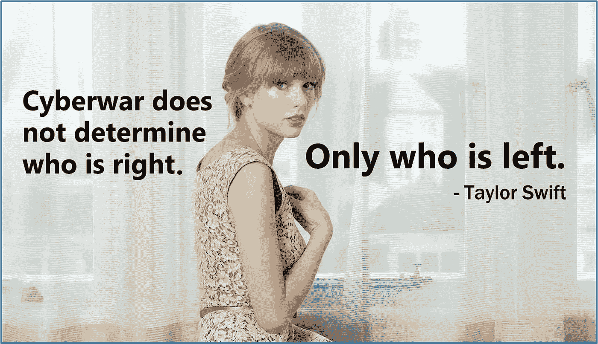

# 网络战如何影响人道主义援助

> 原文：<https://medium.com/hackernoon/how-cyber-war-affects-humanitarian-aid-e4f88b8caa6d>

Cyberwar tips from the @SwiftonSecurity Twitter account

想象一部戏剧性的机场小说，大部分通信中断，水电服务时断时续，Snapchat 和 messenger 应用程序等互联网服务无法运行。网络战一词让人联想到计算机相互攻击的画面，扰乱了现代世界。想象一下它将如何影响当前的人道主义援助行动，或者数字战争可能造成的连锁危机，还有待充分探索。国际红十字委员会(ICRC)发现了这一需求，于 2018 年 12 月 11 日至 12 日在伦敦举办了一场关于这一问题及相关主题的研讨会[数字无害会议](https://www.icrc.org/en/document/digital-technologies-exploring-threats-people-and-humanitarians-warzones)。一位受人尊敬的同事利用我的军事和网络战背景，让我加入了网络作战工作组。

一切都数字化了，包括难民营。节省时间和速度的援助，以人民和拯救生命，是的！在数字安全上花费巨大，而不是食物或医疗用品，艰难的选择。我们的团队由关键基础设施、网络战和人道主义法方面的专家组成。我们的目标是，创造一个令人信服的、可信的、简单的、简短的网络战场景，影响人道主义行动和随后的附带损害，造成新的危机。

***岩石、纸张、网络、坦克:数字武器对抗武装力量***
好消息，让你的国家进入攻击性数字安全的代价大幅降低。由于政府级攻击应用程序的可用性，他们也拥有所需的技能。没有什么比民族国家的疯狂更疯狂的了，网络已经被加入其中。耶！？😢

我们的主角，较大的内陆寓言故事与较小但技术先进的幻想世界。这两个国家之间的种族紧张关系已经酝酿了多年，当时一场边境冲突给了寓言家部落攻击幻想世界的内部支持；切断了这个国家并控制了两个炼油厂和一个港口。幻想世界通过远程访问木马(RAT)对炼油厂发起网络攻击，造成生态破坏并影响邻国。先进的农业，类似于荷兰没有电就被淘汰，出现食物短缺。戒严令、宵禁和对内部行动的严格限制开始实施。通信充其量是断断续续的，后勤，一个破碎的梦。你有一个小时的时间来想出一个初步的行动计划。

国际人道主义援助或非政府组织将如何应对全面爆发的网络战争？
我不会说谎，在一些认为自己与技术能力截然相反的参与者中，我对自己报名参加的 WTF 有一种淡淡的感觉。我们的工作组在那里促进和帮助我们各自的小组，考虑战略和影响。没有网络，有收音机。物流问题，使用当地非官方的公共交通系统来填补。货币短缺，一种本地货币，可能是加密货币，与一种国家货币挂钩，可以在短期内填补。数据，包括弱势和流离失所人口的生物特征信息，可能成为军事目标。配有政府级别的监控和设备黑客。他们准备好了吗，没有人准备在几个小时内解决这个问题。

***黑暗切线已经发话***
杰夫·莫斯，DefCon 的创始人，黑客 handle [所知的黑暗切线](https://twitter.com/thedarktangent)也是红十字国际委员会的一个工作组成员。虽然研讨会是根据查塔姆大厦的规则，莫斯先生允许我引用他的话。当人们参与进来时:“在你能补救之前不要创新”。当人类、比特和字节相交时，有一个很好的规则可以遵循。当现代数字基础设施不再可用时，旧的或替代的技术可能需要重新使用。做好事却想着坏事。附带损害会让痛苦倍增，但有计划的应急措施会让痛苦最小化。