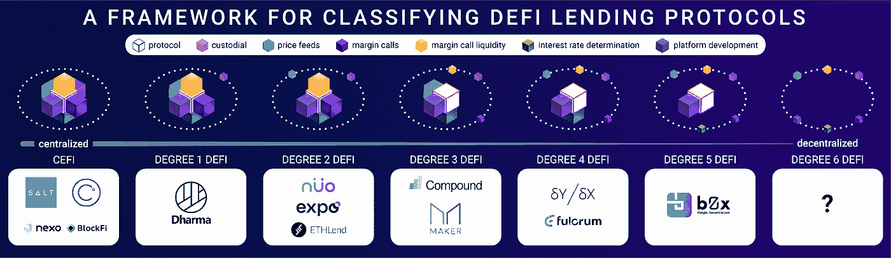
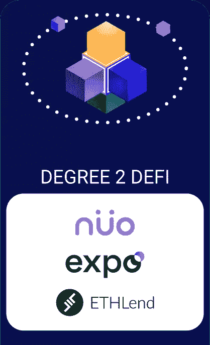
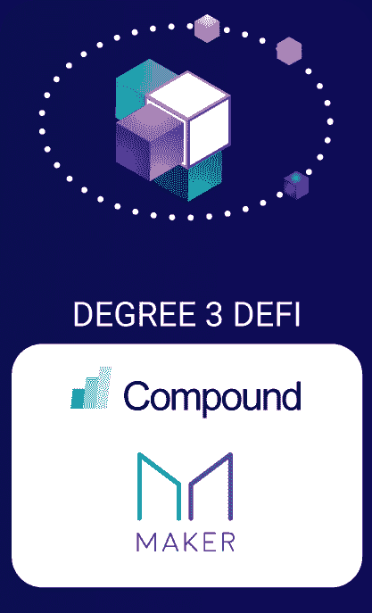
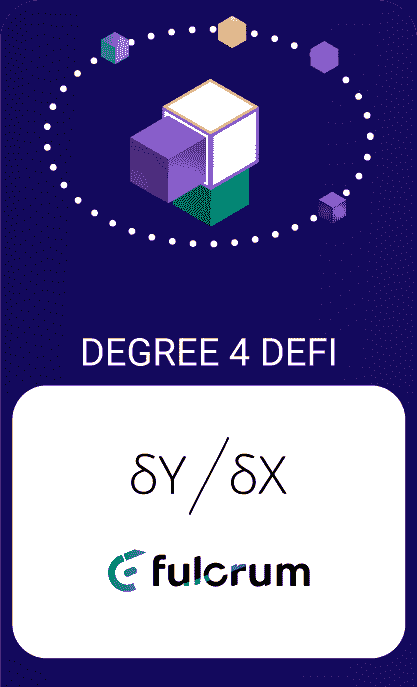
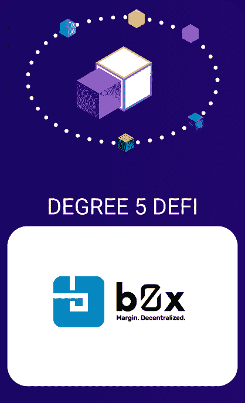
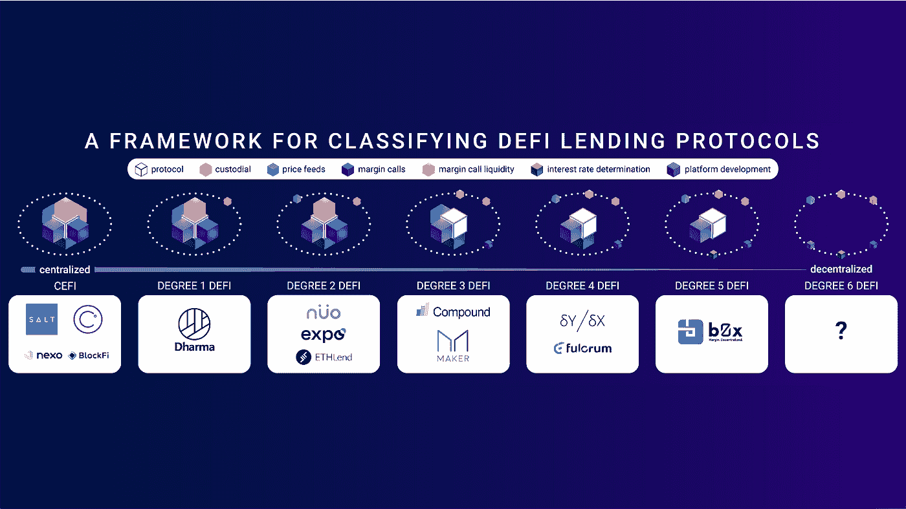

# DeFi 有多分散？贷款协议分类框架

> 原文：<https://medium.com/hackernoon/how-decentralized-is-defi-a-framework-for-classifying-lending-protocols-90981f2c007f>

*感谢达摩组织的 Brendan Forster、Compound 组织的 Robert Leshner、MakerDAO 组织的 Nik Kunkel、dYdX 组织的安东尼奥·尤利亚诺、Nuo 组织的 Varun Deshpande 和 AAVE 的 Emilio Frangella 对各自章节的贡献。*

这里介绍的是一个突出的 DeFi 贷款协议的描述和一个框架，以了解每个分散的程度。这个框架试图理解贷款协议，因为他们目前存在的实际意义上，因为他们目前正在使用。有人说，一个系统的分散程度取决于其最核心的组成部分，虽然这有一定的道理，但分散是连续存在的。本文将列举不同的 DeFi 租借协议，描述它们的功能，然后给它们在去中心化连续体中分配一个位置。

# **打破借贷协议**

所有 DeFi 贷款协议的共同组成部分包括托管、价格反馈、追加保证金通知的发起、追加保证金通知流动性的提供、利率确定和协议开发。根据这些分散的组成部分的数量，分配一个分散连续体的类别。这个分类系统虽然简单，但在捕捉协议背后的团队对资产的控制程度方面却惊人地强大。

## **类别**

**CeFi** : CeFi 产品为托管型，采用集中报价，集中发起保证金追缴，集中确定利率，集中为其保证金追缴提供流动性。示例包括 SALT、BlockFi、Nexo 和 Celsius。

**1 级 DeFi:** 这些 DeFi 产品是非托管的，但使用集中的价格反馈，集中发起保证金通知，集中提供流动性，集中确定利率，以及集中管理平台开发&更新。例子包括佛法。

**2 级 DeFi** :这些 DeFi 产品是非托管的，并有一个额外的分散组件，可能包括价格反馈、保证金通知的发起、保证金流动性、利率确定或平台开发，而其余的仍然是集中的。例子包括博览会，诺，和 ETHLend。

**3 级 DeFi** :这些 DeFi 产品为非托管产品，无需授权即可发起保证金追缴，无需授权即可提供保证金追缴流动性，同时集中管理价格馈送、集中控制利率、集中控制平台开发和更新。例子包括 Compound，MakerDAO。

**Degree 4 DeFi** :这些 DeFi 产品是非托管的，具有免许可的保证金追缴、免许可的保证金追缴流动性提供、分散的价格馈送，但集中确定利率并集中控制平台开发和更新。例子有 Fulcrum 和 dYdX。

**5 级 DeFi** :这些 DeFi 产品是非托管的，具有免许可的保证金追缴、免许可的保证金追缴流动性提供、分散的价格馈送和分散的利率确定，但是集中控制平台开发&更新。例子包括 bZx。

**6 级 DeFi** :这些 DeFi 协议中的每一个组件，包括开发，都是去中心化的。没有现成的例子，因为没有 DeFi 协议是完全分散的。

# 列举

## **达摩**

托管:达摩使用他们在达摩白皮书中描述的开源债务内核智能契约。达摩控制的地址被指定为“承保人”。债务核心智能合约将借款人的抵押品发送到抵押合约，在贷款的有效期限内，抵押合约拥有借款人资金的托管权。系统的这一方面是非拘留性的。达摩的贷款发放过程涉及合同代码是封闭的源代码。当借款人或贷款人将资产发送到提供的地址以启动达摩贷款时，接收地址包含一个与位于集中式达摩服务器上的监视器脚本交互的合同。如果 watcher 进程离线或在重定向资金时未能使用正确的天然气价格，则资产可能会被卡住，直到交易被重新提交，这目前由 Dharma 团队完成。虽然这意味着达摩用户暂时失去对资金的控制，因为他们的资产可能在智能合同系统中等待处理，但达摩团队无法窃取资金，因为他们不控制用户的私钥。在未来的某一天，达摩组织计划发布文档，允许用户根据自己的意愿处理交易。

**追缴保证金**:达摩中心监控头寸，中心发起追缴保证金，并从其个人流动性池中提供流动性。

**价格反馈**:价格由达摩估算。价格反馈在强制良好行为方面不起作用。

**利率**:达摩的利率是集中确定的，目前由平台运营商补贴，以起到亏本的作用。

**开发**:达摩核心合同和承销合同的开发由达摩自行承担。承销合同是开源的，贷款发起合同是闭源的。

注:达摩院最近透露，它计划转向马克尔道式清算机制。这将大大提高权力下放的程度。

## **诺**

**托管** *:* 诺契约从贷款来源来看是开源的非托管。

**发起保证金追缴** *:* Nuo 离线集中监控保证金头寸，并在头寸处于保证金维持状态时调用其合约。只有当价格反馈确认头寸处于保证金维持状态时，才执行清算。只有 Nuo 的白名单地址可以调用合同来启动保证金调用，这使得这成为潜在的中心故障点。

**融资融券流动性** : Nuo 从 Kyber 和 Uniswap 获取融资融券流动性，使其融资融券流动性分散。

**价格馈送**:币安、比特币基地和凯伯价格馈送的组合用于防止过早清算和价格馈送操纵。这是系统的一个集中方面。

**利率**:诺采用算法利率。尽管费率是对供求关系的反应，但 Nuo 控制着潜在的参数，并能有效地设定费率。

**开发** *:* 诺目前由团队集中开发。所有合同都是开源的。这些合同是可变的，没有时间限制。

## **世博会**

**托管**:从贷款发放的角度来看，世博会合同是开源的、非托管的。

**发起保证金追缴** : Expo 集中监控保证金头寸，并在头寸处于保证金维持状态时追缴其合约。只有 dYdX 的白名单地址可以调用合同来启动保证金调用，这是一个主要的故障点。

保证金通知流动性:当保证金通知被启动时，世博会合约启动荷兰式拍卖。目前，Expo 在荷兰拍卖期间使用 RadarRelay 和 ETH2DAI 集中提供流动性。理论上，其他各方都可以参与，但是没有一方参与，可能是因为缺乏直观的界面。

**价格反馈**:由于荷兰式拍卖的使用，不需要价格反馈，这使得该组件分散化。

**利率**:世博利率是集中确定的静态利率。

**开发**:世博会合同是集中开发和开源的。这些契约在很大程度上是不可变的，但是有许多可选择的升级，例如 ETH 包装器代理契约和其他分散的交换包装器。

## 埃瑟伦

**托管**:从贷款发放的角度来看，ETHLend 合同是封闭的来源，是非托管的。

**发起融资融券** *:* 融资融券由出借人发起。他们被阻止通过价格馈送过早地平仓。只有一方负责发起保证金通知的事实使得协议的这一方面是集中的。

融资融券流动性:贷方负责清算头寸，他们为此获得抵押品 8%的折扣。ETHLend 收取 2%的费用。融资融券流动性的来源集中于贷方。

**利率**:利率由借贷双方自由约定。协议的这一方面是分散的。

**开发** *:* 租约合同是闭源的，是部分可变的。该协议由团队集中开发。核心功能是不可变的，但辅助功能，如单笔贷款偿还，可以建立在上面。

## **复合**

**托管** *:* 从贷款发放的角度来看，复合智能合约是开源的、非托管的。

**启动保证金追缴**:保证金监控和保证金追缴启动是无许可、激励和分散的。

**融资融券流动性**:流动性的提供是无许可的、分散的、激励性的。对任何被清算的抵押品给予 5%的折扣，激励人们监控、发起和提供追加保证金通知的流动性。

**价格馈送**:复合价格馈送由复合控制的白名单地址集中并直接输入。由于存在一个敏感度参数，防止更新移动到每小时 10%的范围之外，因此减轻了化合物本身对价格馈送的操纵。

**利率**:目前利率由中央决定。在 Compound v2 中，最初将部署相同的模型，但后来将有一个 cToken DAO，允许贷款人就各自货币市场储备的利率参数进行投票。cToken DAO 方法不如订单簿方法分散，因为订单簿将整个市场的信息输入到利率中。然而，cToken DAO 方法远比单一中央方决定利率模型参数更加分散。

**开发**:复合契约是集中开发、开源的。v1 合约是不可变的，除了利率逻辑合约，而 v2 合约是可变的。v2 协议由一系列 cToken 合同组成。开始时，Compound 将对 cToken 利率和风险参数进行集中控制，但控制权将让给 cToken DAO，后者可以在 48 小时内更改合同。

## **马克尔道**

**托管**:从贷款发放的角度来看，MakerDAO 智能合约是开源的、非托管的。

**发起保证金追缴**:保证金监控和保证金追缴发起是无许可的、激励的、分散的。

**融资融券流动性**:流动性的提供是无许可的、分散的和激励性的。

**价格反馈** : MakerDAO 价格反馈是半集中式的，由 MKR 持有者投票选出的地址财团估算。财团对价格馈送的操纵通过防止更新被移动到有界范围之外的灵敏度参数来减轻。MakerDAO 价格提要应该比 Compound 的价格提要更加分散。

**利率** *:* 在马可道生态系统中被称为“稳定费”。稳定费是 CDP 持有者支付的利息。稳定费由 MKR 持有者投票决定。这是一种半分散的方法。应该注意的是，目前，由于利率决定的差异，MakerDAO 应该被认为是更分散的而不是复合的，然而这种差异是细微的。

**开发** : MakerDAO 合约集中开发，开源。这些合同是不可变的。MCD 的发布将需要迁移到新合同。

## [**支点**](http://fulcrum.trade)

**托管** *:* 支点智能合约从贷款发放的角度来看，是开源的、非托管的。

**发起保证金追缴**:保证金监控和保证金追缴发起是无许可、分散和激励的。保证金打电话者因成功执行保证金通知而获得奖金。

**融资融券流动性**:流动性的提供是无许可的、分散的、激励性的。流动性来源于 KyberSwap。

**价格馈送** : KyberSwap 的安全链上价格馈送用于分散的价格信息。Kyber 从 Uniswap、Biniance、Bitfinex、Huobi 和自己的内部库存中收集信息。在储备经理没有更新价格的情况下，Kyber 的价格保持在预先定义的范围内，减少了操纵价格的可能性。KyberSwap 价格馈送没有中心故障点。

**利率**:bZx 团队控制利率模型参数，允许有效地集中设定利率。有计划通过允许代币持有者在未来设定利率来增加这方面的权力下放。

**开发**:支点合同是集中开发和开源的。这些合同是可变的，核心功能有 28 天的时间锁定。

## **dYdX**

**托管**:从贷款发放的角度来看，dYdX 智能合约是非托管的。

**发起追加保证金通知**:追加保证金通知可以由任何人发起。清算抵押品有 5%的折扣，以激励保证金要求者。追加保证金是没有许可的。

**融资融券流动性**:任何人都可以提供融资融券流动性，使得这个功能去中心化。

**价格提要** *:* dYdX 为 ETH 和 DAI 使用 MakerDAO 价格提要，但也使用 Uniswap 和 ETH2DAI 价格提要来绑定更新价格，以减轻对提要的攻击。MakerDAO 价格馈送是半集中式的，但也不受 dYdX 控制。因此，我们认为 dYdX 价格馈送应该被认为是分散的，但不像使用 Kyber 那样分散。应该注意的是，dYdX 方法的集中化增加了攻击价格馈送的成本。

**利率** : dYdX 设置利率模型参数，对利率进行集中控制。

**开发***:*dYdX 智能合约是集中开发和封闭源代码的。该小组报告说，合同将很快在 Etherscan 上得到验证。

## [**bZx**](http://bzx.network)

**托管**:从贷款发放的角度来看，bZx 智能合约是开源的、非托管的。

**发起追加保证金通知**:任何人都可以发起追加保证金通知。这个过程是无许可的、分散的和激励的。

**融资融券流动性** *:* 任何人都可以通过 KyberNetwork 提供融资融券流动性。在不久的将来，将有办法通过 0x 或直接从呼叫者的资产中提供保证金通知流动性。

价格源 : bZx 使用 KyberSwap 的安全、分散的价格源。Kyber 从 Uniswap、币安、Bitfinex、Huobi 以及自己的内部库存中收集信息。在储备经理没有提供价格更新的情况下，Kyber 的价格保持在预定的范围内，减少了操纵价格的可能性。KyberSwap 价格馈送没有中心故障点。

**利率**:利率由市场通过指令簿决定。由于每个人都在制定利率中发挥作用，这是一个完全分散的利率决定机制。

**开发** *:* bZx 由团队集中开发，合同是开源的。这些合约是可变的，但在第一轮主要清算后，将由一个 28 天的时间锁定的多重信号来保护。

# **结论**

An easy-to-share 16:9 image of the infographic

本文通过分析所有融资融券协议共有的基本构成要素，提供了一个基于连续统的框架，对各种协议的分散化程度进行了分析。该框架成功地形式化了关于每个协议相对于彼此的位置的现有直觉。这个框架的一个缺点是它不能捕捉分散化的全部粒度；在类别中，有些项目比其他项目更分散(例如，MakerDAO 比 Compound 更分散。为了使框架易于理解和通用，避免了创建子类别。该框架的一个主要缺陷是缺乏类别权重。例如，与集中于贷方或单一第三方的追加保证金通知相比，未受影响的合同可变性是更大的集中来源。然而，该框架提供了一种建设性的方式来系统地思考保证金贷款协议的分散化连续体。

Kyle J Kistner 是 bZx 的首席视觉官，bZx 是以太坊主网上第一个分散保证金借贷协议。bZx 是一种金融原语，支持卖空、杠杆、借贷。Kyle 拥有计算和分子生物学理学硕士学位。