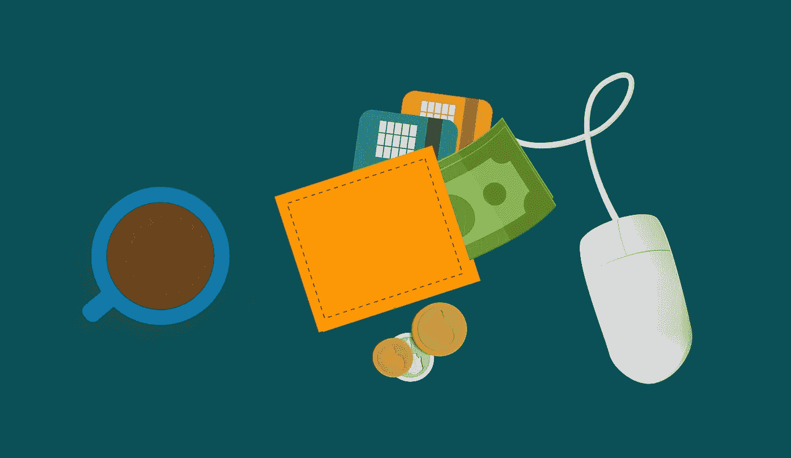
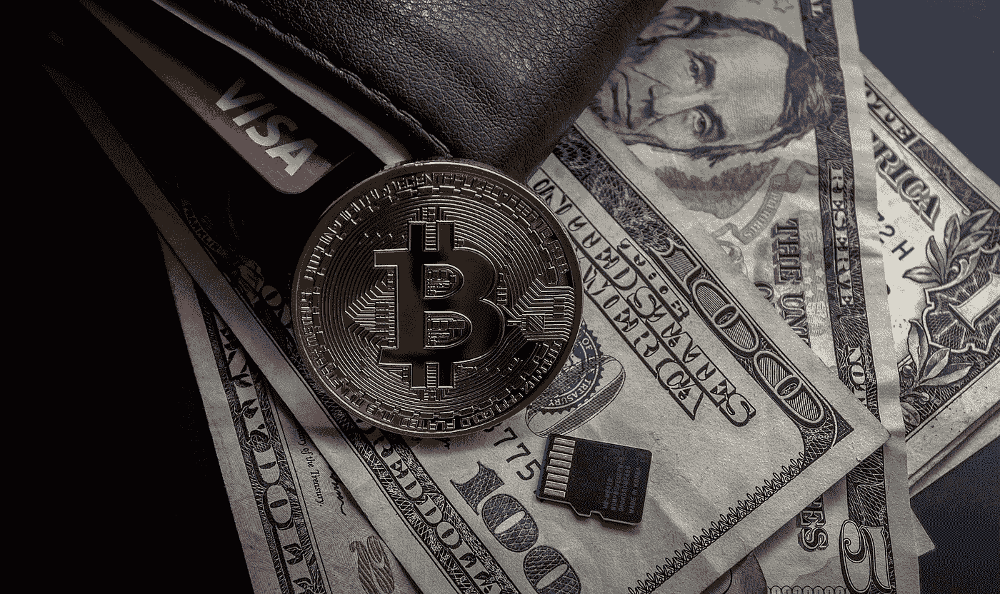

# 加密货币等数字支付如何改变我们做生意的方式

> 原文：<https://medium.com/hackernoon/how-digital-payments-like-cryptocurrencies-are-changing-the-way-we-do-business-39503d3a1bed>

## 加密货币通过省去中间人，使一个人向另一个人汇款的方式民主化。结果是一种更快、更透明、更安全的做生意方式。

Image source: Pixabay.com

现金正在成为一种过时的交易方式，这不是什么秘密。与留下可追踪记录的数字支付不同，现金可以匿名支付，这使得它可以参与各种类型的有组织犯罪或金融犯罪。除此之外，简直不方便。

出于这些原因，使用借记卡、PayPal 和其他电子转账方式已经变得很普遍。它们标志着对现金处理及其明显缺点的重大改进。尽管如此，我们正处于交易世界的另一场革命的风口浪尖。

加密货币通过省去中间人，使一个人向另一个人汇款的方式民主化。结果是一种更快、更透明、更安全的做生意方式。

**思维速度下的业务**

比尔·盖茨认为，将最新的数字技术融入商业实践是实现最大效率的关键。许多大公司，如戴尔、微软和 Dish，现在接受加密货币支付，很大程度上是因为它们可以快速发生。

大多数传统类型的数字支付，如银行转账，都需要中介机构(在这里是银行)的批准。这延迟了钱从汇款人到收款人的时间。然而，使用加密货币，交易不是由机构验证，而是由选定的用户通过透明协议验证。此外，由于规模的改进，许多加密货币可以支持大量交易，使其成为转移资金的合法方法。

Image source: Pixabay.com

**为什么权力下放很重要**

支持加密货币的区块链技术使全球支付系统现代化的另一种方式是，它提供了一种分散的转账模式。在传统的银行系统中，银行和政府成了权力的汇合点，使得货币交换系统的参与者依赖于它们的有效性和完整性。正如 2008 年金融危机所表明的那样，这种脆弱性还有许多不足之处。

然而，在区块链，不可能有像银行倒闭这样的中心失败点。相反，批准交易的责任分散在用户之间，协议为用户提供经济激励，使他们积极、公平地参与验证过程。结果是一个更有弹性的金融体系，不依赖于权力的集中。

**迈向更安全的货币**

除了允许用户避免昂贵的商户费用，加密货币还通过提供更安全的转账方法改变了全球商业惯例。区块链的透明性及其快速验证使用户可以放心汇款，而其他方法需要花费数天或数周的时间来处理。

分散的系统也意味着用户不再需要信任银行或贷方的商业行为。这为系统的基础设施提供了更大的稳定性。此外，使用加密货币可以防止中央机构出售您的私人数据，从而进一步保护您的个人信息。

有了这些优势，加密货币的使用呈指数级增长也就不足为奇了。