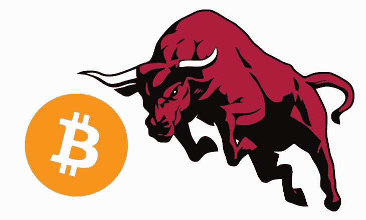

# 我如何知道牛市通常何时结束？当它在 37 天内大幅上涨时。

> 原文：<https://medium.com/hackernoon/how-do-i-know-when-a-bull-run-typically-ends-when-it-goes-up-a-lot-within-37-days-ca62707eaa38>

我经常被问到这个问题。我怎么知道牛市什么时候结束，我应该退出我所有的资金？

出于这个原因，我看了看以前的牛市，发现这是一个相当简单的规则。

让我们看一看。

1.  比特币从 11 月 15 日的 6500 美元涨到 12 月 18 日的 19800 美元，33 天内做了 3 倍。
2.  此前的牛市从 10 月 18 日的 176 美元涨到 11 月 29 日的 1132 美元，在 42 天内上涨了 8 倍。
3.  此前的牛市从 3 月 18 日的 48 美元涨到 4 月 9 日的 213 美元，在 42 天内上涨了 6 倍。
4.  此前的牛市从 4 月 26 日的 1.67 美元涨到 6 月 6 日的 30 美元，在 42 天内上涨了 18 倍。
5.  此前的牛市从 1 月 19 日的 0.31 美元涨到 2 月 14 日的 1.06 美元，在 26 天内上涨了 3 倍。

来源:[完整比特币价格历史图表+相关事件(2009–2018)](https://99bitcoins.com/price-chart-history/)

正如我们所见，所有最近的牛市都以平均 37 天内的大幅上涨结束，平均上涨了 7.6 倍。

有趣的是，价格的大幅上涨在 42 天内发生了 3 次。

**结论**

所以，下次你看到 37 天内上涨 7.6 倍时，你可以相当肯定地说，这标志着牛市的结束，你应该开始卖出。不要一次卖掉所有的东西，但此时一定要卖掉你所有密码的 20%,但多留一些以防牛市产生 10 倍的收益，然后再卖掉 20%。

然后等待，直到它达到 12 倍，再卖出 20%，然后在 15 倍时再卖出 20%，在 18 倍时再卖出 20%。然后，你应该有 20%的初始资金。

现在，就看你有多贪心了。你认为这波牛市会达到前所未有的 21x，而你仍然不会卖掉所有的东西吗？

我个人认为不会，我最迟会在 37 天内以 18 倍的价格卖掉我所有的密码。我不是一个情绪化的交易者，我坚持数字和方法论，不认为我比市场聪明(这实际上让你比市场聪明)。