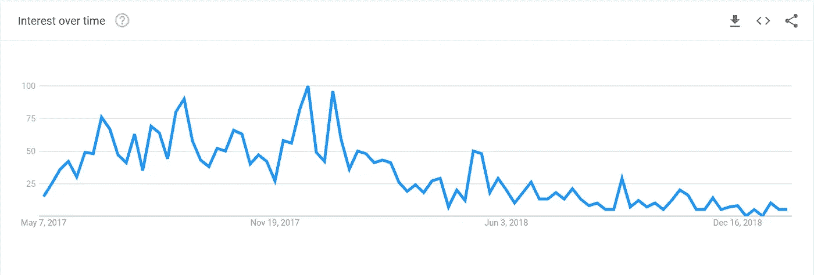
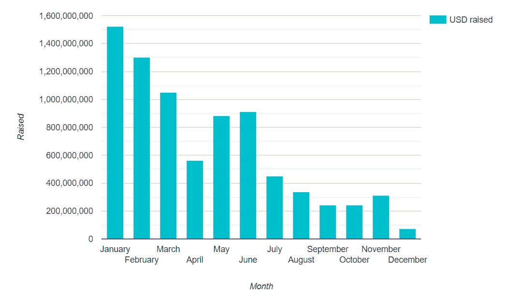

# 投资者如何看待 2019 年的 ICO/STO 市场？

> 原文：<https://medium.com/hackernoon/how-do-investors-view-the-ico-sto-market-in-2019-b8c91bd2bb26>

trends.google.com

比特币是平的，并没有像大多数分析专家预测的那样在一月份“飞向月球”。当 ICO 市场崩溃时，投资者并没有从比特币不断上涨的价格中获得天价利润..在我的 [**#10kqachallenge**](https://formula.geekforge.io/) (我采访了 10000 名不同领域的专家)之后，我询问了加密基金的创始人和经理们如何看待这个市场，我们得到了他们的答案如下。

但首先，让我们检查一些影响 ICO 和 STO 市场的统计数据和关键指标。

ICO 资金继续下降:

[https://www.icodata.io/stats/2018](https://www.icodata.io/stats/2018)

【2019 年 ICO 资助总额:$ 2040 万

**一月 ICO 资金:** $20，400，00。与 2018 年 1 月相比下降了 75 倍。

现在谈论 STO 的统计数据还为时过早，但根据 IcoBench 的数据，有超过 150 家活跃的 sto([source](https://icobench.com/icos?page=13&filterTokenClass=security&utm_source=sto_header))其中大多数只是更名后的 ico。

关于 ICO 和 STO，人们意见不一，但有一些共识:

*   ICO 与其说活着，不如说是死了。杀死它的因素是:糟糕的项目和法规
*   sto 正处于早期阶段，二级市场是这里的关键增长点。此外，大多数 STO 是更名为 ICO 的，这不是 sto 应该如何工作。

## [**蒂姆·艾普斯坎普**](https://twitter.com/TimEpskamp) **—创始合伙人**[**blockbaycapital.com**](http://blockbaycapital.com/)

> 为了回答这个问题，我将在谈到 ICO 和 STO 市场后概述一些一般原则，并做出一个简短的结论。
> 
> **将军**
> 
> 我们将我们的投资分成三个不同的部分，这三个部分源自区块链软件层(协议层、网络层和应用层)。我们看到大多数成功的 ICO 都可以归功于协议层(以太坊、NEO、EOS、Tezos)。我们确实预计 STO 公司将(天生)在应用层，因为他们试图在区块链建立一个(商业)业务。
> 
> 2019 年，我们预计(也应该有)三个层面的持续发展，最终将导致新的资金流入生态系统。生态系统的规模和发展速度将决定投资者的兴趣，我们预计 ICO 和 STO 之间的区别将在加密社区内更加明显。
> 
> **ICO**
> 
> ICO 是协议层的主要资金来源。在我们看来，成功的 ico 和有趣的区块链的共同点是，它们不依赖于一个单一的实体进行开发和融资。大多数 ico 失败(并陷入困境)的部分原因就是这种依赖性。主要区块链上正在进行的区块链开发(缩放/隐私)应该会增加新协议的准入门槛，新的附加法规导致 2019 年 ICO 机会因此减少。新项目和新协议的发布(例如 GRIN)根本不需要 ICO，也可以在没有 ICO 的情况下获得成功，因为他们能够建立一个社区(这是大多数 ICO 无法做到的，因为他们集中于应用层)。
> 
> 对于 2019 年，我们预计不会有重大的 ICO，因为 1)尽管熊市持续增长，但协议(适合作为 ICO 融资方法的协议)的进入壁垒；2)流动性枯竭(投资者意愿低)；3)由于监管加强和低回报(应该出现)的替代融资方式，如风险投资、GRIN 方法、社区融资等。
> 
> **STO**
> 
> 看看首批上市的 sto 能否在未来获得可观的回报，将是一件有趣的事情。积极的结果可能会加速 STOs 作为一种融资方法，因为这些第一批应该铺平道路。STO 作为一种融资方式可能是区块链应用层的解决方案。我们都知道目前阻止区块链应用成功大规模推出的某些限制。推出的 STO 总体上可归类为合规 ico，而非真正区块链应用的真正资金来源。因此，我们并不期待这些初始 sto 的积极结果(和回报)。我们没有看到来自加密社区之外的投资者的巨大需求，因为还没有足够的成功故事可以讲述。
> 
> 对于 2019 年，我们持负面展望，因为 1)大多数 sto 都是更名的 ICOs2)成功的 sto 应该需要能够推动区块链而不是极限的协议，最终允许杀手级应用。
> 
> **结论**
> 
> ICO/STO 市场的前景不容乐观，因为我们可以看到启动协议的其他方式(这是 ICO 的最初目的)，而 STO 市场还不够成熟。一旦区块链的应用层准备好构建，并且一旦有以前的 sto 启动，我们确实在 sto 中看到了未来的机会。风险/回报比目前只是不利。

## [**路易斯·伙计**](https://www.linkedin.com/in/lewisfellas/)**—**[**www.bletchley.com**](http://www.bletchley.com/)联合创始人兼首席投资官】

> **ICO** — 99%死亡。我从不相信那些被提出来的模型，因为它们缺乏任何评估的标准，那些暗示网络效应的模型已经被证明是错误的。我们评估了大约 550 家公司，只投资了两家！在我看来，ICO 狂热是我 19 年来在金融领域看到的最大做空，然而，没有办法做空 ICO。我相信这些项目不会有喘息之机，许多筹集到资金的人将在未来一年面临法律诉讼。
> 
> **STO** —现在还为时过早，但从我的角度来看，这些代币在发行时符合优质法律管辖区的监管规定，并真正考虑了股权经济，似乎能够实现代币经济的许多技术承诺。在保护散户投资者、股息税、证券交易印花税的征收(依管辖范围而定)以及交易所上市等问题上，仍有重大障碍需要克服。
> 
> STO 更接近我创办 Bletchley Park 时对数字资产类别的愿景。现在还为时过早，但我们正朝着正确的方向前进，不仅要放开资本市场，还要为投资者提供真正的价值主张。我应该指出，关于 ICO/公用事业令牌，我认为有几个(我指的是成千上万个令牌中的一小部分)确实代表了作为公用事业令牌的新经济模式，我们将继续关注这一群体。

## [**阿里安娜·辛普森**](https://twitter.com/AriannaSimpson)**—VC&MD @**[**自主合伙人**](http://autonomous.partners)

> 自 2017 年和 2018 年初以来，ICO 市场大幅下降。许多投资者(尤其是散户投资者)遭受了损失，不愿再投资。鉴于我们在整个市场目睹的价格大幅下跌，项目正在避免进行 ico，而选择股权融资或私人代币销售(这些也有所减少，但程度较低)。我认为 2019 年 ICO 市场将保持弱势。
> 
> 就 sto 而言，我的感觉是前景比 ico 稍好，但这里的兴趣也有所减弱。机构投资者仍习惯于将资产所有权令牌化的想法，我的感觉是，尽管我们最终会看到这将成为一个大市场。然而，今年不太可能发生。

## ****—**[**2030 . io**](https://2030.io/)联合创始人兼 CEO】**

> **我觉得我们不会用公开的 ico 来融资。也许是为了分发令牌或以固定价格出售现有系统的令牌，但我们所知的 ico 实际上被监管机构扼杀了，这太糟糕了。许多好项目都无缘无故地失败了。为了保护投资者，美国证券交易委员会尤其是弊大于利。**
> 
> **股票发行将一如既往地继续，无论是在纸面上还是通过代币，使用与以前相同的法规。记号化只是一种使过程的机制更便宜和更好的方法。最终，令牌化将增加流动性，但我们还需要 5-10 年才能实现这些好处。**

## **[**布鲁斯·芬顿**](https://twitter.com/brucefenton)**——大西洋金融公司首席执行官、**[**brucefenton.com**](http://brucefenton.com/)链石实验室创始人**

> **我们认为 2017 年和 2018 年的 ICO 模型有缺陷，不会重现。有很多炒作，这导致了没有可靠前景或条款的项目融资。从监管的角度来看，很多都是有问题的。**
> 
> **数字证券/安全令牌有很大的潜力。他们可以在现有的大型监管结构中与 crypto 一起工作。**
> 
> **2019 年，数字证券领域有数十项重大和受资助的计划。许多主要的加密和传统公司也在此基础上构建。看起来会很有趣。**

## **[**扬·布热泽克**](https://twitter.com/JanBrzezek)**—**[**加密基金股份公司**](http://cryptofundag.ch/) **的首席执行官和** [**加密金融集团**](http://cryptofinance.ch/) 的联合创始人**

> **越来越多的专业人士进入加密市场，这意味着只有具有令人信服的商业案例和令人信服的故事的 ico 才能在未来取得成功。我们对 STO 最近投资机会的预期得到了积极的回应，但这不太可能很快大规模发生，原因有二:银行等传统参与者尚未准备好令牌化，新的金融科技参与者尚未获得发行安全令牌的许可。此外，最近的 ico 和新的投资产品和服务(无论是基金还是对加密资产的直接投资)的回报越来越少，变得越来越有吸引力，消除了一些领域的风险。**

## **[**卢卡·博古**](https://twitter.com/LukaGubo) **—首席执行官**[**blocktrade.com**](http://www.blocktrade.com/)**

> **我认为 STO 市场将在 2019 年大幅增长。2018 年，我们看到了一些产品，大多是小规模的，而 2019 年将为我们带来 sto 数量的大幅增加，其中一些将非常大。
> 
> 目前，主要的瓶颈是证券代币的流动性，因为没有拥有足够机构会员的二级市场，但随着机构资金开始越来越多地投资于证券代币，这种情况也将在未来两年发生变化。**