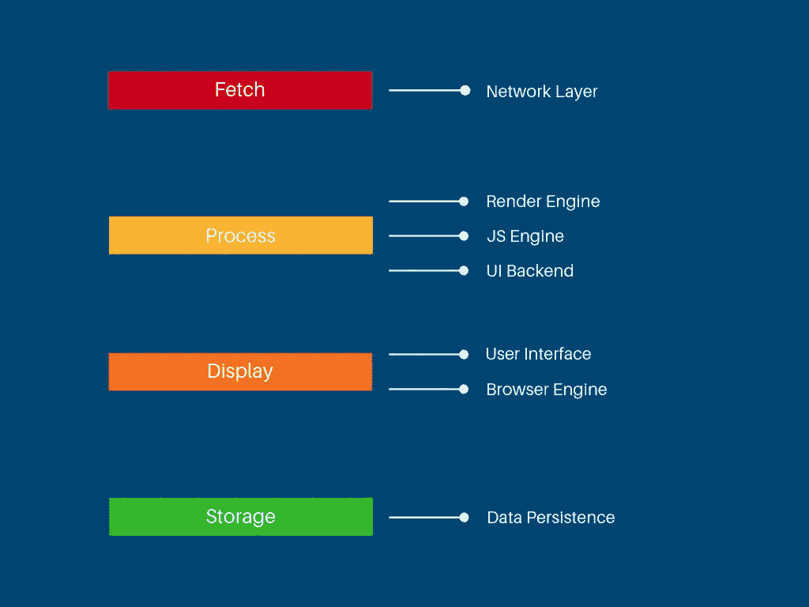
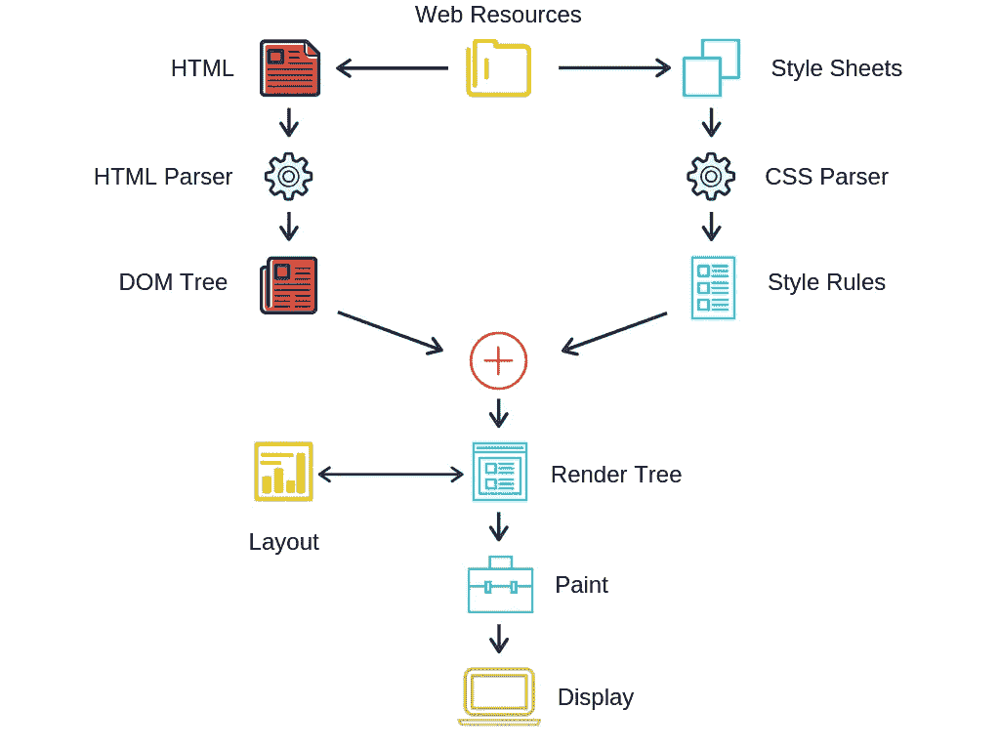
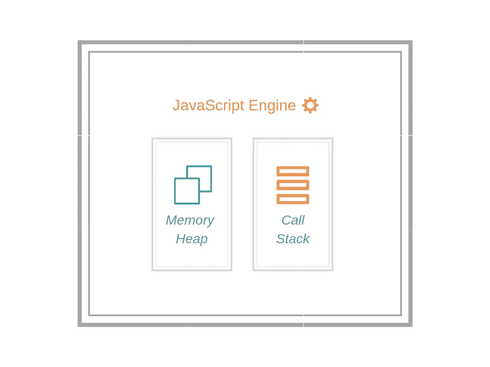

# 网络浏览器是如何工作的？

> 原文：<https://medium.com/hackernoon/how-do-web-browsers-work-40cefd2cb1e1>

Photo by [Chang Duong](https://unsplash.com/@chang612?utm_source=medium&utm_medium=referral) on [Unsplash](https://unsplash.com?utm_source=medium&utm_medium=referral)

> “如果你不了解你生意的细节，你将会失败。”——杰夫·贝索斯

今天，很难想象一个没有互联网的世界。

网络浏览器是我们体验互联网的核心。每天，数百万人通过浏览器访问网站。五大浏览器——Chrome、Firefox、Internet Explorer、Safari 和 Opera——占据了 95%的网络流量。

web 浏览器的主要作用是通过地址栏接受 web URL，获取资源，并将它们显示在屏幕上。

浏览器功能可以分为四个主要部分，包括:

*   **取货**
*   **流程**
*   **显示**
*   **存储**

每个类别定义了浏览器必须执行的一组职责，由子系统组成。

# 取得

称为*网络层*的主要子系统在通过互联网从后续 web 服务器获取数据中起着至关重要的作用。

## 网络层

接受来自浏览器用户界面的 URL，并负责通过 HTTP/FTP 协议进行网络调用以获取资源。

当数据变得可用时，它将数据馈送到称为*渲染引擎*的处理子系统，并且通常以字节大小来完成以提高性能。

如果请求的网站实现了缓存，则在应用缓存或[服务工作者](/@arunsena.bojja/4-simple-steps-to-get-your-website-working-offline-using-service-workers-4ff427aff88f)中制作数据的副本，以供下次使用。高速缓存因其快速的响应时间和节省定期访问的网络请求而大受欢迎。

浏览器最初会在本地内存中查找所请求 URL 的缓存可用性。否则，网络层创建一个带有域名的 HTTP 数据包，用于通过互联网请求 web 资源。

网络层在用户体验中起着重要作用。这可能成为 web 性能的瓶颈，因为浏览器需要等待远程数据/内容的到达。可以使用各种技术来减少对用户体验的影响。

# 过程

这一步包括接受来自网络层的数据，并提供给显示子系统。*渲染引擎、JS 引擎*和 *UI 后端*子系统是流程的一部分。

## 渲染引擎

WebKit Main Flow

渲染引擎子系统处理来自网络层的数据，并在屏幕上显示 web 内容。

默认情况下，它可以处理 HTML、XML 和图像文件。然而，它可以通过扩展来适应各种数据类型。

许多渲染引擎都是可用的，并且通常是用 C++编写的。例子包括:

*   Chrome 和 Opera 都用 Blink
*   火狐用壁虎
*   Internet Explorer 使用三叉戟
*   Edge 使用 EdgeHTML
*   Safari 使用 WebKit

使用渲染引擎，可以解析 web 资源。例如，HTML 解析器将 HTML 模板转换成一个名为 DOM 树的对象。

样式表被解析以生成外部和内联样式元素的样式规则。

渲染树是一个结合了解析的 HTML 和 CSS 的对象。它由可视指令和属性生成，用于在用户屏幕上呈现元素。

一旦构建了渲染树，它将经历布局和绘制过程，并在屏幕上显示输出。

布局过程包括计算尺寸和每个元素应该出现在视口中的确切坐标。

绘画过程包括用颜色、背景和其他 CSS 属性等样式属性填充布局。

渲染引擎分块处理数据，并尽快显示内容。它不会等到整个文档内容经历了布局和绘制过程。

## JavaScript 引擎

这是用于将 JavaScript 代码解析为机器代码，然后执行它的子系统。这些 JS 引擎可以是标准解释器或 JIT 编译器。

最受欢迎的引擎之一是谷歌 V8 引擎。是用 C++写的。以下是不同浏览器使用的一些示例:

*   Chrome 采用[Chrome V8](https://en.wikipedia.org/wiki/Chrome_V8)
*   Safari 使用 [JavaScriptCore](https://en.wikipedia.org/wiki/WebKit#JavaScriptCore)
*   火狐使用[蜘蛛猴](https://en.wikipedia.org/wiki/SpiderMonkey)
*   边缘使用[脉轮](https://en.wikipedia.org/wiki/Chakra_(JavaScript_engine))
*   Internet Explorer 使用[脉轮](https://en.wikipedia.org/wiki/Chakra_%28JScript_engine%29)(jscript)

JavaScript Engine

这些引擎包括两个组件:内存堆和调用堆栈。

内存堆是为变量、函数和其他 JS 元素分配内存的地方。

调用堆栈只是堆栈帧的队列或浏览器执行的连续步骤。

JavaScript 是一个单线程进程，每个条目或执行步骤都是一个堆栈帧。

这些引擎内部有几个线程来执行各种任务。此类任务的示例包括:

*   获取、编译和执行代码
*   分析函数及其时间消耗的分析线程
*   优化执行流程
*   垃圾收集者

Google 的 V8 引擎使用一种标记和清除的方法来以增量的方式执行垃圾收集。这利用了浏览器的空闲时间，提高了性能。

截至 5.9 版本(2017 年初)，点火和涡轮风扇是 V8 发动机中最新的管道。

[NodeJS](https://nodejs.org/en/) 是一个基于谷歌开源 V8 引擎构建的服务器端 JavaScript 运行时。它用于在服务器端执行 JavaScript。

# 显示

顾名思义，这与向用户呈现数据有关。*用户界面*和*浏览器引擎*负责数据呈现和处理用户导航。

## 用户界面

浏览器的视觉外观通常包括接受 web URLs 的地址栏和导航按钮，如后退、前进、刷新、主页和书签栏。

除了这些输入和动作按钮，我们还有 viewport(屏幕的主要部分)来显示从网站获取的内容。

用户界面(UI)与浏览器中的其他子系统通信，以显示内容并相应地采取行动。

对于界面的外观和感觉没有特定的标准。相反，随着浏览器多年来的发展，浏览器供应商已经改进了用户界面。

## 浏览器引擎

浏览器引擎是一个可嵌入的子系统，为渲染引擎提供高级接口。

它加载一个给定的 URL，并支持基本的浏览操作，如向前、向后和重新加载。

它还提供了查看浏览会话各个方面的钩子。例如，查看当前页面加载进度和 JavaScript 警告。

浏览器引擎还允许查询和操作渲染引擎设置。

# 储存；储备

Web 浏览器具有少量的存储容量，以便在浏览器上执行一些动作、缓存数据和存储数据，从而执行 kicks 和其他浏览器功能。

## 数据存储

数据持久性是通过各种浏览器 API 实现的。其中一些包括:

*   局部存储器
*   会话存储
*   饼干
*   WebSQL
*   索引 b
*   文件系统
*   AppCache
*   服务人员

本地存储和会话存储是可以在浏览器中存储任何 JS 对象和函数的键值对。

只要网站会话处于活动状态，会话存储就会将数据保存在浏览器上。本地存储是浏览器上的内存。它保存数据，直到被用户或 JavaScript 代码明确清除或更改。

这些会话和本地 web 存储限制是每个对象 5MB，每个系统 50MB。

Cookies 是存储在浏览器内存中的密钥对数据的集合。它们在客户机和服务器之间来回发送。

这些是昂贵的，并且是数据持久化方法中性能最差的。然而，当涉及到隐私和安全时，它们非常有用。

WebSQL、IndexedDB 和 FileSystem 能够根据大小、性能和需要在浏览器上存储数据。

HTML5 中引入了 App Cache。它存储网站静态内容，并在网络停机期间提供 UI 内容。

服务人员是谷歌缓存网站数据以供离线使用的新方式。与应用程序缓存相比，它具有显著的特性。你可以在这里阅读更多关于服务人员的信息。

# 回顾和参考

好吧，我们现在快速回顾一下。所有主要的网络浏览器都包含子系统，以及其他有助于该过程的子模块。

这些系统包括从接受网络 URL 到在屏幕上显示网络内容。它们进行网络调用、获取资源、解析 HTML、CSS 和 JavaScript 文件来创建要在屏幕上呈现的对象。所有这些结合起来为用户创造了一个美妙的网站。

您可以在以下链接的资源中了解更多信息:

*   [浏览器如何工作:现代网络浏览器的幕后——html 5 摇滚](https://www.html5rocks.com/en/tutorials/internals/howbrowserswork/)
*   【JavaScript 如何工作:引擎、运行时和调用栈概述
*   [浏览器数据持久化](/comparethemarket/browser-data-persistence-cb57d3b3a527)
*   [浏览器架构](http://citeseerx.ist.psu.edu/viewdoc/download?doi=10.1.1.60.1151&rep=rep1&type=pdf)—作者艾伦·格罗斯库斯和迈克尔·w·戈弗雷

感谢您的阅读👍