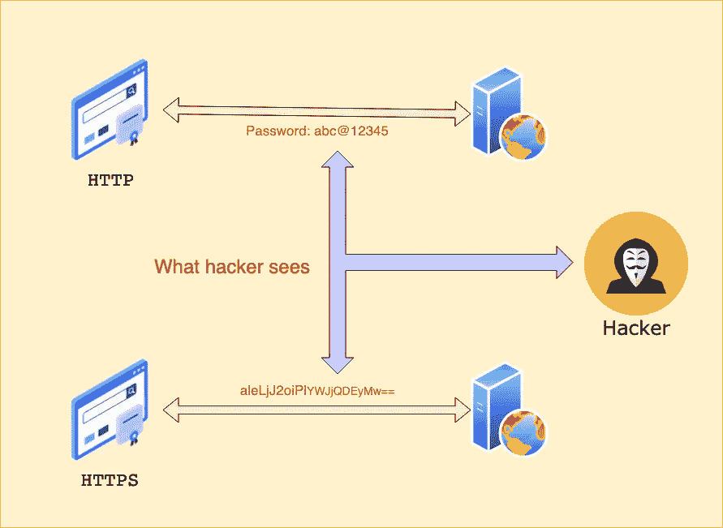
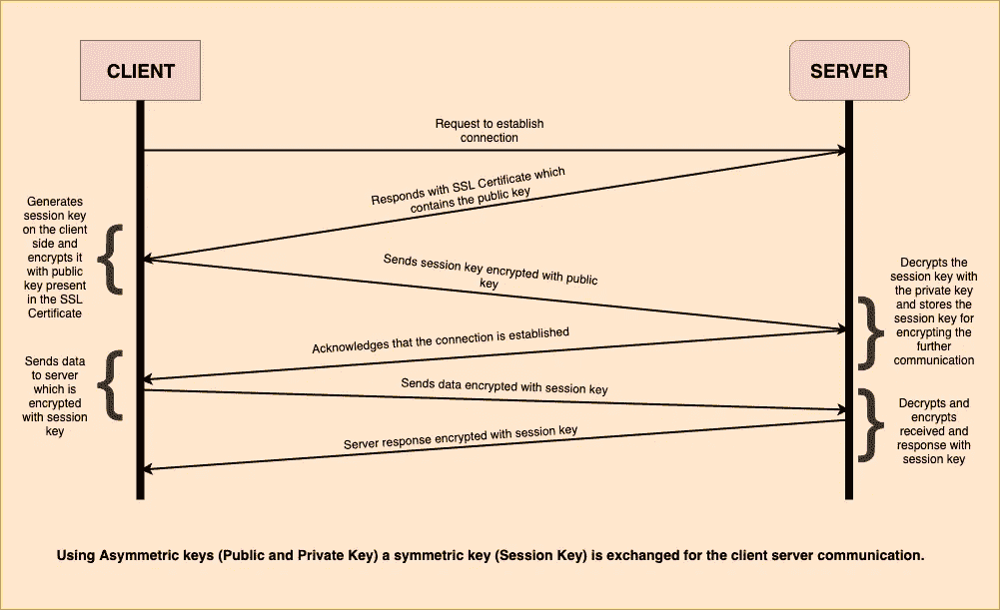

# SSL/TLS 如何确保 HTTPS 的安全？

> 原文：<https://medium.com/hackernoon/how-does-ssl-tls-make-https-secure-d247bd4e4cae>

Photo by [Markus Spiske](https://unsplash.com/@markusspiske?utm_source=medium&utm_medium=referral) on [Unsplash](https://unsplash.com?utm_source=medium&utm_medium=referral)

HTTPS 代表超文本传输协议安全，是 HTTP 的安全版本。它是用于在 web 浏览器和网站之间交换数据的主要协议。由于 HTTPS 是安全版本，它在 HTTP 中增加了加密，以增加交换数据的安全性。

让我们更深入地了解网络上的数据到底是如何得到保护的。

# HTTP 概述

HTTP 是万维网使用的底层协议，该协议定义了如何格式化和传输消息，以及 Web 服务器和浏览器应该采取什么动作来响应或请求各种命令。

例如，当您在浏览器中输入一个 URL 时，实际上会向 Web 服务器发送一个 HTTP 命令，指示它获取并传输所请求的网页。

HTTP 也是一种无状态协议，因为每个命令都是独立执行的，不知道之前的命令是什么。

作为一种请求-响应协议，HTTP 通过在客户机和服务器之间传输超文本消息，为用户提供了一种与 web 资源(如 HTML 文件)进行交互的方式。HTTP 客户端通常使用传输控制协议(TCP)连接与服务器通信。

HTTP 利用特定的请求方法来执行各种任务:

*   `GET`:请求指定资源的表示。使用此方法的请求应该只检索数据。
*   `HEAD`:请求与`GET`请求相同的响应，但是没有响应体。
*   `POST`:该方法用于将实体提交给指定的资源，通常会导致状态的改变或者对服务器产生副作用。
*   `PUT`:该方法用请求负载替换目标资源的所有当前表示。
*   `DELETE`:该方法删除指定的资源。
*   `TRACE`:该方法沿着到目标资源的路径执行消息环回测试。
*   `OPTIONS`:该方法用于描述目标资源的通信选项。
*   `CONNECT`:这个方法建立一个到目标资源所标识的服务器的隧道。
*   `PATCH`:该方法用于对资源进行部分修改。

## HTTP 和 HTTPS 有什么区别？

这两个协议之间最重要的区别是 SSL 证书。事实上，HTTPS 基本上是一个具有额外安全性的 HTTP 协议。然而，这种额外的安全性可能是极其重要的，尤其是对于那些从用户那里获取敏感数据(如信用卡信息和密码)的网站。

那么 HTTPS 是如何工作的呢？SSL 证书对用户提供给网站的信息进行加密，基本上是将数据转换成代码。即使有人设法窃取了发送方和接收方之间的通信数据，由于这种加密，他们也无法理解这些数据。

但是除了增加额外的安全层，HTTPS 还通过 TLS(传输层安全)协议得到保护。TLS 有助于提供数据完整性和身份验证，前者有助于防止数据传输被修改或损坏，后者向您的用户证明他们正在与目标网站进行通信。

用户可以通过网址识别一个站点是否使用 HTTPS 协议。网址的第一部分(在“www”之前)表示该站点使用的是 HTTP 协议还是 HTTPS 协议。

# SSL/TLS 如何让它变得安全？

SSL/TLS 协议最重要的部分之一是 SSL/TLS 握手。握手是建立每个连接的地方。

TLS 握手包括三个步骤:

1.  设置密码套件。
2.  认证服务器和客户端。
3.  交换对称会话密钥。

让我们更深入地了解这些步骤。

## 设置密码套件

网络浏览器是最常见的客户端。同样，在服务器端，流行的操作系统如 Windows Server、Apache 和 NGINX 都有非常不同的特性支持。当您添加定制配置时，这一切变得更加复杂。因此，TLS 握手的第一步要求客户端和服务器共享它们的功能，以便它们可以找到它们相互支持的加密功能。

一旦客户机和服务器就它们将使用的确切加密方法达成一致。这被称为密码套件，然后服务器向客户端发送其 SSL 证书。

## 认证服务器和客户端

客户端检查以确保证书是“真实的”这是极其重要的一步。要真正拥有安全的连接，你不能只是加密你的数据，你还需要知道它被发送到正确的网站/组织。SSL/TLS 证书提供了这种身份验证。但是他们做的方式取决于所使用的密码套件。

所有受信任的 SSL 证书都是由证书颁发机构(CA)颁发的，CA 是一家已被批准颁发数字证书的公司。这些组织必须遵循严格的颁发和验证准则，以便他们颁发的证书继续受到信任。这主要是为了确保您只能获得您真正拥有的网站或公司的证书。在这种情况下，您可以认为 CA 有点像公证人，它的签名表示证书上的实体就是它所说的那个实体。

在 TLS 握手的身份验证部分，客户端执行几项加密安全检查，以确保服务器提供的证书是可信的。这包括检查数字签名并确保证书来自受信任的 CA。

在此阶段，客户端还会验证服务器是否拥有与证书相关联的私钥。服务器通过 SSL 证书发送公钥。公钥用于加密数据，私钥用于解密。这被称为“非对称”公钥加密，因为这两种功能是由不同的密钥执行的。加密实际上是单向的。

使用最常见的公钥密码系统 RSA，客户端将使用生成会话密钥所需的公钥来加密随机数据。服务器只有在拥有私钥的情况下才能够解密和使用该数据，私钥提供了所有权的证明。

## 交换对称会话密钥

TLS 握手的最后一部分包括创建“会话密钥”，这是实际用于安全通信的密钥。

会话密钥是“对称的”，这意味着加密和解密使用相同的密钥。这些密钥可以比非对称密钥更有效地实现强加密，这使它们适合在 HTTPS 连接中来回发送数据。

生成密钥的确切方法因所选的密码套件而异，最常见的两种方案是 RSA 和 Diffie-Hellman。

为了结束握手，每一方让另一方知道他们已经完成了所有必要的工作，然后双方运行校验和以确保握手没有任何恶意篡改或破坏。

整个 SSL 握手发生在几百毫秒内，并且都是在幕后进行的。这是 HTTPS 连接中必须发生的第一件事，甚至在网页加载之前。

SSL 握手完成后，加密和认证的 HTTPS 连接开始，您和服务器之间发送和接收的所有数据都使用会话密钥进行保护。

SSL/TLS 握手是一个迷人的过程，对于安全的互联网来说至关重要，然而它在幕后快速而安静地发生，大多数人对此从不多想。

希望对你有帮助。
感谢阅读。

## 参考链接:

[https://www.webopedia.com/TERM/H/HTTP.html](https://www.webopedia.com/TERM/H/HTTP.html)

 [## HTTP 请求方法

### HTTP 定义了一组请求方法来指示对给定资源要执行的操作。虽然…

developer.mozilla.org](https://developer.mozilla.org/en-US/docs/Web/HTTP/Methods) 

[https://www.thesslstore.com/blog/explaining-ssl-handshake/](https://www.thesslstore.com/blog/explaining-ssl-handshake/)