# Tor 实际上是如何工作的？

> 原文：<https://medium.com/hackernoon/how-does-tor-really-work-5909b9bd232c>

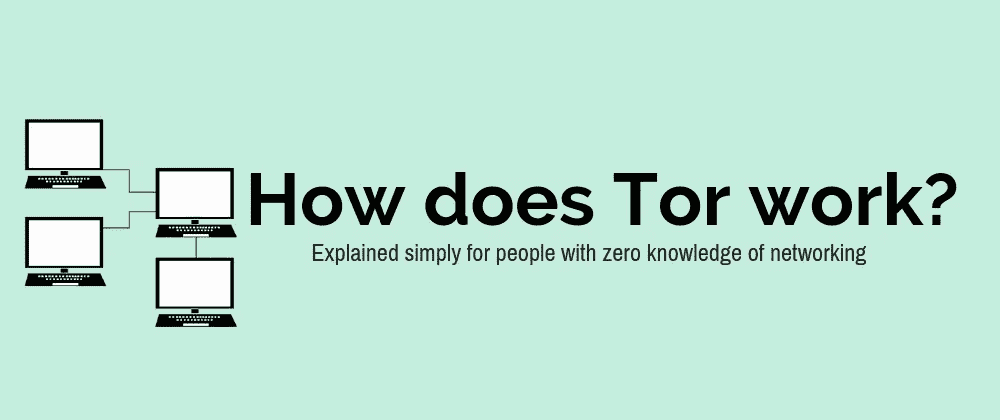

美国海军研究实验室开发了洋葱路由协议(T0r ),用于规划美国在线情报通信。具有讽刺意味的是，Tor 已经被每个人广泛使用——甚至是那些美国海军与之对抗的组织。

你可能知道 Tor 是网上非法活动的故乡，一个你可以买到任何你想要的毒品的地方，一个做所有非法事情的地方。Tor 比媒体描述的要大得多。根据国王学院的说法，Tor 的大部分是合法的。

本文并不讨论 Tor 上有什么，或者如何访问 Tor。这篇文章给出了技术如何工作的技术概要，没有猜测也没有夸大 Tor 是什么。

Tor 的核心原理是*洋葱路由*，这是一种通过公共网络进行匿名&安全通信的技术。在 onion 中，路由消息封装在几个加密层中。

洋葱有多层结构，通过 Tor 传递的信息也是如此。Tor 中的每一层都是加密，你是在给 Tor 消息增加加密层，而不是仅仅增加一层加密。

这就是为什么它被称为洋葱路由协议，因为它在每个阶段都增加了层。

产生的洋葱(完全封装的消息)然后通过网络中的一系列计算机(称为洋葱路由器)传输，每台计算机剥去一层“洋葱”。每一层都包含下一个目的地，即数据包必须到达的下一个路由器。当最后一层解密后，你得到的是明文(非加密消息)。

原作者保持匿名，因为网络中的每个节点只知道路径中的前一个和后一个节点(除了知道发送者是谁但不知道最终目的地的第一个节点)。

这导致了一些攻击，拥有大量资源的大型组织运行服务器，试图成为网络中的第一个和最后一个节点。如果组织的服务器是第一个节点，它就知道是谁发送了消息。如果组织服务器是最后一个节点，它知道最终目的地和消息内容。

现在我们对 Tor 有了一个基本的概述，让我们开始探索 Tor 的每个部分是如何工作的。

# 概观

> 洋葱路由是一种分布式覆盖网络，旨在匿名化基于 TCP 的应用程序，如网页浏览、安全外壳和即时消息。

客户端*选择*一条通过网络的路径，并建立一条*电路*，其中路径中的每个洋葱路由器都知道前任和继任者，但不知道电路中的其他节点。

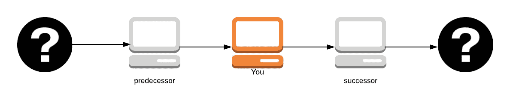

原作者(最左边的问号)保持匿名，除非你是节点中的第一条路径，因为你知道是谁给你发送了数据包。

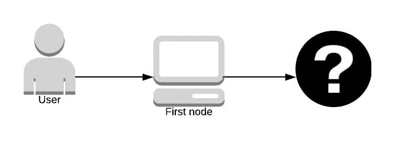

在数据到达路径中的最后一个节点之前，没有人知道正在发送什么数据；谁知道数据却不知道是谁发的。路径中的倒数第二个节点不知道数据是什么，只有路径中的最后一个节点知道。

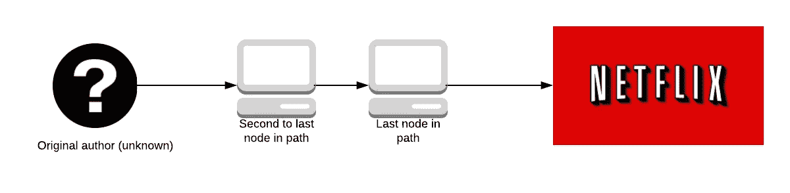

这导致了攻击，拥有大量资源的大型组织创建 Tor 服务器，旨在成为路径中的第一个和最后一个洋葱路由器。如果组织能够做到这一点，他们就会知道谁发送了数据，发送了什么数据，从而有效地打破了 Tor。

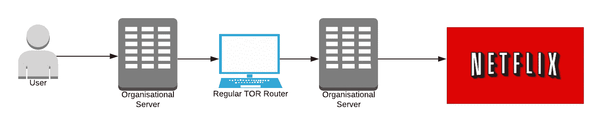

Oh no! Now large organisation knows you watch Netflix 🍿

要做到这一点，不靠近组织服务器的位置是非常困难的，我们将在后面进一步探讨。

在整篇文章中，我将把网飞作为正常服务(Bob)，把亚马逊 Prime Video 作为对手(Eve)。在现实世界中，这种情况不太可能发生。我在这里不是要推测什么组织可能想要攻击 Tor，所以我用了两个不太可能的例子来避免它的政治方面。

每个数据包以固定大小的*单元*在网络中传输。这些小区必须大小相同，这样通过 Tor 网络的数据看起来就不会太大。

这些信元在每台路由器上被一个对称密钥解开，然后沿路径进一步转发。让我们进入 Tor 本身。

# Tor 本身

> *人多力量大*

Tor 需要大量用户来创建匿名，如果 Tor 很难使用，新用户不会这么快采用它。因为新用户不会采用它，Tor 变得不那么匿名了。通过这个推理，很容易看出可用性不仅仅是 Tor 的设计选择，也是使 Tor 更加安全的*安全需求*。

如果 Tor 不可用或者设计得不好，就不会有很多人使用它。如果没多少人用，那就没那么匿名了。

Tor 不得不做出一些设计选择，这些选择可能不会提高安全性，但会提高可用性，并希望可用性的提高就是安全性的提高。

# 什么 Tor 不是

Tor 并不像许多人认为的那样是一个完全去中心化的点对点系统。如果它完全是点对点的，它就不会非常有用。Tor 需要一组目录服务器来管理和保持网络在任何给定时间的状态。

Tor 无法抵御端到端攻击。如前所述，端到端攻击是指一个实体同时控制路径中的第一个和最后一个节点。这是网络安全专家尚未解决的问题，所以 Tor 没有解决这个问题的方案。

Tor 不会隐藏发送者的身份。

2013 年，在哈佛大学期末考试期间，一名学生试图通过发送虚假的炸弹威胁来推迟考试。该学生使用 Tor 和游击邮件(一种允许人们创建一次性电子邮件地址的服务)向学校官员发送炸弹威胁。

这名学生被抓住了，尽管他采取了预防措施以确保自己不被抓住。

Gurillar mail 会在发送电子邮件的同时发送一个原始 IP 地址头，这样收件人就知道原始电子邮件来自哪里。对于 Tor，该学生预计 IP 地址会被加密，但当局知道它来自 Tor 出口节点(Tor 在目录服务中保存了所有节点的列表)，因此当局只需查找在电子邮件发送时正在访问 Tor(在大学内)的人。

Tor 不是一项匿名服务，但它可以加密从 A 到 B 的所有流量(只要不进行端到端攻击)。Tor 的速度也慢得令人难以置信，因此将其用于网飞并不是一个好的用例。

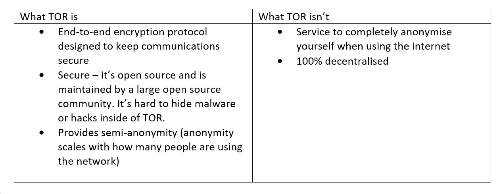

现在我们已经很好地掌握了 Tor 是什么，让我们来探索一下*洋葱路由*。

# 洋葱路由

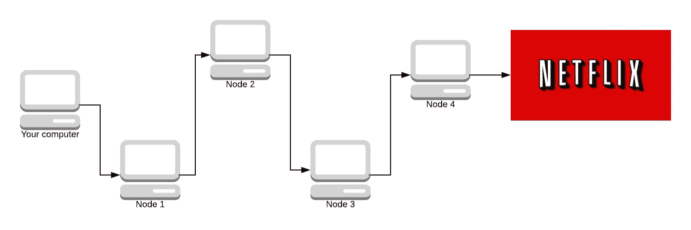

给定上面的网络，我们将模拟 Tor 做什么。你的电脑是最左边的那台，你正在发送一个在网飞上观看*陌生人事件*的请求(因为 Tor 还有别的用途吗😉).这条节点路径被称为*回路。*稍后，我们将研究电路是如何构成的，以及加密是如何工作的。但是现在我们试图概括 Tor 是如何工作的。

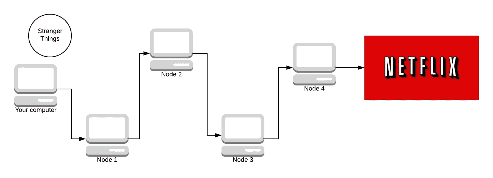

我们从消息开始(我们还没有发送它)。我们需要将消息加密 N 次(其中 N 是路径中有多少个节点)。我们用 AES，一种对称密钥加密系统加密它。使用 Diffie-Hellman 协商密钥。别担心，我们以后再讨论这些。路径中有 4 个节点(减去你的计算机和网飞),所以我们将消息加密 4 次。

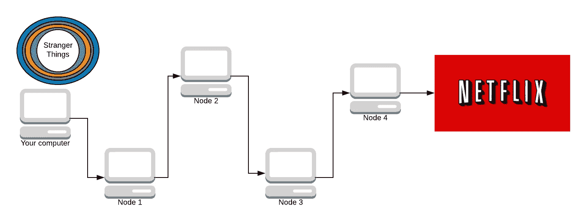

我们的包装(洋葱)有 4 层。蓝色、紫色、橙色和蓝绿色。每种颜色代表一层加密。

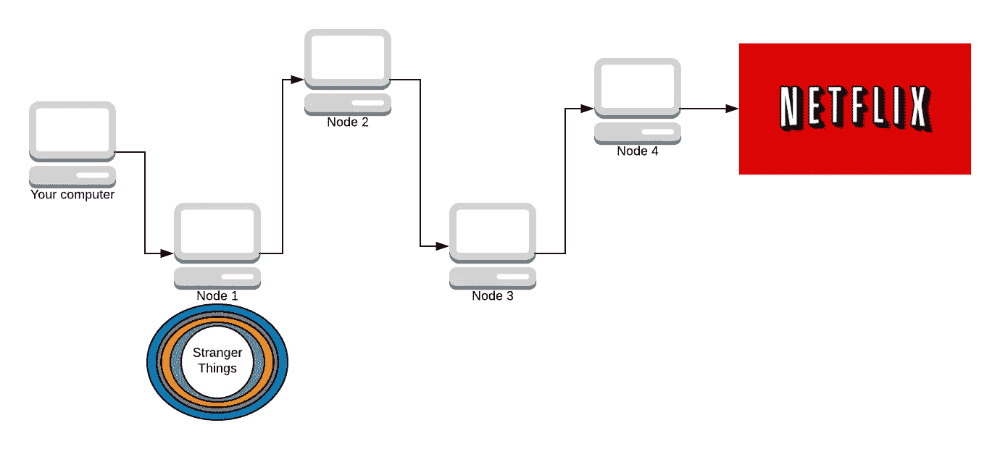

我们将洋葱发送到路径中的第一个节点。然后，该节点删除第一层加密。

路径中的每个节点都知道解密其层的密钥是什么(通过 [Diffie-Hellman](https://skerritt.blog/diffie-hellman-merkle/) )。节点 1 用它们的对称密钥(你们双方都同意的)删除蓝色层。


节点 1 知道你发送了消息，但是消息仍然被 3 层加密所加密，它不知道消息是什么。

当它沿着路径行进时，越来越多的层被剥离。下一个节点不知道是谁发送了数据包。它只知道节点 1 向它们发送了数据包，并且该数据包将被传送到节点 3。

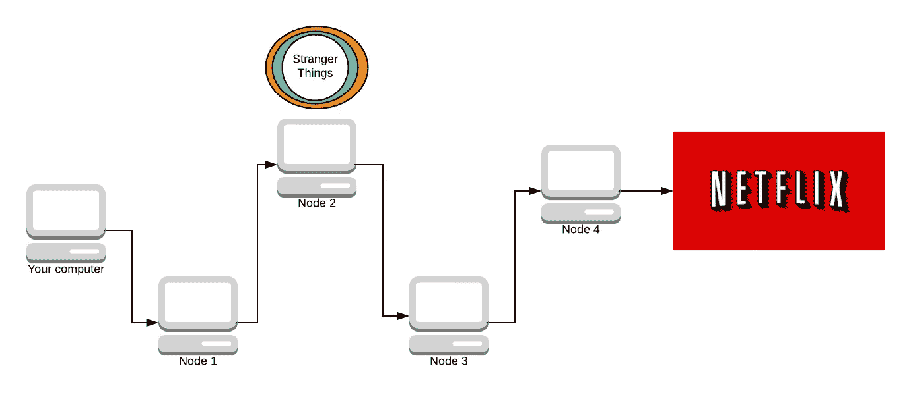

现在节点 3 剥离了一层。

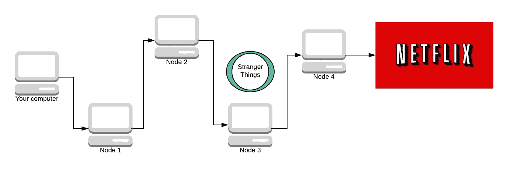

最后一个节点知道消息是什么，它要去哪里，但不知道是谁发送的。它只知道节点 3 向它们发送了消息，但它不知道路径上的其他任何人。这里的一个关键属性是，一旦节点解密了一层，它就不知道还有多少层要解密。它可以小到 1 或 2 层，大到 200 层加密。

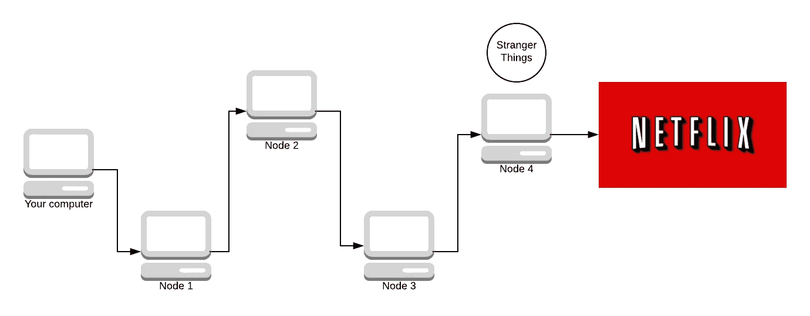

现在亚马逊不可能发现你看网飞了！网飞送回了一部分奇怪的东西。

让我们看看它是如何反向工作的。

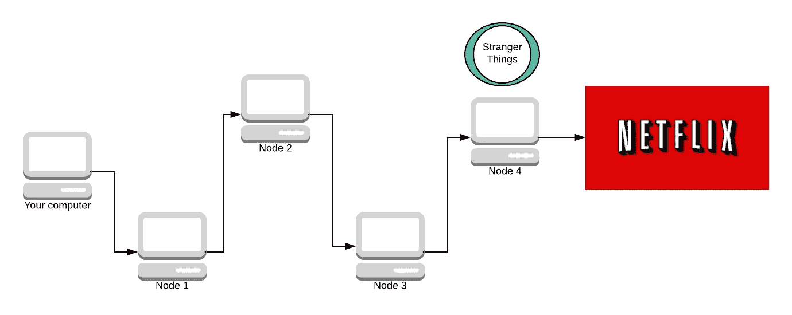

节点 4 现在添加其加密层。它不知道最初是谁发出的请求，它只知道节点 3 向它们发送了请求，因此它将响应消息发送回节点 3。

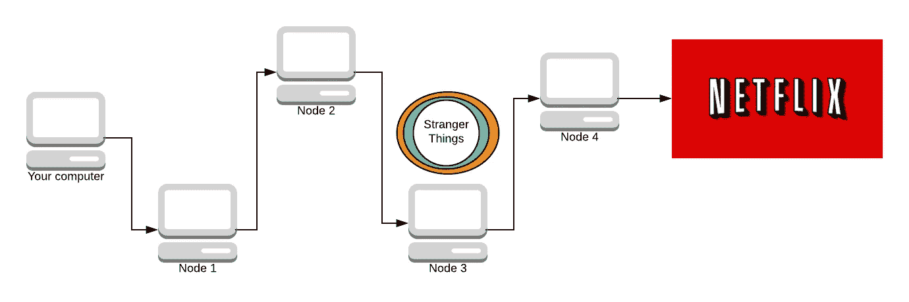

接下来的几个节点依此类推。

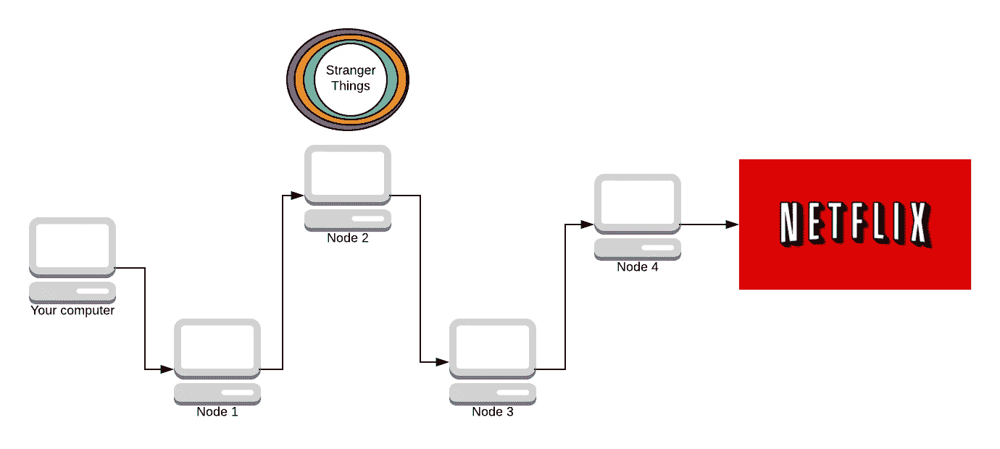

现在响应包已经完全加密了。


现在数据包已经完全加密，唯一知道消息内容的是节点 4。唯一知道是谁发的消息的人是节点 1。现在我们已经得到了完全加密的响应，我们可以使用所有的对称密钥来解密它。

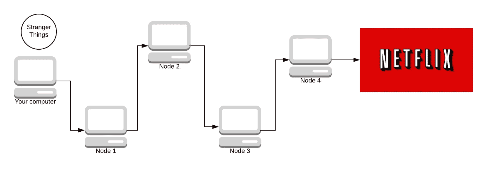

你可能会想“我见过蜗牛🐌比这更快”你是对的。这个协议不是为速度而设计的，但同时它必须关心速度。

该算法可能会慢得多，但安全得多(完全使用公钥加密而不是对称密钥加密)，但系统的可用性很重要。所以是的，很慢。不，它没有想象的那么慢。但这都是一种平衡行为。

使用的加密通常是 [AES](https://www.wikiwand.com/en/Advanced_Encryption_Standard) ，密钥通过 Diffie-Hellman 共享。我在这里写了另一篇关于迪菲-赫尔曼[的文章。](https://skerritt.blog/diffie-hellman-merkle/)

Tor 创建的路径称为回路。让我们来探讨 Tor 如何选择电路中使用的节点。

# 电路是如何产生的？

当每台机器想要创建电路时，首先选择**出口节点**，然后选择电路中的其他节点。Tor 电路总是 3 个节点。增加电路的长度并不能创造更好的匿名性。如果攻击者拥有网络中的第一个和最后一个节点，即使电路中有 1500 个节点，也不会使您更加安全。

当 Tor 选择出口节点时，它遵循以下原则进行选择:

1.  客户端的`torrc`(Tor 的配置文件)是否有关于哪些出口节点不能选择的设置？
2.  Tor 只选择一个允许您退出 Tor 网络的退出中继。一些出口节点只允许 web 流量(HTTP/S 端口 80)，当有人想要发送电子邮件(SMTP 端口 25)时，这是没有用的。
3.  出口节点必须具有支持您的可用容量。Tor 试图选择一个具有足够可用资源的出口节点。

电路中的所有路径都遵循这些规则:

*   我们不会为同一条路径选择相同的路由器两次。

如果您两次选择同一个节点，那么可以保证该节点要么是保护节点(您进入的节点)，要么是退出节点，这两个位置都很危险。有 2/3 的几率它既是守卫节点又是出口节点，这就更危险了。我们想避免进入/退出攻击。

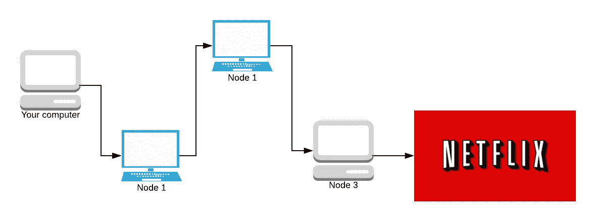

This isn’t okay. Node colour changes to show it’s the same.

*   我们不选择同一系列中的任何路由器作为同一路径中的另一个路由器。(如果两个路由器都在其描述符的“家族”条目中列出了另一个，则这两个路由器属于同一家族。)

运行 1 个以上 Tor 节点的运营商可以选择将其节点标记为“系列”。这意味着这些节点具有相同的父节点(它们网络的运营商)。这也是针对进入/退出攻击的一种对策，尽管操作者如果愿意的话不必申报家庭。如果它们想要成为保护节点(即将讨论),建议声明 family，尽管这不是必需的。

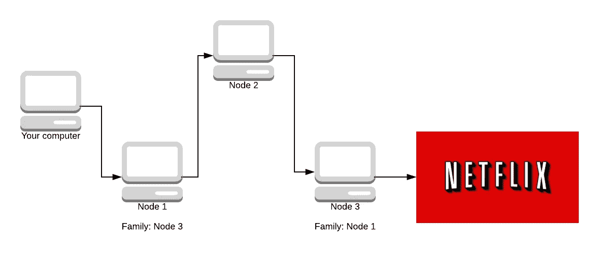

Not allowed

*   我们不会在给定的/16 子网中选择一个以上的路由器。

子网定义网络。IP 地址由 8 个二进制八位数组成。例如，谷歌的二进制 IP 地址是:

```
01000000.11101001.10101001.01101010
```

前 16 位(/16 子网)是`01000000.11101001`,这意味着 Tor 不会选择任何以相同的 16 位开始的节点作为 IP 地址。同样，这也是对进入/退出攻击的反制措施。


Not allowed

如果子网听起来令人困惑，我写了这段 Python 代码来帮助解释它们:

```
# have a play around with these
# ip addresses are in binary, not the usual base 10
# subnets are usually powers of 2, this is 2^4.
IP = "01000000.11101001.10101001.01101010"
subnet = 16# this will store the subnet address once we find it
subnet_ip = []IP_list = list(IP)
counter = 0# for every number in the ip address
for i in IP_list:
  # we want to end the loop when we reach the subnet number
  if counter >= subnet:
    break
  # the ip address segments each oclet of bits with full stops
  # we don't want to count a fullstop as a number 
  # but we want to include it in the final subnet
  if i == ".":
    subnet_ip.append(".")
    continue
  else:
    # else it is a number so we append and increment counter
    subnet_ip.append(i)
    counter = counter + 1

print("Subnet is " + ''.join(subnet_ip))
```

*   我们不会选择任何不运行或无效的路由器，除非我们被配置这样做。默认情况下，我们配置为允许无效路由器位于“中间”和“会合”位置。

不运行意味着节点当前不在线。你不会想挑选不在线的东西。无效意味着节点`torrc`中的某些配置是错误的。你不想接受奇怪的配置，以防他们试图破解或破坏什么东西。

*   第一个节点必须是一个 ***守卫节点*** 。

***守卫节点*** 是特权节点，因为它看到了用户的真实 IP。成为一个保护节点是“昂贵的”(维持数周的高正常运行时间和良好的带宽)。


这对于拥有 99.9%正常运行时间和高带宽的大公司来说是可能的(比如网飞)。Tor 无法阻止强大的对手注册大量的保护节点。现在，Tor 被配置为一次使用一个保护节点 12 周，因此每年选择 4 个新的保护节点。

这意味着，如果你使用 Tor 观看一次亚马逊 Prime 视频，网飞成为你的守卫节点的可能性相对较小。当然，网飞创建的警戒节点越多，这种可能性就越大。虽然，如果网飞知道你连接到 Tor 网络观看亚马逊 Prime 视频，那么他们将不得不等待 4 周的时间来证实他们的怀疑，除非他们攻击守卫节点并接管它。

对于大型组织来说，成为一个防护节点相对容易。成为退出节点稍微难一点，但还是有可能的。我们必须假设大型组织拥有无限的计算能力来做到这一点。解决方案是使攻击成本高昂，成功率低。

Tor 的常规用户越多，大型组织攻击它的难度就越大。如果网飞控制网络中的 50/100 节点:

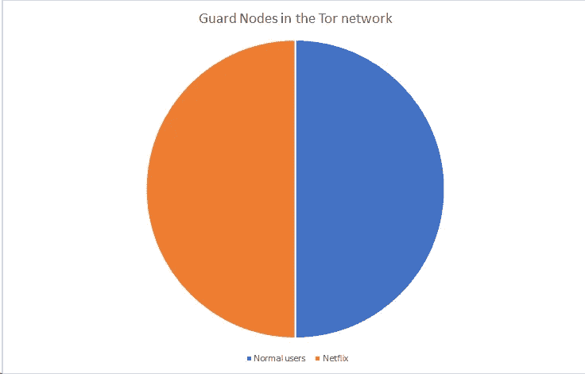

你从网飞选择一个保护节点的几率是 50%。

如果突然多了 50 个普通用户节点加入，那么这个比例就是 50/150，这就降低了网飞拥有一个保护节点(以及潜在的攻击)的可能性，并使其更加昂贵。

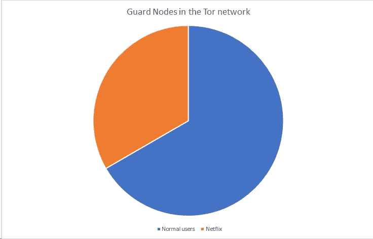

Tor 服务中的人数优势。

# Tor 隐藏服务

听说过那些谣言吗“在黑暗网络上有一些网站，当你访问它们的时候，你会看到人们在做肮脏的事情，卖非法的东西或者更糟:看《宿醉 3》”

当人们谈论这些网站时，他们谈论的是隐藏服务*。*

*这是一个疯狂的概念，老实说，它们本身就值得写一整篇博文。隐藏服务是服务器，就像任何普通的计算机服务器一样。*

*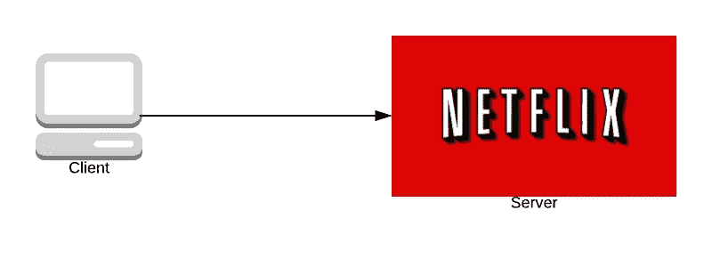*

*除了在 Tor 隐藏服务中，用户和服务器不知道对方是谁也可以进行通信。*

**

*设备(问号)知道它想要访问网飞，但是它不知道服务器的任何信息，服务器也不知道被请求访问它的设备的任何信息。这是相当令人困惑的，但不要担心，我将用很酷的图表来解释这一切。✨*

*当一个服务器在 Tor 上被设置成一个隐藏服务时，该服务器向一些选定的洋葱路由器发送一条消息，询问它们是否想成为该服务器的引入点。至于选择谁作为引入点，这完全取决于服务器，尽管通常他们要求 3 个路由器作为引入点。*

*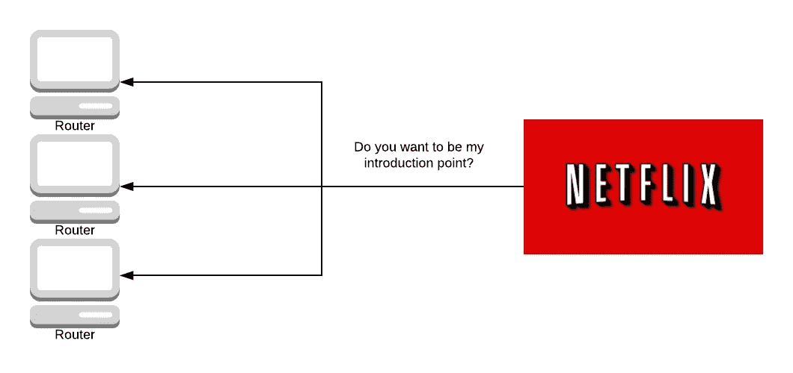*

*介绍点知道他们将把人们介绍给服务器。*

*然后，服务器将创建一个叫做隐藏服务描述符的东西，它有一个公钥和每个引入点的 IP 地址。然后，它将这个隐藏的服务描述符发送到一个[分布式哈希表](https://www.wikiwand.com/en/Distributed_hash_table)，这意味着每个洋葱路由器(不仅仅是引入点)将保存隐藏服务的一些信息。*

*如果你试图查找一个隐藏的服务，负责它的引入点会给你完整的隐藏服务描述符，隐藏服务引入点的地址。*

*这个哈希表的键是洋葱地址，洋葱地址是从服务器的公钥中导出的。*

*这个想法是洋葱地址并不在整个 Tor 网络上公布，而是你可以通过另一种方式找到它，比如从朋友那里或者在互联网上(地址以结尾。洋葱)。*

*分布式哈希表的编程方式意味着绝大多数节点不知道给定键的描述符是什么。*

*所以几乎每一个洋葱路由器对隐藏的服务都知之甚少，除非他们明确地想要找到它。*

**

*假设有人给了你洋葱地址。您从散列表中请求描述符，并获得服务引入点。*

*如果你想访问一个洋葱地址，你应该首先从散列表中请求描述符，描述符有 4 或 5 个介绍性节点的 IP 地址。你随便挑一个，比如说最上面的。*

*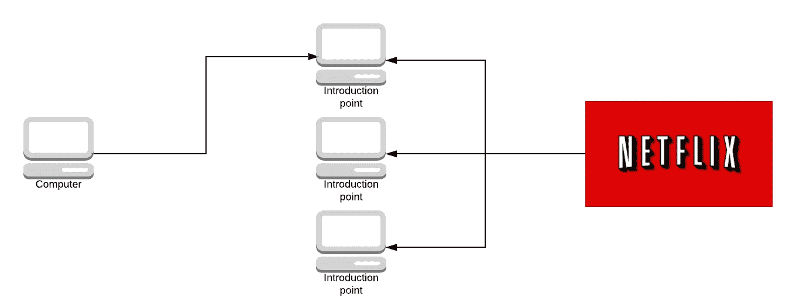*

*您将要求介绍点将您介绍给服务器，而不是直接连接到服务器，您将从一组给定的洋葱路由器在网络中随机创建一个集合点。*

*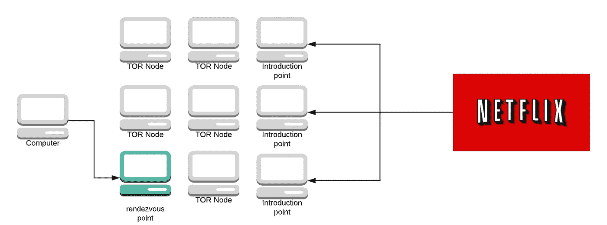*

*然后，您建立一个到集合点的电路，并向集合点发送一条消息，询问它是否可以使用您刚才使用的介绍点将您介绍给服务器。然后，向集合点发送一次性密码(在本例中，我们使用“Labrador”)。*

*集合点形成到引入点的回路，并向引入点发送单词“Labrador”及其 IP 地址。*

*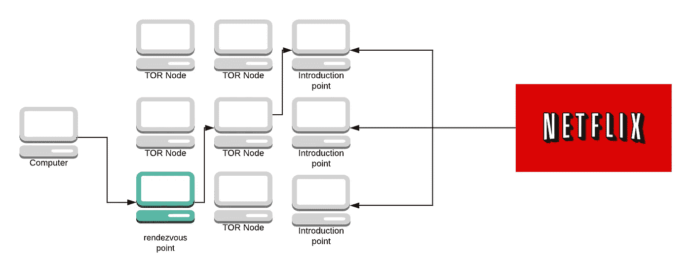*

*引入点将消息发送给服务器，服务器可以选择接受它或者什么都不做。*

*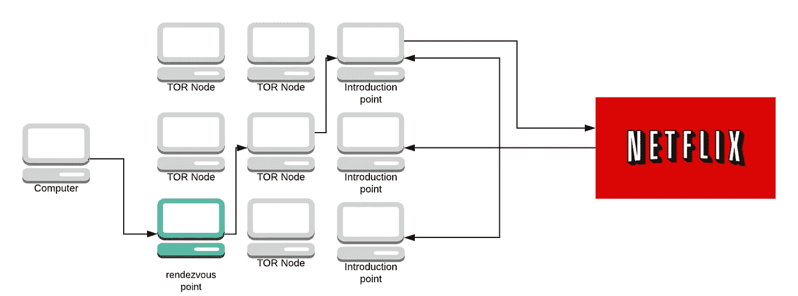*

*如果服务器接受该消息，它将创建一个到集合点的电路。*

*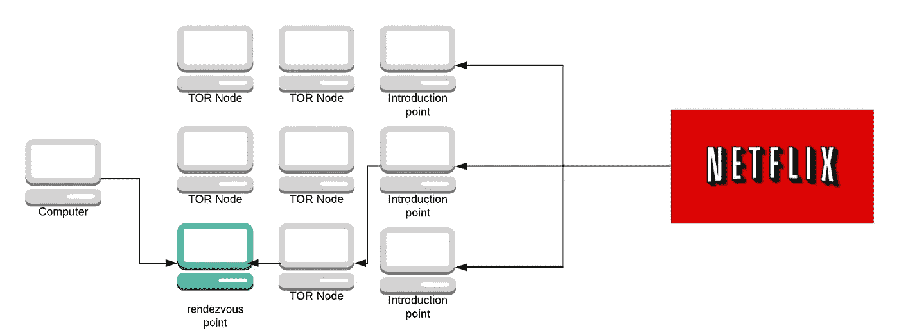*

*服务器向集合点发送消息。集合点查看来自您的计算机和服务器的消息。它说“嗯，我已经从这台计算机收到一条消息，说它想连接到这个服务，我还收到一条消息，问它是否可以连接到一台计算机，因此他们必须要互相交谈”。*

*集合点将充当电路上的另一跳，并将它们连接起来。*

**

*简而言之，隐藏服务是这样工作的，从[到这里](https://tor.stackexchange.com/questions/672/how-do-onion-addresses-exactly-work):*

1.  *隐藏服务计算其密钥对(私钥和公钥，非对称加密)。*
2.  *然后隐藏服务挑选一些中继作为它的*引入点*。*
3.  *它把它的公钥告诉 Tor 电路上的那些*引入点*。*
4.  *之后，隐藏服务创建一个*隐藏服务描述符*，包含它的公钥和它的*引入点*是什么。*
5.  *隐藏服务用它的私钥签署*隐藏服务描述符*。*
6.  *然后，它将*隐藏服务描述符*上传到*分布式哈希表* (DHT)。*
7.  *客户学习。来自带外隐藏服务的洋葱地址。(例如公共网站)(A $hash.onion 是从服务的公钥中导出的 16 个字符的名称。)*
8.  *在检索到。客户机连接到 DHT 并请求那个$hash。*
9.  *如果存在的话，客户端了解隐藏服务的公钥和它的*引入点*。*
10.  *客户端随机选择一个中继来建立一个电路，告诉它一个一次性的秘密。被选中的中继站作为*集合点*。*
11.  *在用隐藏服务的公钥加密消息之前，客户端创建一个*介绍消息*，包含*集合点*的地址和*一次性秘密*。*
12.  *客户端通过 Tor 电路将其消息发送到其中一个*引入点*，要求将其转发到隐藏服务。*
13.  *隐藏服务用其私钥解密*介绍消息*以了解*集合点*和*一次性秘密*。*
14.  *隐藏服务创建一个*集合消息*，包含*一次性秘密*，并通过电路将其发送到*集合点*。*
15.  **集合点*告诉客户端连接已经建立。*
16.  *客户端和隐藏服务通过这个*集合点*相互对话。所有通信都是端到端加密的，而*集合点*只是来回传递它。注意，它们中的每一个，客户端和隐藏服务，都建立了到*集合点*的回路；每条线路三跳，总共六跳。*

*Tor 是一个迷人的协议，其中充满了多年来不断完善的算法。我开始欣赏托尔了，我希望你也是。不幸的是，这篇文章太长了，无法在短时间内总结。如果您想了解更多，请查看 Tor 上题为“ [Tor:第二代洋葱路由器](https://svn.torproject.org/svn/projects/design-paper/tor-design.pdf)”的论文。*

*如果你喜欢这篇文章，并想要更多的喜欢，注册我的电子邮件列表下面✨我只会给你发电子邮件时，我有新的东西，这是每个月/ 2 个月左右。*

*如果你觉得特别慷慨，我有一个 PayPal，甚至还有一个 Patreon。我是一名大学生，在业余时间写这些文章。这个博客是我的全职工作，所以任何和所有的捐款都表示感谢*

**原载于 2019 年 3 月 1 日*[*sker ritt . blog*](https://skerritt.blog/how-does-tor-really-work/)*。**