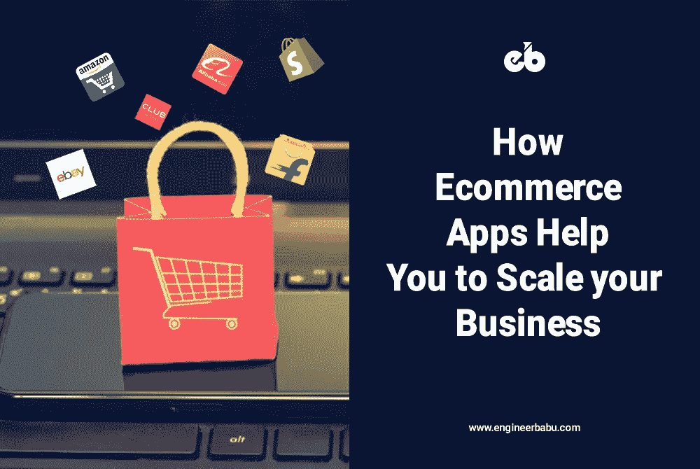
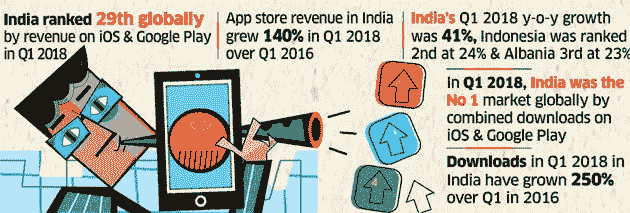
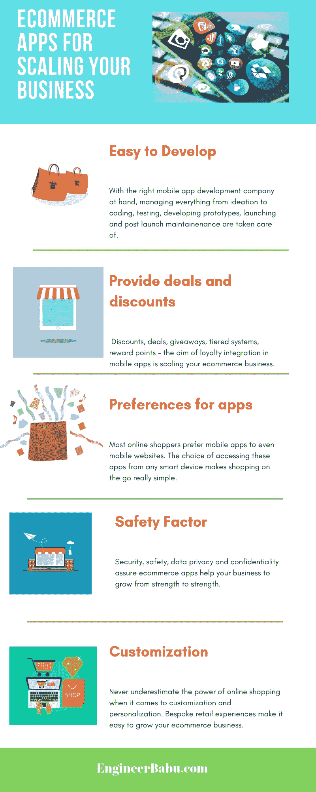
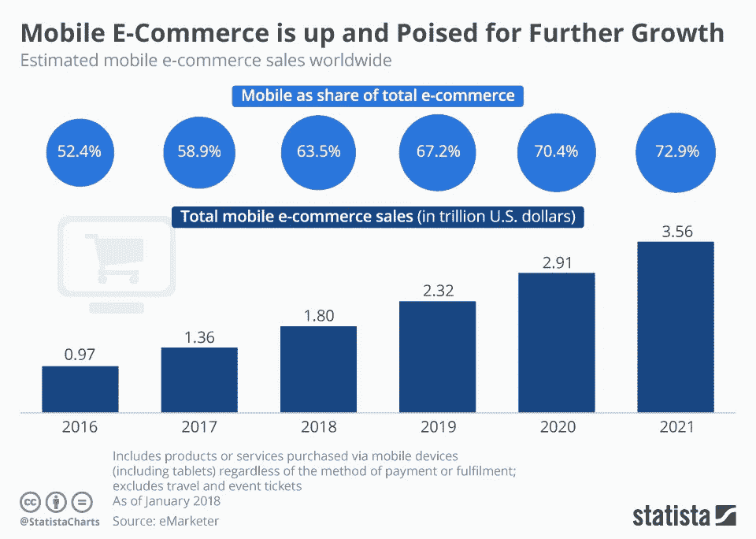

# 电子商务应用程序如何帮助您扩大业务规模

> 原文：<https://medium.com/hackernoon/how-ecommerce-apps-help-you-to-scale-your-business-a614921e0f7f>

*您正在为您的*电子商务*商店寻找完美的商务移动应用吗？*

*你想知道如何扩展*电子商务*业务吗？*

*如果你热衷于了解*移动*应用程序对*电子商务*商店销售的好处，是时候阅读这篇博客了。*

*我们展示了*电子商务*应用程序如何帮助您扩展您的在线业务，关注最新的趋势、技术、*和*进步* ***就在这里*** 。

了解客户想要什么是有效电子商务的核心。在现在的数字时代，一个完美无瑕、流畅的购物 app 是赢得客户芳心、抢占心智份额的关键，钱包份额也是如此！

无论是黑色星期五还是网络星期一的高峰时段，甚至是购物旺季，你的电子商务商店总是需要一个可靠、无缝的移动应用程序来兑现销售。根据 CBS Insights 的数据，像 Target Corporation 这样的主要零售电子商务公司通过使用移动应用程序，其电子商务业务同比增长了 200%以上。

电子商务移动应用程序开发进一步融合了尖端技术和创新，让你知道如何发展电子商务业务，甚至开始一个小规模的业务。

一个现成的电子商务应用程序可以成倍提高你的在线业务的投资回报率。鉴于几乎所有东西都有应用程序(还记得苹果的“有一个应用程序！”营销活动？)，为什么电子商务或在线市场会落后呢？

为了理解电子商务的规模，有必要使用移动应用来发展你的业务，并使用这些应用来发展你的电子商务业务。如果你想让你的小企业开始成长，增加你的高科技应用工具包。

几乎 70%的品牌现在依靠移动应用开展业务。对于小企业来说，这意味着赚大钱！对于企业来说，无论你的业务是寻求提高生产率、利润、收入还是投资回报率，电子商务移动应用都是最好的出路。移动应用对电子商务的好处无论怎么强调都不为过。

据***Flurry Analytics***称，从 2015 年到 2018 年，仅移动使用量就增长了 11%,并且仍在增长。大量客户在零售移动应用上花费更多时间。如果你需要知道如何扩展电子商务网站门户，移动电子商务应用程序是关键。

# 1.移动应用的兴起

有大量的电子商务[移动应用](https://www.engineerbabu.com/blog/top-10-mobile-app-development-companies-in-virginia/)可以执行几乎任何功能。2008 年，iTunes 商店有 800 个应用程序可供下载。 ***Statista*** 估计 2019 年 iTunes 商店的商业移动应用统计数据将有多达 190 万个移动应用。该研究小组还估计，Android 手机应用的数量将达到 210 万个！

当手机成为智能设备时，专用于特定功能的电子商务移动应用开始出现。小型企业和大型企业的电子商务商业模式必须有特定任务的专用软件。

这包括设备的个性化和购物应用的使用。当谈到如何扩大电子商务商店的规模时，移动应用程序对于电子商务的重要性怎么强调都不为过。

# 2.为什么电子商务应用打败了移动网站

你可能会争辩说，移动网站同样适合扩大电子商务业务。但事实并非如此。移动应用击败了电子商务响应网站，因为移动应用在桌面上占主导地位。移动应用是移动浏览的首选媒介。

这就是为什么电子商务需要移动应用的原因。

# 专用应用

由于移动应用致力于简化购物，用户可以在移动中从任何智能设备上快速找到自己选择的产品或服务。Android 的商业移动应用吸引了数百万用户。但无论你是在考虑 Android、iOS 还是 Windows 的电子商务移动应用，这些应用的真正优势在于它们比基于浏览器或桌面的界面更简单。
效用丰富

购物应用程序很方便。电子商务应用程序使得使用设备的功能变得容易。这包括 GPS、蓝牙和摄像头。使用移动应用程序，许多流程都是自动的，例如结账和支付。例如，在一个电子商务应用程序中，你可以扫描移动支付。此外，这些实用程序正被集成到可穿戴设备中，以确保您可以扩展您的电子商务网站计划。

# 功能齐全

这种购物应用程序的每一个特性和功能都值得电子商务应用程序的开发成本。这些应用程序会自动检测位置，并通过提供便捷的购物体验来扩大客户群。

## 可以离线使用

如果你的重点是如何扩大业务规模，面向小企业或企业的移动应用程序可能会成为真正的人群吸引者，完全是因为它们甚至可以离线使用。其他形式的网上购物需要互联网连接。离线电子商务应用要方便得多。

# 加载更快

如果你想知道如何扩展电子商务业务，关键要素是一个快速加载的购物界面。这也是小企业甚至大企业的电子商务移动应用得分的地方。这些应用程序加载速度更快，用户不必面对打开网络浏览器、输入网址和让页面加载的障碍。点击应用程序图标更容易。

如果你想知道如何扩大电子商务业务，没有任何电子商务营销软件能够像快速加载的移动应用程序那样简单易用。面向小型企业的电子商务解决方案不应专注于移动网站。相反，允许使用智能手机应用程序流畅导航。

# 3.电子商务移动应用:重新定义电子商务业务

研究表明，接近 89%的用户正在部署移动零售应用，而不是登录响应性网站。无论是服装购物应用还是食品配送应用，那些想知道如何扩大业务规模的人应该依靠这些实用的应用来拓展全球市场。电子商务应用实例比比皆是。

在线零售商也展示了 75%的在线虚拟店面流量是如何通过移动设备或平板电脑实现的。用户清楚地了解应用的价值。电子商务企业意识到，一个应用程序不仅仅是商务通讯应用程序。

即使你处于需要知道如何开始电子商务业务的阶段，从头开始电子商务业务也需要一个购物应用程序，即使是一个基本的应用程序。2015 年，此类电子商务应用的收入达到 809.4 亿美元。现在这个数字已经达到了 2065.3 亿美元，仅仅三年就增长了 155%。

电子商务行业中的小规模企业现在可以与经验丰富的竞争对手、经验丰富的企业公司和行业领导者平起平坐。对于那些寻求如何扩大电子商务业务的人来说，移动优先的应用程序甚至为小规模企业提供了一个公平的竞争环境，并形成了完美的出路。

对于想知道如何扩大业务规模的小型零售商来说，如何发展电子商务业务就是利用技术和应用程序在电子商务行业做大。以前，电子商务应用程序的开发成本很高。

即使是商务通讯应用也需要复杂的编码。现在，由于高端移动应用程序开发公司的出现，制作易于导航、无缝和简单的电子商务应用程序变得容易了。

谈到电子商务应用程序，Android 或 iOS 版本可以一步到位。电子商务移动应用程序的设计和开发是一个雇佣合适的开发伙伴的问题。在合适的预算和合适的开发团队的帮助下，也可以开发创业应用。

# 4.电子商务应用如何扩展业务

什么是电子商务应用程序，为什么这些应用程序有助于扩大您的电子商务业务？对于如何开始自己的小生意，你需要一个电子商务商业计划。但是没有移动应用开发，任何电子商务商业模式都是不完整的。

越来越多的电子商务企业推出了自己的应用。正是因为这个原因，零售巨头如塔吉特、亚马逊和沃尔玛积累了可观的收入。至于如何在当地推广你的业务，商业营销应用程序是关键。

电子商务改变了人们购物的方式。它也改变了如何在网上推广你的业务。

除了便利因素，阿里巴巴、亚马逊和 Flipkart 等零售巨头也在推出交易和促销活动。基于应用程序的电子商务营销软件解决方案是分配交易和折扣的完美模式。

面向电子商务的移动应用正在改变如何发展你的小企业(甚至扩大你的电子商务企业的覆盖范围)。如果不了解如何在网上发展业务，任何小规模的商业计划都是不完整的。对于基于应用的电子零售商来说，只需轻轻一扫或滚动，就能吸引更多客户并达成交易。

数据显示，80%的客户转向智能手机购物应用，这表明移动应用对小企业或大公司都有好处。即使你正在考虑如何在社交媒体上推广你的业务，请注意应用程序作为一种营销工具提供了一条便捷的途径，原因如下:
易于开发

从电子商务移动应用程序源代码到电子商务移动应用程序功能，在合适的开发团队的支持下，为您的企业编写和开发移动应用程序从未如此简单。

# 相关信息的第一价值

商务电子商务应用程序的最大优势在于，电子商务应用程序的增长和功能会随着您不断增长的客户群而扩展。这使得应用程序成为一个很好的选择。可以有效地对产品描述进行优先排序。

价格也必须考虑在内。产品成本的多少是这里的关键。

为了扩大业务规模，请记住定制应用程序功能，以适应客户的偏好，实现高转化率和低回报率。

# #2 提供交易和折扣

由于电子商务应用程序提供大量的交易和折扣，它们在网上购物者中具有巨大的吸引力。近 71%的受访者通过移动应用程序购买或购买了一些东西，因为有折扣或优惠券可用。此外，移动优惠券可以即时创建，使其具有成本效益。

# #3 免费营销

挖掘移动应用作为营销渠道的潜力至关重要。如果用户注册了，你就有了一个可以用于营销活动的订户列表。

通过推送通知营销您的产品，以发展您的电子商务业务。推送通知拥有 97%的阅读率，其中大约 90%在收到后 3 分钟内被阅读。

# 应用程序的第四大偏好

电子商务商店、支付银行、食品配送和在线医疗保健企业的客户青睐移动应用程序。没有哪个在线行业不涉及电子商务移动应用开发。除了证明自己是有效的通信工具之外，移动应用程序正在证明它们的市场价值。

# #5 促进电子商务销售

挖掘个性化的力量和其他因素，如高级支持和独家内容，促进您的电子商务业务销售。

可以很容易地监控通过互联网进行商业交易的电子商务商店的在线存在。随着电子商务的发展，消费者的网上购物行为正在发生积极的变化。平稳的客户体验带来了业务增长和扩张的新机遇。

***Statista*** 估计购物是 2017 年消费者花费时间最多的移动应用类别。最高利润来自购物应用，全年用户会话增长了 54%。

## 深入分析

移动应用提供了更好的客户偏好和电子商务交易和活动视图。这改进了商业和营销策略，并提供了详尽的用户信息。

## 定制功能

电子商务应用程序设计有个性化的功能来吸引用户，简单的产品过滤器来限制结果和提高客户兴趣，从而加速业务增长。

## 安全可靠

用户的数据和通过信用卡或借记卡、Google Pay 甚至 PayPal 进行的在线支付信息在购物应用程序上得到安全保护。数据的机密性和隐私得到了保证。

## 降低复杂性

移动应用程序提供用户友好的体验，具有丰富的功能，如搜索栏、多种支付方式和可用的购物产品。

## 更具互动性

高级商务移动应用程序界面带来令人印象深刻的用户体验。直观、漂亮的用户界面和 UX 设计使移动应用程序具有交互性。这有助于潜在购物者延长使用时间，增加更多购物的机会。

## 方便的

电子商务应用可以从 App Store 或 Play Store 下载。由于电子商务应用让购物者可以随时随地购物，这对于提高收入至关重要。

## 降低购物车废弃率

移动电子商务应用降低弃车率。Baymard 的研究显示，网站上的使用率为 68%，而移动应用程序的使用率为 28%。

## 忠诚度整合

在应用程序中整合奖励和优惠券可以提高客户忠诚度。除了 VIP 奖励和行动点数之外，您还可以选择分层奖励、刮刮乐、折扣、交易、推荐、旋转赢取或优惠券奖励。

## 客户保持

人们可以向应用程序用户发送关于最新销售、折扣和优惠的推送通知。通知吸引了大量客户，提高了转化率和客户保留率。大约 38%的用户因为收到通知而返回应用程序十次以上。

## 巨额收入

***Statista*** 预计 2020 年移动应用将产生 1889 亿美元的收入。将近 90%的移动时间花在应用程序上，因为电子商务应用程序具有以下优势:

*   为购物者提供便利
*   扩大品牌
*   为顾客提供友好的购物体验
*   利用原生移动功能，并且独立于浏览器。
*   关注使用移动生物识别技术的自然安全支付。
*   注重以体验为中心的销售，比网站更具互动性。
*   地理围栏和定位以提高品牌召回率
*   改进的用户界面和 UX

# 一锤定音

电子商务应用的出现和随之而来的增长是很自然的。新的市场机遇引发了潜在收入的大幅增长。随着移动应用的发展，电子商务生态系统蓬勃发展。用户喜欢购物应用程序，因为它们方便、易用、实用。对于企业主来说，这是投资电子商务品牌的最佳时机，以满足市场需求，建立品牌曝光率，并从竞争对手中脱颖而出。联系 [**工程师巴布**](https://www.engineerbabu.com/blog/we-work-with-startups-we-are-happy/) 与我们一起发展您的业务，因为我们是满足您所有需求和要求的合适的应用程序开发公司