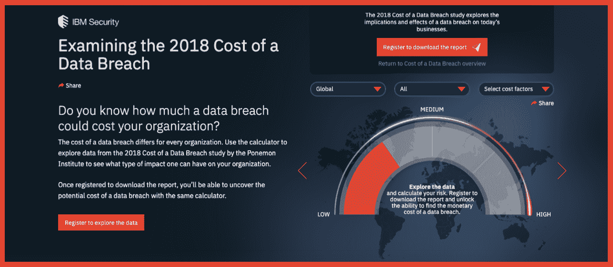
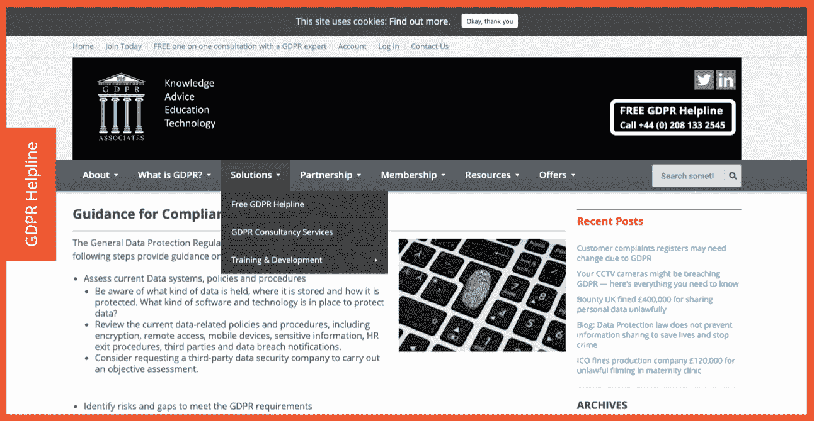
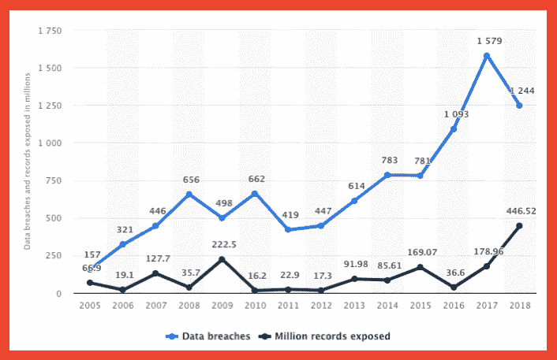

# 在我们的数字时代，高管如何更好地防止数据泄露

> 原文：<https://medium.com/hackernoon/how-executives-can-better-prevent-data-breaches-in-our-digital-day-and-age-833f7a53bee0>

*Unsplash*

数据泄露是我们生活方式的一部分，当另一家公司的数据被盗时，我们几乎连眼睛都不会眨一下。事实上，自 2005 年以来，一些出版物将每年的[称为“数据泄露年”。每年都有多起新的备受关注的消费者数据失窃事件，其中很多都是可以预防的。](https://hackernoon.com/will-the-real-year-of-the-data-breach-please-stand-up-744ab6f63615)

equifax 2017 年的数据泄露是最知名的事件之一，它源于一个最愚蠢的原因:[没有及时更新补丁](https://hackernoon.com/the-5-dumbest-data-breaches-in-history-and-what-you-should-learn-from-them-9122713efa0a)。有许多基本的、可预防的问题导致了巨大的数据泄露:明文中的顺序用户 id、明文密码存储、不检查每笔交易余额的交易日志——这样的例子不胜枚举…

当数据泄露的平均总成本为[386 万美元](https://www.ibm.com/security/data-breach?cm_mmc=Search_Google-_-Security_Optimize+the+Security+Program-_-WW_NA-_-%25252Bbreach%252520of%252520%25252Bdata_b&cm_mmca1=000000NJ&cm_mmca2=10000253&cm_mmca7=9026193&cm_mmca8=kwd-295901324379&cm_mmca9=_k_Cj0KCQjw7sDlBRC9ARIsAD-pDFrY7HWRqH_eM1FYSGvlbw754fPANg6wW5yiTYljQMQnbqQv-xUssHAaAl_gEALw_wcB_k_&cm_mmca10=253508236928&cm_mmca11=b&gclid=Cj0KCQjw7sDlBRC9ARIsAD-pDFrY7HWRqH_eM1FYSGvlbw754fPANg6wW5yiTYljQMQnbqQv-xUssHAaAl_gEALw_wcB)时，可预防的问题是不可接受的。(如果你想知道你的公司具体会花多少钱，IBM 有一个计算器[可以帮你。)](https://databreachcalculator.mybluemix.net/?cm_mc_uid=47944150996915551044185&cm_mc_sid_50200000=83529781555104418568&cm_mc_sid_52640000=29377031555104418612)

Photo Credit: [IBM](https://databreachcalculator.mybluemix.net/?cm_mc_uid=47944150996915551044185&cm_mc_sid_50200000=83529781555104418568&cm_mc_sid_52640000=29377031555104418612)

但数据泄露是可以预防的，作为一名高管，你有责任确保它们不会发生。以下是您可以降低风险的方法。

# **正确配置人员**

Equifax 的数据泄露尤其令人震惊，原因有几个。一个是漏洞的范围，1.43 亿人面临风险。另一个是他们的首席安全官是音乐专业的学生，没有安全方面的证书。

如此规模的公司信任一个在该领域没有资历的人是不可思议的。考虑到可以修复安全漏洞的补丁已经发布了[个月](https://www.wired.com/story/equifax-breach-no-excuse/)，这么长时间的修补也是不可思议的。

如果人员配备得当，这个问题本来是可以解决的。在任何组织中，让合适的人担任合适的职位都是关键，但在负责如此多用户数据的组织中，这一点绝对至关重要。确保那些关键的安全位置都被锁定了。

# **确保问责到位**

当[三分之二的首席执行官](https://www.forbes.com/sites/forbestechcouncil/2018/06/26/ceos-the-data-breach-is-your-fault/%2315e1f29558b0)拥有对 IT 的组织控制权，60%的首席执行官拥有对 IT 预算的控制权时，责任就落在了最高层。

创造一种负责任的文化始于高层。你不能陷入清单心态——一旦你完成了安全清单，你仍然不能休息。一个适当激励的员工会寻找其他方法来防范零日利用和其他可能不会出现在清单上的事情。即使你试图与 GDPR 保持一致，这也会有所帮助——但如果你只是这样做，有些事情就不会显现出来。

Photo Credit: [GDPR Associates](https://www.gdpr.associates/compliance-guidelines/)

问责制从最高管理层开始。你是否授权合适的人在部门中做决定？给他们所需的预算？让他们对违规负责并帮助他们创建更好的基础架构？

正如云管理套件的首席执行官 Ashley Leonard 在一封电子邮件中告诉我的那样，“对于 it 部门来说，为他们提供工作所需的工具和人员非常重要。否则，当错误发生时，责任在于最高管理层，而不是基层人员。修补的自动解决方案、提出可能的入侵媒介的创新型员工、pen 测试……所有这些都有助于创建一个保持公司安全的战略。”

# **教育你的员工**

这不仅仅适用于它。这对公司的每个层面都很重要。

卡巴斯基实验室[指出](https://usa.kaspersky.com/resource-center/definitions/data-breach)“绝大多数数据泄露都是由被盗或薄弱的凭证造成的。如果恶意行为者拥有您的用户名和密码组合，他们就有机会进入您的网络。因为大多数人重复使用密码，网络罪犯可以进入电子邮件、网站、银行账户和其他 PII 或财务信息来源。”

确保让您的员工了解最新的常见网络钓鱼策略，并定期测试以确保他们掌握这些策略。经常更换密码，即使他们抱怨。重要的是要确保他们不会无意中打开你的网络进行攻击，这要从适当的教育开始。

网络钓鱼是个人身份盗窃和公司数据盗窃最常见的攻击途径之一。随着一些组织开始使用[多重重定向](https://www.antiphishing.org/apwg-news-center/)来混淆 URL，检测也变得越来越困难。如果你能至少停止非常普通的方法，你会安全得多。

# **防患于未然**

不是每一个漏洞都可以被阻止，但绝对关键的是，你要尽一切努力防止它们发生。美国和世界各地的数据泄露事件都在增加。随着越来越多的信息进入互联网，我们的身份被泄露的途径越来越多，越来越多的公司窃取了我们的个人信息。

Photo Credit: [Statista](https://www.statista.com/statistics/273550/data-breaches-recorded-in-the-united-states-by-number-of-breaches-and-records-exposed/)

你不能阻止每一次入侵，但你能做的是加固你的防线。确保你没有因为疏忽而在安全上留下漏洞，或者让你的 IT 部门缺乏资源。建立一种负责任的文化，雇佣合适的人，教育你的员工，投入适当的资源来保持修补和安全，你将能够在大多数攻击发生之前阻止它们。