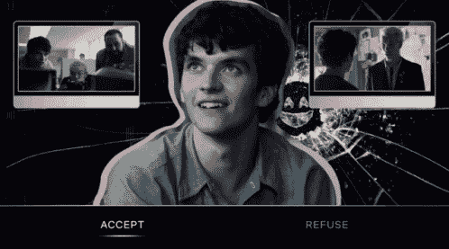
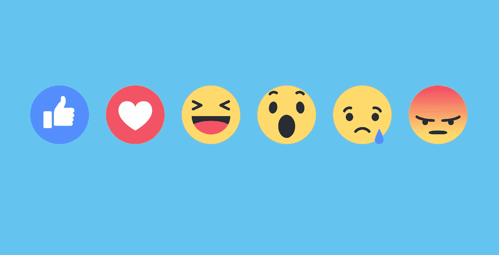

# 在数字生态系统中，我们有多大的“选择”自由？

> 原文：<https://medium.com/hackernoon/how-free-are-we-to-choose-in-digital-world-7c6ad8474a07>

## 你的选择决定了你的世界。

一次又一次，我被这句话卡住了“我们只是活着的概率”。我们今天的成就是由于我们在过去所做的一系列选择，我对此深有同感。如果我选择了 B 而不是 A，我今天可能会是一个完全不同的人。你在选择大学时所做的选择，选择你感兴趣的领域，选择合作的公司，选择你最好的朋友，选择约会的人，选择你居住的城市，你吃的食物，你看的电影，你读的书，你要学习的技能，所有这些都对你产生了影响，塑造了你的人格。

现实生活中有趣的事情是，我们的选择是我们自己的。至少我愿意这么认为。我知道有一个类似的理论，说你做的一切都是预先决定的，而不是真正掌握在你手中，自由意志是一种幻觉。

但不管是哪种情况，有一点是正确的，那就是选择的多样性。我们有选项，但并不是所有选项都是布尔型的，很多选项都是灰色的。

一个简单的例子是，你喜欢一个人:是还是不是？这不是一个布尔问题。本质上，没有纯粹的喜欢或纯粹的讨厌一个人，它有很多不同的方面，也许你爱这个人，也许你讨厌这个人，你钦佩这个人，你会想要喜欢这个人或者那个人的存在并不重要，等等。我们充满了复杂的感觉、情感和观点。它们不是布尔型的。

如果你在神经网络中，你可能会说，给让你喜欢/不喜欢这个人的特征分配权重，每个单一特征的存在与否将决定最终结果，所以这在最底层是一种布尔运算，但我们不要深入到这一步。我们谈论的是我们作为人类能够感受、理解和联系到的事物。

> 我们可以做出的选择是无限的，最好的部分是你可以定义自己的选择。

毫无疑问，基于你所在的社会/家庭/机构，总会有一个既定的事实，但你也可以选择改变它，也可以选择不接受既定的事实，而是寻求完全不同的东西。这就是我们真实生活的感觉。如果不是真正的免费，它肯定成功地给了我们一个免费的假象。

了解了这个事实之后，让我们来看看当我们试图转向数字世界时会发生什么。

# 在数字世界中，我们的生活会受到怎样的影响？

> 我们拼命地试图在数字领域描绘我们的生活，我们需要网上的一切，从食物到朋友，到工作，到约会，到音乐，到电影。我们生活中的所有这些重要组成部分现在都通过数字媒体提供给我们，因此我们的选择如何在数字媒体上得到反映就成了一个有趣的问题。

在数字媒体中，选择被呈现为**菜单栏**，开发者(任何科技公司的)在那里决定所有要放的东西。由于这是一个资本主义、[注意力经济](https://hackernoon.com/you-are-gambling-daily-bf2ed376ac61)，我们不能真正相信他们会给我们提供公正的选择，这影响了我们对数字世界的体验。技术为我们提供了一套“有限的”选择，有时还会促使我们采取某些行动。让我用 Instagram 上的两个设计例子来解释一下。

View post for all the screens.

你可以关注或不关注某人，将文章或文章静音，你可以添加到你的故事或编辑好友列表或阻止用户，取消发送消息或标记为未读等。这是一个合适的架构，我们只能在其中运作。回到我们开始的例子，你可以喜欢一个相当于“追随”的人，也可以不喜欢。他们增加了像密友和无声故事等功能。以反映现实生活中的关系范围，但你可以添加到平台的选项集仍然是如此有限，由设计。不用说，这种架构也让我们容易受到很多内容的影响，而这些内容我们在现实生活中很容易忽略并继续前进。

一个真正耐人寻味的特点是“故事”。你追随的人可以让你在任何时候*看到他们想看到的*，反之亦然。这是一种完全不同的交流方式。以前，我们确实与人类同胞保持联系，但那是由我们决定的，我们希望在一天中的什么日期和时间这样做，这从来不是瞬间的，也不是我们所能控制的。此外，**我们过去常常决定我们想要交流的话题**，而**谈话由双方决定**。**

> **对话由参与对话的两个人决定。**

**“故事”改变了它的片面，每个人展示他/她想看的，而不管其他人想看什么。在这种情况下，我们没有足够的选择。很难断定这是对还是错，但重要的是要承认，这是一种非常不同的交流方式，自从人类有了第一次对话以来，多年来从未存在过。**

**我想提到的另一个例子是:**

**我经常收到通知，分散了我手头工作的注意力，所以我决定把它们静音。我真的希望他们永远静音，我的想法是让我决定什么时候打开应用程序。我会每天打开它一次，处理所有的通知，然后离开它，而不是每次推送通知都拖着我打开应用程序，花更多的时间在那里。但令我惊讶的是，当我进入设置时，我看到的是这个。**

> **我别无选择，只能永远静音。**

**我被允许的最长时间是 8 小时。原因很简单，公司对利润的偏好显而易见。有人可能会说，你总是可以选择卸载应用程序或让你的手机静音，但我们都知道这是多么可行。核心的本质是你至少应该被提供一个选择，一个在你正在使用的任何应用程序的架构内的选择。**

**因此，当你使用这个应用程序时，你会被要求选择一组选项。决定和控制你的数字生活。**

> **这是非常严肃的，因为当我看到它时，我意识到我暴露在不想要的垃圾内容中，因为我没有“选择”来避免它，我的朋友列表中有不切实际的人数，因为我没有选择调节它的大小，我只能以这五种形式中的一种来回应大多数帖子**

****

**虽然我看到的大部分帖子都是垃圾，我对它们的反应大多是一个巴掌大的表情，但我对这个托盘中的表情没有选择。**

> **因此，不管自由选择在现实生活中是不是一种幻觉，有一件事我们可以肯定，那就是我们的数字生活绝对没有这种东西。在数字平台上，我们唯一被允许做出的选择是从一组经过深思熟虑的、有偏见的选项中做出的，这些选项是由开发者精心策划的，有利于他们所服务的公司。**

> **这篇文章是在 90 年代夏天的概念下撰写的。**
> 
> **“90 年代的夏天”是一个有意识地分析我们对技术的使用，并传播对它带来的问题的认识的倡议，如数字隐私，安全，技术成瘾和设计道德。**
> 
> **欢迎你加入我们的行列！**
> 
> **在媒体上关注我们，在[上关注脸书](https://www.facebook.com/summer.of.90s)或者在 Instagram 上关注[@ 90 年代的夏天](https://www.instagram.com/summer.of.90s/) *因为*我们需要传播消息。**

** [## 90 年代的夏天(@ summer . of . 90)* insta gram 照片和视频

### 查看 90 年代夏天的 Instagram 照片和视频(@ Summer . of . 90)

www.instagram.com](https://www.instagram.com/summer.of.90s/) **