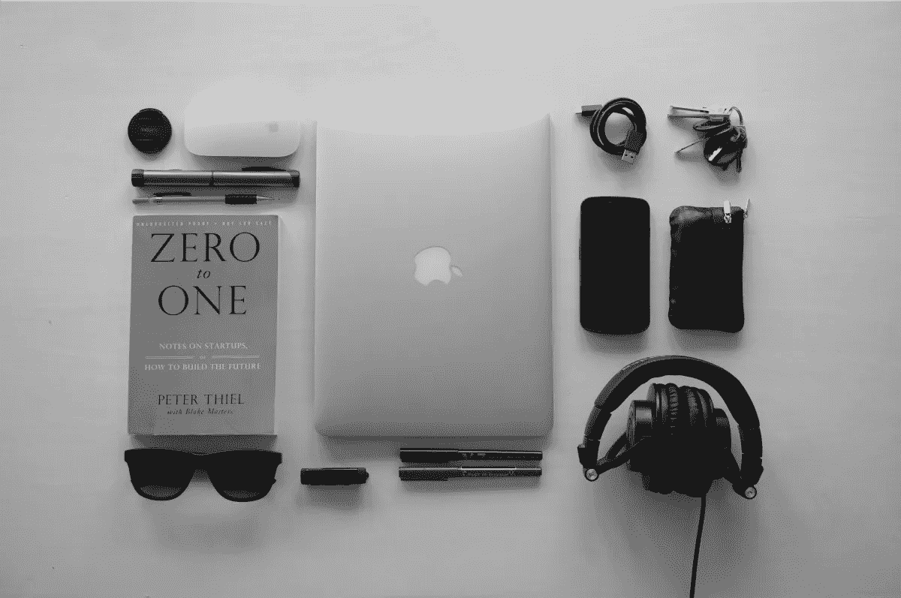

# 小玩意如何改善健康和幸福

> 原文：<https://medium.com/hackernoon/how-gadgets-can-improve-health-and-well-being-22d1d04bd5e4>

媒体经常让你相信科技和小玩意对我们的日常生活有害。 ***但这其中有多少是真的呢？***

虽然，是的，连续几个小时盯着你的脸书视频对你的身体或精神健康没有任何好处，但你的智能手机并不是你唯一可以拥有的小工具。我整理了一份人们在日常生活中用来增进健康和保持良好状态的小器具清单。

自从 1994 年以来，智能手表 实际上已经出现了**，但是直到现在我们才开始在我们遇到的人的手腕上看到它们。自然，随着技术的进步和概念的普及，我们开始看到可以做各种事情的智能手表。拥有智能手表的最好理由之一无疑是计步器，它能够计算你的步数。**

Fitbit 等品牌将自己标榜为运动/活动跟踪智能手表，可以监控各种健身相关数据，从你的步数到你的心率。这些手表记录的指标对人们有很大的影响，特别是当他们***(*把一些东西变成游戏的行为*)他们。***

**一个特别为三星用户设计的应用程序会让你在你走多少步的问题上与该应用程序的其他用户竞争。除了健康方面的好处，某些智能手表能够在紧急情况下跟踪你的位置，甚至在你生病时监测你的生命体征，并提醒某人(或警察)你的状况和位置。**

**[**无人机**](https://www.thesun.co.uk/news/3213708/drones-laws-uk-police-photography-uses/) 或许是这份名单中一个意想不到的新成员。然而，随着它们变得越来越便宜，越来越容易被消费者买到，越来越多的人开始在户外放飞他们的无人机。除了像 [**GoPro**](https://shop.gopro.com/cameras) 这样的动作相机，这给了人们更多的理由去户外尝试新的活动或旅行，以及追求摄像的额外爱好。**

**就我个人而言，**go pro 的**的使用激发了我去旅行和从事各种爱好*，比如卡丁车、滑雪和攀岩。*事实证明，这种创造美丽画面来回顾或向你的朋友炫耀的额外激励在让人们走出去方面是有效的。 [**DJI Mavic**](https://www.dji.com/en/mavic) (无人机)的营销主要以其用户曾去过的起伏的风景和美丽的场景为特色。**

**同样， **GoPro** 的立场是过更积极、更充实的生活。这些小玩意不仅让那些已经过着这种生活方式的人受益，而且它们的营销向任何愿意购买的人承诺了它们。**

**在过去的几年里，你很可能听说过[**【pokemon go】**](https://www.pokemongolive.com/en/)，这是一款有数千甚至数百万人在街上行走以捕捉虚拟现实宠物的游戏。一个经常被使用但从未完全命中目标的想法在这次迭代中获得了前所未有的成功。**

**该游戏要求用户在他们居住的地方周围的不同地标和区域找到可以捕捉口袋妖怪的物品。然后，使用计步器，鼓励人们步行，以便找到这些口袋妖怪。这导致无数人到户外走动，这反过来又导致这些人在户外追逐同一只口袋妖怪时相遇。**

**有一段时间，这款游戏让原本从未谋面的人们之间的互动激增。虽然游戏本身是短暂的，但它为未来类似性质的游戏开辟了道路。**

**智能手机是我们日常生活中的一个显著特征，吸引了每个人的注意力。许多人认为，可以访问社交媒体的智能手机实际上正在损害社交互动，阻止“真正的”对话。然而，这些人可能没有意识到社交媒体的全球影响力。无论一个人实际上是社交无能，找不到任何人分享他们的爱好或只是感到孤独，他们现在有机会在世界任何地方遇到某人。**

**游戏玩家从中受益最大，因为他们能够与半个世界之外的人建立持久的关系。我的一个最好的朋友只住在我的国家旁边，然而，如果不是社交媒体，我永远不会有机会见到他并保持多年的友谊。**

**虽然必须保持平衡，但说社交媒体不能为正确使用它的人提供社交满足感是错误的。**

**我的最后一套小工具是对一个老的最爱的新的尝试。虽然孩子们多年来一直骑自行车、滑板和踏板车，但更新的电子模型，如悬浮滑板，正一波一波地把他们带到街上。像迷你赛格威平衡板这样的技术很受孩子们的欢迎，在街上也经常出现。现在有成吨的更高端的型号，如不同特点和规格的增压板(**电动滑板**)，只要通过这个 [**悬浮滑板对比**](https://offroadhoverboard.net/best-hoverboards/) 看看现在的选择范围有多广。虽然这些与非电子产品非常相似，但任何鼓励人们到户外活动的东西都不容小觑。尤其是考虑到许多这些电动交通工具使用起来更容易、更快捷，甚至导致人们使用它们去上班。**

**虽然技术有它的缺点，同时一些人滥用小工具，用它们来取代所有的社会交往。这并不意味着小工具作为一个整体是一件消极的事情。正确使用它们可以打开你从未想象过的通向更好的幸福和健康的大门。**

**当你考虑这些小玩意的实际应用以及它们能给很多人带来的好处时，很容易就能看出它们是如何改善你的健康和幸福的。考虑你使用的小工具和你使用它们的方式。它们是你逃避现实的方式，还是你用它们来过一种更充实、更快乐的生活方式？**