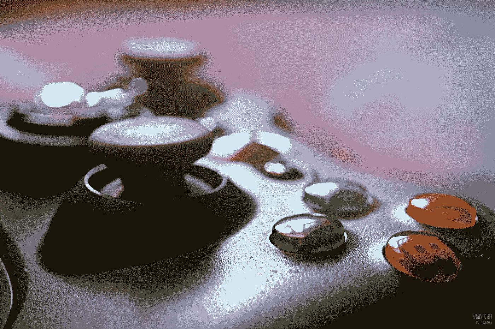

# 游戏如何推动加密货币和区块链的采用

> 原文：<https://medium.com/hackernoon/how-gaming-could-drive-cryptocurrency-and-blockchain-adoption-7ab12bc88138>

## 加密货币正在成为不断增长的游戏行业的一部分，但在这种情况下，你不会经常听到“比特币”这个词

在新一代精通数字的游戏玩家的推动下，游戏开发商正在创造自己的虚拟货币。千禧一代或所谓的 X 一代是两个经济活跃的人口群体，他们对加密货币的兴趣超过任何其他人。他们也喜欢玩电子游戏。在接下来的内容中，我将讨论游戏开发者将加密货币集成到他们产品中的各种方式。

## 游戏资产的令牌化

许多游戏现在都有一种游戏内货币，玩家可以赚取、购买和消费。这些货币通常是在游戏中用法定现金或礼品卡购买的。通常，这些货币化的游戏是免费提供的，并且在游戏中推广游戏货币和相关的物品购买，以鼓励玩家花钱。

> “如果我们看看顶级游戏，不管是哪一类，它们都有一个共同点:它们实现了虚拟经济(这也是它们迄今为止的盈利方式)。”王帅文，硅谷风险投资公司前哨资本的创始合伙人

然而，游戏的兴起与加密货币的流行相结合，导致了越来越多的游戏开发商将游戏资产“令牌化”的新趋势。虚拟游戏内货币可以基于区块链网络进行令牌化，并赋予它们自身的价值和存在(不仅仅是作为游戏内货币)。这是因为以这种方式使用区块链技术为游戏代币创建了一个加密会计系统，这也允许在游戏之外购买、出售和交易游戏资产。

## 用加密奖励游戏玩家和开发者

一家名为 [ClanPlay](http://www.clan-play.com/) 的初创公司计划用一种名为“[好游戏](https://youtu.be/8UlZWwzG2Zg)的新加密货币奖励《皇家冲突》等游戏的玩家代币是在游戏中获得和使用的，但与我们熟悉的虚拟货币不同，好游戏也将在交易所交易，并作为游戏外的加密货币放在钱包中。

总部位于中国北京的另一家名为 Chukong Technologies 的公司也在将游戏与区块链和加密货币相结合方面取得进展。Chukong 拥有开源移动游戏开发平台 Cocos2d-x. [Cocos2d-x](https://cocos2d-x.org/) 拥有超过 100 万名开发人员在其平台上开发游戏，并推出了《愤怒的小鸟》和《王者冲突》等成功的游戏。Chukong 现在在区块链创办了一家名为 [Cocos-BCX](https://venturebeat.com/2018/09/13/cocos-bcx-raises-40-million-to-develop-blockchain-gaming-platform/) 的游戏公司，已经筹集了 4000 万美元的资本资金。

> “有了这笔新的资金注入，我们将推动区块链博彩业向前发展，并专注于比这个领域的任何人都更快地渗透市场。”陈昊芝(Chukong 联合创始人)，Venturebeat，2018 年 9 月。

另一个例子是[银河数字投资基金](https://www.galaxydigital.io/services/principal-investments/)，它最近领导了一轮对位于西雅图的另一家区块链游戏初创公司神话游戏的投资。它的创始人曾致力于《使命召唤》和《吉他英雄》等热门游戏，但现在他们将技能转向了开发基于区块链的游戏。

> “我们相信游戏——尤其是玩家与游戏内经济和虚拟商品的互动——将在大众如何首次发现区块链的真正潜力方面发挥关键作用，”[银河数码公司创始人](https://gamedaily.biz/article/388/activision-blizzard-vets-launch-mythical-games)迈克·诺沃格拉茨说。

## 在线游戏看到越来越多的密码使用

很快，游戏玩家可以赚取虚拟货币，这些虚拟货币实际上是可交易的加密资产，具有即时的现实价值。游戏中的货币化和新的数字微观经济的创造以这种方式回报了开发者和游戏玩家。这也是一个很好的商业想法，因为它激励人们玩得更多。

玩电子游戏同时赚钱的机会很有吸引力。

随着越来越多的游戏玩家开始以这种方式使用数字货币，加密货币和区块链的使用也将增加。以前从未拥有过加密货币的人可能会发现，由于玩了他们最喜欢的游戏，他们有了硬币余额。然后，他们可能会有兴趣将余额转移到[加密货币钱包](/swlh/best-cryptocurrency-wallets-for-2019-20eda6935cce)或[交易所](https://hackernoon.com/which-is-the-right-cryptocurrency-exchange-for-you-ecf0cc8f9477)以交易比特币或法定货币。

*订阅我的* [*中*](/@minadown) *和* [*推特*](https://twitter.com/minad21) *频道如果你想了解更多关于区块链和加密货币项目的信息，

如果您对本文有任何疑问，请在下面的部分发表评论。谢谢*