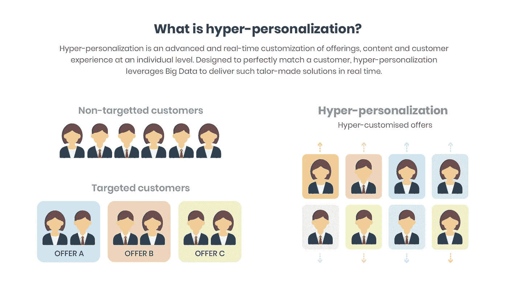

# 超个性化营销如何大规模提供更好的客户体验

> 原文：<https://medium.com/hackernoon/how-hyper-personalised-marketing-can-deliver-better-customer-experiences-at-scale-af94405a6fdf>

几十年前，当地杂货店老板必须记住他们的老顾客的名字，他们最忠诚的顾客的偏好和生活方式，利用所有这些信息来提供更受欢迎和难忘的服务。

如今，技术使企业能够无缝地收集和捕获客户数据，如姓名、出生日期和购买历史，这有助于他们提供大规模的个性化客户体验。事实上，现在在线零售商通过直呼用户的名字来发送信息，并根据他们的历史购买行为、性别和精确的地理位置数据来推荐产品，这种做法很常见。

移动应用营销中的个性化已经存在多年了。像你这样的营销人员已经尝到了个性化的果实，知道它为今天的移动优先业务带来的真正潜力。用户现在希望在接收电子邮件、推送通知或任何类型的通信时实现个性化。

据麦肯锡公司称，个性化可以为 5X 带来 8 倍于总营销支出的投资回报率，并可以将销售额提高 10%或更多。

但是个性化正在发展。与市场营销中的其他事情不同，我们不断努力增强和优化个性化。在过去的几年里，下一个个性化浪潮以“超个性化”的形式出现了。

营销策略的这个方面可以帮助你提高转化率，建立可持续的长期客户关系。

# 什么是超个性化？

超个性化是借助来自行为和实时数据的高级见解与单个用户互动的过程。简单地说，它将个性化技术和策略向前推进了一步。

例如，假设你访问一个电子商务网站，浏览你选择的鞋子。该平台很快开始根据你的浏览和搜索历史推荐相似种类的鞋子或相关产品。

想象一下，你正在一个电子商务应用程序中寻找一双跑鞋，最终放弃了搜索而没有购买。在你退出应用程序后，你很快就会收到一条推送通知，告知你产品的详细信息和合适的折扣。

这不过是“超个性化营销”。如今，每个企业都意识到个性化的力量，以及如果你称呼用户的名字、生日或性别，他们会如何关注你的交流。这就是个性化限制自己的地方。为了在更深层次上与客户联系和互动，你需要精心策划和开展超个性化的营销活动。

超个性化营销的目标是最大化定制内容和沟通的机会，以正确满足您的客户需求。

# 超个性化与个性化有什么不同？

超个性化正越来越多地介入顾客的行为，比个性化更复杂，也更有效。超个性化和个性化有一个显著的区别。个性化被限制在更简单的方面，例如在推送通知的标题或电子邮件的主题行中用用户的名字来称呼他们。

而超个性化利用用户特定的数据更进一步，发送高度情境化的通信，以提高转换的机会。根据用户与此类活动的互动，您可以识别传统个性化和客户特征分析可能无法捕捉的客户的微妙细节。

这反过来有助于您提供高度针对性和个性化的产品/服务、折扣、优惠以及上下文相关的内容。所有这些都在正确的时间通过正确的频道以正确的内容交付给正确的用户。

# 为什么超个性化营销很重要？

一种尺寸从来没有也永远不会适合所有人！

无论是独家折扣还是在需要的时候通过推送通知提供的产品推荐，用户都希望应用程序能够学习并根据他们的需求和偏好采取行动。与此相反，有用户不希望商家研究他们的行为，认为个性化通信是侵犯隐私的产物。

你可能会依赖于目标导向的数据，如电子邮件订阅，销售转换，过去的购买等。通过各种渠道与您的客户互动。但是，您真正需要关注的数据是行为数据，例如:

*   您客户的地理位置
*   时间(客户在一天中的什么时间访问应用程序？)
*   以前的搜索历史(哪些产品或产品页面被浏览或购买最多？)
*   对之前消息的回复(例如:哪一天的推送通知/邮件打开率最高？)

例如，一位顾客在周三午餐时间访问你的应用，浏览女装类别，寻找打折的粗斜纹棉布牛仔裤。她在应用程序上花了大约 15 分钟，然后退出你的应用程序，没有向购物车或愿望清单添加任何产品，也没有进行任何购买。

作为一名营销人员，您需要分析以下数据点，以高度个性化您的后续营销活动:

1.  产品类别:她在找粗斜纹棉布牛仔裤
2.  **花在产品浏览上的时间:**她花了大约 15 分钟浏览该产品类别，显示出很高的购买意愿
3.  **产品搜索行为:**她对感兴趣的品牌和尺寸使用了多个过滤器
4.  **对产品价格的实时反应:**她试图以折扣价购买它们
5.  **对营销传播的历史回应:**她过去曾参与过类似的推送通知(即“打折的鞋子”)

下一步是什么？

基于这些数据和所做的分析，你可以创建一个高度个性化的推送通知活动，在她午餐时间向她发送“本周五牛仔布打折”的消息。

您还可以在信息中添加特定的品牌名称，因为她使用了特定品牌的过滤器。记住，你只有不到 8 秒的时间来吸引顾客的注意力。专注于让你的内容清晰、高度相关、高度语境化。

# 超个性化:获得长期客户满意的最可靠途径

客户随着不断变化的技术而发展，他们的偏好也是如此。从简单的问候到生日，他们希望品牌传递个性化的信息。显而易见，超个性化是当下的需要。这一新浪潮是由商业需求和消费者需求共同驱动的。它帮助您突破噪音，让您的客户感到更有价值，同时增加跨渠道转换的机会。

你越了解你的客户和他们不同的行为，你就越能让你的营销传播更加个性化。而且，你的营销活动越是高度个性化，你就越能持续地提供大规模的差异化客户体验。

*和耶这篇博客最初发表于* [*Smartech 博客*](https://blog.netcoresmartech.com/hyper-personalisation-for-better-customer-experiences) *。*

在 [Smartech](https://www.netcoresmartech.com/) ，我们专注于帮助数字企业创建高度个性化的营销策略，以帮助他们终身留住客户。