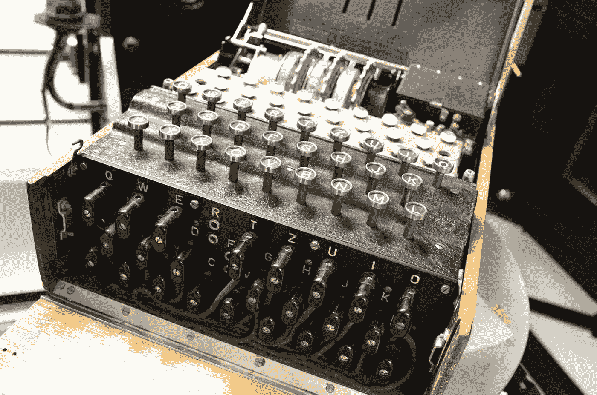
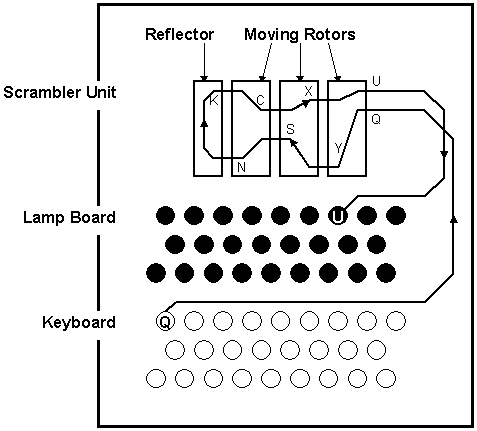

# 我如何建立一个英格玛模拟器…

> 原文：<https://medium.com/hackernoon/how-i-built-an-enigma-simulator-6892242fecc3>

2019 年即将到来。当其他人正在为新年庆祝活动做准备时，像我这样的人(显然没有生活……的人)将在他们心爱的电脑上度过这段时间。

经过深思熟虑，我想——“在新年给别人发一条加密信息不是很酷吗？”一件事接着一件事，我完成了 Engima 机器的编码。

# 什么是英格玛？

Enigma Machine

基本上是德国人在二战期间使用的一种加密设备。

> 主要单元包括键盘、加扰器单元和灯板。编码是在加扰器单元中完成的。它包含多个转子，转子左右各有 26 个触点(A-Z)。每个左侧触点通过内部布线方案连接到右侧触点。转子通过滑动接触彼此连接。一个反射转子反向反射连接。根据转子的相对位置，在某一路径上从右向左流过所有转子的电流被反射并返回到右侧。入口点对应于明文中的一个字母，出口点对应于密文中的一个字母。

# 恩尼格马的工作。

当按下一个键时，最右边的转子移动 1/26 圈。就像钟表一样，第一个转子旋转一整圈后，下一个转子移动 1/26 圈，依此类推。

转子的旋转确保了相同的字符输入两次，每次都会在密文中产生不同的字符。

因为每个转子有 26 个分区，并且转子是独立的。我们得到 26x 26x 26 =**17576**个可能的起始状态。这三个旋翼是从一套五个旋翼中选出来的，可以放在任何位置。这给了我们 60 种可能的转子选择，对于每种选择，我们有 17，576 种启动状态，给了我们 17，576 X60 =**1，054，560**种可能性。

> 即使在这之后，德国人还是像这样——“哼！”。

因此，为了增加安全性，包括交换输入值的插头连接。假设你按下 **A** 并且 **A** 与 **E** 插接，那么输入作为 **E** 进入机器。现在假设输出为 **C** 并且 **C** 插入 **T，**输出为 **T** 而不是 **C.**

(通过使用一些复杂的数学)获得的可能组合是:

> (26!)/(10!*6!*²¹⁰) * 1,054,560

这给了我们一台恩尼格玛机 **1.58*1⁰ ⁰** 可能设置的总数。

# 如何使用英格玛模拟器？

> 通过使用反射转子，简化了机器的操作。如果 A 被编码成 E，那么反过来也成立。因此，同一台机器可以用于编码和解码，而不需要任何重新布线。要解密一条信息，不仅需要一台恩尼格玛密码机，还需要知道起始状态，也就是输入文本时轮子的位置。要解密消息，必须将机器设置为相同的启动状态，并输入密文。输出是纯文本。

链接:[https://enigmasim.herokuapp.com/](https://enigmasim.herokuapp.com/)

1.  在键入您的信息之前记下这些设置，您将需要它们在接收者端解密文本。
2.  输入你的短信，并在末尾写下你的密文。*当您键入文本信息时，您会看到转子指针在增加。*
3.  再次打开模拟器(对，就是重新加载的意思)。
4.  **确保将相同的设置应用于转子和插板，即点击转子名称进行更改，通过编辑输入字段内的值来更改指针值。此外，请更换插头。**
5.  做完后，再次输入密文。您将能够恢复原来的消息。

作为对这条消息解码练习

> xrjyzwnvezjs

设置:

1.  转子名称= 0，1，2
2.  转子指针= 1，2，3
3.  插头= a b、c d、e f、g h、i j、k l、m n、o p、q r、s t

代号:[https://github.com/Worm4047/Enigma-Simulator](https://github.com/Worm4047/Enigma-Simulator)链接:[https://enigmasim.herokuapp.com/](https://enigmasim.herokuapp.com/)