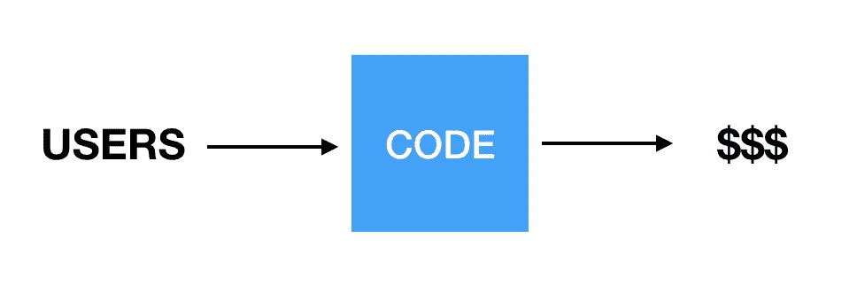
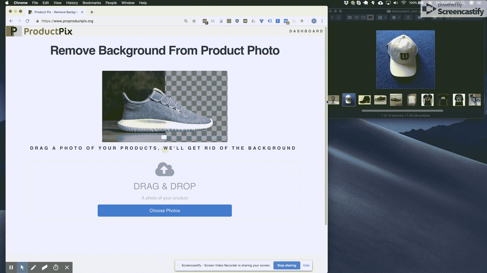
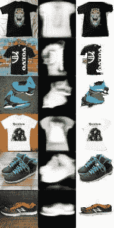
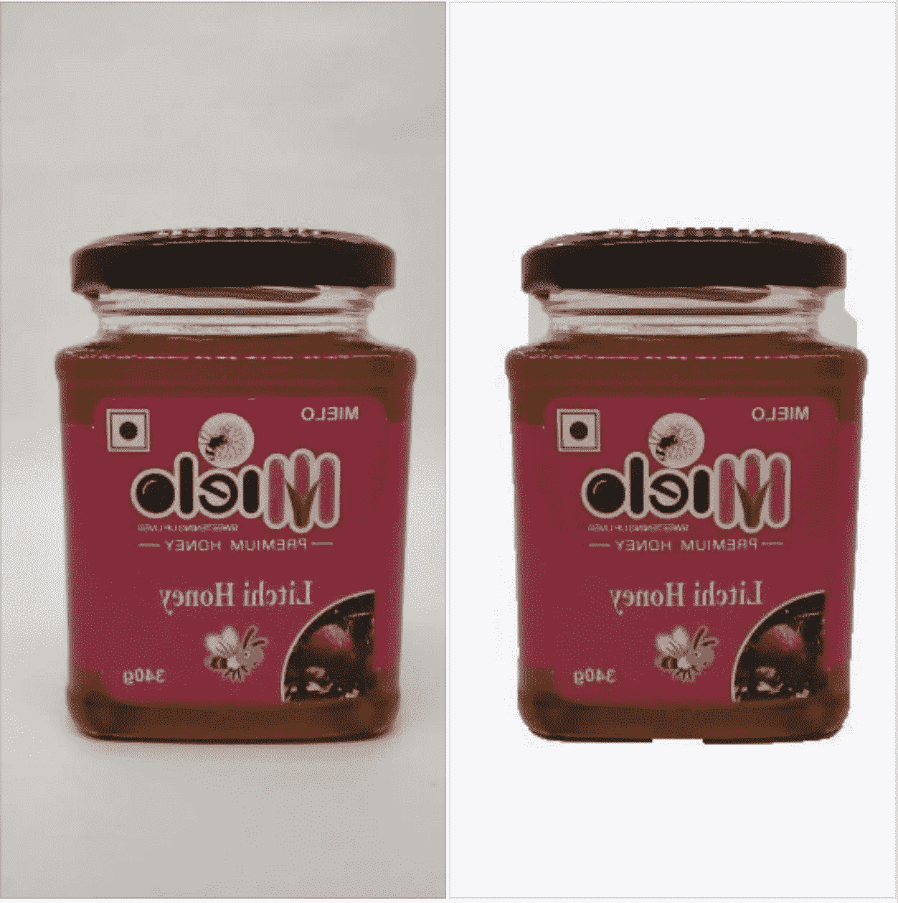
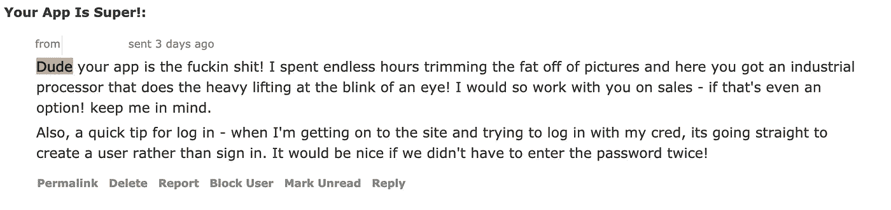

# 我如何构建我的第一个机器学习软件即服务

> 原文：<https://medium.com/hackernoon/how-i-built-my-first-machine-learning-software-as-a-service-a726080f566a>

## 你猜怎么着？它不需要任何资金。但是它确实需要人类(现在仍然需要)

我从一个真正的客户那里得到的第一笔付款终于结清了。[产品 Pix](https://www.proproductpix.org/?ref=medium) 刚赚了 65.36 美元。我觉得我终于可以写一点关于我构建 SaaS(软件即服务)的旅程了。我终于可以肯定地说*有人*认为我的网站正在产生真正的价值。

而且网站还是没有任何付费或者订阅页面！交易源于客户主动联系我，询问服务费用，因为他们需要大规模使用我的服务。

这是个好兆头，对吧？如此优雅。我在这里，一个机器学习顾问，在我的业余时间写一些代码，我让人们为我使用它付钱。绝对的优雅。这是一个流程图:

Easy peasy

原来这个流程图少了一些东西。

我刚刚艰难地认识到，营销、产品设计和全栈开发都是非常真实的技能。好消息是，它们都非常有趣，只要你不断尝试和改变方法，你一定会在这些方面做得更好。

# 怎么开始的

我最喜欢做的是构建机器学习产品。我非常喜欢这样做，这是我作为自由职业者的全职工作。但是，我想，从 A 到 Z 构建一个产品，其中机器学习是核心组件，这不是很酷吗？推出一个网页，让客户走进来，为我写的代码付一点钱，这不是很酷吗？

所以我开始研究人们可能会为什么付费，以及机器学习可能会解决什么问题。

## 开始寻找一个问题

我最近离开了 LinkedIn，我认为帮助人们从他们相机胶卷上的照片库中识别出他们最专业的照片可能是一个好的方向。然后我试着在我自己的手机上破解了一个概念证明，发现我和我的朋友在我们的相机胶卷上有 0 张专业照片，不管你怎么裁剪它们。

我又像那样从头开始了几次，最终选定了我喜欢的东西。看起来在线销售的人是一个大人物(Shopify 已经达到 200 亿美元的估值就是一个很好的例子)。而且所有这些卖家都要做繁琐的体力劳动，从产品照片上去除背景。不仅如此，他们中的一些人*付钱让人做这个*。

> 一台机器可以做到这一点！让我们构建一个移除产品图像背景的服务！

Fast forward and — hey it works!

# 让欢乐开始吧

拿着锤子的人只看到钉子。所以我立即着手建立我的第一个机器学习模型，从照片中去除背景。请注意，在我有网站之前，在我想出是否有办法把用户带到那个网站之前，在我知道他们会上传什么样的图片之前，我就这样做了。

换句话说，我从做我擅长的一件事开始。这是一个愚蠢的优先事项，原因有很多。最值得注意的是，这不是开始的最佳地方，因为我没有透露这个项目中巨大不确定性的答案(谁将支付背景消除，他们正在拍摄什么样的照片，以及我如何找到这些用户)。

但我要为自己辩护:建立一个自力更生的 SaaS 的部分动机是为了好玩。如果玩弄*语义分割模型*是我的乐趣，你真的能评判我吗？

好吧。*评判我*。

我可能会写一篇长文，讲述我在完善机器学习模型方面所做的无数次迭代。我喜欢[极客出](https://towardsdatascience.com/how-to-quickly-build-a-tensorflow-training-pipeline-15e9ae4d78a0)关于机器学习的[很多](https://towardsdatascience.com/how-to-quickly-build-a-tensorflow-training-pipeline-15e9ae4d78a0)。现在，我会说我是从合成数据开始的:从互联网上下载了一堆背景，并将产品图片嵌入这些人工背景中，以教会我的模型如何去除背景。

所以我拿了一堆这样的背景:

artificial backgrounds

我只是把随机的产品照片贴在上面，然后教我的模特去掉背景。

Paste these photos on top of the backgrounds above. Now you’ve got yourself a machine learning dataset!

所以我基本上是在想象我可能需要解决什么样的问题，并让我的模型解决这些带有假背景的假产品的合成例子。令人惊讶的是，它有点奏效了。这些半生不熟的结果让我兴奋不已:

Only an optimist can do machine learning. These poor results got me excited that the problem is looking solvable!

当我看到这个模型开始给出合理的结果时，我花了几个周末的时间试图改进它。并对其进行改进。

Getting there…

但是在某个时候，我的建模工作停滞不前了。我很快意识到，没有真实数据来补充我正在训练的合成数据，很难取得进步。

是的，我尝试在网上收集“带背景的产品照片”。你会发现很难得到真实的“之前”的照片。

> 没有人上传背后有白色窗帘的家具或者浴缸里的鞋子的照片——但是我后来发现，那些试图出售东西的真实用户正在上传这种照片。只有活用户才能给我这个数据。

无论如何，我对这些结果感到非常高兴，我想与全世界分享它们。当然，一旦他们看到我的模型能做什么，他们会印象深刻！

# 建立一个网站(在朋友的帮助下)

我很幸运地数了数我的朋友们，他们都是疯狂的天才，工作过度，对无意义的冒险不感兴趣。但他说“是的，我会给你一个框架网站”。几个小时后，我有了一个看起来很合理的网站，可以修改并连接到我的模型上。

我以前从未写过一行 Javascript 或 Ruby 代码，但还是那句话——学习新技能是这里的一半目标。所以我改走了。创建了这个网站，并把它发布在一些 reddit 群组上。还有…

> 鼓声…

一些人访问了这个网站，我甚至为谷歌广告支付了几十美元。人们会顺便来看看，上传一张照片，然后就再也不回来了。最终，一位 reddit 用户用非常 *redditesque* 级别的礼貌向我解释道:

> 残酷的诚实:你的应用程序很烂。你一直在发帖说你的烂事，但没用。别再发垃圾邮件了，因为没人想听。

# 袖手旁观你的产品

这花了一段时间，但最终我不得不接受现实。对于一个看到潜力的工程师来说，*几乎，有时*起作用的东西令人印象深刻，但对于一个需要解决问题的用户来说，这是不可接受的。就“有没有不断回来的用户”而言，我从 0 到 1 的时间点是在我与第一位平面设计师合作的时候。现在，任何用户上传的内容都会进入一个队列，等待图形设计人员进行修复。如果不是产品照片，他们会扔掉。如果是的话——设计者移除背景，用户通过邮件得到一个完美的结果。

它的妙处:用户得到了一些有价值的东西，而我的模型得到了 **gold** :一张真实的产品照片，上面有一个真实的标签，标明了清洗后的照片应该是什么样子！

# 并迫使你的用户从中受益

我最初的想法是:让我们向用户显示自动结果，如果结果不理想，让用户选择性地键入一个电子邮件地址，并承诺一旦完成，用户将获得一个手动修复的结果。当然，如果用户得到一个她不满意的结果，她会输入她的电子邮件来得到一个完美的结果？对吗？

不对。4.5%的用户输入了他们的电子邮件地址。

我和了解[营销](https://www.linkedin.com/in/baptiste-parravicini/)的[人](https://www.linkedin.com/in/lem-white-425a931b/)聊过。他们有一个非常有见地的建议:我隐藏自动结果。想看看你的自动结果吗？请输入一封电子邮件，然后你就会看到它。结果呢？用户给她发邮件的可能性增加了五倍。用户将总是收到一封完美的电子邮件，手工制作的结果，完美的背景去除。

Only 4.5% of users opted to type in their user email — until I held their photos hostage

# 与您的用户交流

我肯定[不是第一个这么说的](https://blog.ycombinator.com/ycs-essential-startup-advice/)，但是亲眼目睹与你的用户交谈的力量令人印象深刻。过了一段时间，我养成了给上传了大量照片的用户发邮件的习惯，或者给那些上传了几张照片然后就离开的用户发邮件的习惯。

这些邮件毫无系统性。我没有品牌，没有模板——只是类似于“嗨，我是尤里，我建立了这个网站，想知道你对它有什么感觉”。我每次都是从头开始写邮件，我仍然不知道为什么我没有写一个标准模板并重复它——但我很高兴我没有这样做。

几乎所有人都响应了。他们告诉我很多事情:

*   用户告诉我他们需要更高的分辨率(所以我改了)
*   他们需要一个仪表板在一个地方查看他们的结果(所以我做了一个)
*   他们需要能够批量下载照片(所以我补充说)
*   他们需要能够批量上传 12 张以上的照片(现在是 500 张)
*   他们告诉我，他们不知道如何从我的电子邮件中下载照片，因为它们是嵌入在邮件中的(所以我在电子邮件中添加了说明)

最后，在 reddit 那条残酷的消息通知我我的应用程序是狗屎几个月后，我开始收到这样的消息:

Thank you, nice person on reddit!

# 如果你建造了它，它们就会到来(但前提是你要坚持)

我知道长期免费提供手动背景去除是不可持续的。但我已经发现的一件事是，当你与你的用户交谈，当你给他们真正的价值时，他们会回报你，真的。

我的第一次付费转换完全是自愿的，用户只是觉得他们参与手动图像背景去除才是公平的。从长远来看，我将不得不在某个时候开始充电。但老实说，我希望我有几万美元花在取悦我的客户，并建立一个真实产品及其背景变化的庞大数据集。因为在幕后，我的模型正在快速改进，用户通过电子邮件获得的大量结果已经自动生成——与人工结果完全没有区别。

# 向前！

所以我的第一笔付款并不是“用户走向代码并为代码的输出付费”。它是自动结果、人工评论和代码的组合，帮助人们以一致的质量向用户提供结果。与我的流程图相去甚远。

但这可能是我学到的最重要的一课。仅仅因为我想建立一个机器学习模型，并不意味着成功的道路必须从完善模型开始。我有时会想象另一个世界，在那里我坚持不懈，迭代我的机器学习模型而不启动，不与我的用户交谈，不知道没有人使用我的服务的原因是低分辨率和缺乏仪表板。我仍然会想象，也许我需要的只是一个稍微好一点的模型，然后用户就会蜂拥而至！

尽管如此，我相信自动化的潜力是巨大的。我迫不及待地想看到模型如何改进，因为它有一个糟糕的数据流，准确地反映了我的用户想要解决的问题。

哦，顺便说一下:如果你或你认识的任何人可能需要去除产品图片的背景——那就试试[产品图片](https://www.proproductpix.org/?ref=medium)。你上传的每一张产品照片都会让它变得更好。