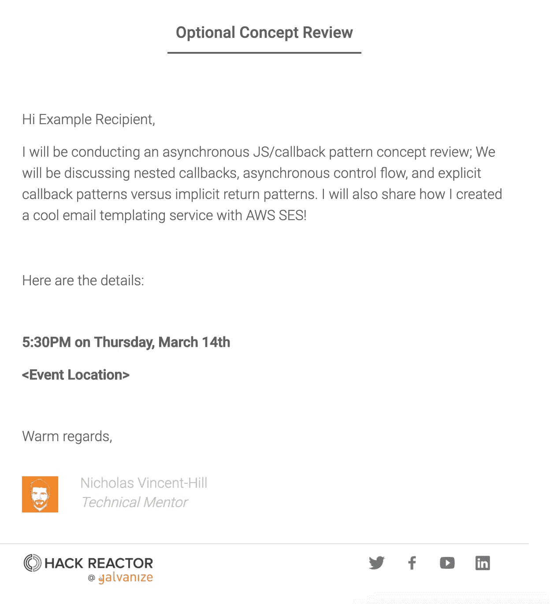

# 我如何用 AWS SES 和 MJML ✉️构建自己的 MailChimp 应用程序

> 原文：<https://medium.com/hackernoon/how-i-built-my-own-mailchimp-app-with-aws-ses-and-mjml-%EF%B8%8F-5e180432cc33>

## 你是否曾经不得不在一份你希望可以自动化的工作中发送重复的电子邮件？

# 什么是 dotmail.tech？

这是一个开源的 FERN-stack 应用程序，用 Nodemailer 和 MJML 模板编程发送响应性设计的电子邮件(查看代码[这里](https://github.com/nvincenthill/dotmail))。

以下是我的应用程序发送的电子邮件示例:

An example templated email sent with dotmail.tech

# 技术堆栈

以下是我使用的技术:

## 前端

*   [React.js](https://reactjs.org/) —前端 MVC 框架
*   [Redux](https://redux.js.org/) —国家管理
*   Jest —测试框架
*   [酶](https://airbnb.io/enzyme/) —测试工具

## 后端

*   [Firebase](https://firebase.google.com/)—OAuth 和云 Firestore 数据库
*   [快递](https://expressjs.com/) —服务器
*   [Node.js](https://nodejs.org/) —后端
*   [小胡子](https://mustache.github.io/)——无逻辑模板系统
*   [MJML](https://mjml.io/) —让回复邮件变得简单的框架
*   超级测试—http 集成测试

## 部署有

*   [Docker](https://www.docker.com/) —包装/容器管理
*   [AWS SES](https://aws.amazon.com/ses/) —灵活、高可扩展性的邮件收发平台
*   [AWS EC2](https://aws.amazon.com/ec2/) —云中安全且可调整大小的计算能力

# 技术挑战

为了构建这个应用程序，我必须解决许多技术难题。

为了创建一个丰富的、响应性的 HTML 电子邮件，我使用了 MJML 并将其转换为响应性 HTML。这使我能够编写模块化的标记块，而不用担心每个模板需要 700 多行 HTML 和 CSS 来确保最终接收者的响应体验。

我使用 [Mustache](https://mustache.github.io/) 将变量注入到 transpiled HTML 中，为每个接收者个性化内容。AWS SES 有自己的模板服务，但这个免费的开源工具对我来说很好，并且有一个简单易学的 API。

AWS SES 是电子邮件发送服务的明确选择。我需要的吞吐量远低于每月发送的 60，000 封免费电子邮件，AWS SES 可以即时批量发送电子邮件(至少在我的小范围内)。

我使用[邮件测试器](https://www.mail-tester.com/)来评估我的电子邮件，以确保它们避开垃圾邮件过滤器。这是至关重要的一步，教会了我很多关于 Apache SpamAssassin 的知识，以及现代过滤器如何将电子邮件分类为垃圾邮件。像原始文本与 HTML 的百分比和图像与文本的比率这样的指标很重要，会对自动过滤器如何对您的电子邮件进行分类产生负面影响。

# 未来特征

有一个数字 a 的功能，我仍然想添加到这个项目中。最后一个完成的主要功能是一个预览功能，在发送之前用 React 门户网站查看电子邮件；客户端可以组合电子邮件，并在不同的选项卡中查看实时预览。

我还喜欢最终添加从注入的变量和预先构建的 MJML“Lego”构建块以编程方式生成电子邮件的能力。这有助于使用标准布局但内容块可变的时事通讯或其他定期出版物。

# 结论

我很高兴在我的个人和职业生活中使用这个应用程序来自动消除电子邮件压力。工作中重复的电子邮件、感谢信和生日电子贺卡可以而且应该只写一次，并注入所需的数据以编程方式生成。

我很乐意在评论中听到你的评论/建议/批评，或者如果你发现任何可以改进的地方，可以提出请求！

> *阅读下一篇:*
> 
> [如何用 AWS S3、Route53 和 CloudFront 构建和部署一个漂亮的静态站点](https://hackernoon.com/how-to-build-and-deploy-a-beautiful-personal-portfolio-site-with-aws-s3-route53-and-cloudfront-af125ccbb1c2)