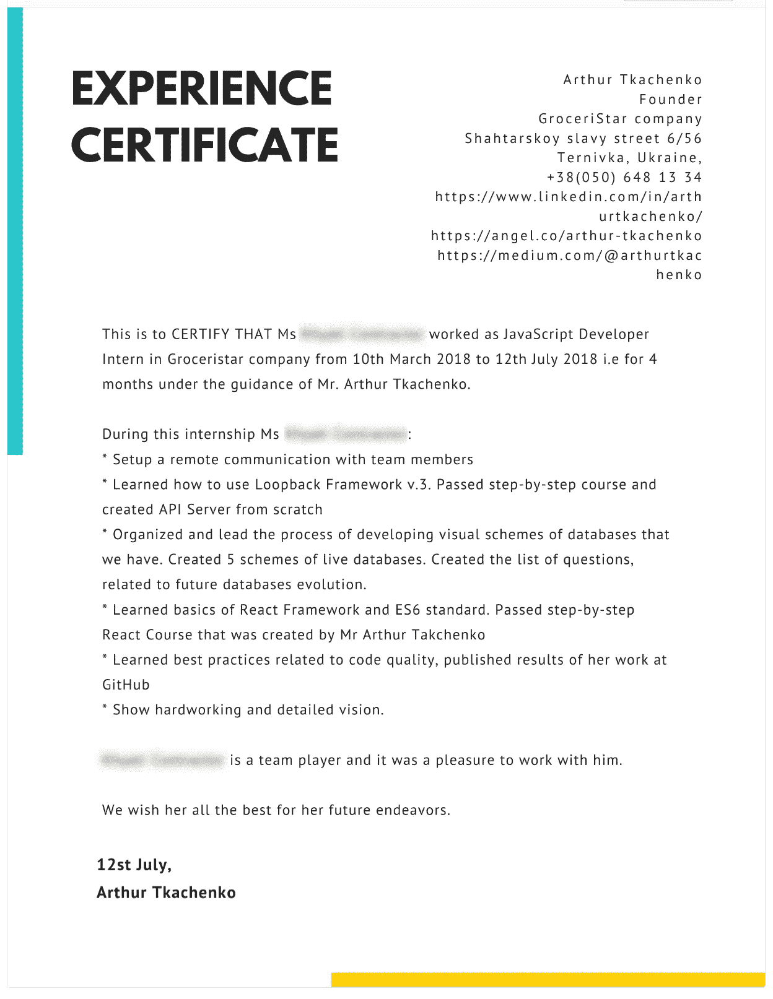
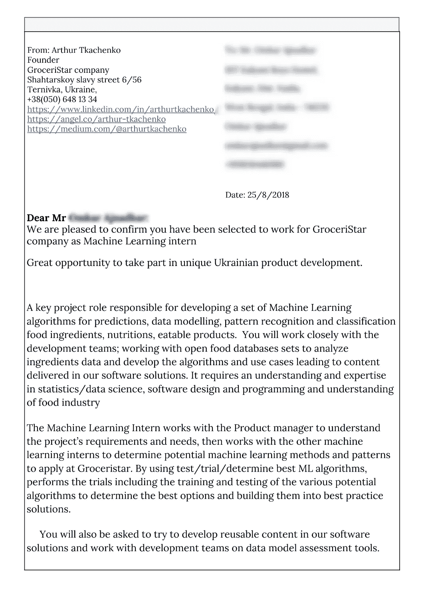

# 我如何用实习生建立我的创业团队

> 原文：<https://medium.com/hackernoon/how-i-built-my-startup-team-with-interns-part-2-fd88b7e2560f>

## 第二部分 *(* [*下面是第一部分，ICYMI！*](https://hackernoon.com/how-i-built-my-startup-team-with-interns-9a395d265cc4)

**

*Photo by [Perry Grone](https://unsplash.com/@perrygrone?utm_source=medium&utm_medium=referral) on [Unsplash](https://unsplash.com?utm_source=medium&utm_medium=referral)*

> *请注意……当你开始和没有经验的人一起工作时，你不能期望立即的结果。*

*通过将实习生纳入你的开发过程(或任何其他专业/商业项目)，你会让你的项目经理非常忙。*

*我不喜欢保姆这个词，但是为了双方都玩得开心，应该进行大量的控制和组织工作。所以，如果你没有空闲时间/精力，这是个坏主意。以后再试试或者做好准备。*

*如果您没有在您的公司和工作中建立的严格规则或流程(重要！)—不做。你只会在混乱中增加更多的混乱。我想你明白我的意思。*

*做好准备一般来说，实习生需要 1-2 个月的时间来学习“如何在你的公司工作”。(我不是指编码技能，整个工作过程)*

*只有在那之后，他/她才会准备好自己取得进步，而不需要花费额外的时间。(有时我仍然惊讶地看到学生们如何在短短六个月内从我这里学习并成为独立的编码机器。)*

# *问题和答案*

## *我可以从哪些国家获得申请？他们是不是本地人？*

*我有来自世界各地的实习生。*

*“不同”是最重要的。我不能记住所有的国家，但亚洲、欧洲、澳大利亚、非洲和北美都包括在内。很多不同的国家和文化。有段时间我们视频聊天——4 个人——不同的地方，不同的口音。非常有趣。*

> *对我来说，最迷人和最有动力的人来自中国、印度、加纳、肯尼亚和尼日利亚等非洲国家(排名不分先后)。*

*该死，我们的一个实习生夏天生了孩子。我很紧张，在等她的消息。我真的很在意我因为某些原因得到的这些经历。因为申请工作的人想要更好的生活，他们正在为成功而奋斗。每当我想起它，我就充满活力。*

## *如何管理实习生*

*很难。你可以向每个人解释工作流程和规则。他们会尝试一次，然后抛弃他们。因为他们不知道如何工作，而且对新方法感到不舒服。*

*这是正常的。*

*他们喜欢用 Messenger 叫我兄弟。我喜欢用电子邮件。所以请耐心点，不要紧张。等到他们打开电子邮件，发现你的信息。什么是酷——他们会很快回复(在阅读你的信息后)。*

*关于我如何管理我的项目的细节可以在这里找到。*

## *如何搜索实习生？如何找到合适的？*

*我认为最基本的方法是搜索技能。但是这需要很长的滚动游戏。您也可以通过技术教育来查看它们。你可以寻找那些对你工作的某些方面有所了解的人。*

**举例:*如果一个学生在图像识别软件的 Udacity 完成了一个定制的课程工作或者完成了一个“著名的课程”。如果你有类似的工作要做，他可能是一个快速的选择。(其实 Udacity 有他们著名的自驾课程，不是 OCR)*

*您可以尝试应用不同的搜索方法。比如自定义的“关键字”搜索。它可以帮助你减少面试的次数。*

**举例:*你开始搜索“机器学习”标题和技能“Python”。
这是一个常见术语，你会有很多结果。*

> *是的，你需要教你的实习生。*

*准备好回答他们简单的问题。或者在他们陷入麻烦之前抓住他们。在某个时候，我厌倦了回复默认或类似的问题，我开始写文章。而且很难，因为你需要在分享之前准备一份必要的资料。
这些信息还应该采用易于理解的格式。如果我做得好，他们会准备好做我需要做的事情。*

> *有时，学生们会“放松一下”。*

*后来他们都不好意思回来了。没关系，这也是过程的一部分。你需要和他们建立联系，让他们开心。*

*每个团队成员都是不同的。没有规则手册。
文化不同，年龄不同。人可以是主动的，也可以是被动的。*

*   *有些人已经足够成熟，可以工作了。他们找到了自己的目标。
    和工具来归档它们。*
*   *有些人还没有找到他们的路。这是可以的。*
*   *有些人就是想试试。他们想探索新的东西。它将如何为他们工作。他们也会很快离开你。这很好。*

## *是什么让我们团结在一起？*

*对技术的热情。他们和我一样渴望新事物。他们想了解更多。*

**还有一件事！**

*他们准备聊天和探索机会。我曾多次遇到这种情况:*

> *我和我们未来的实习生进行了一次很好的面试，我们进行了一次很棒的谈话，等等。我花时间准备一个有细节的任务。当任务被分配时，一些事情突然改变，他们很难去执行它。*

*这就是为什么他们通常要求时间框架。对双方来说，有一个最后期限会更好。否则，它会埋在他们的脑袋里。因为要开始一个全新的“东西”并不容易。*

*例如，对于许多人来说，一个设置总是一个转折点。因为第一次在本地建立和启动一个项目很难理解。如果很难建立你的项目——在大多数情况下，你会浪费那个学生。*

*做好准备，他们会要求一份正式的工作，一份经验证明。下面你可以从我的作品中看到一些例子，作为你的灵感或模板。*

**

*Experience certificate*

**

*Offer letter*

*为了给他们更多的“自由”和“乐趣”，我创建了一个公共松弛通道。但是我不经常使用它。这很糟糕。因为你没有给他们太多的关注，他们变得悲伤和没有动力。*

*所以你通常应该一直和他们保持开放的联系。我很难接受这一点。*

*所有这些观察都来自试验和错误。我正在和我的学生一起学习如何更好地管理人员。16 个月后，我仍然喜欢在 GitHub 使用、创建和分配编码任务。对我来说很安全。因为我在花自己的时间准备任务，并想象这个学生将离开——我仍然有任务要分配给一个新的人。*

*有时候，实习生在开始之前看到一个有 600 个提交的大存储库，或者看到许多他们不理解的“可怕”代码，会感到害怕(实际上，我也是一样)*

*通常，我不会在几次采访后对以下内容进行任何猜测:*

*   *实习生如何理解你*
*   *他们的动机水平如何*
*   *交付成果的能力*
*   *工作的质量或数量*

*很多开发人员都是从视频教程或循序渐进的文章中掌握初级技能的。(通常，花几周时间编写代码并不意味着他们已经学会了。或者可以在项目中的不同情况下应用这些知识)。*

> *所以你不应该从一开始就做任何假设。给他们点时间。因为人们的行为可能不同，第一印象可能是错误的(妈的，那我们为什么需要简历？)尤其是在软件开发领域。*

*个人筛选、简历审查、查看 LinkedIn 个人资料——无法告诉你他/她将如何表现。还有，永远是个人的事。老师和实习生到底能不能很般配？这非常重要*

*在他们这个年龄，专业网络中的个人资料通常维护得不好。大约 50%的情况下。改为查看 Instagram！*

## *摘要*

*学生没有经验去展示自己的经验，去呈现自己。*

*对我来说重要的是——他们学习的意图和**将**完成任务并弄清楚如何做和做什么？*

*以及他们的适应能力。这只是作为团队的一部分工作的另一项技能。*

*通常，口头任务解释效果不好。有什么能像它一样糟糕？也许解释一下在其他人也在互动的长时间聊天中该做什么。*

*我更喜欢在单独的 GitHub 任务/问题中使用文本解释。*

*实习生应该意识到这是他们“安全”的地方。这是一个他们自己的地方，在这里他们可以提出问题并得到答案。*

> *最初，请不要在几个用户之间共享相同的任务。他们会很矛盾。*

*如果一个实习生停滞不前或者没有开始一项任务，那么他们停滞不前是因为你。你的工作比你想象的更复杂。你永远不会真正感受到什么是容易做的，什么是不容易做的。通常，这还与他们事先与你或另一位经理相处的时间有关。在一起工作了几个月后，作为一名积极参与的实习生，它只需要时间来“解冻”和感到舒适。*

*感谢阅读！*