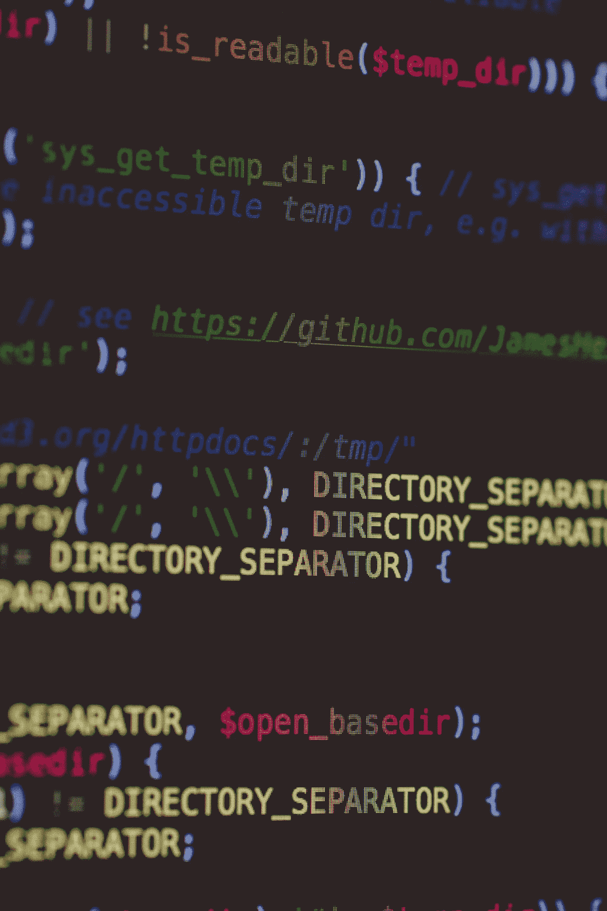
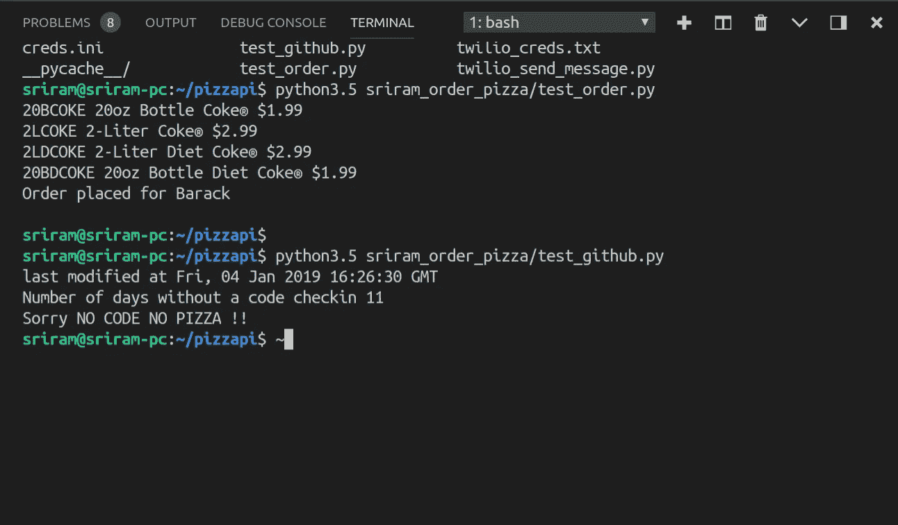

# 我如何强迫自己每天使用 pizza API 编码。

> 原文：<https://medium.com/hackernoon/how-i-forced-myself-to-code-daily-using-a-pizza-api-8bd1a0a6f66f>



周一晚上，在从大学回家的路上，一辆长途汽车在我前面，我开始渴望比萨饼。嗯，我心想，“如果有一个 API，那该多好啊？”。是的，你可能想知道为什么我不能使用众多应用程序中的一个，一个甚至可以让你点击一下就点披萨的程序，大声喊出来点披萨！，但是事情是这样的，我是一个学生，我不能经常买比萨饼。除非，是我挣的。

我*需要*编码，但是我*想要*披萨。所以我的解决方案是在我编码的时候简单地应用积极的反馈，请我自己吃披萨。很漂亮吧？现在你们可以说你们都知道使用反馈循环的强化学习。

所以我需要两样东西。

1.一种方法来跟踪我的工作，检查我是否定期发布代码，是的，这必须是一个第三方实体，以保持我们的诚实。

Throwback

2.只有在第 1 点通过的情况下才能点披萨。

3.跳过这些，直接点个披萨吧。

如果你坚持第三点，这篇文章是给你的。如果不是，这篇文章对你更重要。

因此，要跟踪我们的工作，我们可以使用 www.github.com 的 T4。我更喜欢 www.hackerrank.com 的,但是他们的 API 被否决了，GitHub 让它更通用。

为了订购比萨饼，我把这个 github 库[www.github.com/Magicjarvis/pizzapi](https://github.com/Magicjarvis/pizzapi)分到了[贾维斯·约翰逊](https://medium.com/u/811bfcc5cf65?source=post_page-----8bd1a0a6f66f--------------------------------)那里，并对它做了一些修改。

## 第一步。实现 API 来订购比萨饼。

API 需要以下信息，客户详细信息，如姓名、电子邮件 id、地址和电话号码。它使用这些信息来创建一个客户对象。

```
customer = Customer('Barack', 'Obama', 'barack@whitehouse.gov', '2024561111', '700 Pennsylvania Avenue NW, Washington, DC, 20408')closest_dominos = StoreLocator.find_closest_store_to_customer(customer)
```

一旦创建了客户对象，我们就可以使用商店定位器找到离我们最近的商店。

然后，我们在菜单中搜索一个项目，在我的例子中是“可乐”，我们得到一个标有“可乐”的项目列表和它们各自的订单 id。

```
menu = closest_dominos.get_menu()print("search the menu for coke, because you're cheap :)")menu.search(Name='Coke')order = Order.begin_customer_order(customer, closest_dominos)order.add_item('20BCOKE')
```

一旦我们准备好订单，我们输入我们的信用卡信息，然后向我们当地的商店下订单:)

```
card = CreditCard('XXXXXXXXXXX', 'XXXX', 'XXX', 'XXXXX')order.place(card)closest_dominos.place_order(order, card)
```

跟我到目前为止？太好了！现在我们转到第 2 步，如果我在过去 24 小时内签入了 GitHub 的代码，那么只允许我们订购一个披萨**。您可以根据需要更改这个号码。**

## **第二步。我们使用 PyGithub，它是 Github 的 python 库。**

**我们首先使用凭据创建一个用户对象。**

```
g = Github("g_eazy","!GreatestRapperAlive")user = g.get_user()
```

**现在使用用户对象，我们通过简单地调用用户对象上的 get_repo()函数来获得我们需要的存储库。**

```
repo = g.get_user().get_repo("Daily_Code")print("last modified at",repo.last_modified)
```

**在这里，我们将上次修改日期与当前日期进行比较，并检查自从我们上次签入一些代码以来已经过去了多少天。**

```
last_updated_date = repo.updated_atcurrent_time = datetime.now()diff_days = (current_time-last_updated_date).daysprint("Number of days without a code checkin",diff_days)if diff_days > 0: print("Sorry NO CODE NO PIZZA !!")else: print("Enjoy thy offering") order_pizza()
```

**真的就这么简单！**

## **可选择的**

**我采取了额外的措施，当订单下达后，我使用 Twilio 向我的手机发送短信提醒。**

****

**Sample credentials, please change it before you order a pizza.**

****

## **成功了吗？**

**代码起作用了，但可悲的是我的 T2 意志力不起作用。我屈服了，没有代码登记就点了披萨。我为此恨我自己，希望下一次我能找到一个更好的解决方案来避免这个问题。 [HackerRank](https://medium.com/u/d3ac51b2731c?source=post_page-----8bd1a0a6f66f--------------------------------) 请把你的 API 带回来，我们可以一起做一些很棒的事情，比如解决两个公司的竞赛，下一个披萨就在它们上面。**

**完整的代码，请查看[www.github.com/n00b007/pizzapi](http://www.github.com/n00b007/pizzapi)。感谢贾维斯·约翰逊的精彩教程。**