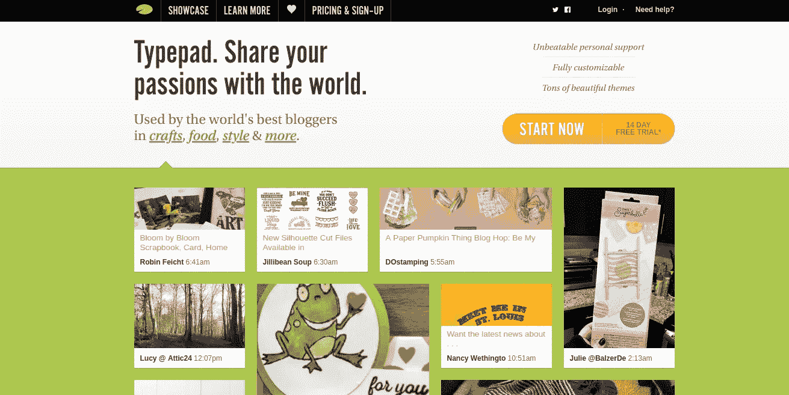
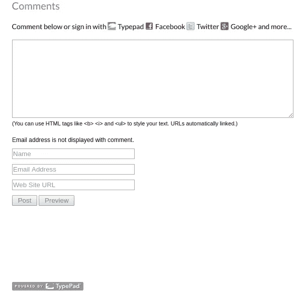
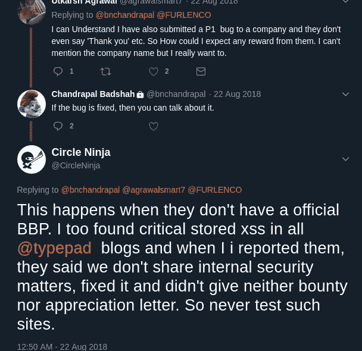
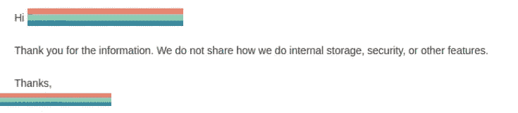

# 我如何在 Typepad 下的数千个网站中找到存储的 XSS

> 原文：<https://medium.com/hackernoon/how-i-found-stored-xss-in-thousands-of-sites-under-typepad-ee7632e1c774>

注意——作者不会因为公开这个 bug 而对任何人造成的伤害负责。这是出于教育目的而出版的。

在这篇文章中，我将分享我的一个发现，我在由 Typepad 驱动的博客中发现了存储的 xs。(*这个 bug 在很多网站还没有修复！0 天？IDK :\)* )

# **打字本——那是什么？**

Typepad 是耐力国际集团旗下的博客服务，之前由 SAY Media 所有。它属于 Wordpress、Blogger、Tumblr 等顶级在线博客平台。

根据维基百科的说法，Typepad 目前被许多大型组织和媒体公司用来托管他们的博客，如美国广播公司、MSNBC、加拿大广播公司、英国广播公司和天空新闻。

除此之外，它还被用作一个个人博客平台，有自定义的网址和 anysite.typepad.com 格式。

# 查找存储的 XSS

这个 bug 是我去年发现并举报的。我在微软运行的一个子域中发现了这个存储的 XSS 问题。虽然微软通过将我的名字列入名人堂承认了这个问题，但他们建议我直接向 Typepad 报告这个问题，因为存储 XSS 是由评论框(由 Typepad 提供支持)引起的。

# 更多细节-

在每篇 Typepad 博客文章之后，都有一个评论选项(允许使用 html 标签。)

请注意，这适用于特殊类型的评论框，它允许使用标签。然而，在这篇文章发表后，我的黑客朋友可能会在其他人身上发现这一点。；)

Comment Box Vulnerable

嘿，但是 XSS 的有效载荷是什么呢？

> [><](”wow/"><img "””")

每当页面被加载时，这个有效负载触发一个永久存储的 XSS。

# **即时预防步骤**

我注意到在一段时间后，评论选项会自动关闭。我真的不知道这是否是业主定制的。

网站管理员也可以在评论直接发布到网站之前对其进行审核。

使用 Cloudfare 的网站也会阻止这种有效载荷。

# **外卖**

几个月前，当我在推特上向一名安全研究人员发布这个问题时，我犯了一个错误，没有检查它是否仍未修复！

我注意到了这一点，同时检查了我最近提交的旧文件，并向他们索要感谢信。(大学佬。)

如果一个网站在这么长时间后继续忽视这个问题，我相信如果我公开披露这一点，就不会有任何问题。:)

最初在一年前，当我联系 Typepad 安全/客户支持团队时，我得到的回复是这样的！

嗯，我完全尊重他们的观点，但我谦卑地认为，他们至少可以在这么长时间后尝试修补这个。

前几天看了很多 Typepad 的博客。80%的人容易受到存储的 xs 的攻击。我真的不能确定他们是否做了一些事情来修复这个 bug，因为他们唯一给我的回复是我们很感谢把这个问题带给我们！

有些 Typepad 博客易受攻击，而有些则不然。

下面是我一年前创建的工作漏洞的链接。

 [## 社交媒体每天增加 100 万新用户，总数超过 3B 全球[图表]

### 来自 We Are Social 和 Hootsuite 的新全球数字统计显示，使用社交媒体的人数…

www.hypebot.com](https://www.hypebot.com/hypebot/2017/08/social-media-is-adding-1m-new-users-per-day-total-tops-3b-globally-charts.html) 

*编辑-本文发表后，上述 POC 已从网站上删除。*

Typepad 有一个被称为“展示”的功能，它在那里张贴最好的博客。我发现这个网站只有通过那里。

让我分享一部分我的概念证明-

希望这篇文章是有帮助的。你可以在推特上关注我的 [@Circleninja](https://twitter.com/CircleNinja) 。