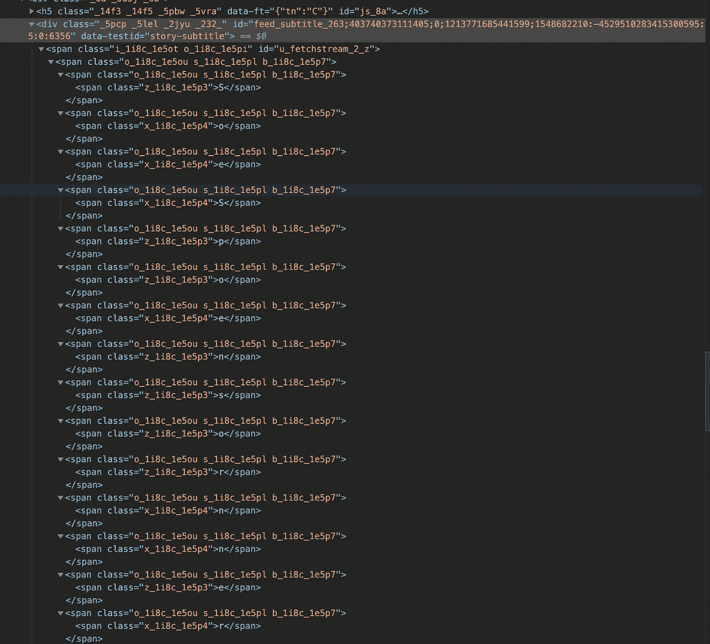
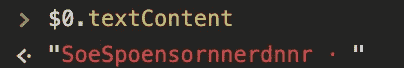
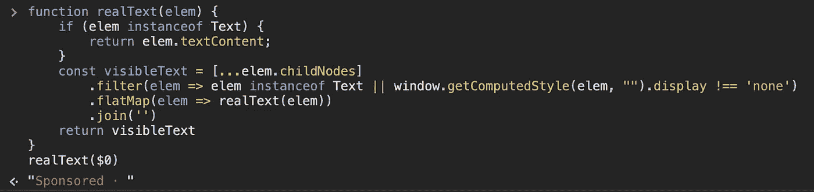
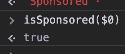
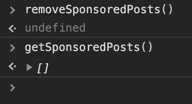

# 我如何摆脱新赞助的脸书邮报？

> 原文：<https://medium.com/hackernoon/how-i-get-rid-of-the-new-sponsored-facebook-posts-138d013f4bbe>

> 声明:这个故事的重点是*我如何*识别并删除赞助帖子，而不是*我为什么*删除它们。这是一个了解更多大教堂的机会。

今天我打开[脸书](https://hackernoon.com/tagged/facebook)，我注意到一些事情，我的广告拦截器不工作了。作为一名开发人员，我决定进行调查，首先我会检查这些赞助商帖子的结构，看看是否有办法识别它们，这样我就可以用脚本删除它们。

这个结构看起来非常简单，我们有一个角色为" *article* "的元素，它包含一个 div，该 div 包含一个以" *feed_subtitle* "开头的类，在最后一个 div 中，有大量的随机单词。
哥们，说真的，搞什么鬼？

Facebook madness…

他们使用一种技巧来显示“赞助”这个词:有些跨度是可见的，有些是不可见的。

更简单的说，有时候父母是可见的，但是孩子是不可见的，反之亦然。

是时候开始构建一个脚本来清除这些无用的东西了。
我在 chrome 检查器中选择了字幕 div，并在控制台中运行“$0.textContent”:

嗯，这是一种预期，我们需要一个功能来找到什么是真正的文本，如果我们想删除这些广告。

为此，我们需要一个递归函数；该函数将获得元素的子节点列表，并删除隐藏的子节点。

DOM 是一个巨大的节点树，组成页面的元素通常是“元素”和“文本”类型，注意每个不同的节点类型都允许有不同的子节点集是很重要的。例如，文档节点(根)可以将 DocumentType 节点作为子节点，而其他节点则不能。

组成文章的元素都在元素类型的节点下，这意味着我们只能找到这些类型的节点:元素、文本、处理指令和评论。[【规格】](https://dom.spec.whatwg.org/#concept-node)。

我们对注释和处理指令不感兴趣，因为它们不是由浏览器呈现的。为此，我们将它们过滤掉。

返回以从列表中移除隐藏节点。只有元素类型的节点可以有样式，因此是唯一可以隐藏的节点(连同它们的子节点)。其他节点类型没有样式，我们不能对它们使用“getComputedStyle”。这意味着我们只需要在元素节点上检查样式:

然后，通过这些可见的节点，我们收集在它们内部可见的节点。

但是如果我们递归地得到元素的节点，我们就有一个问题。末端的叶子没有任何节点。

当我们到达一个只包含文本的元素时，我们需要停下来，返回我们感兴趣的内容，即文本内容。

完美！现在我们有了递归函数，递归循环和停止条件的所有东西，让我们合并所有的部分。

在所选元素上尝试该功能的时间:

完美！有用！

现在，我们需要有一个函数，当我们询问这是否是一个赞助帖子的副标题时，它只说“是”或“不是”。为了安全起见，即使字幕丢失也能正常工作。

既然我们有办法知道什么时候被赞助，我们只需要获得页面上所有被赞助的帖子。

让我们从简单的部分开始，让我们得到所有的帖子，并且只保留那些被赞助的

现在，我们需要一个函数来知道帖子是否是赞助的，我们已经有了一个函数来识别副标题是否是赞助帖子的副标题，我们需要做的就是将帖子的副标题传递给这个函数

所有的碎片都在一起了！

现在我们需要一个函数来删除这些文章。

我们试试吧！

有用！

现在只少了一片，在我看到这些帖子之前把它们去掉。

当然有很多聪明的方法可以做到这一点，但是我很懒，所以我将简单地使用一个函数来观察所有添加到提要中的新 DOM 元素。为了做到这一点，我可以使用 [*MutationObserver*](https://developer.mozilla.org/en-US/docs/Web/API/MutationObserver) ，这个有用的特性可以在每次向特定元素的子树中添加或删除元素时执行回调。

当我们创建一个新的 MutationObserver 时，我们向构造函数传递一个回调，当我们正在观察的元素发生变化时，这个回调将被执行。我们可以被通知的变化是在我们稍后将看到的观察方法上选择的。
我们将通过一个变异列表得到这些变化的通知，变异列表是发生在该元素上的[变异记录](https://developer.mozilla.org/en-US/docs/Web/API/MutationRecord)的列表，有 3 种类型的变异可以通知我们:“属性”、“字符数据”和“子列表”；这些突变中的每一个都描述了什么被改变了，例如，如果那个元素的一个或多个属性已经改变，那么一个突变记录将是“属性”类型。

创建一个变异观察器是不够的，我们还需要让它观察一个元素，在创建它之后，我们可以使用" observe "方法，这个方法把要观察的元素和观察什么作为参数。我们可以观察到元素属性的变化，和/或元素层次结构的变化(添加或删除元素下的新节点)。

当脸书添加一个新帖子时，它总是一个 id 以“u_fetchstream”开头的元素

我将对它进行分解，因为它看起来有点复杂:

*   我们只对类型“childList”(添加或删除的孩子)的变化感兴趣，并且我们只想要在列表中添加一个孩子的变化。
*   在这些突变中，我们只对添加的节点感兴趣，所以我将它们提取出来。
*   在添加的节点中，我们只对 posts 节点感兴趣。
*   最后，我调用 observe 方法来检查 childList 上的更改，我对整个子树感兴趣(不仅仅是元素的直接子元素)。

太好了，现在我们有了添加到页面上的每个帖子的列表！

我们只需要使用旧的功能来检测这些帖子中的哪些是赞助的，并删除它们。是时候看看最终结果了:

现在唯一剩下的事情就是在我每次打开 facebook 的时候自动将这段代码投入运行。

为此，我将使用 Greasemonkey(或者 Chrome 中的 Tampermonkey)

可以在这里找到用户脚本:[https://gist . github . com/Maury 91/d 054d 9 f 38650d 70 b 64 EC 583845231 f 20/raw/00 af 0 da 1 D5 F8 de 4934 FB 0874 eff da 6 DCE 9 e 11 daf/remove facebookadsnew . user . js](https://gist.github.com/maury91/d054d9f38650d70b64ec583845231f20/raw/00af0da1d5f8de4934fb0874effda6dce9e11daf/removeFacebookAdsNew.user.js)

祝你摆脱新的 facebook 广告愉快！(我知道这不会长久)