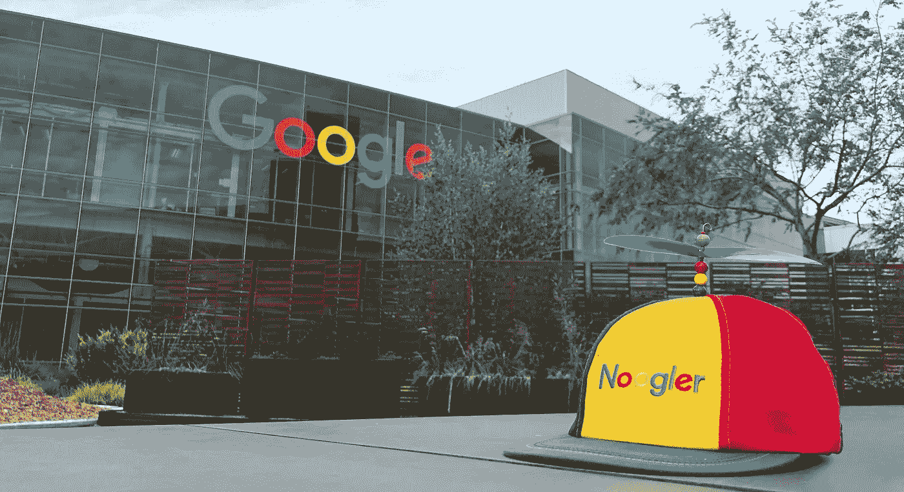
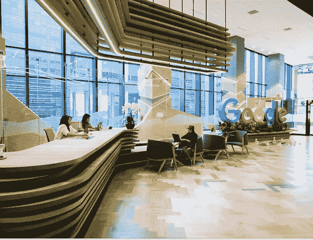
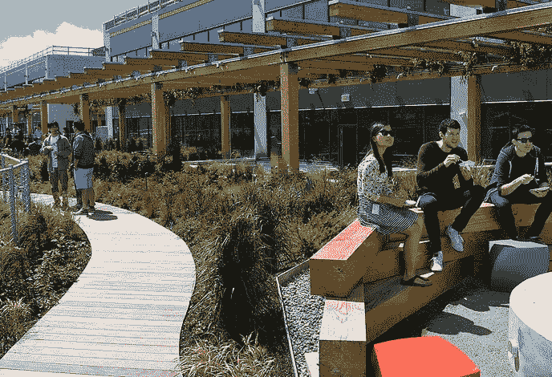

# 如何在谷歌找到一份设计工作

> 原文：<https://medium.com/hackernoon/how-i-got-a-design-job-at-google-bf0d28b5bb65>

## 在两个月的时间里，我面试了亚马逊、苹果、脸书和谷歌的设计职位。如果你也想这样做，这里有你需要知道的一切。

*看看这个故事的 YouTube 版本:*

2019 年给我带来了很多改变。在 [Osmo](http://playosmo.com) 领导 UX/UI 四年后，我觉得是时候做些不同的事情了。所以我接受了挑战，面试了硅谷四家最大的公司。我最终收到了三份工作邀请，并加入了谷歌。

如果你有兴趣做同样的事情，这是适合你的文章。下面，我把整个面试过程分解一下。我为每一步都提供了提示和例子。在结论中，我还比较了这些公司，并解释了它们的不同之处。

# 面试过程

这个过程持续了大约两个月。每个公司的情况都差不多:

1.  *伸出手*
2.  *打电话给招聘人员*
3.  *设计挑战*
4.  *现场准备*
5.  *现场面试*
6.  *跟进和决策*

# 1.伸手🔍

第一步是与招聘人员取得联系。有几种方法可以做到:

*   对于**脸书和苹果，**已经有人在 LinkedIn 上联系过我，所以我只是回了信。
*   自从我搬到湾区，谷歌就一直是我梦想中的公司。我每年都在他们的职业页面上投简历和申请各种职位。我从未得到回复。这一次，我联系了一位现在在那里工作的前同事。他给了我一封推荐信，第二天我就收到了招聘人员的电子邮件。如果可能的话，推荐是进入这些公司的最佳途径。
*   至于亚马逊，十月份我在 XRDC 做了一次演讲。这引起了亚马逊项目负责人的注意。我在活动当天见到了她。我们聊了两个小时，她邀请我现场。

# 2.电话呼叫 **(30 分钟)**📞

一旦联系上，招聘人员通常会打电话给你聊天。电话是非常非正式的，不应该有压力。招聘人员希望了解:

*   你是谁？
*   你专攻什么？
*   你为什么要找新工作？
*   你为什么对这家公司特别感兴趣？
*   你想做什么？
*   为什么你会是公司的优秀候选人？

在这一点上，招聘人员也将要求他们可以转发给内部设计师的投资组合和简历。这是我发的:

*   🔗[网站](https://www.tonyaube.com/)
*   📄[简历](https://www.dropbox.com/s/8mh1ut273l6sako/Tony-Aube-Resume-Redacted.pdf?dl=0)
*   📕[作品集](https://www.dropbox.com/s/7kkz1xw8za3s1x6/Tony-Aube-Osmo-Portfolio.pdf?dl=0)

因为我在 Osmo 所做的大部分工作都与儿童有关，我担心我会很难说服招聘人员我可以从事不同类型的产品。事实完全不是这样。对于产品设计的角色，招聘人员主要寻找伟大的设计和积极的影响，我有很多。

# 3.设计挑战(1 周)💻

谷歌和苹果给了我一个设计挑战。脸书和亚马逊没有。这两项挑战都是无偿的。

谷歌给出了在 3 个设计问题中进行选择的选项。我不能透露它们，但它们是关于重新设计日常事物的，与谷歌无关。挑战以一份 3 页的 PDF 文档的形式出现，每个文档解释一个需要解决的问题。这感觉很像回到了设计学校。

苹果公司被要求重新设计它的一个应用程序。有些人对此有道德问题。过去也有其他公司实施甚至申请专利的案例。记住这一点很重要。然而，我不认为这在这种情况下会是一个问题。

我通过了两项设计挑战。这里有一些提示:

*   **留下印象**。我记得一个很有前途的设计师在 Osmo 面试。每个人都对他加入公司感到兴奋。我们给他一个付费的设计挑战。他送回来的还可以，但不算伟大。我们觉得他可以做得更好，所以我们最终没有雇用他。当你做最少的时候，它会显示出来，并且传达出你对这家公司没那么感兴趣。
*   **超越自我。如果招聘人员告诉你这是一个 8 小时的任务，那就接受 12 小时。如果招聘人员只要求线框，给他们充分充实的用户界面。如果他们要求用户界面，给他们一个交互式的原型。超越要求说明你在乎加入。也就是说，招聘人员也在寻求合理利用你的时间。如果你的解决方案不好，说你花了 30 个小时也没用。这将是一面巨大的红旗。对于如何支配时间要有策略。**
*   **展示你可以处理整个设计过程**。对于谷歌，我把决定解决哪个问题作为我设计过程的一部分。我研究了所有三个选项，选择了一个，并解释了原因。然后我做了用户访谈、线框、UI、原型、一些用户测试，甚至一些品牌和标志设计。至于苹果，我知道他们有多在乎细节。所以在我设计完解决方案之后，我花了两倍的时间打磨 UI。我甚至创造了一个完全动画的运动原型。两位招聘人员都告诉我，他们对我的成果印象深刻。

# 4.现场面试(1 天)🤝

如果一切顺利，你将被邀请参加现场面试。这是整个过程中压力最大、最累人的部分。所有四家公司都遵循类似的公式:

*   早上 9-10 点左右出现。
*   投资组合演示(约 1 小时)。
*   一般面试(45 分钟)。
*   午餐伙伴(~1h)。
*   技术面试(45 分钟)。
*   设计评审(45 分钟)。
*   白板练习(45 分钟)
*   下午 3-5 点左右出去走走

谷歌和脸书的采访是在他们的总部，这是令人难以置信的。不幸的是，我在他们的一个卫星办公室采访了亚马逊和苹果，所以我没有看到他们的总部。

脸书和亚马逊报销了参加面试的全部交通费用。苹果和谷歌没有提供。我没问。

**作品展(30 分钟到 1 小时):**现场第一部分是主题演讲。你将在 5 到 10 个人面前展示你的作品集。他们是招聘人员、设计师、经理和工程师的混合体。招聘人员会在一周前给你打电话，帮你准备。

前 5 到 10 分钟是关于介绍你自己，你的背景，教育等。然后你需要陈述 2-3 个设计项目( **~** 每个 15 分钟)。最后 5 分钟是提问时间。

几个小贴士:

*   展示整个设计过程，从早期的头脑风暴草图到最终的像素完美模型。
*   对于每个项目，披露:**项目持续了多长时间**，**团队有多大，** **你的贡献有多大**。如果没有，这将是第一个出现的问题。帮大家一个忙，提前说出来。
*   **排练**。你希望能够在没有任何笔记的情况下背诵你的演示文稿。在你的朋友和其他设计师面前排练。请他们提供反馈。
*   **带上记事本，记下每个人的名字**。你会在一天中再次遇到这些人中的大多数，并且可能会与他们进行一些后续讨论。记住他们的名字将有助于这些讨论。另外，人们喜欢你记住他们的名字。
*   如果你在谷歌面试，使用谷歌幻灯片。如果你在苹果公司面试，用 Keynote)

**一般面试(~45 分钟):**这种面试通常是与上级经理进行的。很悠闲，类似电话面试。他们想更多地了解你，你的背景，并补充一些你在陈述中可能没有解释清楚的细节。

**午餐伙伴(~1h):** 中午左右，会有人带你出去吃午饭。你可以在这些公司的咖啡馆(或者亚马逊附近的餐馆)用餐。招聘人员可能会告诉你这是非正式的，不是面试的一部分。这不是真的——午餐肯定是面试的一部分。这是他们决定你的*文化是否适合*的地方。换句话说，团队是否会和你相处。友好地享受免费午餐。利用这个机会问一些私人问题。以下是一些好的例子:

*   他们喜欢自己的工作吗？
*   他们最讨厌自己的项目/工作/公司的什么？
*   团队士气如何？
*   工作生活平衡如何？

技术面试(~45 分钟):这是关于你作为设计师的技术能力。在这里，他们想确保你亲力亲为，能够交付真正的工作。他们可能会问这样的问题:

*   你用什么软件？
*   你如何向工程师交付资产？
*   你对将要使用的技术了解多少？(HTML/CSS、Swift、IOS、Android、Unity 等…)
*   你有什么免费的技能吗？(3D、动画、摄影、插画等)。
*   我甚至被要求打开我的电脑，展示我的项目文件。这也是我在 Osmo 面试候选人时做过的事情。这是一个聪明的方法，可以看出你是否有条理。你能容易地找到一个文件吗？您是否正确地对层进行了分组和命名？

**设计回顾(~45 分钟):**这个面试是关于了解你对优秀设计的品味和眼光。招聘人员很可能会要求你打开手机上的应用程序。这可能是你已经拥有的一个应用程序，或者他们可能会要求你下载一个你从未使用过的全新应用程序。这里有一些问题可以期待。

*   你对这个设计的第一印象是什么？
*   入职体验如何？
*   这到底是不是一款设计精良的 app？
*   你觉得调色板怎么样？标志设计？图标风格？
*   在 UI 方面你会改进什么？就 UX 而言？
*   你认为他们为什么这样做？你会怎样做得更好？

如果你习惯于对你使用的界面设计进行评判，这应该很容易。如果没有，尽快养成这个习惯。

**白板练习(~45 分钟):**这是关于评估你的设计思维和流程。面试官会给你一个设计挑战。房间里会有马克笔和一个大白板，你可以在上面画一些线框。这可能是一天中最紧张的部分。以下是一些需要记住的重要事项:

*   慢慢来。明白这是关于过程，而不是结果。面试官并不指望你能想出一个完美的解决方案。
*   **不要马上开始设计。**这是一个陷阱。挑战将是非常广泛的。招聘人员希望你能缩小范围。从提问开始。例如，如果问题是“设计完美的送礼体验”，你可以问:谁会使用它？我们在谈论什么样的礼物？他们要给谁？他们通常会怎么做？送礼物时的主要痛点是什么？然后，你可以选择一个痛点，开始嘲笑它。此外，不要假设解决方案需要一个移动应用程序。跳出框框思考。
*   **坦然面对不确定性。你可能会走到一个十字路口，那里有两种可能的解决方案。介绍他们两个，列出他们的优点和缺点。然后挑一个你认为最好的。你总是可以说，理想情况下，你会想测试他们两个，但为了练习，你要用这个。有时候，即使你不确定，也可以继续前进。**

**走出去。在一天结束时，招聘人员会接你并送你出大楼。他们会问你对今天的感觉如何，并告诉你接下来会发生什么。干得好，你做到了！**

## 5.跟进(1 -2 周)

接下来，团队会花一些时间讨论并做出决定。这可能需要几周时间。明白你不是唯一一个面试的人，他们不会在见过所有人之前做出决定。

招聘人员可能会要求你发送额外的信息，甚至回来进行更多的面试。以我的情况来说，苹果让我回来跟更高的经理待半天。

最终，我得到了亚马逊**、脸书**和谷歌**的报价。我没有得到苹果公司，因为他们觉得我缺乏项目所需的特定技能。**

# 我应该要求多少？

一旦你通过了面试，你会被问到你的期望薪水。这可能会有压力。如果你对自己的价值有一个很好的认识，这会有所帮助。

参考消息是比较这些公司薪资的一个很好的工具。你也可以在 [Glassdoor](https://www.glassdoor.com/index.htm) 上看看，在[上问一下 Blind](https://www.teamblind.com/articles/Topics) 上的人，这是一个面向科技员工的匿名社区。对于毕业生来说，13 万至 16 万美元的总薪酬似乎是平均水平。

# 这些公司比较起来如何？

虽然这四家公司都取得了巨大的成功，但他们都以自己独特的方式做到了这一点。在内部，他们有非常不同的文化和做事方式。以下是我认为他们最大的不同:

## 亚马逊有最好的面试流程——手到擒来。🥇

在很大程度上，现场是非常相似的。除了亚马逊。

在现场之前，招聘人员会让你回顾一下亚马逊的 12 条领导原则**。在现场，每个面试官都会问你在哪些具体的情况下你展示了这些原则。**

**这里的关键词是 ***具体的*** 。你提供的每一个例子，他们都会追问你细节。“这是什么时候的事？”“谁说的？”“你有什么反应？”等等。这些问题是这样设置的，你不能靠胡说八道来逃避。**

**亚马逊与其他公司不同，因为他们非常明确地表达了他们所寻求的特质。他们确保人们不会捏造事实。如果候选人不具备这些特质，他们不会录用，即使他或她非常适合这份工作。**

**经历这个过程改变了我采访人的方式。我现在对我要找的东西更有目的性和明确性了。值得在亚马逊面试，学习如何进行适当的面试。**

## **谷歌和脸书首先寻求人才。 ⬆️**

**谷歌和脸书相信先雇佣聪明人，然后给他们做自己想做的事情的自由。这种*自下而上*的方法对他们来说非常成功。例如， [Google Cardboard](https://vr.google.com/cardboard/) 是一名员工瞎搞出来的，它启动了谷歌进军虚拟现实的整个过程。**

**这种理念体现在他们的面试过程中。当你在谷歌或脸书面试时，你首先是为公司面试。你的团队和项目有点事后诸葛亮。如果你被证明足够优秀，你就会被雇佣。之后，他们会再次带你到现场，但这一次， ***你*** 去面试团队，而 ***你*** 挑选你想要参与的项目。**

**这里有一个很好的例子。我在脸书的第一次面试失败了。我面试的团队在我现场后马上雇佣了其他人。然而，我的面试官非常喜欢我，他把我推荐给了另一个更适合我的团队。我又做了现场，拿到了 offer。**

## **亚马逊和苹果首先寻求项目和团队配合。⬇️**

**另一方面，亚马逊和苹果关注的是你如何为他们招聘的特定项目做出贡献。他们有一个*自上而下*的方法，领导发起项目，员工跟随。如果你不适合那个项目，他们不会雇用你。**

**这就是苹果发生的事情。虽然他们喜欢我作为候选人，但他们认为我缺少项目所需的特定技能，所以我没有得到这份工作。**

## ****苹果和亚马逊是最神秘的。**🤫**

**大多数人都知道苹果是一家非常神秘的公司。我惊讶地发现，亚马逊也相当神秘。在苹果，我的一些面试官不知道我面试的是什么项目。我也没有。我的招聘人员给了我一些神秘的线索。“跟 X 行业有关。”“这是一款面向消费者的产品。”“这是为了 Y 人口统计。”除了面试的压力之外，我还必须解决弄清楚我面试的是什么项目的难题。**

*   **也就是说，与大多数公司相比，谷歌和脸书也是保密的。也要看你做的是哪个项目。比如，脸书的[加密货币项目](https://www.cnbc.com/2019/02/28/facebooks-crypto-team-works-an-office-off-limits-to-other-employees-nyt.html)就极其隐秘。**
*   **谷歌、脸书和亚马逊支持写作和公开演讲。苹果不是。在过去的 4 年里，我一直热衷于在媒体上发表演讲和分享我的想法。谷歌、脸书和亚马逊得知这一消息后兴奋不已。他们鼓励在媒体上写作。他们中的一些人甚至提出带我去参加未来的会议。据我所知，苹果的员工只被允许在 WWDC 的活动上发言。**

## **脸书和谷歌受益最大。😌**

**公平地说，这四家公司都提供了令人难以置信的福利，是世界上最好的工作场所之一。他们支付市场最高的薪水，并提供难以置信的职业机会。但是如果你想享受一下，脸书和谷歌是你应该去的地方。**

*   **谷歌和脸书提供免费的早餐、午餐和晚餐。食物既美味又健康。他们甚至有冰沙和泡沫茶吧。在工作中吃饭一年可以为你节省大约 5 到 1 万美元，但最大的好处是节省了你大量的时间。不用担心午餐吃什么，或者是否能及时赶回来参加会议，你只需专注于工作。**
*   **根据你工作的办公室，你还可以享受免费按摩、现场理发、洗衣服务等等。**
*   **对家庭来说。脸书为男女提供 4.5 个月的育儿假。谷歌为男性提供 3 个，女性提供 5 个。他们还会给你一份婴儿现金奖励。**
*   **我相信这四家公司都有现场健身房，并提供私人巴士服务。巴士很棒。它将我从旧金山的通勤时间从 1 小时 30 分减少到 45 分钟。他们有桌子和 Wi-Fi，所以你可以在通勤时工作。**
*   **谷歌 20%时间还是个东西。这意味着你可以选择每周花一天时间做一个你认为对公司最有价值的项目。这是了解其他团队和项目的好方法。**

************

## **脸书和谷歌更加悠闲自在。**

**当我收到脸书和谷歌的邀请时，他们告诉我入职会很慢。这些都是大公司，新员工通常需要几个月的时间来熟悉并开始产生影响。这与亚马逊(Amazon)和苹果(Apple)形成了鲜明对比，在这两家公司，我的印象是，我需要立即投入运营。**

**这当然是一个宽泛的说法。最后，每个团队和项目都有不同的期望。但总的来说，谷歌和脸书的文化似乎更重视工作与生活的平衡。**

**这可能是好的也可能是坏的，取决于你的个性。有些人很有驱动力，他们想努力工作，快速产生影响。其他人在休假和清理头脑中获得了很多价值。无论你是谁，一定要了解你的团队的期望是否适合你。**

# **结束语**

## ****不要只盯着一家公司**🚫**

**虽然谷歌是我梦想中的公司，但我在许多其他地方面试过。如果不成功，我准备加入任何其他公司。**

**回想起来，我非常幸运地获得了 Google 的 offer。时机非常理想，很多细节都安排得非常完美。如果这些细节中有一个没有解决，这篇文章就会有一个不同标题。**

**要明白加入任何一家这样的公司都需要运气，而运气是一个数字游戏。在不同的地方面试也有助于以下几点:**

## ****获得竞争优惠**💰**

**这是获得更高薪水的必要条件。有了三份报价，我就有了很多谈判的筹码。最终，我收到的第一份工作和最高的一份工作之间有 45%的薪资差距。我会分解这个过程，但是湾区的美容师已经做了很好的解释。👇**

** [## 我是如何在硅谷谈妥一份 30 万美元的工作

### 谷歌、脸书、亚马逊、苹果、LinkedIn 和 Yelp 都向我发出了软件工程师的工作邀请。以下是我如何…

nal.com 博客](https://blog.usejournal.com/how-i-negotiated-a-software-engineer-offer-in-silicon-valley-f11590f5c656) 

## **建立你的人际网络**📣

这是人际关系网有多重要的一课。正如我在第一步中解释的那样，**与招聘人员的每一次对话都是从我的关系网开始的。4 年来，我向谷歌发送了我的简历，但没有任何反馈。然后，我要求引荐，第二天就接到了电话。**

> “但我是个内向的人。”

没关系，我也是个内向的人。你不需要外向去交际。以我的经验，最有效的社交策略时间是做有趣的事情并公开分享。

它可以是在 Dribbble 或 Behance 上发布你最好的设计，在媒体上写文章，或者进行演讲和会议。如果你把自己放在那里足够长的时间，你最终会得到注意。招聘人员会开始在 LinkedIn 上给你发信息。

另一个建立人际网络的有效方法是每年进行面试。迄今为止，我总共面试了 50 多家公司，我和我见过的大多数人都保持着良好的关系。每隔一段时间，他们中的一个给我发消息，告诉我一个新的有趣的机会。

## **超越 FAMGA** 👀

脸书和谷歌可能是硅谷最受欢迎的公司，但它们远不是唯一做得好的公司。

很多人想加入这些大公司，因为它们在简历上看起来不错。他们提供认可和地位，这是人们通常在职业生涯早期寻求的。但随着时间的推移，这些事情会逐渐消失，感觉自己在做重要而有意义的工作变得更加重要。

钱也是一样。这些公司的薪酬很高，但我认识的大多数人都是通过在正确的时间加入规模较小、不太知名的公司而赚到改变人生的钱的。

硅谷在科技领域提供了一些最好的机会。保持警惕。如果你太专注于一家公司，你可能会错过你职业生涯中最大的机会。** 

# **请点击👏按钮，如果你喜欢或从中学到了什么。**

**这有助于更多的人阅读这本书。亲提示:你可以拍 **50 次**。**